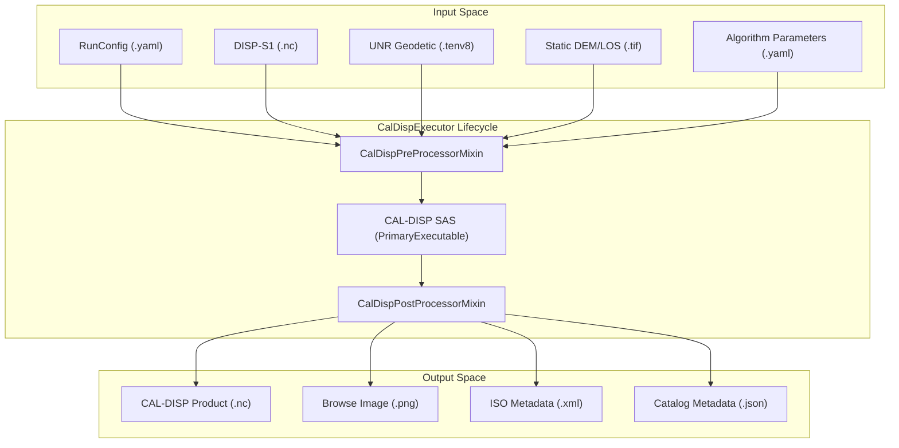
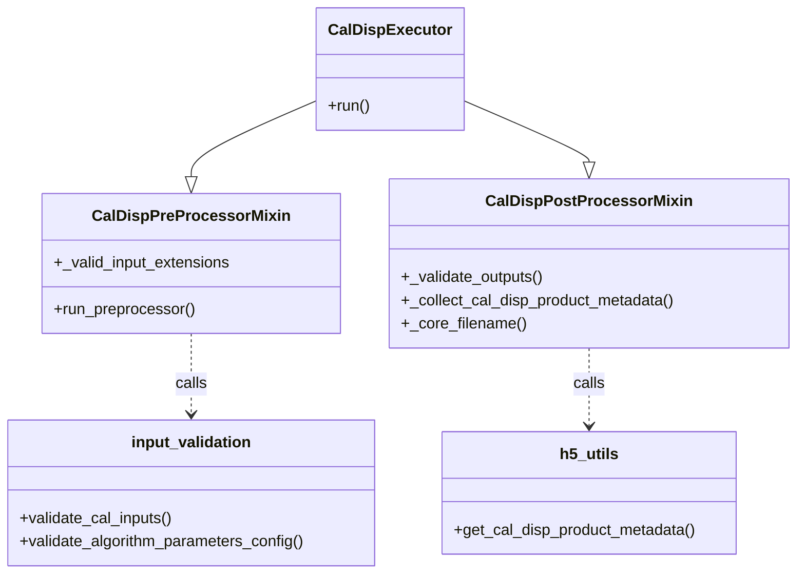
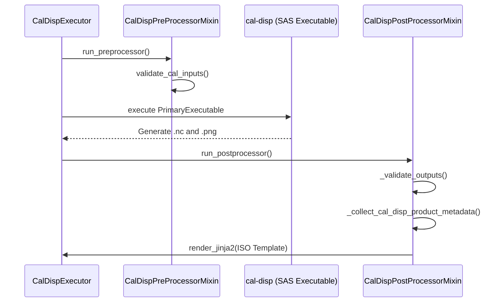

# Page: CAL-DISP PGE

# CAL-DISP PGE

Relevant source files

The following files were used as context for generating this wiki page:

- [.ci/docker/Dockerfile_cal_disp](.ci/docker/Dockerfile_cal_disp)
- [.ci/scripts/cal_disp/compare_cal_disp_products.sh](.ci/scripts/cal_disp/compare_cal_disp_products.sh)
- [.ci/scripts/cal_disp/opera_pge_cal_disp_r1.0_interface_algorithm_parameters.yaml](.ci/scripts/cal_disp/opera_pge_cal_disp_r1.0_interface_algorithm_parameters.yaml)
- [.ci/scripts/cal_disp/opera_pge_cal_disp_r1.0_interface_runconfig.yaml](.ci/scripts/cal_disp/opera_pge_cal_disp_r1.0_interface_runconfig.yaml)
- [.ci/scripts/cal_disp/test_cal_disp.sh](.ci/scripts/cal_disp/test_cal_disp.sh)
- [.ci/scripts/cal_disp/test_int_cal_disp.sh](.ci/scripts/cal_disp/test_int_cal_disp.sh)
- [src/opera/pge/cal_disp/cal_disp_pge.py](src/opera/pge/cal_disp/cal_disp_pge.py)
- [src/opera/pge/cal_disp/schema/cal_disp_sas_schema.yaml](src/opera/pge/cal_disp/schema/cal_disp_sas_schema.yaml)
- [src/opera/pge/cal_disp/templates/OPERA_ISO_metadata_L4_CAL_DISP_template.xml.jinja2](src/opera/pge/cal_disp/templates/OPERA_ISO_metadata_L4_CAL_DISP_template.xml.jinja2)
- [src/opera/pge/cal_disp/templates/cal_disp_measured_parameters.yaml](src/opera/pge/cal_disp/templates/cal_disp_measured_parameters.yaml)
- [src/opera/test/data/test_cal_disp_algorithm_parameters.yaml](src/opera/test/data/test_cal_disp_algorithm_parameters.yaml)
- [src/opera/test/data/test_cal_disp_config.yaml](src/opera/test/data/test_cal_disp_config.yaml)
- [src/opera/test/pge/cal_disp/test_cal_disp_pge.py](src/opera/test/pge/cal_disp/test_cal_disp_pge.py)

The Calibration for Surface Displacement (CAL-DISP) PGE is responsible for generating Level 4 calibration products derived from Sentinel-1 or NISAR displacement data. It integrates surface displacement measurements (DISP) with geodetic GNSS data from the University of Nevada, Reno (UNR) to provide a calibrated reference frame for surface motion.

## 1. Overview and Data Flow

The `CalDispExecutor` orchestrates the transition from Level 3 displacement products to Level 4 calibration layers. It validates a complex set of inputs including NetCDF displacement files, static DEM/LOS layers, and UNR geodetic time-series files (`.tenv8`).

### Data Flow Diagram
The following diagram illustrates the flow of data through the `CalDispExecutor` and its associated mixins.

**Title: CAL-DISP PGE Data Flow**

**Sources:** [src/opera/pge/cal_disp/cal_disp_pge.py:23-66](), [src/opera/pge/cal_disp/cal_disp_pge.py:186-218]()

---

## 2. Implementation Details

### 2.1. CalDispExecutor Class
The `CalDispExecutor` [src/opera/pge/cal_disp/cal_disp_pge.py:186-218]() inherits from `PgeExecutor` and implements the `CalDispPreProcessorMixin` and `CalDispPostProcessorMixin`. It defines the naming convention and metadata extraction logic specific to the CAL-DISP product.

### 2.2. Pre-Processing and Validation
The `CalDispPreProcessorMixin` [src/opera/pge/cal_disp/cal_disp_pge.py:23-56]() handles:
1.  **Input Validation**: Calls `validate_cal_inputs` to ensure the existence and format of DISP files, UNR time-series, and static ancillary files [src/opera/pge/cal_disp/cal_disp_pge.py:51]().
2.  **Algorithm Parameters**: Validates the SAS-specific algorithm configuration against a Yamale schema [src/opera/pge/cal_disp/cal_disp_pge.py:52-55]().
3.  **UNR Data**: Validates `.tenv8` geodetic files and the associated grid lookup table [src/opera/test/data/test_cal_disp_config.yaml:22-26]().

### 2.3. Post-Processing and Output Validation
The `CalDispPostProcessorMixin` [src/opera/pge/cal_disp/cal_disp_pge.py:57-184]() performs the following:
*   **Output Verification**: Ensures exactly one `.nc` and one `.png` file are produced [src/opera/pge/cal_disp/cal_disp_pge.py:78-92]().
*   **Filename Parsing**: Uses a regex `_granule_filename_re` to extract the core product identifier for naming derived files [src/opera/pge/cal_disp/cal_disp_pge.py:104-110]().
*   **Metadata Extraction**: Calls `_collect_cal_disp_product_metadata` which utilizes `get_cal_disp_product_metadata` to scrape attributes from the output NetCDF [src/opera/pge/cal_disp/cal_disp_pge.py:113]().

**Sources:** [src/opera/pge/cal_disp/cal_disp_pge.py:57-184](), [src/opera/util/h5_utils.py]() (implied)

---

## 3. Metadata and Naming Conventions

### 3.1. L4 CAL-DISP Naming Convention
The core filename for CAL-DISP products follows this structure:
`<PROJECT>_<LEVEL>_<PGE NAME>_<PLATFORM>_<MODE>_<FRAME_ID>_<POL>_<REF_DT>_<SEC_DT>_<PRODUCT VERSION>_<PROC_DT>`

This is extracted from the SAS output via the `_core_filename` method [src/opera/pge/cal_disp/cal_disp_pge.py:115-146]().

### 3.2. ISO Metadata Rendering
ISO XML metadata is generated using Jinja2 templates. The PGE maps NetCDF attributes to ISO elements using a measured parameters configuration.

| Category | Code Entity / Attribute | Purpose |
| :--- | :--- | :--- |
| **Template** | `OPERA_ISO_metadata_L4_CAL_DISP_template.xml.jinja2` | Base XML structure for ISO 19115-2 [src/opera/pge/cal_disp/templates/OPERA_ISO_metadata_L4_CAL_DISP_template.xml.jinja2:1-9]() |
| **Config** | `cal_disp_measured_parameters.yaml` | Maps HDF5/NetCDF paths to ISO metadata tags [src/opera/pge/cal_disp/templates/cal_disp_measured_parameters.yaml:1-25]() |
| **Function** | `augment_hdf5_measured_parameters` | Populates template variables from the output NetCDF file [src/opera/pge/cal_disp/cal_disp_pge.py:18]() |
| **WKT Conversion** | `parse_bounding_polygon_from_wkt` | Converts Well-Known Text (WKT) polygons from NetCDF to GML for ISO XML [src/opera/pge/cal_disp/cal_disp_pge.py:14]() |

**Sources:** [src/opera/pge/cal_disp/cal_disp_pge.py:14-21](), [src/opera/pge/cal_disp/templates/cal_disp_measured_parameters.yaml:1-181]()

---

## 4. System Entity Mapping

The following diagrams bridge the gap between high-level PGE concepts and the specific code entities implementing them.

### Entity Relationship: Validation and Metadata
**Title: CAL-DISP Code Entity Relationships**

**Sources:** [src/opera/pge/cal_disp/cal_disp_pge.py:23-72](), [src/opera/pge/cal_disp/cal_disp_pge.py:186-195]()

### Runtime Orchestration
**Title: CAL-DISP SAS Orchestration**

**Sources:** [src/opera/pge/cal_disp/cal_disp_pge.py:37-56](), [src/opera/pge/cal_disp/cal_disp_pge.py:74-114](), [src/opera/test/pge/cal_disp/test_cal_disp_pge.py:124-155]()

---

## 5. Integration and Testing

### 5.1. Unit Testing
Unit tests in `test_cal_disp_pge.py` simulate the full lifecycle by:
*   Creating dummy input DISP and UNR `.tenv8` files [src/opera/test/pge/cal_disp/test_cal_disp_pge.py:65-78]().
*   Mocking the SAS execution using a shell command (e.g., `mkdir` or `python -c`) to produce expected output files [src/opera/test/data/test_cal_disp_config.yaml:35-40]().
*   Verifying that ISO and Catalog metadata are correctly rendered and contain no undefined placeholders [src/opera/test/pge/cal_disp/test_cal_disp_pge.py:143-154]().

### 5.2. Integration Testing
Integration tests use Docker to run the PGE against real or high-fidelity sample data.
*   **Orchestration**: `test_int_cal_disp.sh` handles volume mounting of input, output, and scratch directories [.ci/scripts/cal_disp/test_int_cal_disp.sh:100-106]().
*   **Comparison**: `compare_cal_disp_products.sh` uses the `cal-disp validate` command to compare PGE output against expected golden datasets [.ci/scripts/cal_disp/compare_cal_disp_products.sh:75-76]().

**Sources:** [.ci/scripts/cal_disp/test_int_cal_disp.sh:1-139](), [.ci/scripts/cal_disp/compare_cal_disp_products.sh:1-107](), [src/opera/test/pge/cal_disp/test_cal_disp_pge.py:104-165]()
