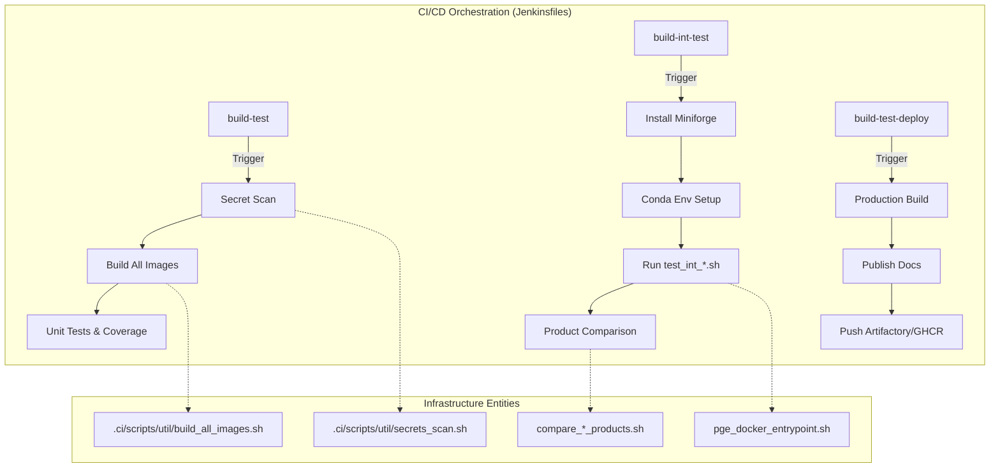
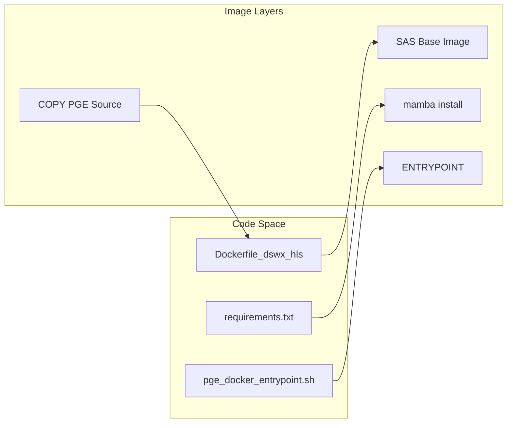

# Page: CI/CD Infrastructure

# CI/CD Infrastructure

Relevant source files

The following files were used as context for generating this wiki page:

- [.ci/docker/Dockerfile_dswx_hls](.ci/docker/Dockerfile_dswx_hls)
- [.ci/jenkins/build-int-test/Jenkinsfile](.ci/jenkins/build-int-test/Jenkinsfile)
- [.ci/jenkins/build-test-deploy/Jenkinsfile](.ci/jenkins/build-test-deploy/Jenkinsfile)
- [.ci/jenkins/build-test/Jenkinsfile](.ci/jenkins/build-test/Jenkinsfile)
- [.ci/jenkins/delete-tmp-dirs/Jenkinsfile](.ci/jenkins/delete-tmp-dirs/Jenkinsfile)
- [.ci/jenkins/grype_html.tmpl](.ci/jenkins/grype_html.tmpl)

The OPERA SDS PGE repository utilizes a robust CI/CD framework centered around Jenkins pipelines and Dockerized execution environments. This system ensures that every Product Generation Executable (PGE) is scanned for secrets, unit tested, integrated with its respective Science Algorithm Software (SAS), scanned for vulnerabilities, and deployed to centralized registries.

### CI/CD Pipeline Architecture

The infrastructure is composed of several specialized Jenkins pipelines that manage the lifecycle of the PGE software from commit to release.

| Pipeline | Purpose | Key Actions |
| :--- | :--- | :--- |
| **build-test** | Continuous Integration | Secret scanning, building all Docker images, running unit tests, and vulnerability scanning. |
| **build-int-test** | Integration Validation | Deploys temporary Conda environments, executes PGEs against sample data, and performs product comparisons. |
| **build-test-deploy** | Release & Deployment | Builds production images, publishes Sphinx documentation, and pushes to Artifactory and GHCR. |
| **delete-tmp-dirs** | Maintenance | Cleans up orphaned `/data/tmp` directories, Docker system pruning, and expired Conda environments. |

**Jenkins Pipeline Flow**

Sources: [.ci/jenkins/build-test/Jenkinsfile:24-94](), [.ci/jenkins/build-int-test/Jenkinsfile:28-140](), [.ci/jenkins/build-test-deploy/Jenkinsfile:51-135](), [.ci/jenkins/delete-tmp-dirs/Jenkinsfile:13-26]()

---

### Jenkins Pipelines
The Jenkins pipelines use a `RUN_ID` based on the process ID (`$$`) to ensure isolation when multiple builds run on the same agent [.ci/jenkins/build-int-test/Jenkinsfile:11-14](). 

*   **Secret Scanning:** Uses `secrets_scan.sh` to identify potential credentials before code is processed [.ci/jenkins/build-test/Jenkinsfile:24-35]().
*   **Miniforge Integration:** For integration testing, the pipelines dynamically install Miniforge and create a local Conda environment (`int_test_env`) to provide the necessary Python and GDAL dependencies [.ci/jenkins/build-int-test/Jenkinsfile:63-93]().
*   **Status Codes:** The integration pipeline treats a return code of `2` from test scripts as `UNSTABLE`, typically indicating a product comparison mismatch rather than a hard execution failure [.ci/jenkins/build-int-test/Jenkinsfile:112-114]().

For details, see [Jenkins Pipelines](#7.1).

Sources: [.ci/jenkins/build-int-test/Jenkinsfile:11-14](), [.ci/jenkins/build-int-test/Jenkinsfile:63-93](), [.ci/jenkins/build-int-test/Jenkinsfile:112-114](), [.ci/jenkins/build-test/Jenkinsfile:24-35]()

---

### Docker Image Builds
Every PGE has a dedicated Dockerfile (e.g., `Dockerfile_dswx_hls`) that follows a standardized inheritance pattern. They start from a base SAS image provided via the `SAS_IMAGE` build argument [.ci/docker/Dockerfile_dswx_hls:5-6]().

*   **Environment Management:** Images use `mamba` to install dependencies from `requirements.txt` into the root Conda environment [.ci/docker/Dockerfile_dswx_hls:56]().
*   **Entrypoint:** The `pge_docker_entrypoint.sh` script is set as the `ENTRYPOINT`, allowing the container to act as an executable for the PGE dispatcher [.ci/docker/Dockerfile_dswx_hls:60]().
*   **Vulnerability Scanning:** Pipelines utilize `grype` to scan built images for patchable vulnerabilities, generating HTML reports using a custom template [.ci/jenkins/build-test/Jenkinsfile:85-87]().

**Docker Build Entity Mapping**

For details, see [Docker Image Builds](#7.2).

Sources: [.ci/docker/Dockerfile_dswx_hls:5-60](), [.ci/jenkins/build-test/Jenkinsfile:85-87](), [.ci/jenkins/grype_html.tmpl:1-11]()

---

### Integration Testing and Product Comparison
Integration tests bridge the gap between the PGE wrapper and the underlying SAS. These tests are orchestrated by per-PGE shell scripts (e.g., `test_int_dswx_hls.sh`) [.ci/jenkins/build-int-test/Jenkinsfile:107]().

*   **Validation:** Integration tests run the PGE within the built Docker container and verify the resulting output products.
*   **Comparison:** Specialized Python scripts compare the generated products against "golden" datasets to ensure bit-wise or statistical consistency.
*   **Metrics:** The system collects usage metrics (CPU, Memory) during these runs, which are archived as CSVs and PNG plots [.ci/jenkins/build-int-test/Jenkinsfile:137-138]().

For details, see [Integration Testing and Product Comparison](#7.3).

Sources: [.ci/jenkins/build-int-test/Jenkinsfile:107-138]()
