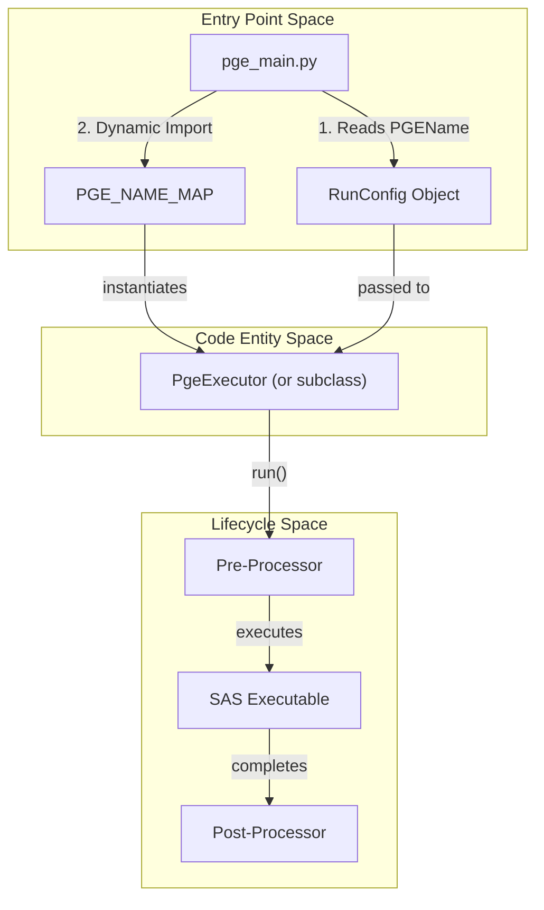
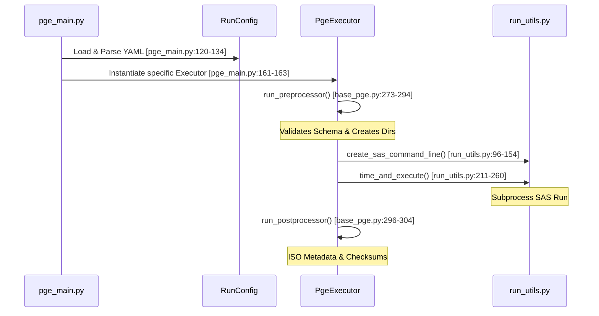

# Page: Core PGE Framework

# Core PGE Framework

Relevant source files

The following files were used as context for generating this wiki page:

- [src/opera/pge/__init__.py](src/opera/pge/__init__.py)
- [src/opera/pge/base/base_pge.py](src/opera/pge/base/base_pge.py)
- [src/opera/pge/dswx_hls/dswx_hls_pge.py](src/opera/pge/dswx_hls/dswx_hls_pge.py)
- [src/opera/scripts/pge_main.py](src/opera/scripts/pge_main.py)
- [src/opera/test/pge/base/test_base_pge.py](src/opera/test/pge/base/test_base_pge.py)
- [src/opera/test/pge/dswx_hls/test_dswx_hls_pge.py](src/opera/test/pge/dswx_hls/test_dswx_hls_pge.py)
- [src/opera/test/scripts/test_pge_main.py](src/opera/test/scripts/test_pge_main.py)
- [src/opera/util/__init__.py](src/opera/util/__init__.py)
- [src/opera/util/metfile.py](src/opera/util/metfile.py)
- [src/opera/util/run_utils.py](src/opera/util/run_utils.py)
- [src/opera/util/time.py](src/opera/util/time.py)

The **Core PGE Framework** provides a standardized, reusable execution environment for all OPERA Product Generation Executables (PGEs). It abstracts common tasks such as RunConfig parsing, directory management, logging, SAS (Science Application Software) execution, and product metadata generation. By using a mixin-based architecture, the framework allows specific product types to inherit base functionality while overriding or extending steps as needed.

### System Architecture Overview

The framework follows a "Wrapper" pattern where the Python-based PGE manages the lifecycle of a lower-level SAS executable. The relationship between the entry point, the configuration, and the executor is illustrated below:

**PGE Execution Flow: Dispatcher to Executor**

**Sources:** [src/opera/scripts/pge_main.py:25-38](), [src/opera/pge/base/base_pge.py:306-335]()

---

### Core Components

The framework is built around three primary pillars:

#### 1. PgeExecutor and Mixins
The `PgeExecutor` class defines the high-level `run()` lifecycle. It utilizes `PreProcessorMixin` and `PostProcessorMixin` to organize tasks.
*   **Pre-Processing**: Includes log initialization, RunConfig validation, and directory setup.
*   **SAS Execution**: Formulates command lines and manages the subprocess execution of the science algorithm.
*   **Post-Processing**: Handles output validation, filename canonicalization, and metadata (ISO/Catalog) generation.

For details, see [PgeExecutor Base Class and Lifecycle](#2.1).

#### 2. RunConfig System
The `RunConfig` class provides a structured way to interface with YAML configuration files. It uses a two-tier validation approach:
1.  **Base Schema**: Validates fields required by the framework (e.g., `InputFilesGroup`, `PrimaryExecutable`).
2.  **SAS Schema**: Validates fields specific to the science algorithm being wrapped.

For details, see [RunConfig: Schema and Parsing](#2.2).

#### 3. pge_main.py Dispatcher
The `pge_main.py` script serves as the universal entry point for all PGEs in the repository. It performs dynamic class loading based on the `PGEName` found in the provided RunConfig, mapping strings like `RTC_S1_PGE` to specific executor classes like `RtcS1Executor`.

For details, see [pge_main.py: Dispatcher and Entry Point](#2.3).

---

### Execution Lifecycle

The following diagram maps the natural language steps of a PGE run to the specific methods and utilities invoked within the `base_pge.py` framework.

**Mapping Lifecycle to Code Entities**

**Sources:** [src/opera/pge/base/base_pge.py:306-335](), [src/opera/scripts/pge_main.py:137-165](), [src/opera/util/run_utils.py:211-215]()

### Key Classes and Roles

| Class / File | Role | Key Methods |
| :--- | :--- | :--- |
| `PgeExecutor` | Base class for all PGEs | `run()`, `run_preprocessor()`, `run_postprocessor()` |
| `RunConfig` | Configuration management | `validate()`, `input_files`, `output_product_path` |
| `PreProcessorMixin` | Pre-SAS logic | `_setup_directories()`, `_validate_runconfig()` |
| `PostProcessorMixin`| Post-SAS logic | `_validate_outputs()`, `_georeference_outputs()` |
| `pge_main.py` | CLI Entry Point | `pge_main()`, `get_pge_class()` |

**Sources:** [src/opera/pge/base/base_pge.py:41-55](), [src/opera/pge/base/base_pge.py:192-206](), [src/opera/pge/base/base_pge.py:256-271](), [src/opera/scripts/pge_main.py:42-79]()
