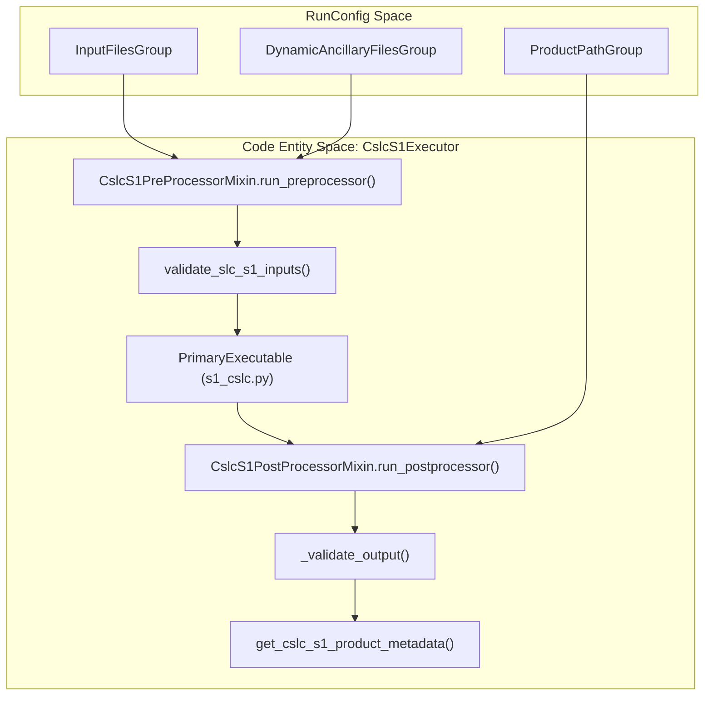
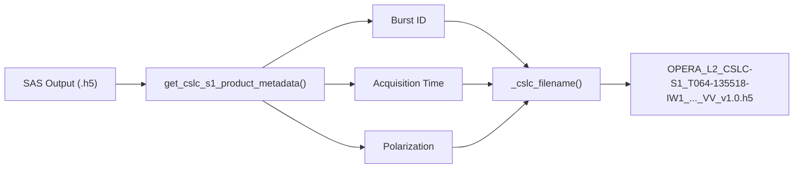

# Page: CSLC-S1 PGE

# CSLC-S1 PGE

Relevant source files

The following files were used as context for generating this wiki page:

- [.ci/scripts/cslc_s1/cslc_s1_compare.py](.ci/scripts/cslc_s1/cslc_s1_compare.py)
- [.ci/scripts/cslc_s1/opera_pge_cslc_s1_delivery_6.5_final_runconfig.yaml](.ci/scripts/cslc_s1/opera_pge_cslc_s1_delivery_6.5_final_runconfig.yaml)
- [.ci/scripts/cslc_s1/opera_pge_cslc_s1_static_delivery_6.5_final_runconfig.yaml](.ci/scripts/cslc_s1/opera_pge_cslc_s1_static_delivery_6.5_final_runconfig.yaml)
- [.ci/scripts/cslc_s1/test_int_cslc_s1.sh](.ci/scripts/cslc_s1/test_int_cslc_s1.sh)
- [src/opera/pge/cslc_s1/cslc_s1_pge.py](src/opera/pge/cslc_s1/cslc_s1_pge.py)
- [src/opera/pge/cslc_s1/schema/cslc_s1_sas_schema.yaml](src/opera/pge/cslc_s1/schema/cslc_s1_sas_schema.yaml)
- [src/opera/pge/disp_s1/disp_s1_pge.py](src/opera/pge/disp_s1/disp_s1_pge.py)
- [src/opera/pge/rtc_s1/rtc_s1_pge.py](src/opera/pge/rtc_s1/rtc_s1_pge.py)
- [src/opera/test/data/test_cslc_s1_config.yaml](src/opera/test/data/test_cslc_s1_config.yaml)
- [src/opera/test/pge/cslc_s1/test_cslc_s1_pge.py](src/opera/test/pge/cslc_s1/test_cslc_s1_pge.py)

The CSLC-S1 (Co-registered Single Look Complex) PGE is responsible for processing Sentinel-1 A/B SLC data into geocoded, co-registered complex radar images. This PGE supports both standard product generation and the generation of static layer products (e.g., local incidence angle, shadow masks).

## Implementation Overview

The CSLC-S1 PGE is implemented via the `CslcS1Executor` class, which inherits from `PgeExecutor` and utilizes specific mixins for pre- and post-processing logic [src/opera/pge/cslc_s1/cslc_s1_pge.py:114-116]().

### Key Classes
- **`CslcS1Executor`**: The main driver class that manages the lifecycle of the CSLC-S1 product generation [src/opera/pge/cslc_s1/cslc_s1_pge.py:114-116]().
- **`CslcS1PreProcessorMixin`**: Handles input validation for Sentinel-1 SLC inputs (SAFE files, orbits) and RunConfig sanity checks [src/opera/pge/cslc_s1/cslc_s1_pge.py:30-42]().
- **`CslcS1PostProcessorMixin`**: Manages output validation, HDF5 metadata extraction, and final product renaming based on burst metadata [src/opera/pge/cslc_s1/cslc_s1_pge.py:63-75]().

### Data Flow and Entity Mapping

The following diagram illustrates how the CSLC-S1 PGE maps RunConfig groups to the internal execution logic and validation steps.

**CSLC-S1 Execution Flow**

Sources: [src/opera/pge/cslc_s1/cslc_s1_pge.py:44-61](), [src/opera/pge/cslc_s1/cslc_s1_pge.py:80-123](), [src/opera/util/input_validation.py:145-180]()

## Pre-processing and Input Validation

The `CslcS1PreProcessorMixin` ensures all required inputs are present before invoking the Science Algorithm Software (SAS). It specifically calls `validate_slc_s1_inputs` to verify the existence and format of:
- Sentinel-1 SAFE zip files [src/opera/pge/cslc_s1/cslc_s1_pge.py:60]().
- Orbit files (.EOF) [src/opera/test/data/test_cslc_s1_config.yaml:13]().
- Digital Elevation Models (DEM) and Burst Databases [src/opera/test/data/test_cslc_s1_config.yaml:17-19]().

## Post-processing and Output Handling

The post-processing phase is critical for transforming SAS-produced files into finalized OPERA products.

### Output Validation
The `_validate_output` function performs a recursive walk of the output directory. It ensures that:
1. Every burst sub-directory contains valid files [src/opera/pge/cslc_s1/cslc_s1_pge.py:92-98]().
2. Files are non-zero in size [src/opera/pge/cslc_s1/cslc_s1_pge.py:114-117]().
3. Extensions match expected types: `tiff`, `tif`, `h5`, or `png` [src/opera/pge/cslc_s1/cslc_s1_pge.py:104-122]().

### Filename Construction
CSLC-S1 filenames are constructed dynamically using metadata extracted from the generated HDF5 files. The PGE uses the `_cslc_filename` method to assemble the canonical name:
- **Format**: `<PROJECT>_<LEVEL>_<PGE_NAME>_<BURST_ID>_<ACQUISITION_TIME>_<PRODUCTION_TIME>_<POLARIZATION>_<PRODUCT_VERSION>.<EXT>`
- **Logic**: It retrieves the `burst_id`, `acquisition_start_time`, and `polarization` from the product metadata using `get_cslc_s1_product_metadata` [src/opera/pge/cslc_s1/cslc_s1_pge.py:228-260]().

### Static Layer Support
If the `primary_executable.product_type` is set to `CSLC_S1_STATIC` [src/opera/pge/cslc_s1/schema/cslc_s1_sas_schema.yaml:49](), the PGE utilizes `_core_static_filename` to append the `-STATIC` suffix to the product name [src/opera/pge/cslc_s1/cslc_s1_pge.py:170-182]().

**Metadata Extraction and Renaming Flow**

Sources: [src/opera/pge/cslc_s1/cslc_s1_pge.py:228-270](), [src/opera/util/h5_utils.py:150-180]()

## Metadata Extraction

The PGE relies on `get_cslc_s1_product_metadata` to parse the SAS HDF5 output. This utility extracts:
- **Identification Group**: Product version, processing center, and platform [src/opera/util/h5_utils.py:150-160]().
- **Processing Information**: Input burst metadata including the unique Burst ID and acquisition timestamps [src/opera/pge/cslc_s1/cslc_s1_pge.py:241-245]().

## Integration Testing

Integration tests for the CSLC-S1 PGE verify both the baseline and static workflows [src/opera/test/pge/cslc_s1/test_cslc_s1_pge.py:108-169]().
- **Comparison Script**: `cslc_s1_compare.py` is used to validate that generated HDF5 files match "golden" datasets within defined thresholds (e.g., $10^{-5}$ for static layers) [.ci/scripts/cslc_s1/cslc_s1_compare.py:181-183]().
- **Metrics**: The `test_int_cslc_s1.sh` script collects OS resource usage metrics during Docker execution [.ci/scripts/cslc_s1/test_int_cslc_s1.sh:95-111]().

| Feature | Implementation |
| :--- | :--- |
| **SAS Entrypoint** | `s1_cslc.py` [.ci/scripts/cslc_s1/opera_pge_cslc_s1_delivery_6.5_final_runconfig.yaml:38]() |
| **Validation Schema** | `cslc_s1_sas_schema.yaml` [src/opera/pge/cslc_s1/schema/cslc_s1_sas_schema.yaml:1-62]() |
| **ISO Template** | `OPERA_ISO_metadata_L2_CSLC_S1_template.xml.jinja2` [src/opera/test/data/test_cslc_s1_config.yaml:36]() |
| **Polarization Modes** | `co-pol`, `cross-pol`, `dual-pol` [src/opera/pge/cslc_s1/schema/cslc_s1_sas_schema.yaml:67]() |

Sources: [src/opera/pge/cslc_s1/cslc_s1_pge.py:1-300](), [src/opera/test/pge/cslc_s1/test_cslc_s1_pge.py:1-190](), [.ci/scripts/cslc_s1/test_int_cslc_s1.sh:1-174]()
