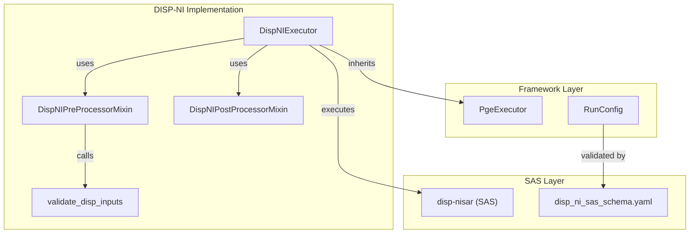
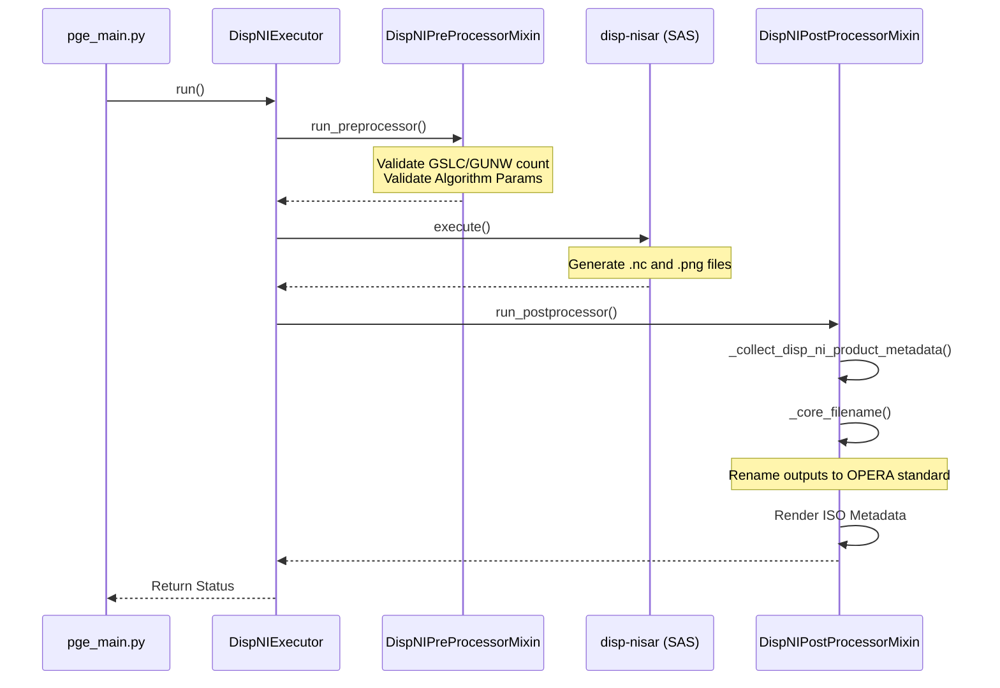

# Page: DISP-NI PGE

# DISP-NI PGE

Relevant source files

The following files were used as context for generating this wiki page:

- [.ci/docker/Dockerfile_disp_ni](.ci/docker/Dockerfile_disp_ni)
- [.ci/scripts/disp_ni/build_disp_ni.sh](.ci/scripts/disp_ni/build_disp_ni.sh)
- [.ci/scripts/disp_ni/compare_disp_ni_products.sh](.ci/scripts/disp_ni/compare_disp_ni_products.sh)
- [.ci/scripts/disp_ni/opera_pge_disp_ni_r2.1_beta_algorithm_parameters_forward.yaml](.ci/scripts/disp_ni/opera_pge_disp_ni_r2.1_beta_algorithm_parameters_forward.yaml)
- [.ci/scripts/disp_ni/opera_pge_disp_ni_r2.1_beta_algorithm_parameters_historical.yaml](.ci/scripts/disp_ni/opera_pge_disp_ni_r2.1_beta_algorithm_parameters_historical.yaml)
- [.ci/scripts/disp_ni/opera_pge_disp_ni_r2.1_beta_runconfig_forward.yaml](.ci/scripts/disp_ni/opera_pge_disp_ni_r2.1_beta_runconfig_forward.yaml)
- [.ci/scripts/disp_ni/opera_pge_disp_ni_r2.1_beta_runconfig_historical.yaml](.ci/scripts/disp_ni/opera_pge_disp_ni_r2.1_beta_runconfig_historical.yaml)
- [.ci/scripts/disp_ni/test_int_disp_ni.sh](.ci/scripts/disp_ni/test_int_disp_ni.sh)
- [docs/opera.pge.disp_ni.rst](docs/opera.pge.disp_ni.rst)
- [examples/disp_ni_sample_runconfig-v6.0.0-er.2.0.yaml](examples/disp_ni_sample_runconfig-v6.0.0-er.2.0.yaml)
- [src/opera/pge/disp_ni/disp_ni_pge.py](src/opera/pge/disp_ni/disp_ni_pge.py)
- [src/opera/pge/disp_ni/schema/algorithm_parameters_disp_ni_schema.yaml](src/opera/pge/disp_ni/schema/algorithm_parameters_disp_ni_schema.yaml)
- [src/opera/pge/disp_ni/schema/disp_ni_sas_schema.yaml](src/opera/pge/disp_ni/schema/disp_ni_sas_schema.yaml)
- [src/opera/test/data/test_disp_ni_algorithm_parameters.yaml](src/opera/test/data/test_disp_ni_algorithm_parameters.yaml)
- [src/opera/test/data/test_disp_ni_config.yaml](src/opera/test/data/test_disp_ni_config.yaml)
- [src/opera/test/pge/disp_ni/test_disp_ni_pge.py](src/opera/test/pge/disp_ni/test_disp_ni_pge.py)
- [src/opera/util/input_validation.py](src/opera/util/input_validation.py)

The **DISP-NI PGE** (Product Generation Executable) is responsible for generating the OPERA Surface Displacement (DISP) product from NISAR (NI) Geocoded Single Look Complex (GSLC) inputs. It supports both **Forward** (catch-up) and **Historical** processing modes. The PGE acts as a wrapper around the `disp-nisar` Scientific Analysis Software (SAS), managing input validation, execution lifecycle, and standardized output packaging.

## Implementation Overview

The DISP-NI PGE is implemented in `src/opera/pge/disp_ni/disp_ni_pge.py` [src/opera/pge/disp_ni/disp_ni_pge.py:1-8](). It leverages a mixin architecture, inheriting significant functionality from the `DispS1` PGE classes to maintain consistency across sensor-specific displacement products.

### Key Classes

| Class | Role | Base Class |
| :--- | :--- | :--- |
| `DispNIExecutor` | Main entry point for DISP-NI execution. | `PgeExecutor` |
| `DispNIPreProcessorMixin` | Handles NISAR-specific input validation and staging. | `DispS1PreProcessorMixin` |
| `DispNIPostProcessorMixin` | Manages NetCDF validation, compressed SLC handling, and ISO metadata. | `DispS1PostProcessorMixin` |

Sources: [src/opera/pge/disp_ni/disp_ni_pge.py:23-23](), [src/opera/pge/disp_ni/disp_ni_pge.py:58-58](), [src/opera/pge/disp_ni/disp_ni_pge.py:311-311]()

## Data Flow and Code Entity Mapping

The following diagram illustrates the relationship between the PGE framework components and the specific DISP-NI implementation entities.

### System Entity Relationship

Sources: [src/opera/pge/disp_ni/disp_ni_pge.py:23-311](), [src/opera/pge/disp_ni/schema/disp_ni_sas_schema.yaml:1-88]()

## Pre-Processing and Input Validation

The `DispNIPreProcessorMixin` ensures all required inputs are present and meet the constraints required by the displacement algorithm.

### Input Constraints
- **GSLC Inputs**: Requires a minimum of 2 NISAR GSLC HDF5 files [src/opera/pge/disp_ni/schema/disp_ni_sas_schema.yaml:4-4]().
- **GUNW Inputs**: Requires a minimum of 1 Geocoded Unwrapped Interferogram (GUNW) file for ionosphere and static geometry corrections [src/opera/pge/disp_ni/schema/disp_ni_sas_schema.yaml:33-33]().
- **N_GUNW Constraint**: The PGE validates that the number of GUNW inputs matches the number of GSLC inputs minus one ($N_{GUNW} = N_{GSLC} - 1$) to ensure a continuous network for displacement estimation [src/opera/util/input_validation.py:240-252]().

### Algorithm Parameters
The PGE validates the algorithm parameters against a dedicated Yamale schema `algorithm_parameters_disp_ni_schema.yaml` [src/opera/pge/disp_ni/schema/algorithm_parameters_disp_ni_schema.yaml:1-132](). This includes:
- `ps_options`: Amplitude dispersion thresholds [src/opera/pge/disp_ni/schema/algorithm_parameters_disp_ni_schema.yaml:1-3]().
- `phase_linking`: Ministack sizes and compressed SLC plans [src/opera/pge/disp_ni/schema/algorithm_parameters_disp_ni_schema.yaml:4-44]().
- `unwrap_options`: SNAPHU or SPURT unwrapping configurations [src/opera/pge/disp_ni/schema/algorithm_parameters_disp_ni_schema.yaml:54-132]().

Sources: [src/opera/util/input_validation.py:204-260](), [src/opera/pge/disp_ni/disp_ni_pge.py:23-56]()

## Post-Processing and Output Validation

The `DispNIPostProcessorMixin` handles the transition from SAS outputs to OPERA-compliant products.

### Core Filename Construction
The DISP-NI product filename is constructed using metadata extracted from the SAS output NetCDF files.
Format: `<PROJECT>_<LEVEL>_<PGE NAME>_<MODE>_<FRAME_ID>_<POLARIZATION>_<ReferenceDateTime>_<SecondaryDateTime>_<ProductVersion>_<ProductGenerationDateTime>` [src/opera/pge/disp_ni/disp_ni_pge.py:77-80]().

### Compressed SLC Handling
If `save_compressed_slc` is enabled in the RunConfig [src/opera/pge/disp_ni/schema/disp_ni_sas_schema.yaml:70-70](), the PGE identifies and renames compressed GSLC files produced during phase linking.
- **Naming Convention**: `COMPRESSED-GSLC-NI` is used as the product identifier [src/opera/pge/disp_ni/disp_ni_pge.py:162-162]().
- **Storage**: These files are typically staged in a `compressed_slcs` sub-directory within the output path [src/opera/test/data/test_disp_ni_config.yaml:39-42]().

### Metadata and ISO Generation
- **NetCDF Attributes**: The PGE extracts displacement-specific metadata (e.g., zero-doppler start times, product version) using `_collect_disp_ni_product_metadata` [src/opera/pge/disp_ni/disp_ni_pge.py:108-112]().
- **ISO XML**: A Jinja2 template `OPERA_ISO_metadata_L3_DISP_NI_template.xml.jinja2` is rendered to produce the final ISO 19115 metadata [src/opera/test/data/test_disp_ni_config.yaml:47-47]().

Sources: [src/opera/pge/disp_ni/disp_ni_pge.py:58-153](), [src/opera/pge/disp_ni/disp_ni_pge.py:155-223]()

## Execution Lifecycle

The following diagram traces the execution from the `run()` method through the specialized DISP-NI logic.

### DISP-NI Execution Flow

Sources: [src/opera/pge/disp_ni/disp_ni_pge.py:43-56](), [src/opera/pge/disp_ni/disp_ni_pge.py:311-333](), [src/opera/pge/base/base_pge.py:350-400]() (inferred from framework)

## Integration and Testing

The DISP-NI PGE includes a comprehensive suite of unit and integration tests.

- **Unit Tests**: `src/opera/test/pge/disp_ni/test_disp_ni_pge.py` validates the mixin logic, filename generation, and metadata extraction using mock HDF5 files [src/opera/test/pge/disp_ni/test_disp_ni_pge.py:28-150]().
- **Integration Tests**: `test_int_disp_ni.sh` executes the PGE within a Docker container using sample data for both `forward` and `historical` modes [.ci/scripts/disp_ni/test_int_disp_ni.sh:70-138]().
- **Product Comparison**: `compare_disp_ni_products.sh` uses the `disp-nisar validate` utility to perform bit-wise or structural comparisons between generated and expected NetCDF outputs [.ci/scripts/disp_ni/compare_disp_ni_products.sh:71-80]().

Sources: [src/opera/test/pge/disp_ni/test_disp_ni_pge.py:1-150](), [.ci/scripts/disp_ni/test_int_disp_ni.sh:1-149](), [.ci/scripts/disp_ni/compare_disp_ni_products.sh:1-101]()
