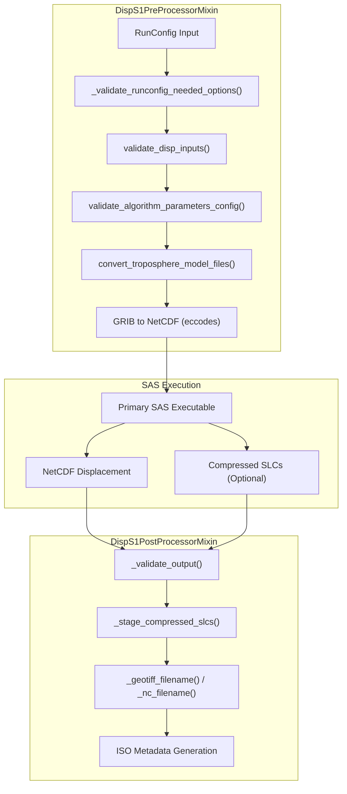
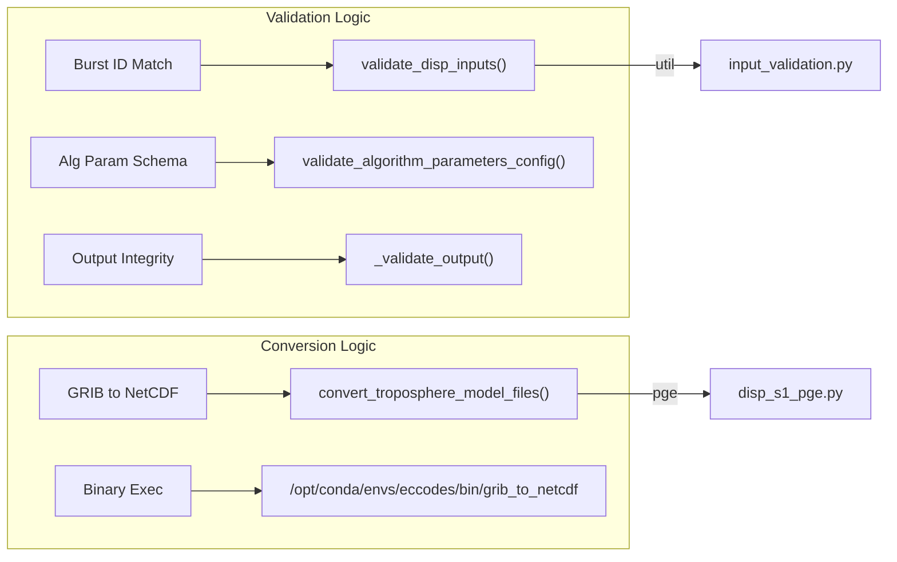
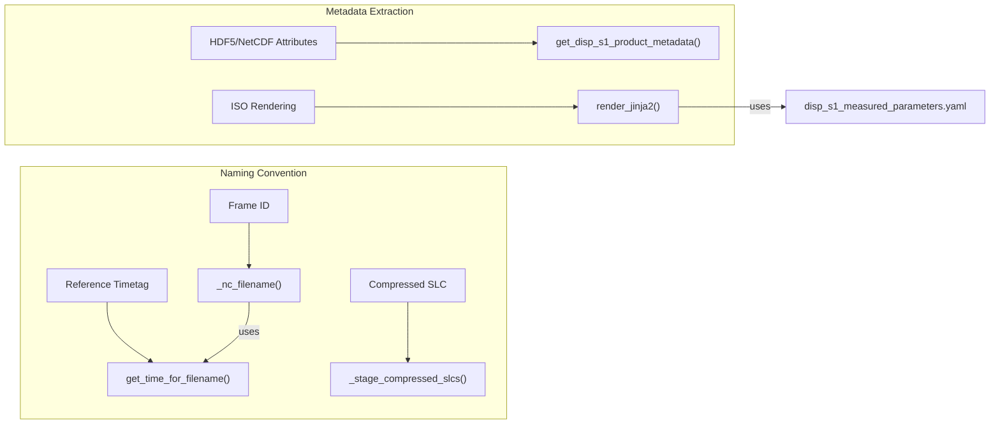

# Page: DISP-S1 PGE

# DISP-S1 PGE

Relevant source files

The following files were used as context for generating this wiki page:

- [.ci/scripts/disp_s1/build_disp_s1.sh](.ci/scripts/disp_s1/build_disp_s1.sh)
- [src/opera/pge/cslc_s1/cslc_s1_pge.py](src/opera/pge/cslc_s1/cslc_s1_pge.py)
- [src/opera/pge/disp_s1/disp_s1_pge.py](src/opera/pge/disp_s1/disp_s1_pge.py)
- [src/opera/pge/disp_s1/schema/algorithm_parameters_disp_s1_schema.yaml](src/opera/pge/disp_s1/schema/algorithm_parameters_disp_s1_schema.yaml)
- [src/opera/pge/disp_s1/schema/disp_s1_sas_schema.yaml](src/opera/pge/disp_s1/schema/disp_s1_sas_schema.yaml)
- [src/opera/pge/disp_s1/templates/disp_s1_measured_parameters.yaml](src/opera/pge/disp_s1/templates/disp_s1_measured_parameters.yaml)
- [src/opera/pge/rtc_s1/rtc_s1_pge.py](src/opera/pge/rtc_s1/rtc_s1_pge.py)
- [src/opera/test/data/test_disp_s1_algorithm_parameters.yaml](src/opera/test/data/test_disp_s1_algorithm_parameters.yaml)
- [src/opera/test/data/test_disp_s1_config.yaml](src/opera/test/data/test_disp_s1_config.yaml)
- [src/opera/test/pge/disp_s1/test_disp_s1_pge.py](src/opera/test/pge/disp_s1/test_disp_s1_pge.py)

The DISP-S1 PGE (Product Generation Executable) is responsible for generating Land-Surface Displacement (DISP) products from Sentinel-1 A/B data. It supports three primary workflows: **FORWARD** (catch-up), **HISTORICAL**, and **STATIC**. The PGE manages complex input validation for Co-registered Single Look Complex (CSLC) files, handles tropospheric model conversions from GRIB to NetCDF, and ensures output products (NetCDF and Compressed SLCs) meet OPERA standards.

## Overview and Architecture

The DISP-S1 PGE is implemented via two main executor classes: `DispS1Executor` for standard displacement products and `DispS1StaticExecutor` for static layer products [src/opera/pge/disp_s1/disp_s1_pge.py:348-358](). Both classes leverage the `DispS1PreProcessorMixin` and `DispS1PostProcessorMixin` to handle the lifecycle of Sentinel-1 displacement processing.

### Data Flow Diagram

The following diagram illustrates the flow from input validation and ancillary data conversion through SAS execution to final product packaging.

**DISP-S1 Execution Lifecycle**

Sources: [src/opera/pge/disp_s1/disp_s1_pge.py:38-346](), [src/opera/util/input_validation.py:30-32]()

## Pre-Processing and Validation

The pre-processing phase ensures that the SAS (Science Application Software) receives a consistent set of inputs.

### Input Validation Logic
The `DispS1PreProcessorMixin` performs several critical checks:
1.  **RunConfig Options**: Validates that required keys for the specific workflow (Forward/Historical vs Static) are present, such as `cslc_file_list`, `algorithm_parameters_file`, and `gpu_enabled` [src/opera/pge/disp_s1/disp_s1_pge.py:52-86]().
2.  **CSLC Matching**: Calls `validate_disp_inputs` to ensure that all input CSLCs belong to the same Burst ID and Frame ID [src/opera/util/input_validation.py:30-32]().
3.  **Algorithm Parameters**: Validates the `algorithm_parameters.yaml` against a specialized Yamale schema [src/opera/pge/disp_s1/disp_s1_pge.py:110-113]().

### Troposphere Model Conversion
The SAS requires tropospheric weather model data in NetCDF format. If the input files are in GRIB (`.grb`) format, the PGE performs an automated conversion:
*   **Function**: `convert_troposphere_model_files()` [src/opera/pge/disp_s1/disp_s1_pge.py:115-121]().
*   **Tool**: Uses `grib_to_netcdf` from the `eccodes` environment [src/opera/pge/disp_s1/disp_s1_pge.py:141-153]().
*   **Update**: The in-memory RunConfig is updated to point to the newly created `.nc` files in the scratch directory [src/opera/pge/disp_s1/disp_s1_pge.py:168-174]().

Sources: [src/opera/pge/disp_s1/disp_s1_pge.py:52-174](), [src/opera/util/input_validation.py:228-250]()

## Post-Processing and Output Handling

The post-processor manages the transition from raw SAS outputs to catalog-ready products.

### Output Validation
The `_validate_output` method scans the output directory to ensure:
*   Files exist and have non-zero size [src/opera/pge/disp_s1/disp_s1_pge.py:204-220]().
*   Extensions match expected types (`.nc`, `.h5`, `.png`, `.tif`) [src/opera/pge/disp_s1/disp_s1_pge.py:222-226]().
*   If `save_compressed_slc` is enabled, it verifies the existence of the `compressed_slcs` subdirectory [src/opera/pge/disp_s1/disp_s1_pge.py:210-213]().

### Filename Construction
DISP-S1 filenames are complex as they must represent a frame and a time range between reference and secondary acquisitions.

| Component | Source | Example/Logic |
| :--- | :--- | :--- |
| **Frame ID** | Metadata / RunConfig | `F123` |
| **Timetags** | `get_time_for_filename()` | `YYYYMMDDTHHMMSSZ` |
| **Reference Date** | HDF5 Dataset | Sensing start of reference epoch |
| **Secondary Date** | HDF5 Dataset | Sensing start of current acquisition |

The PGE uses `_nc_filename()` and `_geotiff_filename()` to assemble these components into the final product names [src/opera/pge/disp_s1/disp_s1_pge.py:265-333]().

### Compressed SLC Staging
When the SAS is configured to save compressed SLCs, these are treated as supplemental products. The `_stage_compressed_slcs()` function identifies these files in the output directory and moves them to the top-level product path for handover [src/opera/pge/disp_s1/disp_s1_pge.py:240-263]().

Sources: [src/opera/pge/disp_s1/disp_s1_pge.py:192-333](), [src/opera/util/time.py:25-39]()

## Code Entity Mapping

The following diagrams map natural language requirements to specific code entities within the DISP-S1 implementation.

**Requirement to Entity Mapping: Validation & Conversion**

Sources: [src/opera/pge/disp_s1/disp_s1_pge.py:108-113](), [src/opera/util/input_validation.py:228-250]()

**Requirement to Entity Mapping: Filename & Metadata**

Sources: [src/opera/pge/disp_s1/disp_s1_pge.py:240-333](), [src/opera/util/h5_utils.py:29-32](), [src/opera/pge/disp_s1/templates/disp_s1_measured_parameters.yaml:1-30]()

## Configuration Schemas

### SAS RunConfig Schema
The DISP-S1 SAS schema (`disp_s1_sas_schema.yaml`) defines the parameters passed to the science algorithm, including:
*   `input_file_group.cslc_file_list`: List of input CSLCs [src/opera/pge/disp_s1/schema/disp_s1_sas_schema.yaml:4-6]().
*   `primary_executable.product_type`: Enum of `DISP_S1_FORWARD`, `DISP_S1_HISTORICAL`, or `DISP_S1_STATIC` [src/opera/pge/disp_s1/schema/disp_s1_sas_schema.yaml:53-55]().
*   `worker_settings`: Configuration for GPU usage and thread counts [src/opera/pge/disp_s1/schema/disp_s1_sas_schema.yaml:74-87]().

### Algorithm Parameters Schema
The `algorithm_parameters_disp_s1_schema.yaml` provides strict validation for displacement-specific settings:
*   `ps_options.amp_dispersion_threshold`: Threshold for Persistent Scatterer detection [src/opera/pge/disp_s1/schema/algorithm_parameters_disp_s1_schema.yaml:1-3]().
*   `phase_linking`: Settings for ministack size and EVD/EMI algorithms [src/opera/pge/disp_s1/schema/algorithm_parameters_disp_s1_schema.yaml:4-38]().
*   `unwrap_options`: Selection of unwrapping methods like `snaphu`, `phass`, or `spurt` [src/opera/pge/disp_s1/schema/algorithm_parameters_disp_s1_schema.yaml:48-56]().

Sources: [src/opera/pge/disp_s1/schema/disp_s1_sas_schema.yaml:1-91](), [src/opera/pge/disp_s1/schema/algorithm_parameters_disp_s1_schema.yaml:1-139]()
