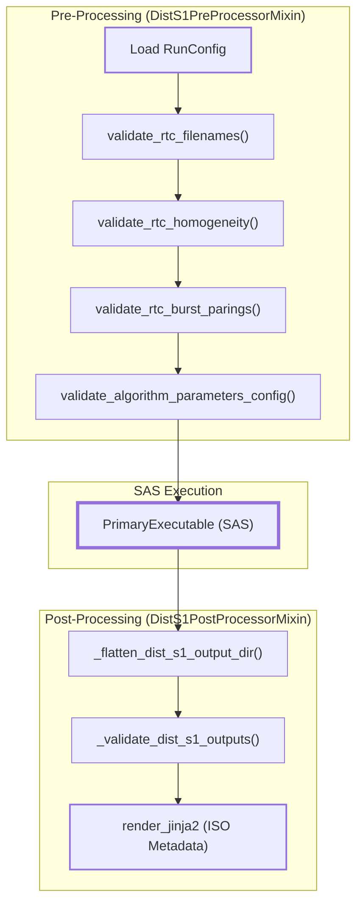
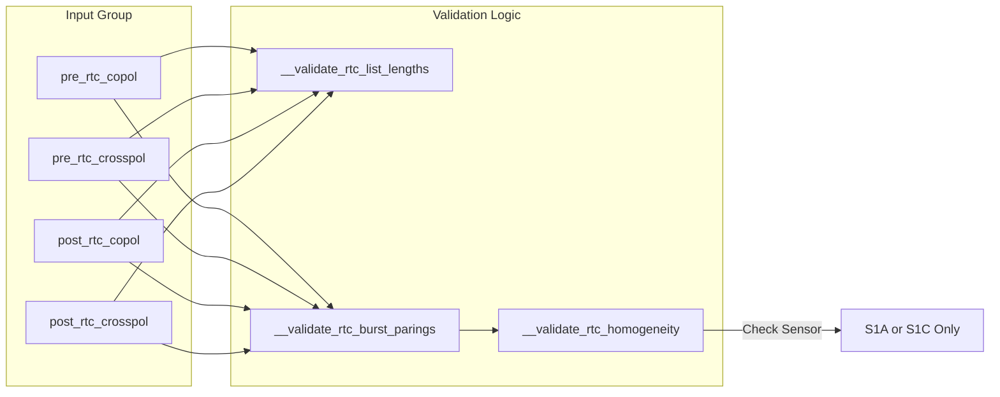

# Page: DIST-S1 PGE

# DIST-S1 PGE

Relevant source files

The following files were used as context for generating this wiki page:

- [.ci/scripts/dist_s1/build_dist_s1.sh](.ci/scripts/dist_s1/build_dist_s1.sh)
- [.ci/scripts/dist_s1/compare_dist_s1_products.sh](.ci/scripts/dist_s1/compare_dist_s1_products.sh)
- [.ci/scripts/dist_s1/dist_s1_compare.py](.ci/scripts/dist_s1/dist_s1_compare.py)
- [.ci/scripts/dist_s1/test_int_dist_s1.sh](.ci/scripts/dist_s1/test_int_dist_s1.sh)
- [src/opera/pge/dist_s1/dist_s1_pge.py](src/opera/pge/dist_s1/dist_s1_pge.py)
- [src/opera/pge/dist_s1/schema/algorithm_parameters_dist_s1_schema.yaml](src/opera/pge/dist_s1/schema/algorithm_parameters_dist_s1_schema.yaml)
- [src/opera/pge/dist_s1/schema/dist_s1_sas_schema.yaml](src/opera/pge/dist_s1/schema/dist_s1_sas_schema.yaml)
- [src/opera/pge/dist_s1/templates/OPERA_ISO_metadata_L3_DIST_S1_template.xml.jinja2](src/opera/pge/dist_s1/templates/OPERA_ISO_metadata_L3_DIST_S1_template.xml.jinja2)
- [src/opera/pge/dist_s1/templates/dist_s1_measured_parameters.yaml](src/opera/pge/dist_s1/templates/dist_s1_measured_parameters.yaml)
- [src/opera/test/data/test_dist_s1_algorithm_parameters.yaml](src/opera/test/data/test_dist_s1_algorithm_parameters.yaml)
- [src/opera/test/data/test_dist_s1_config.yaml](src/opera/test/data/test_dist_s1_config.yaml)
- [src/opera/test/pge/dist_s1/test_dist_s1_pge.py](src/opera/test/pge/dist_s1/test_dist_s1_pge.py)

The Surface Disturbance (DIST) from Sentinel-1 (S1) PGE is responsible for detecting changes in land surface using a time-series of Sentinel-1 RTC (Radiometric Terrain Corrected) products. It utilizes a deep-learning-based Scientific Application Software (SAS) to compare "baseline" (pre-event) RTC stacks against "current" (post-event) RTC stacks to generate disturbance alerts and metrics.

## 1. Overview and Implementation

The DIST-S1 PGE is implemented in the `DistS1Executor` class, which manages the lifecycle of surface disturbance processing [src/opera/pge/dist_s1/dist_s1_pge.py:348-356](). It inherits from `PgeExecutor` and utilizes specific mixins for pre-processing validation and post-processing product packaging.

### Key Responsibilities
*   **Input Validation**: Ensures RTC inputs are provided in co-pol/cross-pol pairs and belong to the same sensor (S1A or S1C) [src/opera/pge/dist_s1/dist_s1_pge.py:128-144]().
*   **Burst Pairing**: Verifies that every burst ID present in the co-polarization list has a matching entry in the cross-polarization list for both baseline and current sets [src/opera/pge/dist_s1/dist_s1_pge.py:145-188]().
*   **Algorithm Configuration**: Validates a complex set of deep learning parameters (e.g., `model_source`, `lookback_strategy`, `confidence_thresholds`) against a dedicated Yamale schema [src/opera/pge/dist_s1/schema/algorithm_parameters_dist_s1_schema.yaml:1-118]().
*   **Product Packaging**: Flattens SAS output directories, renames files to the OPERA standard, and generates COG-compliant metadata [src/opera/pge/dist_s1/dist_s1_pge.py:449-514]().

## 2. Data Flow and Code Entity Relationships

The following diagrams illustrate how the PGE transitions from high-level RunConfig requirements to specific code execution and validation.

### DIST-S1 Execution Lifecycle
This diagram maps the natural language steps of the PGE lifecycle to the specific class methods and external schemas used.

**Sources**: [src/opera/pge/dist_s1/dist_s1_pge.py:28-268](), [src/opera/pge/dist_s1/dist_s1_pge.py:348-369]()

### Input Validation Logic
The PGE enforces strict homogeneity and pairing rules for the input RTC files.

**Sources**: [src/opera/pge/dist_s1/dist_s1_pge.py:47-188]()

## 3. Input Validation Details

### RTC Homogeneity and Pairing
The `DistS1PreProcessorMixin` uses a regex `_rtc_pattern` to parse metadata from RTC filenames [src/opera/pge/dist_s1/dist_s1_pge.py:41-45]().
*   **Sensor Consistency**: All input RTCs must share the same sensor ID (e.g., all `S1A` or all `S1C`). Mixing sensors triggers a critical error [src/opera/pge/dist_s1/dist_s1_pge.py:128-144]().
*   **Burst-Acquisition Matching**: For every co-pol file, there must be a cross-pol file with the exact same `burst_id` and `acquisition_ts` [src/opera/pge/dist_s1/dist_s1_pge.py:158-188]().

### Algorithm Parameters
The DIST-S1 SAS requires a specific set of parameters for its transformer-based detection model. The PGE validates these using `validate_algorithm_parameters_config` [src/opera/pge/dist_s1/dist_s1_pge.py:21]().
Key parameters include:
*   `lookback_strategy`: Currently supports `multi_window` [src/opera/pge/dist_s1/schema/algorithm_parameters_dist_s1_schema.yaml:35]().
*   `model_source`: Options include `transformer_optimized`, `transformer_original`, etc [src/opera/pge/dist_s1/schema/algorithm_parameters_dist_s1_schema.yaml:86]().
*   `confidence_thresholds`: Low and high thresholds for alert generation [src/opera/pge/dist_s1/schema/algorithm_parameters_dist_s1_schema.yaml:50-54]().

## 4. Post-Processing and Output Validation

### Directory Flattening
The DIST-S1 SAS typically outputs products into a sub-directory named after the product ID. To comply with SDS PCM (Product Control Management) expectations, the `DistS1PostProcessorMixin` flattens this structure [src/opera/pge/dist_s1/dist_s1_pge.py:417-447](). It moves all files from the sub-directory (e.g., `OPERA_L3_DIST-ALERT-S1_.../`) directly into the top-level output directory.

### Output Layer Validation
The PGE ensures that the SAS has produced all required GeoTIFF layers. These layers include:
*   `GEN-DIST-STATUS`: General disturbance status.
*   `GEN-METRIC`: The raw detection metric.
*   `GEN-DIST-CONF`: Confirmation confidence.
*   `GEN-DIST-DATE`: Date of first detected disturbance.
*   `GEN-DIST-COUNT`: Number of times disturbance was observed.

The validation logic iterates through the output directory and confirms the presence of these files based on the expected naming convention [src/opera/pge/dist_s1/dist_s1_pge.py:449-514]().

### Metadata Generation
The PGE extracts geospatial boundaries from the MGRS tile ID provided in the RunConfig [src/opera/pge/dist_s1/dist_s1_pge.py:539-540](). It also scrapes metadata from the output GeoTIFFs using `get_geotiff_metadata` to populate the ISO XML templates [src/opera/pge/dist_s1/dist_s1_pge.py:545-555]().

| Output Layer | Description |
| :--- | :--- |
| `GEN-DIST-STATUS` | Indicates if a pixel is disturbed, non-disturbed, or masked. |
| `GEN-METRIC` | Value representing the magnitude of the detected change. |
| `GEN-DIST-CONF` | Accumulation of metrics over time for confirmation. |
| `GEN-DIST-PERC` | Percentage-based reset threshold metric. |

**Sources**: [src/opera/pge/dist_s1/dist_s1_pge.py:449-514](), [src/opera/pge/dist_s1/templates/dist_s1_measured_parameters.yaml:1-170]()

## 5. Integration and Comparison
Integration tests for DIST-S1 are orchestrated via `test_int_dist_s1.sh` [.ci/scripts/dist_s1/test_int_dist_s1.sh:1-138](). This script:
1.  Downloads test data (RTC stacks and expected outputs).
2.  Runs the PGE Docker container.
3.  Invokes `compare_dist_s1_products.sh`, which uses `dist_s1_compare.py` to perform a bit-for-bit or metadata comparison of the generated layers against "golden" datasets [.ci/scripts/dist_s1/compare_dist_s1_products.sh:66-70]().

**Sources**: [.ci/scripts/dist_s1/test_int_dist_s1.sh:1-138](), [.ci/scripts/dist_s1/dist_s1_compare.py:29-42]()
