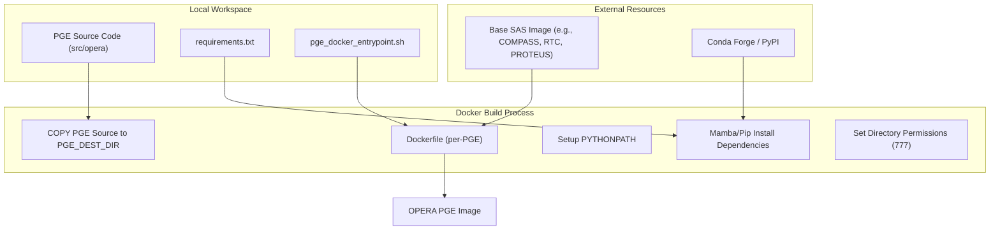
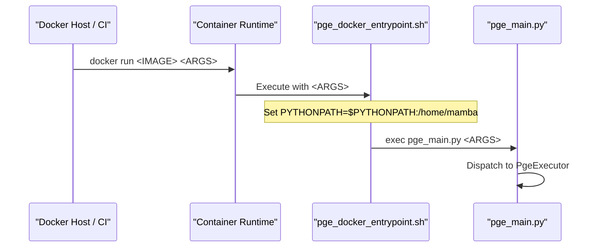

# Page: Docker Image Builds

# Docker Image Builds

Relevant source files

The following files were used as context for generating this wiki page:

- [.ci/docker/Dockerfile_cslc_s1](.ci/docker/Dockerfile_cslc_s1)
- [.ci/docker/Dockerfile_disp_s1](.ci/docker/Dockerfile_disp_s1)
- [.ci/docker/Dockerfile_dist_s1](.ci/docker/Dockerfile_dist_s1)
- [.ci/docker/Dockerfile_dswx_hls](.ci/docker/Dockerfile_dswx_hls)
- [.ci/docker/Dockerfile_rtc_s1](.ci/docker/Dockerfile_rtc_s1)
- [.ci/scripts/dist_s1/test_dist_s1.sh](.ci/scripts/dist_s1/test_dist_s1.sh)
- [requirements.txt](requirements.txt)
- [requirements_numpy2.txt](requirements_numpy2.txt)
- [src/opera/scripts/pge_docker_entrypoint.sh](src/opera/scripts/pge_docker_entrypoint.sh)
- [src/opera/scripts/pge_tests_entrypoint.sh](src/opera/scripts/pge_tests_entrypoint.sh)

The OPERA SDS PGE repository employs a containerized execution strategy where each Product Generation Executable (PGE) is packaged into a dedicated Docker image. These images are built by inheriting from a base Scientific Algorithms Software (SAS) image, layering the PGE framework, and configuring a specialized Conda or Micromamba environment to satisfy all runtime dependencies.

## Image Inheritance and Layering Pattern

The build process follows a strict inheritance pattern. Every PGE Dockerfile requires a `SAS_IMAGE` build argument, which provides the underlying algorithm binaries and a pre-configured environment. The PGE layer then injects the Python framework and installs additional dependencies.

### Base SAS Inheritance
The `FROM $SAS_IMAGE` instruction is the foundation of every PGE image [ .ci/docker/Dockerfile_disp_s1:5-6 ](). This ensures that the PGE framework (the "wrapper") is always coupled with the correct version of the underlying SAS.

### Build Orchestration Flow
The following diagram illustrates how the build system transforms source code and base images into a deployable PGE container.

**PGE Image Construction Flow**

**Sources:** [ .ci/docker/Dockerfile_disp_s1:5-57 ](), [ .ci/docker/Dockerfile_rtc_s1:5-58 ](), [ .ci/docker/Dockerfile_dswx_hls:5-57 ]()

## Environment Setup and Micromamba/Conda

Different PGEs utilize different environment managers based on the underlying SAS image. The images generally fall into two categories:

1.  **Micromamba/Mamba-based**: Used for HLS and DISP-S1, typically utilizing `/opt/conda` or `/usr/local/bin/_activate_current_env.sh` [ .ci/docker/Dockerfile_disp_s1:55-56 ](), [ .ci/docker/Dockerfile_dswx_hls:55-56 ]().
2.  **Conda-based**: Used for RTC-S1 and CSLC-S1, where the build process uses `conda run -n <ENV_NAME>` to execute commands within the specific SAS environment [ .ci/docker/Dockerfile_rtc_s1:47-57 ](), [ .ci/docker/Dockerfile_cslc_s1:47-57 ]().

### Dependency Installation
Dependencies are managed via `requirements.txt` [ requirements.txt:1-15 ]() or `requirements_numpy2.txt` [ requirements_numpy2.txt:1-15 ](). Some PGEs, like `dist_s1`, require additional system-level packages such as `g++` for compiling extensions during the build [ .ci/docker/Dockerfile_dist_s1:58-62 ]().

| PGE Type | Default User | Default Environment | Manager |
| :--- | :--- | :--- | :--- |
| DISP-S1 | `mamba` | Current active | Micromamba |
| RTC-S1 | `rtc_user` | `RTC` | Conda |
| CSLC-S1 | `compass_user` | `COMPASS` | Conda |
| DSWx-HLS | `conda` | `root` | Mamba |
| DIST-S1 | `dist_user` | `dist-s1-env` | Conda |

**Sources:** [ .ci/docker/Dockerfile_disp_s1:41-42 ](), [ .ci/docker/Dockerfile_rtc_s1:41-47 ](), [ .ci/docker/Dockerfile_cslc_s1:41-47 ](), [ .ci/docker/Dockerfile_dist_s1:42-48 ]()

## Container Entrypoints

The repository utilizes two primary entrypoint scripts to bridge the container environment with the PGE Python code.

### pge_docker_entrypoint.sh
This is the production `ENTRYPOINT`. Its primary role is to set the `PYTHONPATH` to include the `PGE_PROGRAM_DIR` so that the `opera` package is importable, then execute `pge_main.py` [ src/opera/scripts/pge_docker_entrypoint.sh:1-16 ]().

In the Dockerfile, this is typically invoked through the environment manager to ensure the shell is correctly initialized:
`ENTRYPOINT ["conda", "run", "--no-capture-output", "-n", "RTC", "sh", "-c", "exec ${CONDA_ROOT}/bin/pge_docker_entrypoint.sh \"${@}\"", "--"]` [ .ci/docker/Dockerfile_rtc_s1:61 ]().

### pge_tests_entrypoint.sh
This entrypoint is used during the CI/CD test phase. It allows arbitrary commands (like `pytest`, `pylint`, or `flake8`) to be run within the container's environment while maintaining the correct `PYTHONPATH` [ src/opera/scripts/pge_tests_entrypoint.sh:1-14 ]().

**Entrypoint Interaction Diagram**

**Sources:** [ src/opera/scripts/pge_docker_entrypoint.sh:1-16 ](), [ .ci/docker/Dockerfile_disp_s1:60 ]()

## Orchestration and Testing

Image building and testing are orchestrated via shell scripts in the `.ci/scripts` directory.

### Build and Test Scripts
Each PGE has a corresponding test script (e.g., `test_dist_s1.sh`). These scripts perform the following:
1.  **Environment Setup**: Define local workspace paths and image tags [ .ci/scripts/dist_s1/test_dist_s1.sh:22-30 ]().
2.  **Docker Run Configuration**: Mount the local source code and test data into the container [ .ci/scripts/dist_s1/test_dist_s1.sh:42-54 ]().
3.  **Static Analysis**: Execute `flake8` and `pylint` against the code inside the container [ .ci/scripts/dist_s1/test_dist_s1.sh:72-86 ]().
4.  **Unit Testing**: Execute `pytest` with coverage reporting, targeting specific PGE sub-packages [ .ci/scripts/dist_s1/test_dist_s1.sh:89-100 ]().

### Permissions Handling
A critical step in the build and test orchestration is the `set_perms` function. Because Docker containers often run as `root` or a specific UID during CI, the scripts use `find` commands to reset permissions to `775` (directories) and `664` (files) so the Jenkins CI agent can archive and clean up the results [ .ci/scripts/dist_s1/test_dist_s1.sh:59-67 ]().

**Sources:** [ .ci/scripts/dist_s1/test_dist_s1.sh:1-105 ](), [ .ci/docker/Dockerfile_disp_s1:57 ]()

## Vulnerability Scanning (Grype)
While the Dockerfiles focus on image assembly, the CI/CD pipeline integrates vulnerability scanning. Images are labeled with `org.label-schema` metadata, including build date and version [ .ci/docker/Dockerfile_disp_s1:20-38 ](). These labels facilitate tracking in vulnerability scanners like Grype, which check the installed Conda/Pip packages and system libraries against known CVE databases.

**Sources:** [ .ci/docker/Dockerfile_disp_s1:18-38 ](), [ .ci/docker/Dockerfile_dswx_hls:18-38 ]()
