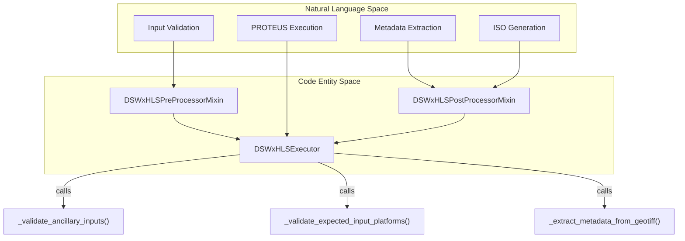
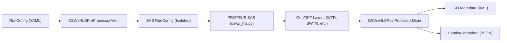

# Page: DSWx-HLS PGE

# DSWx-HLS PGE

Relevant source files

The following files were used as context for generating this wiki page:

- [.ci/docker/Dockerfile_dswx_hls](.ci/docker/Dockerfile_dswx_hls)
- [.ci/scripts/dswx_hls/opera_pge_dswx_hls_delivery_4.2_final_runconfig.yaml](.ci/scripts/dswx_hls/opera_pge_dswx_hls_delivery_4.2_final_runconfig.yaml)
- [.ci/scripts/dswx_hls/test_int_dswx_hls.sh](.ci/scripts/dswx_hls/test_int_dswx_hls.sh)
- [src/opera/pge/base/base_pge.py](src/opera/pge/base/base_pge.py)
- [src/opera/pge/base/schema/catalog_metadata_schema.json](src/opera/pge/base/schema/catalog_metadata_schema.json)
- [src/opera/pge/dswx_hls/dswx_hls_pge.py](src/opera/pge/dswx_hls/dswx_hls_pge.py)
- [src/opera/pge/dswx_hls/schema/dswx_hls_sas_schema.yaml](src/opera/pge/dswx_hls/schema/dswx_hls_sas_schema.yaml)
- [src/opera/pge/dswx_hls/templates/dswx_hls_measured_parameters.yaml](src/opera/pge/dswx_hls/templates/dswx_hls_measured_parameters.yaml)
- [src/opera/test/pge/base/test_base_pge.py](src/opera/test/pge/base/test_base_pge.py)
- [src/opera/test/pge/dswx_hls/test_dswx_hls_pge.py](src/opera/test/pge/dswx_hls/test_dswx_hls_pge.py)
- [src/opera/test/scripts/test_pge_main.py](src/opera/test/scripts/test_pge_main.py)

The **DSWx-HLS PGE** (Product Generation Executable) is responsible for generating the Dynamic Surface Water Extent (DSWx) product from Harmonized Landsat and Sentinel-2 (HLS) data. It integrates the **PROTEUS SAS** (Scientific Analysis Software), providing a wrapper that handles input validation for various satellite platforms (Landsat-8/9, Sentinel-2A/B/C/D), manages MGRS tile-based naming conventions, and performs metadata extraction and ISO rendering.

## Architecture and Execution Flow

The DSWx-HLS PGE is implemented via the `DSWxHLSExecutor` class, which inherits from the base `PgeExecutor` and utilizes specialized mixins for pre-processing and post-processing logic [src/opera/pge/dswx_hls/dswx_hls_pge.py:38-208]().

### Execution Lifecycle
1.  **Pre-processing**: Validates input HLS datasets and ancillary files (DEM, Landcover, WorldCover, Shoreline shapefiles) [src/opera/pge/dswx_hls/dswx_hls_pge.py:145-161]().
2.  **SAS Execution**: Invokes the PROTEUS SAS (typically `dswx_hls.py`) using the parameters defined in the RunConfig [src/opera/pge/base/base_pge.py:440-445]().
3.  **Post-processing**: Validates the output GeoTIFF layers, renames them according to OPERA naming conventions, extracts metadata from the generated files, and renders the final ISO XML metadata [src/opera/pge/dswx_hls/dswx_hls_pge.py:202-208]().

### System Entity Map: Natural Language to Code
The following diagram maps high-level PGE responsibilities to the specific classes and methods that implement them.

**DSWx-HLS Entity Mapping**

Sources: [src/opera/pge/dswx_hls/dswx_hls_pge.py:38-208](), [src/opera/pge/base/base_pge.py:41-55]()

## Input Validation and Platform Support

The PGE ensures that input HLS data originates from supported platforms:
*   **Landsat-8/9**: Validated via the `LANDSAT_PRODUCT_ID` metadata key. The PGE specifically blocks Landsat-7 data [src/opera/pge/dswx_hls/dswx_hls_pge.py:124-131]().
*   **Sentinel-2A/B/C/D**: Validated via the `PRODUCT_URI` metadata key [src/opera/pge/dswx_hls/dswx_hls_pge.py:133-143]().

### Ancillary Data Requirements
The PGE validates the presence and format of several dynamic ancillary files:
| Ancillary Type | Key in RunConfig | Expected Extensions |
| :--- | :--- | :--- |
| Digital Elevation Model | `dem_file` | `.tif`, `.tiff`, `.vrt` |
| CGLS Land Cover | `landcover_file` | `.tif`, `.tiff` |
| ESA WorldCover | `worldcover_file` | `.tif`, `.tiff`, `.vrt` |
| Shoreline Shapefile | `shoreline_shapefile` | `.shp` (plus `.dbf`, `.prj`, `.shx`) |

Sources: [src/opera/pge/dswx_hls/dswx_hls_pge.py:65-88](), [src/opera/pge/dswx_hls/dswx_hls_pge.py:113-143]()

## Data Flow and Integration

The DSWx-HLS PGE acts as a bridge between the SDS RunConfig and the PROTEUS SAS. It transforms the SDS-formatted RunConfig into a SAS-specific YAML configuration before execution.

**DSWx-HLS Data Flow**

Sources: [src/opera/pge/dswx_hls/dswx_hls_pge.py:145-208](), [src/opera/pge/base/base_pge.py:440-445]()

## Metadata Handling and ISO Rendering

Post-processing involves a deep inspection of the SAS-generated GeoTIFFs to populate the final product metadata.

### Key Metadata Functions
*   **SPACECRAFT_NAME Correction**: The PGE extracts the spacecraft name and maps it to a standard sensor string (e.g., "Landsat-9" to "L9") [src/opera/pge/dswx_hls/dswx_hls_pge.py:230-241]().
*   **MGRS Tile Extraction**: Uses `get_geographic_boundaries_from_mgrs_tile` to calculate the bounding polygon based on the MGRS tile ID found in the filename [src/opera/pge/dswx_hls/dswx_hls_pge.py:255-265]().
*   **ISO Rendering**: Utilizes Jinja2 templates (`OPERA_ISO_metadata_L3_DSWx_HLS_template.xml.jinja2`) and a measured parameters configuration (`dswx_hls_measured_parameters.yaml`) to generate the ISO 19115 XML [src/opera/pge/dswx_hls/dswx_hls_pge.py:302-315]().

### Output Product Layers
The PGE validates and renames several layers produced by the SAS:
*   `WTR`: Water Classification
*   `BWTR`: Binary Water Mask
*   `CONF`: Confidence Layer
*   `DIAG`: Diagnostic Layer
*   `BROWSE`: Browse Image (Cloud-Optimized GeoTIFF)

Sources: [src/opera/pge/dswx_hls/dswx_hls_pge.py:223-280](), [src/opera/pge/dswx_hls/schema/dswx_hls_sas_schema.yaml:116-155]()

## Configuration and Dockerization

The PGE is deployed as a Docker container, inheriting from a base SAS image.

### Docker Environment
*   **Entrypoint**: Uses `pge_docker_entrypoint.sh` which wraps the `pge_main.py` dispatcher [.ci/docker/Dockerfile_dswx_hls:60]().
*   **Requirements**: Installs dependencies via Mamba from `requirements.txt` [.ci/docker/Dockerfile_dswx_hls:56]().

### RunConfig Schema
The SAS-specific portion of the RunConfig is validated against `dswx_hls_sas_schema.yaml`, which defines parameters for processing modes like `shadow_masking_algorithm` (otsu or sun_local_inc_angle) and `mask_adjacent_to_cloud_mode` [src/opera/pge/dswx_hls/schema/dswx_hls_sas_schema.yaml:96-106]().

Sources: [.ci/docker/Dockerfile_dswx_hls:1-66](), [src/opera/pge/dswx_hls/schema/dswx_hls_sas_schema.yaml:1-195]()
