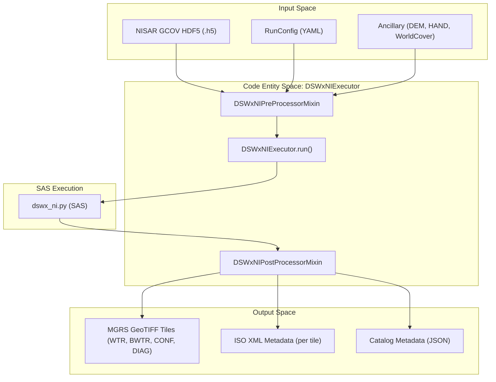
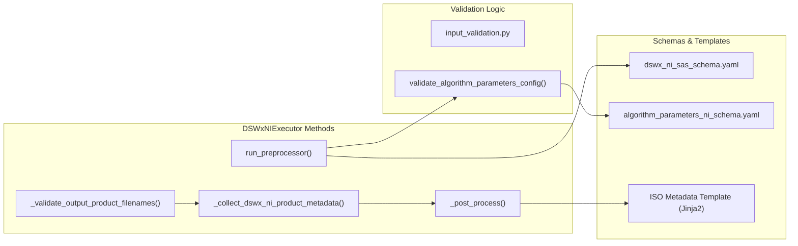

# Page: DSWx-NI PGE

# DSWx-NI PGE

Relevant source files

The following files were used as context for generating this wiki page:

- [.ci/docker/Dockerfile_dswx_ni](.ci/docker/Dockerfile_dswx_ni)
- [.ci/scripts/dswx_ni/build_dswx_ni.sh](.ci/scripts/dswx_ni/build_dswx_ni.sh)
- [.ci/scripts/dswx_ni/compare_dswx_ni_products.sh](.ci/scripts/dswx_ni/compare_dswx_ni_products.sh)
- [.ci/scripts/dswx_ni/opera_pge_dswx_ni_delivery_0.3_gamma_runconfig.yaml](.ci/scripts/dswx_ni/opera_pge_dswx_ni_delivery_0.3_gamma_runconfig.yaml)
- [.ci/scripts/dswx_ni/test_int_dswx_ni.sh](.ci/scripts/dswx_ni/test_int_dswx_ni.sh)
- [.ci/scripts/dswx_s1/compare_dswx_s1_products.sh](.ci/scripts/dswx_s1/compare_dswx_s1_products.sh)
- [.ci/scripts/dswx_s1/dswx_comparison.py](.ci/scripts/dswx_s1/dswx_comparison.py)
- [examples/dswx_ni_sample_runconfig-v4.0.0-rc.1.0.yaml](examples/dswx_ni_sample_runconfig-v4.0.0-rc.1.0.yaml)
- [src/opera/pge/dswx_ni/dswx_ni_pge.py](src/opera/pge/dswx_ni/dswx_ni_pge.py)
- [src/opera/pge/dswx_ni/schema/algorithm_parameters_ni_schema.yaml](src/opera/pge/dswx_ni/schema/algorithm_parameters_ni_schema.yaml)
- [src/opera/pge/dswx_ni/templates/dswx_ni_measured_parameters.yaml](src/opera/pge/dswx_ni/templates/dswx_ni_measured_parameters.yaml)
- [src/opera/test/data/test_dswx_ni_algorithm_parameters.yaml](src/opera/test/data/test_dswx_ni_algorithm_parameters.yaml)
- [src/opera/test/data/test_dswx_ni_config.yaml](src/opera/test/data/test_dswx_ni_config.yaml)
- [src/opera/test/pge/dswx_ni/test_dswx_ni_pge.py](src/opera/test/pge/dswx_ni/test_dswx_ni_pge.py)

The Dynamic Surface Water Extent from NISAR (DSWx-NI) PGE is responsible for generating tile-based surface water maps from NISAR L2 GCOV (Geocoded Covariance) HDF5 products. It inherits much of its operational logic from the DSWx-S1 (Sentinel-1) PGE due to the shared requirement of producing MGRS (Military Grid Reference System) tiled outputs.

## Overview

The `DSWxNIExecutor` manages the lifecycle of the DSWx-NI product generation. It validates NISAR-specific HDF5 inputs, executes the `dswx_sar` Scientific Application Software (SAS), and post-processes the resulting GeoTIFF tiles. Key features include MGRS tile-based filename validation, per-tile metadata caching for ISO XML generation, and integration with the `dswx_ni` algorithm parameters schema.

### Data Flow

The following diagram illustrates the data flow from NISAR HDF5 inputs to the final MGRS-tiled GeoTIFF products.

**DSWx-NI Execution Flow**

Sources: [src/opera/pge/dswx_ni/dswx_ni_pge.py:25-54](), [src/opera/pge/dswx_ni/dswx_ni_pge.py:1172-1193](), [src/opera/test/data/test_dswx_ni_config.yaml:7-43]()

## Implementation Details

### DSWxNIExecutor Class
The `DSWxNIExecutor` is the primary entry point for the PGE. It inherits from `PgeExecutor` and utilizes specialized mixins for pre- and post-processing.

*   **Pre-processing**: Inherits from `DSWxS1PreProcessorMixin` but restricts valid input extensions to `.h5` [src/opera/pge/dswx_ni/dswx_ni_pge.py:36-37]().
*   **Post-processing**: Implements NISAR-specific filename validation and metadata extraction [src/opera/pge/dswx_ni/dswx_ni_pge.py:70-109]().

### MGRS Tile Naming Convention
The PGE enforces a strict naming convention for output products via a regular expression in `_validate_output_product_filenames`.

**Naming Pattern**:
`OPERA_L3_DSWx-NI_T<TILE_ID>_<ACQUISITION_TS>_<CREATION_TS>_LSAR_30_v<VERSION>_<BAND_INDEX>_<BAND_NAME>.<EXT>`

**Supported Bands**:
*   `WTR`: Water Mask
*   `BWTR`: Binary Water Mask
*   `CONF`: Confidence Layer
*   `DIAG`: Diagnostic Layer
*   `BROWSE`: Browse Image (PNG/TIF)

Sources: [src/opera/pge/dswx_ni/dswx_ni_pge.py:85-90]()

### Metadata Caching and ISO Generation
Because the SAS can produce multiple MGRS tiles in a single execution, the PGE caches metadata on a per-tile basis to support independent ISO XML generation for each tile.

1.  **Cache Initialization**: The mixin maintains `_tile_metadata_cache` and `_tile_filename_cache` [src/opera/pge/dswx_ni/dswx_ni_pge.py:67-68]().
2.  **Collection**: During output validation, `_collect_dswx_ni_product_metadata` is called for each new tile ID encountered [src/opera/pge/dswx_ni/dswx_ni_pge.py:102-104]().
3.  **ISO Rendering**: The PGE iterates through the cached tiles and renders the Jinja2 template `OPERA_ISO_metadata_L3_DSWx_NI_template.xml.jinja2` for each [src/opera/pge/dswx_ni/dswx_ni_pge.py:1182-1188]().

### Relationship between PGE Components
The following diagram maps the logical PGE steps to specific class methods and external schemas.

**Code Entity Association**

Sources: [src/opera/pge/dswx_ni/dswx_ni_pge.py:39-51](), [src/opera/pge/dswx_ni/dswx_ni_pge.py:70-109](), [src/opera/pge/dswx_ni/dswx_ni_pge.py:1172-1193](), [src/opera/pge/dswx_ni/schema/algorithm_parameters_ni_schema.yaml:1-136]()

## Configuration and Validation

### Algorithm Parameters
The DSWx-NI PGE uses a specific schema for algorithm parameters, defined in `algorithm_parameters_ni_schema.yaml`. This includes configurations for:
*   **Polarizations**: Support for `co-pol`, `cross-pol`, or `dual-pol` [src/opera/pge/dswx_ni/schema/algorithm_parameters_ni_schema.yaml:9-13]().
*   **Filtering**: Options for `lee_filter`, `guided_filter`, and `bregman` denoising [src/opera/pge/dswx_ni/schema/algorithm_parameters_ni_schema.yaml:53-76]().
*   **Thresholding**: Strategies such as `bimodality`, `chini`, and `twele` [src/opera/pge/dswx_ni/schema/algorithm_parameters_ni_schema.yaml:90-108]().

### RunConfig Example
The PGE requires a RunConfig that defines both PGE-level execution parameters and SAS-level algorithm settings.

| Group | Key | Description |
| :--- | :--- | :--- |
| **InputFilesGroup** | `InputFilePaths` | List of NISAR GCOV `.h5` files. |
| **DynamicAncillaryFilesGroup** | `dem_file`, `hand_file` | Paths to required geospatial ancillary data. |
| **PrimaryExecutable** | `ProgramPath` | Path to the SAS entry point (e.g., `dswx_ni.py`). |
| **PrimaryExecutable** | `AlgorithmParametersSchemaPath` | Path to the NISAR-specific algorithm schema. |

Sources: [src/opera/test/data/test_dswx_ni_config.yaml:7-43](), [.ci/scripts/dswx_ni/opera_pge_dswx_ni_delivery_0.3_gamma_runconfig.yaml:13-115]()

## Testing and Quality Assurance

### Integration Testing
Integration tests are orchestrated via `test_int_dswx_ni.sh`, which performs the following:
1.  Stages NISAR input data and ancillary files.
2.  Executes the PGE within a Docker container using a sample RunConfig [.ci/scripts/dswx_ni/test_int_dswx_ni.sh:95-102]().
3.  Invokes `compare_dswx_ni_products.sh` as a QA executable to perform bit-for-bit or statistical comparison of output GeoTIFFs against expected products [.ci/scripts/dswx_ni/compare_dswx_ni_products.sh:39-104]().

### Unit Testing
The `DswxNIPgeTestCase` class validates the executor mixins by mocking the SAS execution. It verifies that:
*   Directories are created correctly [src/opera/test/pge/dswx_ni/test_dswx_ni_pge.py:154-156]().
*   ISO metadata is rendered without undefined errors [src/opera/test/pge/dswx_ni/test_dswx_ni_pge.py:172-179]().
*   Output filenames are correctly matched against the regex [src/opera/test/pge/dswx_ni/test_dswx_ni_pge.py:92-97]().

Sources: [src/opera/test/pge/dswx_ni/test_dswx_ni_pge.py:128-183](), [.ci/scripts/dswx_ni/test_int_dswx_ni.sh:1-135]()
