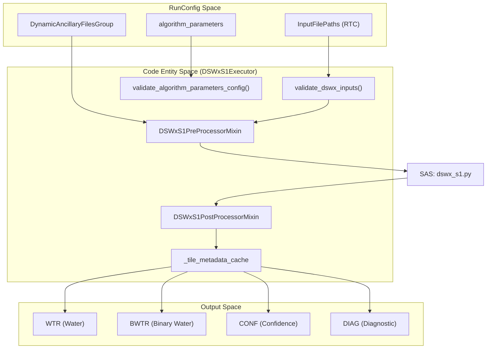
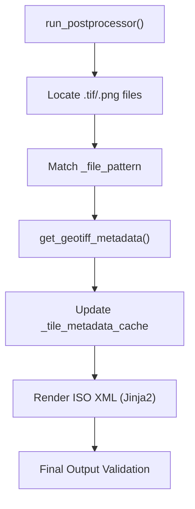

# Page: DSWx-S1 PGE

# DSWx-S1 PGE

<details>
<summary>Relevant source files</summary>

The following files were used as context for generating this wiki page:

- [.ci/docker/Dockerfile_dswx_s1](.ci/docker/Dockerfile_dswx_s1)
- [.ci/scripts/dswx_ni/dswx_comparison.py](.ci/scripts/dswx_ni/dswx_comparison.py)
- [.ci/scripts/dswx_s1/dswx_s1_final_1.2_runconfig.yaml](.ci/scripts/dswx_s1/dswx_s1_final_1.2_runconfig.yaml)
- [.ci/scripts/dswx_s1/test_int_dswx_s1.sh](.ci/scripts/dswx_s1/test_int_dswx_s1.sh)
- [src/opera/pge/dswx_s1/dswx_s1_pge.py](src/opera/pge/dswx_s1/dswx_s1_pge.py)
- [src/opera/pge/dswx_s1/schema/algorithm_parameters_s1_schema.yaml](src/opera/pge/dswx_s1/schema/algorithm_parameters_s1_schema.yaml)
- [src/opera/pge/dswx_s1/schema/dswx_s1_sas_schema.yaml](src/opera/pge/dswx_s1/schema/dswx_s1_sas_schema.yaml)
- [src/opera/test/data/test_dswx_s1_algorithm_parameters.yaml](src/opera/test/data/test_dswx_s1_algorithm_parameters.yaml)
- [src/opera/test/data/test_dswx_s1_config.yaml](src/opera/test/data/test_dswx_s1_config.yaml)
- [src/opera/test/pge/dswx_s1/test_dswx_s1_pge.py](src/opera/test/pge/dswx_s1/test_dswx_s1_pge.py)

</details>


The Dynamic Surface Water Extent from Sentinel-1 (DSWx-S1) PGE is responsible for generating the L3_DSWx-S1 product. This PGE processes Sentinel-1 Radiometric Terrain Corrected (RTC) data to produce water extent maps, confidence layers, and diagnostic information organized by Military Grid Reference System (MGRS) tiles.

## Overview and Purpose

The `DSWxS1Executor` manages the end-to-end execution of the DSWx-S1 Science Application Software (SAS). Its primary responsibilities include:
*   **Input Validation**: Ensuring RTC inputs and a wide array of dynamic ancillary data (DEM, HAND, WorldCover, Shoreline shapefiles) are present and valid.
*   **SAS Execution**: Orchestrating the `dswx_s1.py` SAS workflow.
*   **Output Validation**: Validating MGRS tile-based GeoTIFFs (WTR, BWTR, CONF, DIAG) and browse images.
*   **Metadata Management**: Caching per-tile metadata to facilitate ISO XML generation for multi-tile outputs.

## Class Architecture and Data Flow

The DSWx-S1 PGE is implemented using a mixin-based architecture, inheriting from `PgeExecutor`, `DSWxS1PreProcessorMixin`, and `DSWxS1PostProcessorMixin` [src/opera/pge/dswx_s1/dswx_s1_pge.py:25-30]().

### DSWx-S1 Execution Lifecycle

The following diagram illustrates the transition from RunConfig definitions to the internal code entities and the resulting data flow.

**Diagram: DSWx-S1 Natural Language to Code Entity Mapping**

**Sources**: [src/opera/pge/dswx_s1/dswx_s1_pge.py:30-145](), [src/opera/test/data/test_dswx_s1_config.yaml:7-17]()

## Pre-processing and Validation

The `DSWxS1PreProcessorMixin` performs extensive validation of both primary and ancillary inputs before the SAS is invoked [src/opera/pge/dswx_s1/dswx_s1_pge.py:30-42]().

### Input Validation Steps
1.  **Primary Inputs**: Validates RTC GeoTIFFs or HDF5 files using `validate_dswx_inputs` [src/opera/pge/dswx_s1/dswx_s1_pge.py:121-124]().
2.  **Algorithm Parameters**: Validates the `algorithm_parameters` YAML against its schema using `validate_algorithm_parameters_config` [src/opera/pge/dswx_s1/dswx_s1_pge.py:125-128]().
3.  **Dynamic Ancillary Validation**: The `_validate_dynamic_ancillary_inputs` method checks for the existence and extensions of:
    *   DEM (`.tif`, `.tiff`, `.vrt`)
    *   HAND (`.tif`)
    *   WorldCover and GLAD classification files
    *   Shoreline shapefiles (verifying co-location of `.shp`, `.dbf`, `.prj`, and `.shx`) [src/opera/pge/dswx_s1/dswx_s1_pge.py:45-85]().
4.  **Static Ancillary Validation**: Ensures MGRS database files are valid SQLite databases [src/opera/pge/dswx_s1/dswx_s1_pge.py:87-105]().

**Sources**: [src/opera/pge/dswx_s1/dswx_s1_pge.py:45-131](), [src/opera/util/input_validation.py:1-25]()

## Post-processing and Output Validation

After SAS execution, `DSWxS1PostProcessorMixin` validates the generated products. Unlike other PGEs that produce a single product, DSWx-S1 can produce multiple MGRS tiles, each containing several bands [src/opera/pge/dswx_s1/dswx_s1_pge.py:133-145]().

### MGRS Tile Output Pattern
The PGE expects files following a specific naming convention, parsed via regex `_file_pattern` [src/opera/pge/dswx_s1/dswx_s1_pge.py:150-155]().

| Band Name | Description |
| :--- | :--- |
| **WTR** | Interpreted Water Layer |
| **BWTR** | Binary Water Layer |
| **CONF** | Confidence Layer |
| **DIAG** | Diagnostic Layer |
| **BROWSE** | PNG/TIFF Browse Image |

### Metadata Caching
Because the PGE may process multiple tiles, it uses `_tile_metadata_cache` and `_tile_filename_cache` to store metadata extracted from each GeoTIFF. This cached data is later used to populate ISO metadata templates for each individual tile [src/opera/pge/dswx_s1/dswx_s1_pge.py:147-148]().

**Diagram: Post-processing Logic**

**Sources**: [src/opera/pge/dswx_s1/dswx_s1_pge.py:145-160](), [src/opera/util/tiff_utils.py:26-26]()

## Configuration and Schemas

The DSWx-S1 PGE utilizes two primary schemas for validation:
1.  **SAS RunConfig Schema**: Defines the structure of the `SAS` section, including `dynamic_ancillary_file_group` and `browse_image_group` [src/opera/pge/dswx_s1/schema/dswx_s1_sas_schema.yaml:19-132]().
2.  **Algorithm Parameters Schema**: A detailed Yamale schema for science-tuning parameters such as `initial_threshold` bounds, `filter` methods (Lee, Bregman), and `fuzzy_value` memberships [src/opera/pge/dswx_s1/schema/algorithm_parameters_s1_schema.yaml:1-143]().

### Sample Algorithm Parameters
```yaml
processing:
  dswx_workflow: 'opera_dswx_s1'
  polarizations: ['auto']
  filter:
    enabled: True
    method: bregman
  initial_threshold:
    threshold_method: 'ki'
    threshold_bounds:
      co_pol: [-28, -11]
      cross_pol: [-28, -18]
```
**Sources**: [src/opera/test/data/test_dswx_s1_algorithm_parameters.yaml:4-100](), [src/opera/pge/dswx_s1/schema/algorithm_parameters_s1_schema.yaml:40-101]()

## Integration Testing

Integration tests for DSWx-S1 are orchestrated via `test_int_dswx_s1.sh`. This script:
1.  Sets up temporary work and scratch directories [.ci/scripts/dswx_s1/test_int_dswx_s1.sh:36-87]().
2.  Runs the PGE Docker image using a sample RunConfig [.ci/scripts/dswx_s1/test_int_dswx_s1.sh:96-102]().
3.  Invokes a comparison script (`dswx_comparison.py`) to validate that the output GeoTIFF bands and metadata match expected values within a tolerance (`1e-6`) [.ci/scripts/dswx_ni/dswx_comparison.py:10-21]().

**Sources**: [.ci/scripts/dswx_s1/test_int_dswx_s1.sh:1-135](), [.ci/scripts/dswx_ni/dswx_comparison.py:1-125]()
