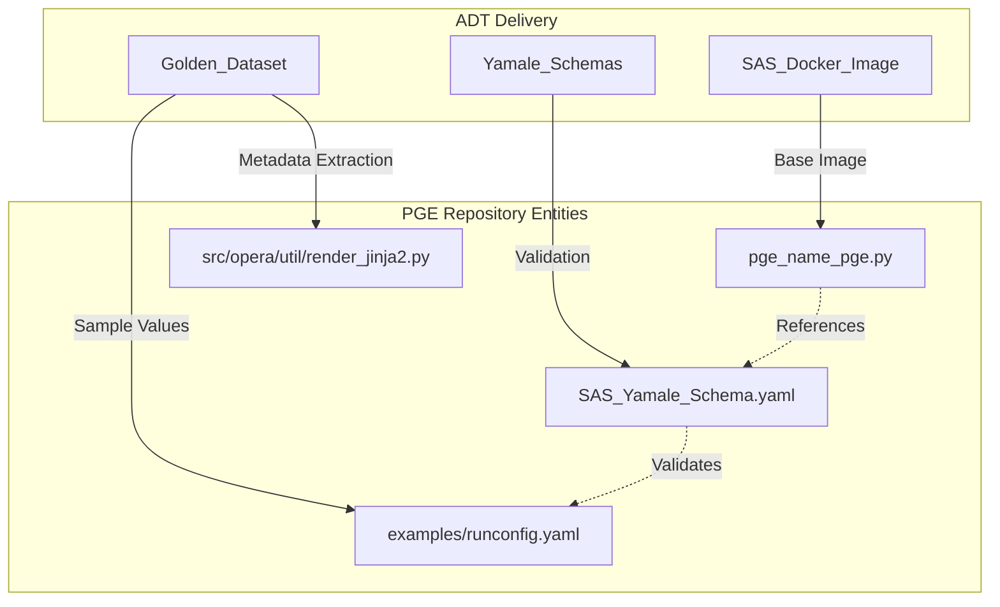
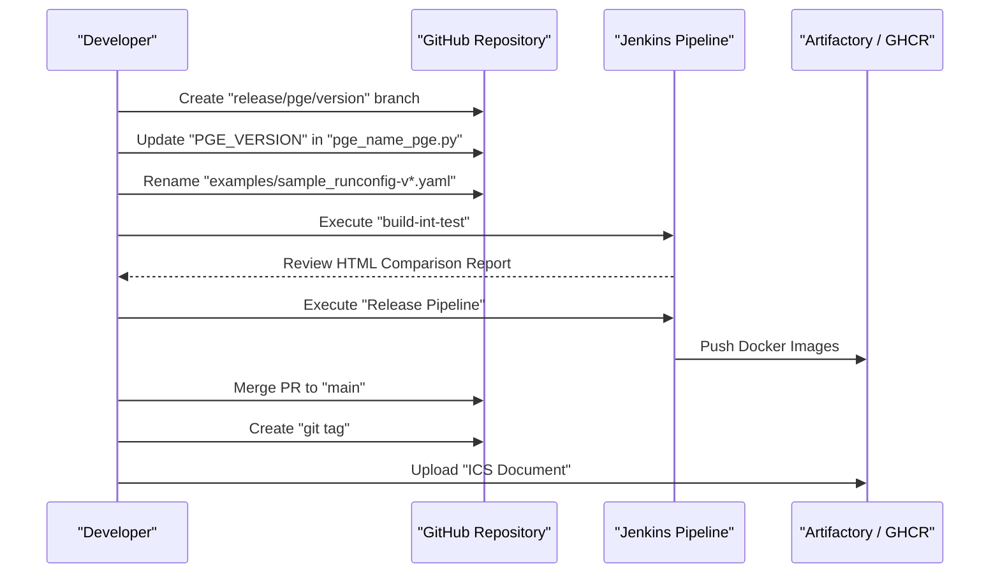

# Page: Example RunConfigs and Release Process

# Example RunConfigs and Release Process

Relevant source files

The following files were used as context for generating this wiki page:

- [.github/ISSUE_TEMPLATE/acceptance_test.yml](.github/ISSUE_TEMPLATE/acceptance_test.yml)
- [.github/ISSUE_TEMPLATE/bug_report.yml](.github/ISSUE_TEMPLATE/bug_report.yml)
- [.github/ISSUE_TEMPLATE/feature_request.yml](.github/ISSUE_TEMPLATE/feature_request.yml)
- [.github/ISSUE_TEMPLATE/pge_release.yml](.github/ISSUE_TEMPLATE/pge_release.yml)
- [.github/ISSUE_TEMPLATE/pge_sas_integration.yml](.github/ISSUE_TEMPLATE/pge_sas_integration.yml)

This page describes the maintenance of example RunConfig files, the structured procedures for integrating new Science Algorithm Software (SAS) deliveries, and the formal release workflow for the OPERA SDS PGE repository. These processes ensure that PGE updates are traceable, validated against "golden" datasets, and properly synchronized with the Interface Control Document (ICS).

## Example RunConfigs

The `examples/` directory contains versioned sample RunConfig YAML files for each PGE. These files serve as the primary reference for users and the Science Data System (SDS) regarding the expected structure of a PGE execution request.

### Maintenance and Versioning
When a PGE version is bumped, the corresponding example RunConfig must be updated to reflect the new versioning and any schema changes.
*   **File Naming**: Examples follow the pattern `examples/<pge_name>_sample_runconfig-v<version>.yaml` [.github/ISSUE_TEMPLATE/pge_release.yml:16-16]().
*   **Internal References**: The version referenced in the comments at the top of the YAML must match the filename and the current `PGE_VERSION` defined in the executor class [.github/ISSUE_TEMPLATE/pge_release.yml:17-17]().
*   **Schema Alignment**: If a SAS integration introduces new fields, the examples must be updated to include these fields, often using sample values sourced from "golden" datasets stored in Artifactory [.github/ISSUE_TEMPLATE/pge_sas_integration.yml:18-20]().

---

## SAS Integration Procedure

Integrating a new SAS delivery is a multi-step process managed via a GitHub Issue template. This ensures that the PGE wrapper correctly invokes the latest SAS container and validates inputs against updated schemas.

### Integration Workflow
1.  **Version Updates**: The `PGE_VERSION` or SAS version string is updated within the specific PGE executor file (e.g., `rtc_s1_pge.py`) [.github/ISSUE_TEMPLATE/pge_sas_integration.yml:12-12]().
2.  **Schema Synchronization**: The Yamale schemas for the SAS and Algorithm Parameters are retrieved from the Algorithm Development Team (ADT) repository and placed in the PGE source tree [.github/ISSUE_TEMPLATE/pge_sas_integration.yml:14-17]().
3.  **Metadata Mapping**: If output product formats change, the Measured Parameters Description configuration (used for ISO metadata rendering) is updated. Developers use `opera.util.tiff_utils.get_geotiff_metadata()` or `opera.util.h5_utils.get_hd5_group_as_dict()` to inspect new SAS outputs [.github/ISSUE_TEMPLATE/pge_sas_integration.yml:21-24]().
4.  **Test Asset Preparation**: Input and "golden" output archives are created from ADT samples, uploaded to S3, and linked to the Jenkins integration test suite [.github/ISSUE_TEMPLATE/pge_sas_integration.yml:25-26]().

### SAS Integration Data Flow
The following diagram illustrates how a SAS delivery moves from ADT into the PGE codebase.

**SAS Integration Data Flow**

Sources: [.github/ISSUE_TEMPLATE/pge_sas_integration.yml:12-28](), [.github/ISSUE_TEMPLATE/acceptance_test.yml:12-22]()

---

## Release Process

The release process is governed by a dedicated GitHub Issue template (`pge_release.yml`) that defines a strict sequence of branch management, automated testing, and artifact publishing.

### 1. Branching and Versioning
*   **Branch Naming**: Releases are performed on branches named `release/<pge_name>/<version>` created from `main` [.github/ISSUE_TEMPLATE/pge_release.yml:12-12]().
*   **Version Bumping**:
    *   `PGE_VERSION` is updated in the specific `src/opera/pge/<pge_name>/<pge_name>_pge.py` file [.github/ISSUE_TEMPLATE/pge_release.yml:14-14]().
    *   The global repository version is updated in `src/opera/_package.py` if the release affects the shared framework or multiple PGEs [.github/ISSUE_TEMPLATE/pge_release.yml:15-15]().

### 2. Validation and CI/CD
*   **Integration Testing**: The release branch is pushed to `origin`, triggering the Jenkins Integration Test pipeline. Results are verified via an HTML product comparison report [.github/ISSUE_TEMPLATE/pge_release.yml:18-20]().
*   **Release Pipeline**: The Jenkins Release pipeline is executed to:
    *   Push container images to Artifactory [.github/ISSUE_TEMPLATE/pge_release.yml:21-21]().
    *   Publish Sphinx documentation to GitHub Pages (if `_package.py` was updated) [.github/ISSUE_TEMPLATE/pge_release.yml:23-23]().
    *   Push images to the GitHub Container Registry (GHCR) for official (non-RC) releases [.github/ISSUE_TEMPLATE/pge_release.yml:24-24]().

### 3. Post-Release Tasks
*   **Tagging**: After merging the PR into `main`, the commit is tagged with `<version>` and pushed [.github/ISSUE_TEMPLATE/pge_release.yml:27-27]().
*   **Documentation**: The Interface Control Document (ICS) is updated and uploaded to Artifactory and the SDS Google Drive [.github/ISSUE_TEMPLATE/pge_release.yml:29-30]().
*   **Notification**: A release announcement is sent to the `operasds-all` mailing list [.github/ISSUE_TEMPLATE/pge_release.yml:31-31]().

### Release Workflow Logic
This diagram maps the natural language steps of the release procedure to the specific files and systems involved.

**PGE Release Workflow**

Sources: [.github/ISSUE_TEMPLATE/pge_release.yml:12-31]()

---

## Issue Templates Summary

The repository utilizes several issue templates to standardize workflows and bug reporting:

| Template | Purpose | Key Requirements |
| :--- | :--- | :--- |
| **PGE Release** | Formal release of a PGE version | Branching, version bumping, Jenkins validation, ICS update [.github/ISSUE_TEMPLATE/pge_release.yml:1-34]() |
| **PGE/SAS Integration** | Incorporating new ADT code | Schema updates, metadata mapping, "golden" data validation [.github/ISSUE_TEMPLATE/pge_sas_integration.yml:1-31]() |
| **SAS Acceptance Test** | Validating raw SAS deliveries | Environment setup (Intel vs AMD), QA comparison check [.github/ISSUE_TEMPLATE/acceptance_test.yml:1-33]() |
| **Bug Report** | Reporting software defects | Reproduction steps, environment details, expected behavior [.github/ISSUE_TEMPLATE/bug_report.yml:1-60]() |
| **New Feature** | Requesting enhancements | Alternatives considered, related problems description [.github/ISSUE_TEMPLATE/feature_request.yml:1-49]() |

Sources: [.github/ISSUE_TEMPLATE/pge_release.yml](), [.github/ISSUE_TEMPLATE/pge_sas_integration.yml](), [.github/ISSUE_TEMPLATE/acceptance_test.yml](), [.github/ISSUE_TEMPLATE/bug_report.yml](), [.github/ISSUE_TEMPLATE/feature_request.yml]()
