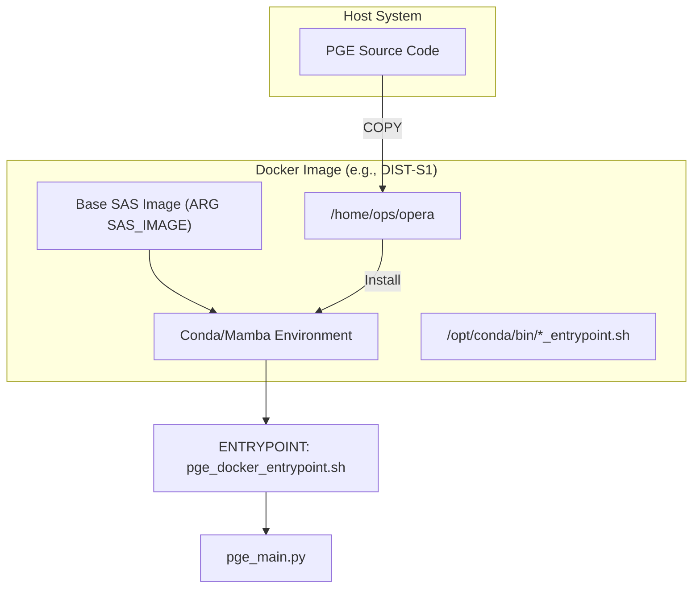
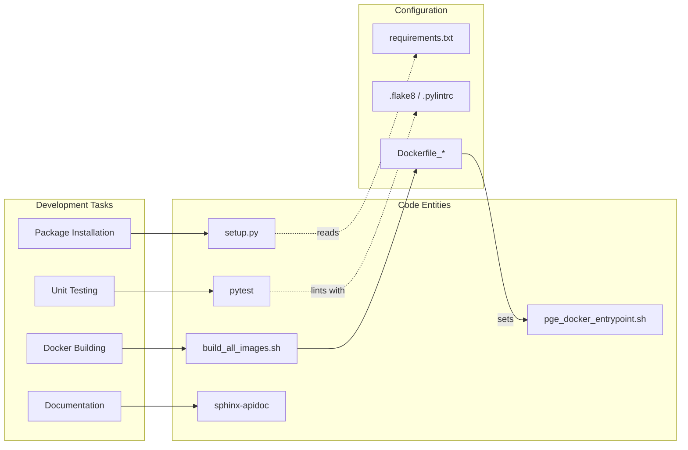

# Page: Getting Started

# Getting Started

<details>
<summary>Relevant source files</summary>

The following files were used as context for generating this wiki page:

- [.ci/docker/Dockerfile_dist_s1](.ci/docker/Dockerfile_dist_s1)
- [.ci/scripts/cal_disp/build_cal_disp.sh](.ci/scripts/cal_disp/build_cal_disp.sh)
- [.ci/scripts/dist_s1/test_dist_s1.sh](.ci/scripts/dist_s1/test_dist_s1.sh)
- [.ci/scripts/util/build_all_images.sh](.ci/scripts/util/build_all_images.sh)
- [.ci/scripts/util/test_all_images.sh](.ci/scripts/util/test_all_images.sh)
- [AUTHORS.rst](AUTHORS.rst)
- [CONTRIBUTING.rst](CONTRIBUTING.rst)
- [README.rst](README.rst)
- [docs/opera.pge.cal_disp.rst](docs/opera.pge.cal_disp.rst)
- [docs/opera.pge.rst](docs/opera.pge.rst)
- [requirements.txt](requirements.txt)
- [requirements_numpy2.txt](requirements_numpy2.txt)
- [setup.py](setup.py)
- [src/opera/pge/cal_disp/schema/algorithm_parameters_cal_disp_schema.yaml](src/opera/pge/cal_disp/schema/algorithm_parameters_cal_disp_schema.yaml)
- [src/opera/scripts/pge_docker_entrypoint.sh](src/opera/scripts/pge_docker_entrypoint.sh)
- [src/opera/scripts/pge_tests_entrypoint.sh](src/opera/scripts/pge_tests_entrypoint.sh)

</details>


This page provides the necessary instructions for developers to set up their environment, install dependencies, execute tests, and build the Docker images used for the OPERA Product Generation Executables (PGE).

## Developer Environment Setup

The OPERA SDS PGE repository is a Python-based framework requiring version 3.10 or above [README.rst:12-12](). Developers should work within a virtual environment to manage dependencies.

### Cloning and Installation

To begin development, clone the repository and install the package in editable mode with development dependencies.

```bash
# Clone the repository
git clone https://github.com/JPL-Devin/opera-sds-pge.git
cd opera-sds-pge

# Create and activate a virtual environment
python3 -m venv venv
source venv/bin/activate

# Install the package and dev dependencies
pip install --editable '.[dev]'
```
The `setup.py` file defines the core requirements (e.g., `jsonschema`, `PyYAML`, `yamale`) and development extras (e.g., `sphinx`, `pytest-cov`) [setup.py:12-32]().

**Note for macOS Users:** Some container build scripts require GNU style shell utilities. Install `coreutils` via Homebrew:
```bash
brew install coreutils
```
[README.rst:31-35]()

**Sources:** [README.rst:17-35](), [setup.py:12-60]()

---

## Dependency Management

The project maintains two primary requirements files to ensure compatibility across different SAS (Science Algorithm Software) environments, specifically addressing `numpy` versioning.

| File | Purpose | Key Dependencies |
| :--- | :--- | :--- |
| `requirements.txt` | Standard production/dev dependencies. | `numpy<2`, `h5py`, `Jinja2`, `yamale` [requirements.txt:1-15]() |
| `requirements_numpy2.txt` | Dependencies for SAS environments requiring NumPy 2.0+. | `numpy>=2`, `h5py`, `Jinja2`, `yamale` [requirements_numpy2.txt:1-15]() |

**Sources:** [requirements.txt:1-15](), [requirements_numpy2.txt:1-15]()

---

## Running Unit Tests

The test suite is powered by `pytest` and covers PGE logic, utility functions, and schema validation.

### Local Execution
To run all tests locally within your virtual environment:
```bash
pytest .
```
[README.rst:39-41]()

### Containerized Testing
For more rigorous validation, tests can be executed inside the PGE Docker containers. This ensures the environment matches production. The script `.ci/scripts/dist_s1/test_dist_s1.sh` demonstrates how a container is spun up to run `pytest`, `flake8`, and `pylint` [.ci/scripts/dist_s1/test_dist_s1.sh:72-100]().

To test all PGE images at once:
```bash
./.ci/scripts/util/test_all_images.sh <TAG>
```
[.ci/scripts/util/test_all_images.sh:1-45]()

**Sources:** [README.rst:39-41](), [.ci/scripts/dist_s1/test_dist_s1.sh:72-100](), [.ci/scripts/util/test_all_images.sh:1-45]()

---

## Building Docker Images

Each PGE (e.g., RTC-S1, DIST-S1) is packaged as a Docker image. These images typically inherit from a base SAS image and layer the PGE framework on top.

### Build Orchestration
The repository provides a utility to build all PGE images sequentially:
```bash
./.ci/scripts/util/build_all_images.sh <TAG>
```
[.ci/scripts/util/build_all_images.sh:1-45]()

### Dockerfile Structure
The Dockerfiles follow a specific pattern to ensure the OPERA environment is correctly configured.

**PGE Docker Architecture**

**Sources:** [.ci/docker/Dockerfile_dist_s1:5-67](), [src/opera/scripts/pge_docker_entrypoint.sh:1-17]()

### Implementation Details
*   **Entrypoint:** The `ENTRYPOINT` in the Dockerfile uses `conda run` to execute `pge_docker_entrypoint.sh` [.ci/docker/Dockerfile_dist_s1:66-66]().
*   **Environment Setup:** `pge_docker_entrypoint.sh` exports the `PYTHONPATH` to include the PGE program directory before calling `pge_main.py` [src/opera/scripts/pge_docker_entrypoint.sh:10-16]().
*   **Permissions:** Build scripts use `chmod 777` on destination directories to ensure compatibility when running containers with arbitrary UIDs [.ci/docker/Dockerfile_dist_s1:63-63]().

---

## Documentation Generation

The project uses Sphinx to generate API documentation from docstrings.

### Generating HTML Docs
To update the documentation source and build the HTML output:
```bash
# Generate API rst files
sphinx-apidoc -o docs/ opera

# Build the documentation (from the docs directory)
cd docs
make html
```
[README.rst:46-49]()

The documentation structure is defined in files like `docs/opera.pge.rst`, which uses `toctree` to organize the submodules for each product type (e.g., `rtc_s1`, `cslc_s1`, `dist_s1`) [docs/opera.pge.rst:1-29]().

**Sources:** [README.rst:46-49](), [docs/opera.pge.rst:1-29]()

---

## System Component Mapping

The following diagram maps the high-level setup tasks to the specific code entities and scripts responsible for them.

**Setup and Execution Entity Map**


**Sources:** [setup.py:1-60](), [.ci/scripts/util/build_all_images.sh:1-45](), [.ci/scripts/dist_s1/test_dist_s1.sh:71-86](), [src/opera/scripts/pge_docker_entrypoint.sh:1-17]()
