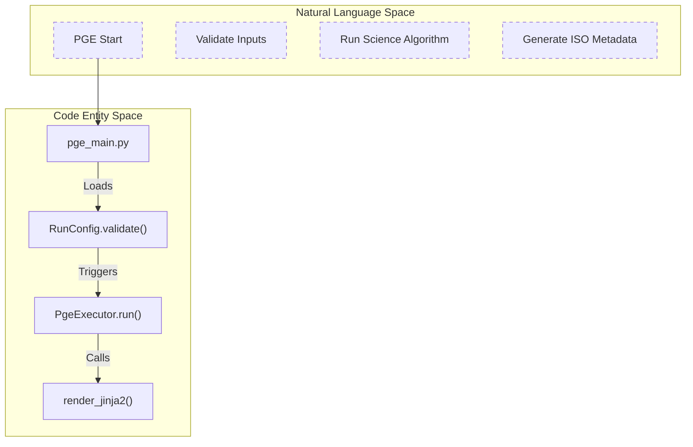
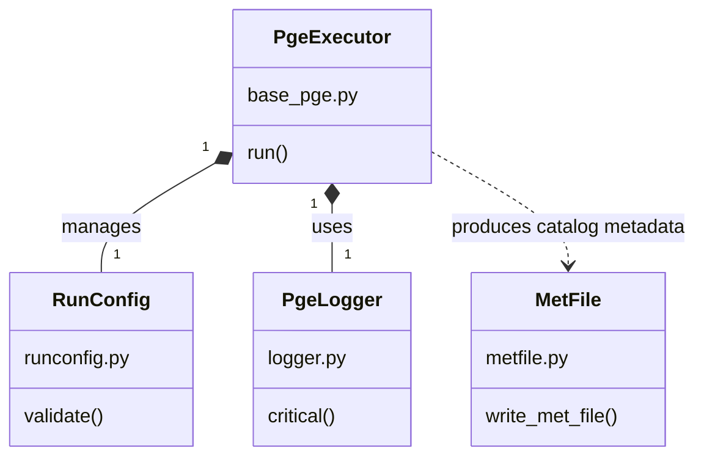

# Page: Glossary

# Glossary

Relevant source files

The following files were used as context for generating this wiki page:

- [.ci/docker/Dockerfile_cal_disp](.ci/docker/Dockerfile_cal_disp)
- [.ci/docker/Dockerfile_tropo](.ci/docker/Dockerfile_tropo)
- [.ci/scripts/cal_disp/test_cal_disp.sh](.ci/scripts/cal_disp/test_cal_disp.sh)
- [.ci/scripts/dist_s1/build_dist_s1.sh](.ci/scripts/dist_s1/build_dist_s1.sh)
- [.ci/scripts/tropo/build_tropo.sh](.ci/scripts/tropo/build_tropo.sh)
- [.ci/scripts/tropo/opera_pge_tropo_1.0_final_runconfig.yaml](.ci/scripts/tropo/opera_pge_tropo_1.0_final_runconfig.yaml)
- [.ci/scripts/tropo/test_int_tropo.sh](.ci/scripts/tropo/test_int_tropo.sh)
- [.ci/scripts/tropo/test_tropo.sh](.ci/scripts/tropo/test_tropo.sh)
- [.flake8](.flake8)
- [.gitignore](.gitignore)
- [.pylintrc](.pylintrc)
- [examples/tropo_sample_runconfig-v3.0.0-rc.1.0.yaml](examples/tropo_sample_runconfig-v3.0.0-rc.1.0.yaml)
- [src/opera/pge/__init__.py](src/opera/pge/__init__.py)
- [src/opera/pge/base/base_pge.py](src/opera/pge/base/base_pge.py)
- [src/opera/pge/base/runconfig.py](src/opera/pge/base/runconfig.py)
- [src/opera/pge/base/schema/base_pge_schema.yaml](src/opera/pge/base/schema/base_pge_schema.yaml)
- [src/opera/pge/cal_disp/cal_disp_pge.py](src/opera/pge/cal_disp/cal_disp_pge.py)
- [src/opera/pge/cal_disp/schema/cal_disp_sas_schema.yaml](src/opera/pge/cal_disp/schema/cal_disp_sas_schema.yaml)
- [src/opera/pge/cal_disp/templates/OPERA_ISO_metadata_L4_CAL_DISP_template.xml.jinja2](src/opera/pge/cal_disp/templates/OPERA_ISO_metadata_L4_CAL_DISP_template.xml.jinja2)
- [src/opera/pge/cal_disp/templates/cal_disp_measured_parameters.yaml](src/opera/pge/cal_disp/templates/cal_disp_measured_parameters.yaml)
- [src/opera/pge/cslc_s1/cslc_s1_pge.py](src/opera/pge/cslc_s1/cslc_s1_pge.py)
- [src/opera/pge/disp_s1/disp_s1_pge.py](src/opera/pge/disp_s1/disp_s1_pge.py)
- [src/opera/pge/dist_s1/dist_s1_pge.py](src/opera/pge/dist_s1/dist_s1_pge.py)
- [src/opera/pge/dist_s1/schema/algorithm_parameters_dist_s1_schema.yaml](src/opera/pge/dist_s1/schema/algorithm_parameters_dist_s1_schema.yaml)
- [src/opera/pge/dist_s1/schema/dist_s1_sas_schema.yaml](src/opera/pge/dist_s1/schema/dist_s1_sas_schema.yaml)
- [src/opera/pge/dist_s1/templates/OPERA_ISO_metadata_L3_DIST_S1_template.xml.jinja2](src/opera/pge/dist_s1/templates/OPERA_ISO_metadata_L3_DIST_S1_template.xml.jinja2)
- [src/opera/pge/dist_s1/templates/dist_s1_measured_parameters.yaml](src/opera/pge/dist_s1/templates/dist_s1_measured_parameters.yaml)
- [src/opera/pge/dswx_hls/dswx_hls_pge.py](src/opera/pge/dswx_hls/dswx_hls_pge.py)
- [src/opera/pge/dswx_s1/dswx_s1_pge.py](src/opera/pge/dswx_s1/dswx_s1_pge.py)
- [src/opera/pge/dswx_s1/schema/algorithm_parameters_s1_schema.yaml](src/opera/pge/dswx_s1/schema/algorithm_parameters_s1_schema.yaml)
- [src/opera/pge/dswx_s1/schema/dswx_s1_sas_schema.yaml](src/opera/pge/dswx_s1/schema/dswx_s1_sas_schema.yaml)
- [src/opera/pge/rtc_s1/rtc_s1_pge.py](src/opera/pge/rtc_s1/rtc_s1_pge.py)
- [src/opera/pge/tropo/schema/tropo_sas_schema.yaml](src/opera/pge/tropo/schema/tropo_sas_schema.yaml)
- [src/opera/pge/tropo/tropo_pge.py](src/opera/pge/tropo/tropo_pge.py)
- [src/opera/scripts/pge_main.py](src/opera/scripts/pge_main.py)
- [src/opera/test/data/invalid_runconfig.yaml](src/opera/test/data/invalid_runconfig.yaml)
- [src/opera/test/data/render_jinja_json_test_template.json.jinja2](src/opera/test/data/render_jinja_json_test_template.json.jinja2)
- [src/opera/test/data/render_jinja_test_template.html](src/opera/test/data/render_jinja_test_template.html)
- [src/opera/test/data/render_jinja_xml_test_template.xml.jinja2](src/opera/test/data/render_jinja_xml_test_template.xml.jinja2)
- [src/opera/test/data/render_jinja_yaml_test_template.yaml.jinja2](src/opera/test/data/render_jinja_yaml_test_template.yaml.jinja2)
- [src/opera/test/data/test_cal_disp_config.yaml](src/opera/test/data/test_cal_disp_config.yaml)
- [src/opera/test/data/test_dist_s1_algorithm_parameters.yaml](src/opera/test/data/test_dist_s1_algorithm_parameters.yaml)
- [src/opera/test/data/test_dist_s1_config.yaml](src/opera/test/data/test_dist_s1_config.yaml)
- [src/opera/test/data/test_dswx_hls_config.yaml](src/opera/test/data/test_dswx_hls_config.yaml)
- [src/opera/test/data/test_dswx_s1_config.yaml](src/opera/test/data/test_dswx_s1_config.yaml)
- [src/opera/test/data/test_tropo_config.yaml](src/opera/test/data/test_tropo_config.yaml)
- [src/opera/test/data/valid_runconfig_extra_fields.yaml](src/opera/test/data/valid_runconfig_extra_fields.yaml)
- [src/opera/test/data/valid_runconfig_full.yaml](src/opera/test/data/valid_runconfig_full.yaml)
- [src/opera/test/data/valid_runconfig_no_sas.yaml](src/opera/test/data/valid_runconfig_no_sas.yaml)
- [src/opera/test/pge/base/test_base_pge.py](src/opera/test/pge/base/test_base_pge.py)
- [src/opera/test/pge/base/test_runconfig.py](src/opera/test/pge/base/test_runconfig.py)
- [src/opera/test/pge/cal_disp/test_cal_disp_pge.py](src/opera/test/pge/cal_disp/test_cal_disp_pge.py)
- [src/opera/test/pge/dist_s1/test_dist_s1_pge.py](src/opera/test/pge/dist_s1/test_dist_s1_pge.py)
- [src/opera/test/pge/dswx_hls/test_dswx_hls_pge.py](src/opera/test/pge/dswx_hls/test_dswx_hls_pge.py)
- [src/opera/test/pge/dswx_s1/test_dswx_s1_pge.py](src/opera/test/pge/dswx_s1/test_dswx_s1_pge.py)
- [src/opera/test/scripts/test_pge_main.py](src/opera/test/scripts/test_pge_main.py)
- [src/opera/test/util/test_dataset_utils.py](src/opera/test/util/test_dataset_utils.py)
- [src/opera/test/util/test_h5_utils.py](src/opera/test/util/test_h5_utils.py)
- [src/opera/test/util/test_render_jinja2.py](src/opera/test/util/test_render_jinja2.py)
- [src/opera/test/util/test_tiff_utils.py](src/opera/test/util/test_tiff_utils.py)
- [src/opera/util/__init__.py](src/opera/util/__init__.py)
- [src/opera/util/dataset_utils.py](src/opera/util/dataset_utils.py)
- [src/opera/util/error_codes.py](src/opera/util/error_codes.py)
- [src/opera/util/geo_utils.py](src/opera/util/geo_utils.py)
- [src/opera/util/h5_utils.py](src/opera/util/h5_utils.py)
- [src/opera/util/logger.py](src/opera/util/logger.py)
- [src/opera/util/metfile.py](src/opera/util/metfile.py)
- [src/opera/util/render_jinja2.py](src/opera/util/render_jinja2.py)
- [src/opera/util/run_utils.py](src/opera/util/run_utils.py)
- [src/opera/util/tiff_utils.py](src/opera/util/tiff_utils.py)
- [src/opera/util/time.py](src/opera/util/time.py)

This page provides definitions for codebase-specific terms, acronyms, and domain concepts used throughout the OPERA SDS PGE repository. It serves as a technical reference for understanding the relationship between high-level SDS concepts and their specific implementations in the code.

## Core System Concepts

### PGE (Product Generation Executable)
The wrapper responsible for managing the lifecycle of a Science Application Software (SAS) execution. It handles input validation, environment setup, execution monitoring, and post-processing of outputs into standardized formats (e.g., ISO metadata generation).
*   **Implementation**: Defined by the `PgeExecutor` base class [src/opera/pge/base/base_pge.py:18-37]().
*   **Dispatching**: The `pge_main.py` script uses the `PGE_NAME_MAP` to dynamically load the correct executor class [src/opera/scripts/pge_main.py:25-38]().

### SAS (Science Application Software)
The core algorithmic software (often provided by science teams) that performs the actual data processing. The PGE executes the SAS as a subprocess.
*   **Execution**: Triggered via `time_and_execute` using a command line constructed by `create_sas_command_line` [src/opera/util/run_utils.py:1-20]().

### RunConfig
A YAML-based configuration file that provides all necessary parameters for a single PGE execution, including input file paths, output directories, and SAS-specific settings.
*   **Class**: `RunConfig` [src/opera/pge/base/runconfig.py:1-40]().
*   **Validation**: Uses Yamale against schemas like `base_pge_schema.yaml` [src/opera/pge/base/schema/base_pge_schema.yaml:1-50]().

### Mixin Architecture
The PGE framework uses Python Mixins to inject specific pre-processing and post-processing logic into different product types without duplicating the core execution logic.
*   **Pre-processing**: `PreProcessorMixin` handles directory setup and RunConfig loading [src/opera/pge/base/base_pge.py:41-55]().
*   **Post-processing**: `PostProcessorMixin` handles metadata rendering and product staging [src/opera/pge/base/base_pge.py:23-24]().

---

## Domain Terms & Product Types

| Term | Full Name | Description | Code Entity |
| :--- | :--- | :--- | :--- |
| **RTC** | Radiometric Terrain Corrected | Sentinel-1 backscatter data corrected for terrain effects. | `RtcS1Executor` [src/opera/pge/rtc_s1/rtc_s1_pge.py:18-30]() |
| **CSLC** | Co-registered Single Look Complex | Sentinel-1 SLC data aligned to a common grid. | `CslcS1Executor` [src/opera/pge/cslc_s1/cslc_s1_pge.py:19-29]() |
| **DSWx** | Dynamic Surface Water Extent | Map of surface water derived from HLS, S1, or NI data. | `DSWxS1Executor` [src/opera/pge/dswx_s1/dswx_s1_pge.py:17-28]() |
| **DIST** | Surface Disturbance | Detects changes/disturbances in land surface over time. | `DistS1Executor` [src/opera/pge/dist_s1/dist_s1_pge.py:18-27]() |
| **DISP** | Land-Surface Displacement | Measures surface movement using InSAR techniques. | `DispS1Executor` [src/opera/pge/disp_s1/disp_s1_pge.py:22-37]() |
| **HLS** | Harmonized Landsat Sentinel | Combined data from Landsat 8/9 and Sentinel-2. | `DSWxHLSExecutor` [src/opera/pge/dswx_hls/dswx_hls_pge.py:20-37]() |

**Sources**: [src/opera/pge/rtc_s1/rtc_s1_pge.py:1-30](), [src/opera/pge/dist_s1/dist_s1_pge.py:1-30](), [src/opera/pge/disp_s1/disp_s1_pge.py:1-40]().

---

## System Data Flow & Code Mapping

The following diagram bridges the gap between high-level operational steps and the specific code entities responsible for them.

### PGE Lifecycle Data Flow

**Sources**: [src/opera/scripts/pge_main.py:137-166](), [src/opera/pge/base/base_pge.py:112-124](), [src/opera/util/render_jinja2.py:445-460]().

---

## Technical Definitions

### ISO Metadata Rendering
The process of generating ISO 19115 compliant XML metadata for products using Jinja2 templates.
*   **Template Engine**: `render_jinja2` function [src/opera/util/render_jinja2.py:445-450]().
*   **Error Handling**: Uses `LoggingUndefined` to catch missing metadata fields without crashing the PGE [src/opera/util/render_jinja2.py:100-122]().

### Measured Parameters Configuration (MPC)
YAML files that map HDF5/NetCDF internal paths or GeoTIFF tags to variables used in ISO templates.
*   **Mapping Separator**: Defined by `MEASURED_PARAMETER_PATH_SEPARATOR` (`/`) [src/opera/util/h5_utils.py:35-37]().
*   **Augmentation**: Functions like `augment_hdf5_measured_parameters` extract values from science products to populate these variables [src/opera/util/render_jinja2.py:33-35]().

### Error Code Ranges
Standardized integer ranges used by `PgeLogger` to categorize events.
*   **0-999**: Information/General events.
*   **1000-1999**: Debugging information.
*   **2000-2999**: Warnings.
*   **3000-3999**: Critical/Fatal errors.
*   **Implementation**: `ErrorCode` class and `PgeLogger.critical()` method [src/opera/util/error_codes.py:1-50](), [src/opera/util/logger.py:1-100]().

### Algorithm Parameters
A specific subset of the RunConfig or a standalone YAML file containing tuning parameters for the SAS (e.g., thresholds, filter sizes).
*   **Validation**: `validate_algorithm_parameters_config` [src/opera/util/input_validation.py:21-23]().
*   **Example**: `test_dswx_s1_algorithm_parameters.yaml` [src/opera/test/pge/dswx_s1/test_dswx_s1_pge.py:66-68]().

---

## Component Relationship Diagram

This diagram maps system components to their specific file locations and class names.

### PGE Component Mapping

**Sources**: [src/opera/pge/base/base_pge.py:22-38](), [src/opera/util/metfile.py:30-45](), [src/opera/util/logger.py:26-35]().

---

## Utility Acronyms

*   **MGRS**: Military Grid Reference System. Used for tiling DSWx and DIST products [src/opera/util/geo_utils.py:20-22]().
*   **WKT**: Well-Known Text. Used for representing bounding polygons [src/opera/util/dataset_utils.py:22-25]().
*   **GML**: Geography Markup Language. The XML format used for spatial metadata in ISO files [src/opera/util/geo_utils.py:27-28]().
*   **PCM**: Process Control System. The external system that orchestrates PGE execution in production.

**Sources**: [src/opera/util/geo_utils.py:1-30](), [src/opera/util/dataset_utils.py:1-30]().