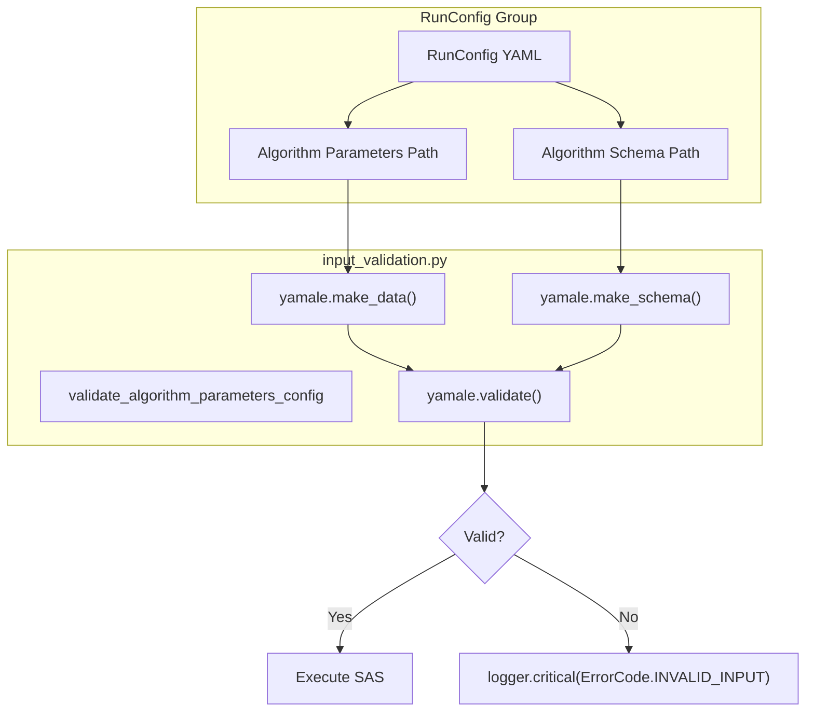
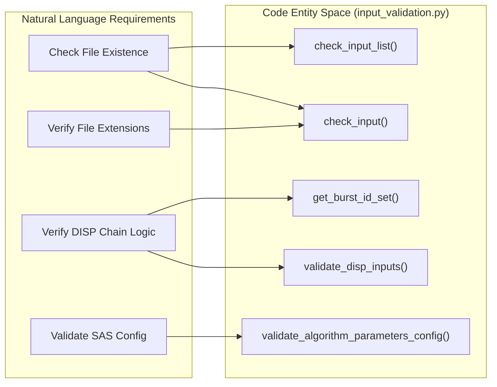

# Page: Input Validation

# Input Validation

Relevant source files

The following files were used as context for generating this wiki page:

- [src/opera/test/data/test_disp_ni_algorithm_parameters.yaml](src/opera/test/data/test_disp_ni_algorithm_parameters.yaml)
- [src/opera/test/data/test_disp_ni_config.yaml](src/opera/test/data/test_disp_ni_config.yaml)
- [src/opera/test/pge/disp_ni/test_disp_ni_pge.py](src/opera/test/pge/disp_ni/test_disp_ni_pge.py)
- [src/opera/util/input_validation.py](src/opera/util/input_validation.py)

The `input_validation.py` module provides a centralized suite of validation routines used across various OPERA SDS PGEs. Its primary purpose is to ensure that input files defined in the `RunConfig` exist, conform to expected file extensions, and meet product-specific constraints (such as matching burst IDs or specific file counts) before the Science Application Software (SAS) is executed.

## Core Validation Functions

The foundation of the validation logic consists of generic file-system checks that are utilized by higher-level product-specific validators.

### `check_input` and `check_input_list`
The `check_input` function performs basic sanity checks on a single file path. It verifies that the path is not `None`, exists on the file system, matches a list of allowed extensions, and (optionally) has a file size greater than zero [src/opera/util/input_validation.py:20-67](). The `check_input_list` function simply iterates over a collection of paths and applies `check_input` to each [src/opera/util/input_validation.py:68-75]().

| Parameter | Type | Description |
| :--- | :--- | :--- |
| `input_object` | `str` | Path to the file or directory to validate. |
| `logger` | `PgeLogger` | Logger used to report `INPUT_NOT_FOUND` or `INVALID_INPUT` errors. |
| `name` | `str` | The name of the PGE calling the validation. |
| `valid_extensions` | `iterable` | (Optional) List of allowed extensions (e.g., `('.zip', '.EOF')`). |
| `check_zero_size` | `bool` | If `True`, triggers an error if the file is 0 bytes. |

**Sources:**
* [src/opera/util/input_validation.py:20-75]()

---

## Product-Specific Validation Logic

### Sentinel-1 SLC Validation (`RTC-S1` & `CSLC-S1`)
The `validate_slc_s1_inputs` function is shared by the RTC-S1 and CSLC-S1 PGEs. It aggregates inputs from the `input_file_group`, `dynamic_ancillary_file_group`, and `static_ancillary_file_group` within the `RunConfig` [src/opera/util/input_validation.py:101-113]().

It enforces the following extension rules:
* **SAFE files**: Must have `.zip` extension [src/opera/util/input_validation.py:118]().
* **Orbit files**: Must have `.EOF` extension [src/opera/util/input_validation.py:121]().
* **DEM files**: Must be `.tif`, `.tiff`, or `.vrt` [src/opera/util/input_validation.py:123]().
* **Burst Database**: Must be `.sqlite` or `.sqlite3` [src/opera/util/input_validation.py:136]().

**Sources:**
* [src/opera/util/input_validation.py:77-140]()

### Displacement (DISP) Validation
The DISP PGEs (both Sentinel-1 and NISAR) require complex validation of the relationship between SLC inputs and GUNW (Geocoded Unwrapped Interferogram) inputs.

#### GUNW Count Constraint
For Displacement products, the number of input GUNW files must exactly equal the number of input SLC files minus one ($N_{GUNW} = N_{SLC} - 1$) [src/opera/util/input_validation.py:284-288](). This ensures a continuous chain of interferograms between the SLC acquisitions.

#### Burst ID Matching
For `DISP-S1`, the validator extracts Burst IDs from the input file names using a regular expression: `[t|T]\w{3}[-|_]\d{6}[-|_][I|i][W|w][1|2|3]` [src/opera/util/input_validation.py:169]().
* It ensures all input SLCs share the same Burst ID [src/opera/util/input_validation.py:269-276]().
* It verifies that ancillary files (amplitude dispersion, geometry, etc.) contain the same Burst ID in their filenames [src/opera/util/input_validation.py:185-214]().

**Sources:**
* [src/opera/util/input_validation.py:142-182]()
* [src/opera/util/input_validation.py:245-325]()
* [src/opera/test/pge/disp_ni/test_disp_ni_pge.py:24-24]()

### DSWx Validation
The `validate_dswx_inputs` function handles the multi-sensor requirements for Surface Water eXtent products. It validates the primary imagery (RTC for S1/NI, HLS for HLS) and ensures ancillary files like WorldCover, HAND, and Shoreline shapefiles are present and correctly formatted [src/opera/util/input_validation.py:328-406]().

**Sources:**
* [src/opera/util/input_validation.py:328-406]()

---

## Algorithm Parameters Validation
PGEs support a secondary layer of validation for SAS-specific algorithm parameters using the **Yamale** schema validator. The `validate_algorithm_parameters_config` function takes an algorithm parameter YAML file and a corresponding schema file to ensure the SAS configuration is valid before launch [src/opera/util/input_validation.py:441-470]().

### Data Flow: Algorithm Parameters Validation
This diagram shows how the `RunConfig` points to the parameters and schema, leading to the Yamale validation step.

**Sources:**
* [src/opera/util/input_validation.py:441-470]()
* [src/opera/test/data/test_disp_ni_config.yaml:46-46]()
* [src/opera/test/data/test_disp_ni_algorithm_parameters.yaml:1-188]()

---

## Shapefile Co-location Checks
For DSWx products, ancillary shapefiles (like the Shoreline shapefile) are often provided as a collection of files (.shp, .shx, .dbf). The `check_shapefile_co_location` function ensures that for a given `.shp` file, the mandatory sidecar files exist in the same directory [src/opera/util/input_validation.py:409-438]().

**Sources:**
* [src/opera/util/input_validation.py:409-438]()

---

## Logic Mapping: Validation Workflow
This diagram bridges the natural language requirements (e.g., "Check if files exist") to the specific code entities in `input_validation.py`.

**Sources:**
* [src/opera/util/input_validation.py:20-21]()
* [src/opera/util/input_validation.py:142-143]()
* [src/opera/util/input_validation.py:245-246]()
* [src/opera/util/input_validation.py:441-442]()
