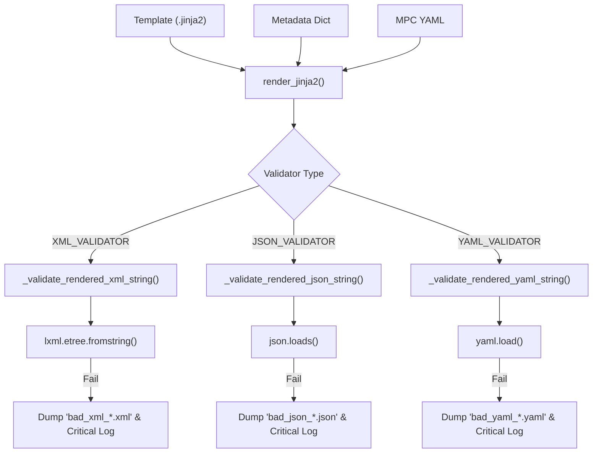

# Page: ISO Metadata Rendering (Jinja2)

# ISO Metadata Rendering (Jinja2)

Relevant source files

The following files were used as context for generating this wiki page:

- [src/opera/pge/base/schema/iso_metadata_measured_parameters_config_schema.yaml](src/opera/pge/base/schema/iso_metadata_measured_parameters_config_schema.yaml)
- [src/opera/pge/cslc_s1/templates/OPERA_ISO_metadata_L2_CSLC_S1_template.xml.jinja2](src/opera/pge/cslc_s1/templates/OPERA_ISO_metadata_L2_CSLC_S1_template.xml.jinja2)
- [src/opera/pge/cslc_s1/templates/cslc_s1_measured_parameters.yaml](src/opera/pge/cslc_s1/templates/cslc_s1_measured_parameters.yaml)
- [src/opera/pge/cslc_s1/templates/cslc_s1_static_measured_parameters.yaml](src/opera/pge/cslc_s1/templates/cslc_s1_static_measured_parameters.yaml)
- [src/opera/pge/disp_s1/templates/OPERA_ISO_metadata_L3_DISP_S1_template.xml.jinja2](src/opera/pge/disp_s1/templates/OPERA_ISO_metadata_L3_DISP_S1_template.xml.jinja2)
- [src/opera/pge/dswx_hls/templates/OPERA_ISO_metadata_L3_DSWx_HLS_template.xml.jinja2](src/opera/pge/dswx_hls/templates/OPERA_ISO_metadata_L3_DSWx_HLS_template.xml.jinja2)
- [src/opera/pge/dswx_ni/templates/OPERA_ISO_metadata_L3_DSWx_NI_template.xml.jinja2](src/opera/pge/dswx_ni/templates/OPERA_ISO_metadata_L3_DSWx_NI_template.xml.jinja2)
- [src/opera/pge/dswx_s1/templates/OPERA_ISO_metadata_L3_DSWx_S1_template.xml.jinja2](src/opera/pge/dswx_s1/templates/OPERA_ISO_metadata_L3_DSWx_S1_template.xml.jinja2)
- [src/opera/pge/rtc_s1/templates/OPERA_ISO_metadata_L2_RTC_S1_template.xml.jinja2](src/opera/pge/rtc_s1/templates/OPERA_ISO_metadata_L2_RTC_S1_template.xml.jinja2)
- [src/opera/test/data/render_jinja_json_test_template.json.jinja2](src/opera/test/data/render_jinja_json_test_template.json.jinja2)
- [src/opera/test/data/render_jinja_test_template.html](src/opera/test/data/render_jinja_test_template.html)
- [src/opera/test/data/render_jinja_xml_test_template.xml.jinja2](src/opera/test/data/render_jinja_xml_test_template.xml.jinja2)
- [src/opera/test/data/render_jinja_yaml_test_template.yaml.jinja2](src/opera/test/data/render_jinja_yaml_test_template.yaml.jinja2)
- [src/opera/test/data/test_cslc_s1_static_config.yaml](src/opera/test/data/test_cslc_s1_static_config.yaml)
- [src/opera/test/util/test_render_jinja2.py](src/opera/test/util/test_render_jinja2.py)
- [src/opera/util/render_jinja2.py](src/opera/util/render_jinja2.py)

The `render_jinja2.py` module provides the core pipeline for generating ISO 19115-2 compliant XML metadata and other structured metadata formats (JSON, YAML) for OPERA products. It utilizes the Jinja2 templating engine to inject PGE-extracted metadata into standardized templates, ensuring that all distributed products meet NASA Earthdata requirements.

## Overview and Implementation

The rendering pipeline is designed to be robust against missing metadata variables. Instead of failing the entire PGE execution when a single metadata field is missing, the system logs the error and continues rendering with placeholder values.

### Core Pipeline Flow

The rendering process follows a structured sequence:
1.  **Data Preparation**: Metadata is collected from various sources (HDF5 attributes, GeoTIFF tags, and RunConfig parameters) into a nested dictionary.
2.  **Augmentation**: The dictionary is augmented with "Measured Parameters" metadata, which includes descriptions and NASA EOSDIS attribute types defined in YAML configuration files.
3.  **Template Loading**: The Jinja2 environment is initialized with a custom `LoggingUndefined` handler.
4.  **Rendering**: The template is rendered into a string.
5.  **Validation**: The resulting string is validated against its expected format (XML, JSON, or YAML).

### Natural Language to Code Entity Mapping

| System Concept | Code Entity | File Path |
| :--- | :--- | :--- |
| **Rendering Entry Point** | `render_jinja2()` | [src/opera/util/render_jinja2.py:284-367]() |
| **Missing Field Handler** | `LoggingUndefined` | [src/opera/util/render_jinja2.py:100-122]() |
| **Error Placeholder** | `UNDEFINED_ERROR` | [src/opera/util/render_jinja2.py:47-52]() |
| **Warning Placeholder** | `UNDEFINED_WARNING` | [src/opera/util/render_jinja2.py:54-60]() |
| **HDF5 Augmentation** | `augment_hdf5_measured_parameters()` | [src/opera/util/render_jinja2.py:458-522]() |
| **JSON Encoder** | `NumpyEncoder` | [src/opera/util/render_jinja2.py:586-601]() |

Sources: [src/opera/util/render_jinja2.py:1-601]()

## The LoggingUndefined Handler

To prevent `jinja2.exceptions.UndefinedError` from crashing the PGE, a custom factory function `_make_undefined_handler_class` creates a `LoggingUndefined` class [src/opera/util/render_jinja2.py:63-122]().

*   **Behavior**: When a variable is missing in the template, the handler calls `_log_message()`, which logs a warning with `ErrorCode.ISO_METADATA_CANT_RENDER_ONE_VARIABLE` [src/opera/util/render_jinja2.py:88-98]().
*   **Output**: The rendered text will contain the string `!Not found!` (defined by `UNDEFINED_ERROR`) at the location of the missing variable [src/opera/util/render_jinja2.py:108]().

## Measured Parameters Configuration (MPC)

OPERA products require detailed descriptions for "Measured Parameters" (datasets within the product). These are managed via YAML files that adhere to a specific schema.

### MPC Schema
The schema defines how internal metadata paths map to public-facing descriptions and NASA attribute types [src/opera/pge/base/schema/iso_metadata_measured_parameters_config_schema.yaml:1-31]().

| Field | Type | Description |
| :--- | :--- | :--- |
| `description` | `str` | Plain-text description from product spec. |
| `attribute_type` | `enum` | NASA/EOSDIS type (e.g., `scienceParameter`, `qualityInformation`). |
| `attribute_data_type` | `enum` | Overrides auto-detected Python types (e.g., `float`, `dateTime`). |
| `display_name` | `str` | Custom name for the attribute in the ISO XML. |
| `optional` | `bool` | If true, logs a warning instead of an error if missing. |

### Augmentation Functions
*   **`augment_measured_parameters`**: Used for GeoTIFF-based products (DSWx-HLS). It iterates through metadata and attaches MPC definitions [src/opera/util/render_jinja2.py:370-455]().
*   **`augment_hdf5_measured_parameters`**: Used for HDF5-based products (RTC-S1, CSLC-S1, DISP-S1). It uses `MEASURED_PARAMETER_PATH_SEPARATOR` (typically `/`) to traverse the HDF5 hierarchy and match parameters to the MPC YAML [src/opera/util/render_jinja2.py:458-522]().

Sources: [src/opera/pge/base/schema/iso_metadata_measured_parameters_config_schema.yaml:1-31](), [src/opera/util/render_jinja2.py:33-33](), [src/opera/util/render_jinja2.py:370-522]()

## Validation Pipeline

After rendering, the string is passed to a validator to ensure syntactic correctness before the file is written to disk.

### Rendering and Validation Sequence

Sources: [src/opera/util/render_jinja2.py:125-226](), [src/opera/util/render_jinja2.py:284-367]()

### Error Handling in Validation
If validation fails, the PGE performs the following:
1.  **Error Extraction**: Captures the line and column number of the syntax error [src/opera/util/render_jinja2.py:133-134]().
2.  **Context Logging**: Extracts the problematic lines and adds a caret `^` to the log message to point to the error [src/opera/util/render_jinja2.py:136-138]().
3.  **File Dump**: Writes the invalid rendered string to a temporary file (e.g., `bad_xml_[timestamp].xml`) in the output directory for debugging [src/opera/util/render_jinja2.py:141-148]().
4.  **Critical Failure**: Calls `logger.critical()`, which raises a `RuntimeError` and terminates the PGE [src/opera/util/render_jinja2.py:152-156]().

## Per-PGE ISO Templates

Each product type maintains its own Jinja2 template under its respective `templates/` directory. These templates define the mapping between the `product_output`, `catalog_metadata`, and `custom_data` dictionaries and the ISO 19115-2 XML structure.

### Common Template Variables
Templates frequently reference these top-level keys:
*   `catalog_metadata`: Basic product info (e.g., `Production_DateTime`) [src/opera/pge/rtc_s1/templates/OPERA_ISO_metadata_L2_RTC_S1_template.xml.jinja2:65]().
*   `product_output`: Spatial and technical metadata (e.g., `xCoordinates.size`, `projection`) [src/opera/pge/rtc_s1/templates/OPERA_ISO_metadata_L2_RTC_S1_template.xml.jinja2:85-125]().
*   `custom_data`: PGE-specific identifiers like `ISO_OPERA_FilePackageName` [src/opera/pge/rtc_s1/templates/OPERA_ISO_metadata_L2_RTC_S1_template.xml.jinja2:12]().

### Template Locations
*   **RTC-S1**: `OPERA_ISO_metadata_L2_RTC_S1_template.xml.jinja2` [src/opera/pge/rtc_s1/templates/OPERA_ISO_metadata_L2_RTC_S1_template.xml.jinja2:1-9]()
*   **CSLC-S1**: `OPERA_ISO_metadata_L2_CSLC_S1_template.xml.jinja2` [src/opera/pge/cslc_s1/templates/OPERA_ISO_metadata_L2_CSLC_S1_template.xml.jinja2:1-9]()
*   **DSWx-HLS**: `OPERA_ISO_metadata_L3_DSWx_HLS_template.xml.jinja2` [src/opera/pge/dswx_hls/templates/OPERA_ISO_metadata_L3_DSWx_HLS_template.xml.jinja2:1-9]()
*   **DSWx-S1**: `OPERA_ISO_metadata_L3_DSWx_S1_template.xml.jinja2` [src/opera/pge/dswx_s1/templates/OPERA_ISO_metadata_L3_DSWx_S1_template.xml.jinja2:1-9]()
*   **DISP-S1**: `OPERA_ISO_metadata_L3_DISP_S1_template.xml.jinja2` [src/opera/pge/disp_s1/templates/OPERA_ISO_metadata_L3_DISP_S1_template.xml.jinja2:1-9]()
