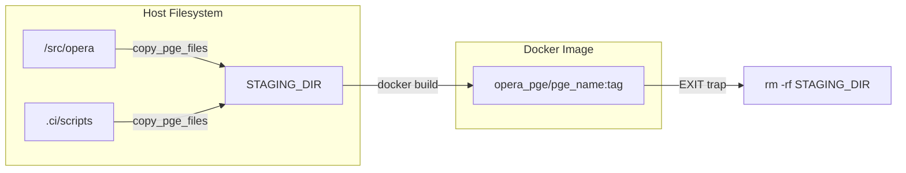

# Page: Jenkins Pipelines

# Jenkins Pipelines

<details>
<summary>Relevant source files</summary>

The following files were used as context for generating this wiki page:

- [.ci/jenkins/build-int-test/Jenkinsfile](.ci/jenkins/build-int-test/Jenkinsfile)
- [.ci/jenkins/build-test-deploy/Jenkinsfile](.ci/jenkins/build-test-deploy/Jenkinsfile)
- [.ci/jenkins/build-test/Jenkinsfile](.ci/jenkins/build-test/Jenkinsfile)
- [.ci/jenkins/delete-tmp-dirs/Jenkinsfile](.ci/jenkins/delete-tmp-dirs/Jenkinsfile)
- [.ci/jenkins/grype_html.tmpl](.ci/jenkins/grype_html.tmpl)
- [.ci/scripts/cal_disp/build_cal_disp.sh](.ci/scripts/cal_disp/build_cal_disp.sh)
- [.ci/scripts/cslc_s1/build_cslc_s1.sh](.ci/scripts/cslc_s1/build_cslc_s1.sh)
- [.ci/scripts/dswx_hls/build_dswx_hls.sh](.ci/scripts/dswx_hls/build_dswx_hls.sh)
- [.ci/scripts/dswx_s1/build_dswx_s1.sh](.ci/scripts/dswx_s1/build_dswx_s1.sh)
- [.ci/scripts/metrics/run_metrics.sh](.ci/scripts/metrics/run_metrics.sh)
- [.ci/scripts/util/build_all_images.sh](.ci/scripts/util/build_all_images.sh)
- [.ci/scripts/util/test_all_images.sh](.ci/scripts/util/test_all_images.sh)
- [.ci/scripts/util/test_int_util.sh](.ci/scripts/util/test_int_util.sh)
- [.ci/scripts/util/util.sh](.ci/scripts/util/util.sh)
- [docs/opera.pge.cal_disp.rst](docs/opera.pge.cal_disp.rst)
- [docs/opera.pge.rst](docs/opera.pge.rst)
- [src/opera/pge/cal_disp/schema/algorithm_parameters_cal_disp_schema.yaml](src/opera/pge/cal_disp/schema/algorithm_parameters_cal_disp_schema.yaml)

</details>


This page describes the CI/CD infrastructure for the OPERA SDS PGE repository, focusing on the four primary Jenkins pipeline entry points. These pipelines automate the lifecycle of the PGE software, from secret scanning and unit testing to integration testing, vulnerability assessment, and deployment to Artifactory and GitHub Container Registry (GHCR).

## Pipeline Overview

The repository utilizes Jenkins Pipeline (Groovy) to orchestrate build and test environments. A key architectural pattern across these pipelines is the use of a `RUN_ID`, which is derived from the Jenkins process ID (`$$`), to isolate temporary Conda environments and staging directories, preventing collisions between concurrent builds [.ci/jenkins/build-int-test/Jenkinsfile:11-14]().

### Jenkins Pipeline Entry Points

| Pipeline | Purpose | Key Actions |
| :--- | :--- | :--- |
| **build-test** | Continuous Integration (CI) | Secret scanning, build all Docker images, run unit tests [.ci/jenkins/build-test/Jenkinsfile:24-72]() |
| **build-int-test** | Integration Testing | Miniforge setup, PGE-specific integration scripts, product comparison [.ci/jenkins/build-int-test/Jenkinsfile:63-134]() |
| **build-test-deploy** | Release/Deployment | Artifactory/GHCR push, Sphinx documentation generation [.ci/jenkins/build-test-deploy/Jenkinsfile:52-160]() |
| **delete-tmp-dirs** | Maintenance | Cleanup of `/data/tmp`, Docker system prune, orphaned Conda removal [.ci/jenkins/delete-tmp-dirs/Jenkinsfile:16-25]() |

Sources: [.ci/jenkins/build-test/Jenkinsfile:1-116](), [.ci/jenkins/build-int-test/Jenkinsfile:1-141](), [.ci/jenkins/build-test-deploy/Jenkinsfile:1-160](), [.ci/jenkins/delete-tmp-dirs/Jenkinsfile:1-27]()

## 1. build-test (CI Pipeline)

The `build-test` pipeline serves as the primary gate for code changes. It performs a "Secrets scan" using `.ci/scripts/util/secrets_scan.sh` and compares the results against a baseline [.ci/jenkins/build-test/Jenkinsfile:24-35](). 

If the scan passes, it triggers `.ci/scripts/util/build_all_images.sh` to build the suite of PGE images (e.g., `dswx_hls`, `rtc_s1`, `cslc_s1`) using the current branch name as a tag [.ci/jenkins/build-test/Jenkinsfile:36-46](). Following the build, it executes unit tests via `.ci/scripts/util/test_all_images.sh`, capturing JUnit XML results and HTML coverage reports [.ci/jenkins/build-test/Jenkinsfile:47-72]().

### Data Flow: CI Pipeline
The following diagram illustrates the transition from source code to validated Docker images.

Title: build-test Pipeline Logic
```mermaid
graph TD
    subgraph "Natural Language Space"
        "Source Code"
        "Security Check"
        "Build Images"
        "Run Tests"
    end

    subgraph "Code Entity Space"
        SC[".ci/scripts/util/secrets_scan.sh"]
        BA["build_all_images.sh"]
        TA["test_all_images.sh"]
        CL["cleanup.sh"]
    end

    "Source Code" --> SC
    SC --> "Security Check"
    "Security Check" -- "Pass" --> BA
    BA --> "Build Images"
    "Build Images" --> TA
    TA --> "Run Tests"
    "Run Tests" --> CL
```
Sources: [.ci/jenkins/build-test/Jenkinsfile:24-100](), [.ci/scripts/util/build_all_images.sh:29-41](), [.ci/scripts/util/test_all_images.sh:29-41]()

## 2. build-int-test (Integration Pipeline)

The `build-int-test` pipeline focuses on end-to-end validation by running PGEs against real data and comparing outputs to "golden" datasets.

### Miniforge and Conda Isolation
To avoid environment pollution, the pipeline installs a fresh instance of Miniforge into a directory keyed by the `RUN_ID` [.ci/jenkins/build-int-test/Jenkinsfile:63-72](). It then creates a local Conda environment (`int_test_env`) to host the dependencies required for product comparison scripts, such as `gdal`, `h5py`, and `matplotlib` [.ci/jenkins/build-int-test/Jenkinsfile:74-93]().

### Integration Execution and Status Codes
The pipeline iterates through `DOCKER_IMAGE_SUFFIXES` and executes specific integration scripts (e.g., `test_int_dswx_s1.sh`) [.ci/jenkins/build-int-test/Jenkinsfile:100-108](). 
* **Status Code 2**: Indicates a product comparison failure (e.g., pixel-for-pixel mismatch). The pipeline marks the stage as `UNSTABLE` rather than `FAILURE` to allow review of the generated HTML reports [.ci/jenkins/build-int-test/Jenkinsfile:112-114]().
* **Status Code 0**: Success.

Sources: [.ci/jenkins/build-int-test/Jenkinsfile:63-120](), [.ci/scripts/util/test_int_util.sh:15-69]()

## 3. build-test-deploy (Deployment Pipeline)

This pipeline handles the distribution of built artifacts. It supports publishing to two primary registries:
1. **Artifactory**: Images are pushed to `ART_DOCKER_REGISTRY` [.ci/jenkins/build-test-deploy/Jenkinsfile:55-62]().
2. **GHCR**: If `PUSH_TO_GHCR` is enabled, images are tagged and pushed to `ghcr.io/nasa/opera-sds-pge` [.ci/jenkins/build-test-deploy/Jenkinsfile:15-24]().

### Documentation Deployment
If `PUBLISH_DOCS` is true, the pipeline installs Sphinx and its dependencies within the isolated Conda environment and builds the documentation [.ci/jenkins/build-test-deploy/Jenkinsfile:125-145](). The resulting HTML is pushed to the `gh-pages` branch of the repository [.ci/jenkins/build-test-deploy/Jenkinsfile:150-160]().

Sources: [.ci/jenkins/build-test-deploy/Jenkinsfile:15-49](), [.ci/jenkins/build-test-deploy/Jenkinsfile:125-160]()

## 4. delete-tmp-dirs (Cleanup Pipeline)

The `delete-tmp-dirs` pipeline is a maintenance utility designed to manage disk space on the CI workers.

* **Temporary Directories**: Deletes `tmp.*` directories in `/data/tmp` that are often left behind by `mktemp` calls in build scripts [.ci/jenkins/delete-tmp-dirs/Jenkinsfile:19]().
* **Docker Prune**: Runs `docker system prune -f` to remove dangling images and build cache [.ci/jenkins/delete-tmp-dirs/Jenkinsfile:21]().
* **Orphaned Conda**: Uses a `find` command to delete any Conda installation directories in `/var/lib/jenkins/conda_installs/` that are older than 1 day [.ci/jenkins/delete-tmp-dirs/Jenkinsfile:23]().

Sources: [.ci/jenkins/delete-tmp-dirs/Jenkinsfile:1-27]()

## Build Script Patterns

Most PGEs follow a standardized build pattern defined in their respective `build_<pge>.sh` scripts. These scripts utilize `util.sh` for common tasks.

### Staging and Cleanup
Build scripts create a `STAGING_DIR` using `mktemp` to collect the necessary Python source and configuration files before the Docker build [.ci/scripts/dswx_s1/build_dswx_s1.sh:42-43](). A shell `trap` is used to ensure the `build_script_cleanup` function (from `util.sh`) removes the staging directory upon exit, regardless of success or failure [.ci/scripts/dswx_s1/build_dswx_s1.sh:45-46]().

Title: Build Staging Pattern

Sources: [.ci/scripts/util/util.sh:88-93](), [.ci/scripts/util/util.sh:95-144](), [.ci/scripts/dswx_s1/build_dswx_s1.sh:40-49]()
