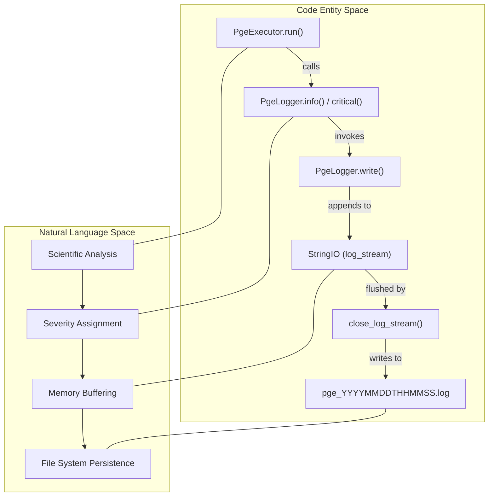
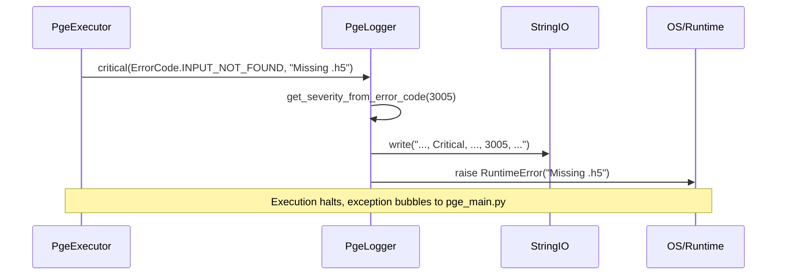

# Page: Logging and Error Codes

# Logging and Error Codes

Relevant source files

The following files were used as context for generating this wiki page:

- [src/opera/test/data/test_sas_log.txt](src/opera/test/data/test_sas_log.txt)
- [src/opera/test/util/test_logger.py](src/opera/test/util/test_logger.py)
- [src/opera/test/util/test_metfile.py](src/opera/test/util/test_metfile.py)
- [src/opera/test/util/test_time.py](src/opera/test/util/test_time.py)
- [src/opera/test/util/test_usage_metrics.py](src/opera/test/util/test_usage_metrics.py)
- [src/opera/util/error_codes.py](src/opera/util/error_codes.py)
- [src/opera/util/logger.py](src/opera/util/logger.py)

The OPERA SDS PGE framework utilizes a structured logging system designed to capture execution telemetry, SAS (Scientific Analysis Software) output, and OS-level resource metrics. The system is built around a buffered, `StringIO`-based logger that produces CSV-formatted logs, facilitating automated parsing and error tracking across the SDS pipeline.

## PgeLogger Implementation

The `PgeLogger` class [src/opera/util/logger.py:152-160]() serves as the primary interface for logging within the PGE. Unlike standard Python logging, `PgeLogger` buffers log messages in memory using `io.StringIO` [src/opera/util/logger.py:190-192]() before flushing them to disk upon completion or failure.

### Key Features
*   **Buffered Logging**: Messages are held in `self.log_stream` and written to a physical file only when `close_log_stream()` is called [src/opera/util/logger.py:217-232]().
*   **Structured Format**: Every log entry follows a comma-separated format: `Timestamp, Severity, Workflow, Module, ErrorCode, Location, "Description"` [src/opera/util/logger.py:67-68]().
*   **Severity Auto-mapping**: Severity levels are automatically determined based on the range of the provided error code [src/opera/util/logger.py:95-122]().
*   **Resource Tracking**: The logger can trigger OS metric collection (CPU, RAM, I/O) via `log_one_metric()` [src/opera/util/logger.py:344-368]().

### Logging Data Flow
The following diagram illustrates how a logging call moves from a PGE module through the `PgeLogger` to the final log file.

**Diagram: Logging Data Flow and Entity Mapping**

Sources: [src/opera/util/logger.py:152-232](), [src/opera/util/logger.py:38-70]()

## Error Codes and Severity Ranges

Error codes in the OPERA PGE are defined in `ErrorCode` (an `IntEnum`) [src/opera/util/error_codes.py:34-121](). Codes are partitioned into ranges of 1000 to define their default severity [src/opera/util/error_codes.py:13-29]().

### Severity Mapping Table
| Range | Severity | Description |
| :--- | :--- | :--- |
| 0 - 999 | **Info** | Normal operational events (e.g., `OVERALL_SUCCESS`, `SAS_PROGRAM_STARTING`). |
| 1000 - 1999 | **Debug** | Detailed diagnostic information (e.g., `SAS_EXE_COMMAND_LINE`). |
| 2000 - 2999 | **Warning** | Non-fatal issues (e.g., `ISO_METADATA_CANT_RENDER_ONE_VARIABLE`). |
| 3000 - 3999 | **Critical** | Fatal errors that halt execution (e.g., `SAS_PROGRAM_FAILED`, `INPUT_NOT_FOUND`). |

Sources: [src/opera/util/error_codes.py:19-29](), [src/opera/util/logger.py:113-122]()

### ERROR_CODE_PGE_OFFSET
To distinguish errors between different PGE types in a centralized logging environment, an `ERROR_CODE_PGE_OFFSET` (defaulting to 10000) is used [src/opera/util/error_codes.py:16-17](). The final logged code is calculated as:
`Logged Code = (PGE_Specific_Offset * 10000) + ErrorCode.value`

## Critical Errors and Exceptions

The `PgeLogger.critical()` method implements a specific pattern for handling fatal errors. When called, it logs the message at the `CRITICAL` level and then raises a `RuntimeError` [src/opera/util/logger.py:330-342](). This ensures that the execution flow is immediately interrupted while the cause is captured in the log buffer.

**Diagram: Critical Error Exception Pattern**

Sources: [src/opera/util/logger.py:330-342](), [src/opera/util/error_codes.py:98-98]()

## OS Metrics Collection

The PGE framework tracks resource consumption during execution via the `usage_metrics.py` utility. This is integrated into the logging system to provide a snapshot of the environment's state.

### Metrics Captured
The `get_os_metrics()` function [src/opera/util/usage_metrics.py:19-114]() collects:
*   **CPU Usage**: System and User time (seconds) [src/opera/util/usage_metrics.py:95-98]().
*   **Disk I/O**: Filesystem reads and writes [src/opera/util/usage_metrics.py:99-102]().
*   **Memory**: Maximum Resident Set Size (RSS) for the largest child process [src/opera/util/usage_metrics.py:103-104]().
*   **Virtual Memory**: Peak VM size for the main process (Linux only) [src/opera/util/usage_metrics.py:106-112]().

The logger records these via `log_one_metric()`, which creates a structured log entry containing these hardware statistics [src/opera/util/logger.py:344-368]().

Sources: [src/opera/util/usage_metrics.py:70-114](), [src/opera/util/logger.py:344-368]()

## Log File Lifecycle

1.  **Initialization**: A default log name is generated using the pattern `pge_YYYYMMDDTHHMMSS.log` [src/opera/util/logger.py:73-92]().
2.  **Execution**: The `PgeLogger` instance collects messages from the PGE and SAS processes.
3.  **Summary Generation**: Before closing, the logger appends a summary including the start time, total duration, and a count of messages by severity [src/opera/util/logger.py:236-258]().
4.  **Finalization**: The `StringIO` buffer is copied to the final file on disk using `shutil.copyfileobj` [src/opera/util/logger.py:224-232]().

Sources: [src/opera/util/logger.py:73-92](), [src/opera/util/logger.py:217-234]()
