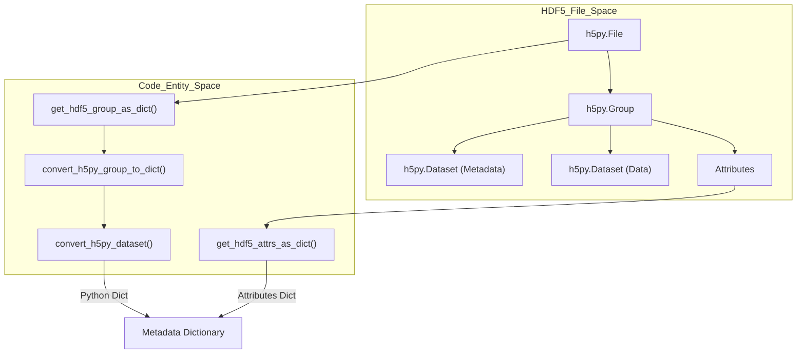
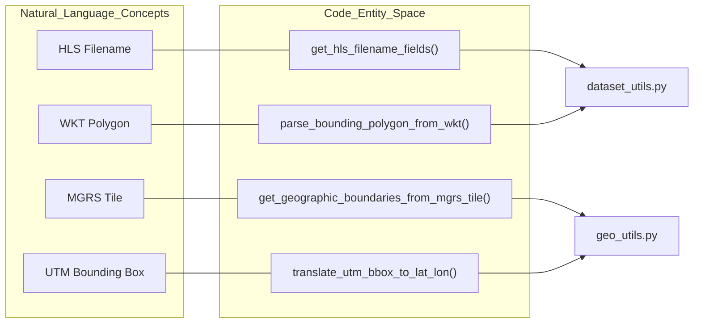

# Page: Metadata Extraction Utilities

# Metadata Extraction Utilities

Relevant source files

The following files were used as context for generating this wiki page:

- [.flake8](.flake8)
- [.gitignore](.gitignore)
- [.pylintrc](.pylintrc)
- [src/opera/pge/disp_s1/data/frame-geometries-simple-0.9.0.geojson](src/opera/pge/disp_s1/data/frame-geometries-simple-0.9.0.geojson)
- [src/opera/pge/disp_s1/templates/OPERA_ISO_metadata_L3_DISP_S1_STATIC_template.xml.jinja2](src/opera/pge/disp_s1/templates/OPERA_ISO_metadata_L3_DISP_S1_STATIC_template.xml.jinja2)
- [src/opera/pge/disp_s1/templates/disp_s1_static_measured_parameters.yaml](src/opera/pge/disp_s1/templates/disp_s1_static_measured_parameters.yaml)
- [src/opera/test/data/sample_l30_dswx_hls.tif](src/opera/test/data/sample_l30_dswx_hls.tif)
- [src/opera/test/data/sample_s30_dswx_hls.tif](src/opera/test/data/sample_s30_dswx_hls.tif)
- [src/opera/test/data/test_disp_s1_static_config.yaml](src/opera/test/data/test_disp_s1_static_config.yaml)
- [src/opera/test/data/test_rtc_s1_config.yaml](src/opera/test/data/test_rtc_s1_config.yaml)
- [src/opera/test/pge/rtc_s1/test_rtc_s1_pge.py](src/opera/test/pge/rtc_s1/test_rtc_s1_pge.py)
- [src/opera/test/util/test_dataset_utils.py](src/opera/test/util/test_dataset_utils.py)
- [src/opera/test/util/test_geo_utils.py](src/opera/test/util/test_geo_utils.py)
- [src/opera/test/util/test_h5_utils.py](src/opera/test/util/test_h5_utils.py)
- [src/opera/test/util/test_tiff_utils.py](src/opera/test/util/test_tiff_utils.py)
- [src/opera/util/dataset_utils.py](src/opera/util/dataset_utils.py)
- [src/opera/util/geo_utils.py](src/opera/util/geo_utils.py)
- [src/opera/util/h5_utils.py](src/opera/util/h5_utils.py)
- [src/opera/util/tiff_utils.py](src/opera/util/tiff_utils.py)

The OPERA SDS PGE framework relies on a suite of utility modules to extract, transform, and validate metadata from various product formats, including HDF5, NetCDF, GeoTIFF, and HLS datasets. These utilities bridge the gap between raw data files produced by Science Algorithm Software (SAS) and the structured metadata required for ISO XML generation and product cataloging.

## HDF5 and NetCDF Utilities (`h5_utils`)

The `h5_utils.py` module provides a recursive extraction framework for HDF5-compliant files. It handles the conversion of HDF5 internal structures into native Python dictionaries while managing complex data types like byte sequences and NumPy arrays.

### Key Implementation Details
*   **Recursive Extraction**: `convert_h5py_group_to_dict` recursively traverses HDF5 groups to build a nested dictionary of all internal datasets [[src/opera/util/h5_utils.py:78-115]]().
*   **Type Conversion**: `convert_h5py_dataset` handles the transformation of HDF5 datasets into Python types, specifically decoding byte sequences into UTF-8 strings [[src/opera/util/h5_utils.py:118-145]]().
*   **Attribute Extraction**: `get_hdf5_attrs_as_dict` extracts metadata stored as HDF5 attributes rather than datasets [[src/opera/util/h5_utils.py:148-193]]().

### Product-Specific Extractors
The module includes specialized functions to extract metadata required for specific OPERA product pipelines:
| Function | Product | Purpose |
| :--- | :--- | :--- |
| `get_rtc_s1_product_metadata` | RTC-S1 | Extracts orbit, processing information, and identification groups [[src/opera/util/h5_utils.py:465-492]](). |
| `get_cslc_s1_product_metadata` | CSLC-S1 | Extracts burst identification and algorithm versions [[src/opera/util/h5_utils.py:495-524]](). |
| `get_disp_s1_product_metadata` | DISP-S1 | Extracts frame ID, temporal coherence, and reference/secondary timetags [[src/opera/util/h5_utils.py:527-564]](). |

### Data Flow: HDF5 to Metadata Dictionary
This diagram illustrates how `h5_utils` transforms HDF5/NetCDF structures into the dictionary format used by the ISO rendering engine.

**Sources**: [[src/opera/util/h5_utils.py:39-75]](), [[src/opera/util/h5_utils.py:78-115]](), [[src/opera/util/h5_utils.py:118-145]](), [[src/opera/util/h5_utils.py:148-193]]().

---

## GeoTIFF Utilities (`tiff_utils`)

The `tiff_utils.py` module manages metadata for GeoTIFF products, specifically focusing on Cloud-Optimized GeoTIFF (COG) compliance.

### LRU Caching and Metadata Access
To optimize performance during post-processing (where the same file may be queried multiple times), `get_geotiff_metadata` and `get_geotiff_dimensions` utilize an `lru_cache` [[src/opera/util/tiff_utils.py:115-116]](), [[src/opera/util/tiff_utils.py:149-150]]().

### COG Restoration
When metadata is updated via `set_geotiff_metadata`, the internal COG structure of a GeoTIFF is often invalidated. The utility performs the following sequence:
1.  Executes `gdal_edit.py` to modify tags [[src/opera/util/tiff_utils.py:83-92]]().
2.  Calls `save_as_cog` (imported from `proteus.core` or `rtc.core`) to restore optimization [[src/opera/util/tiff_utils.py:97-108]]().
3.  Clears the `get_geotiff_metadata` cache to ensure subsequent reads reflect the updates [[src/opera/util/tiff_utils.py:112]]().

**Sources**: [[src/opera/util/tiff_utils.py:46-112]](), [[src/opera/util/tiff_utils.py:115-147]](), [[src/opera/util/tiff_utils.py:149-183]]().

---

## Dataset and Geospatial Utilities

### Filename Parsing (`dataset_utils`)
`dataset_utils.py` provides logic for extracting metadata directly from input/output filenames:
*   **HLS Parsing**: `get_hls_filename_fields` decomposes HLS filenames (e.g., `HLS.S30.T53SMS...`) and converts Julian dates to ISO format [[src/opera/util/dataset_utils.py:17-44]]().
*   **Burst ID Extraction**: `get_burst_id_from_file_name` uses regex to find Sentinel-1 burst IDs (e.g., `t069_147170_iw1`) within strings [[src/opera/util/dataset_utils.py:47-71]]().
*   **Spacecraft Mapping**: Provides bidirectional mapping between full names (e.g., `SENTINEL-1A`) and short names (e.g., `S1A`) used in product filenames [[src/opera/util/dataset_utils.py:74-149]]().

### Geospatial Conversions (`geo_utils`)
The `geo_utils.py` module handles coordinate system transformations:
*   **UTM to WGS84**: `translate_utm_bbox_to_lat_lon` projects all four corners of a UTM bounding box to EPSG:4326 to find the true min/max extents, accounting for "rotated" products at high latitudes [[src/opera/util/geo_utils.py:46-112]]().
*   **MGRS Tile Boundaries**: `get_geographic_boundaries_from_mgrs_tile` calculates the lat/lon bounding box for a given MGRS tile, including the 4.9 km margin used by HLS products [[src/opera/util/geo_utils.py:115-212]]().

### Mapping Natural Language to Code Entities
This diagram maps metadata concepts found in product specifications to the code entities that handle them.

**Sources**: [[src/opera/util/dataset_utils.py:17-44]](), [[src/opera/util/dataset_utils.py:152-185]](), [[src/opera/util/geo_utils.py:46-112]](), [[src/opera/util/geo_utils.py:115-212]]().

---

## Summary of Core Utility Functions

| Module | Function | Input | Output |
| :--- | :--- | :--- | :--- |
| `h5_utils` | `get_hdf5_group_as_dict` | H5 File, Path | Nested Dict |
| `tiff_utils` | `set_geotiff_metadata` | Filename, Kwargs | Updated COG GeoTIFF |
| `dataset_utils` | `get_burst_id_from_file_name` | Filename | Burst ID String |
| `geo_utils` | `translate_utm_bbox_to_lat_lon` | Bbox, EPSG | Lat/Lon Extents |

**Sources**: [[src/opera/util/h5_utils.py:39-42]](), [[src/opera/util/tiff_utils.py:46-53]](), [[src/opera/util/dataset_utils.py:47-51]](), [[src/opera/util/geo_utils.py:46-56]]().
