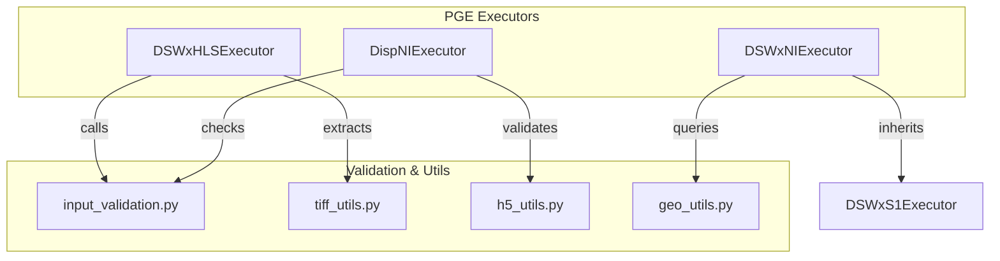
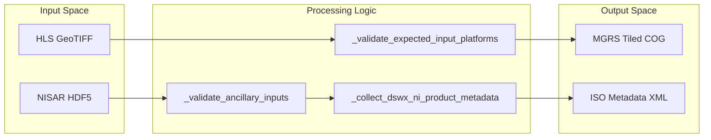

# Page: NISAR and HLS Product PGEs

# NISAR and HLS Product PGEs

Relevant source files

The following files were used as context for generating this wiki page:

- [src/opera/pge/base/base_pge.py](src/opera/pge/base/base_pge.py)
- [src/opera/pge/dswx_hls/dswx_hls_pge.py](src/opera/pge/dswx_hls/dswx_hls_pge.py)
- [src/opera/pge/dswx_ni/dswx_ni_pge.py](src/opera/pge/dswx_ni/dswx_ni_pge.py)
- [src/opera/test/data/test_disp_ni_algorithm_parameters.yaml](src/opera/test/data/test_disp_ni_algorithm_parameters.yaml)
- [src/opera/test/data/test_disp_ni_config.yaml](src/opera/test/data/test_disp_ni_config.yaml)
- [src/opera/test/data/test_dswx_ni_config.yaml](src/opera/test/data/test_dswx_ni_config.yaml)
- [src/opera/test/pge/base/test_base_pge.py](src/opera/test/pge/base/test_base_pge.py)
- [src/opera/test/pge/disp_ni/test_disp_ni_pge.py](src/opera/test/pge/disp_ni/test_disp_ni_pge.py)
- [src/opera/test/pge/dswx_hls/test_dswx_hls_pge.py](src/opera/test/pge/dswx_hls/test_dswx_hls_pge.py)
- [src/opera/test/pge/dswx_ni/test_dswx_ni_pge.py](src/opera/test/pge/dswx_ni/test_dswx_ni_pge.py)
- [src/opera/test/scripts/test_pge_main.py](src/opera/test/scripts/test_pge_main.py)
- [src/opera/util/input_validation.py](src/opera/util/input_validation.py)

This page provides a high-level overview of the Product Generation Executables (PGEs) responsible for processing **Harmonized Landsat Sentinel (HLS)** and **NISAR (NI)** data. These PGEs share common architectural patterns for validating multi-sensor inputs, managing MGRS tile-based outputs, and generating ISO-compliant metadata.

## Overview of NISAR and HLS PGEs

The HLS and NISAR PGEs are specialized implementations of the `PgeExecutor` base class [src/opera/pge/base/base_pge.py:41-55](). They are designed to wrap Science Application Software (SAS) provided by science teams, such as the **PROTEUS** SAS for DSWx-HLS. These PGEs handle the heavy lifting of environment setup, input data integrity checks, and the standardization of output products for handover to the Project Control Mirror (PCM).

### Common Processing Patterns
*   **Tile-Based Processing**: Both DSWx-HLS and DSWx-NI produce outputs aligned to the Military Grid Reference System (MGRS) [src/opera/pge/dswx_ni/dswx_ni_pge.py:85-90]().
*   **Multi-Sensor Validation**: Support for Landsat-8/9, Sentinel-2A/B/C/D, and NISAR L-band SAR [src/opera/pge/dswx_hls/dswx_hls_pge.py:95-107]().
*   **ISO Metadata Generation**: Automated rendering of XML metadata using Jinja2 templates and measured parameters extracted from output files [src/opera/pge/dswx_ni/dswx_ni_pge.py:161-175]().

### Core Entity Relationships
The following diagram illustrates how the PGE classes interact with the shared validation and utility modules.

**PGE to Code Entity Mapping**

Sources: [src/opera/pge/dswx_hls/dswx_hls_pge.py:38-48](), [src/opera/pge/dswx_ni/dswx_ni_pge.py:25-34](), [src/opera/util/input_validation.py:1-10]()

---

## DSWx-HLS PGE
The `DSWxHLSExecutor` processes Harmonized Landsat Sentinel-2 data to produce Dynamic Surface Water Extent products. It integrates with the PROTEUS SAS and performs rigorous platform validation to ensure only supported sensors (Landsat 8/9, Sentinel 2A/B/C/D) are processed [src/opera/pge/dswx_hls/dswx_hls_pge.py:133-143]().

Key features include:
*   **MGRS Naming**: Outputs are named based on the MGRS tile ID and acquisition timestamp [src/opera/pge/dswx_hls/dswx_hls_pge.py:23-26]().
*   **Spacecraft Correction**: Specific logic to handle `SPACECRAFT_NAME` metadata for Landsat-9 [src/opera/pge/dswx_hls/dswx_hls_pge.py:33-35]().

For details, see [DSWx-HLS PGE](#4.1).

Sources: [src/opera/pge/dswx_hls/dswx_hls_pge.py:38-160](), [src/opera/test/pge/dswx_hls/test_dswx_hls_pge.py:90-115]()

---

## DSWx-NI PGE
The `DSWxNIExecutor` processes NISAR L2 HDF5 inputs to generate water extent maps. It leverages a mixin architecture, inheriting significant functionality from the `DSWxS1` (Sentinel-1) pipeline due to the similarity in tile-based SAR processing [src/opera/pge/dswx_ni/dswx_ni_pge.py:25-34]().

Key features include:
*   **HDF5 Validation**: Ensures input files are valid NISAR H5 datasets [src/opera/pge/dswx_ni/dswx_ni_pge.py:37-38]().
*   **Metadata Caching**: Caches per-tile metadata to optimize the generation of multiple band-specific GeoTIFFs (WTR, BWTR, CONF, DIAG) [src/opera/pge/dswx_ni/dswx_ni_pge.py:102-109]().

For details, see [DSWx-NI PGE](#4.2).

Sources: [src/opera/pge/dswx_ni/dswx_ni_pge.py:54-109](), [src/opera/test/pge/dswx_ni/test_dswx_ni_pge.py:128-152]()

---

## DISP-NI PGE
The `DispNIExecutor` is responsible for the NISAR Displacement product. It handles the relationship between Geocoded Single Look Complex (GSLC) inputs and Geocoded Unwrapped Interferogram (GUNW) inputs [src/opera/test/data/test_disp_ni_config.yaml:63-84]().

Key features include:
*   **Input Constraints**: Validates the $N_{GUNW} = N_{GSLC} - 1$ constraint required for the displacement algorithm [src/opera/util/input_validation.py:204-210]().
*   **Algorithm Parameters**: Validates complex SAS configuration schemas for phase linking and unwrapping options [src/opera/test/data/test_disp_ni_algorithm_parameters.yaml:8-38]().

For details, see [DISP-NI PGE](#4.3).

Sources: [src/opera/test/pge/disp_ni/test_disp_ni_pge.py:20-25](), [src/opera/test/data/test_disp_ni_config.yaml:34-48]()

---

## Data Flow Architecture

The following diagram bridges the high-level data products to the specific internal code functions used to validate and process them.

**Data Flow and Functional Mapping**

Sources: [src/opera/pge/dswx_hls/dswx_hls_pge.py:95-143](), [src/opera/pge/dswx_ni/dswx_ni_pge.py:161-175](), [src/opera/util/input_validation.py:20-41]()
