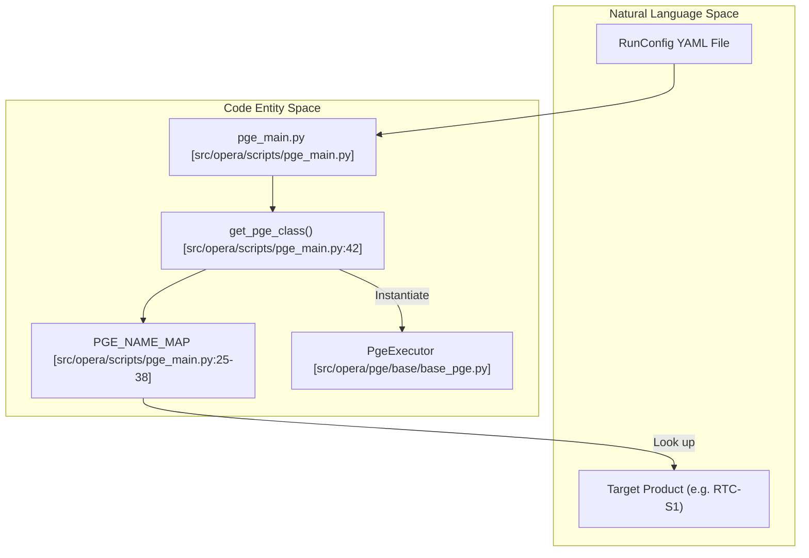
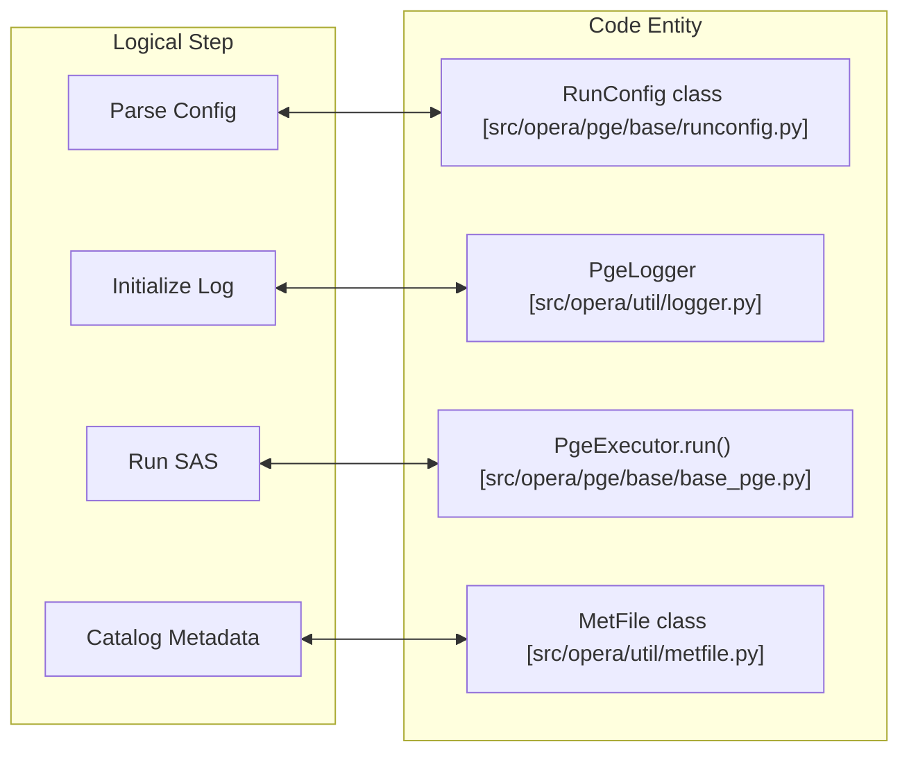

# Page: Overview

# Overview

Relevant source files

The following files were used as context for generating this wiki page:

- [.ci/scripts/cal_disp/build_cal_disp.sh](.ci/scripts/cal_disp/build_cal_disp.sh)
- [.ci/scripts/util/build_all_images.sh](.ci/scripts/util/build_all_images.sh)
- [.ci/scripts/util/test_all_images.sh](.ci/scripts/util/test_all_images.sh)
- [AUTHORS.rst](AUTHORS.rst)
- [CONTRIBUTING.rst](CONTRIBUTING.rst)
- [COPYING](COPYING)
- [LICENSE.txt](LICENSE.txt)
- [NOTICE.txt](NOTICE.txt)
- [README.rst](README.rst)
- [docs/opera.pge.cal_disp.rst](docs/opera.pge.cal_disp.rst)
- [docs/opera.pge.rst](docs/opera.pge.rst)
- [setup.py](setup.py)
- [src/opera/_package.py](src/opera/_package.py)
- [src/opera/pge/cal_disp/schema/algorithm_parameters_cal_disp_schema.yaml](src/opera/pge/cal_disp/schema/algorithm_parameters_cal_disp_schema.yaml)
- [src/opera/scripts/pge_main.py](src/opera/scripts/pge_main.py)
- [src/opera/util/metfile.py](src/opera/util/metfile.py)

The **opera-sds-pge** repository contains the Product Generation Executable (PGE) framework for the Observational Products for End-Users from Remote Sensing Analysis (OPERA) Science Data System (SDS) [src/opera/_package.py:11-12](). Its primary mission is to provide a standardized execution environment that wraps Science Application Software (SAS) to produce high-level radar and optical remote sensing products [README.rst:5-7]().

## Mission and Architecture Philosophy

The repository is built on a "wrapper" philosophy. Rather than implementing the core geophysical algorithms, the PGE code handles the operational concerns required for large-scale production:
*   **Input Validation:** Ensuring all required files (SAFE zips, DEMs, orbits) exist and meet format requirements.
*   **RunConfig Parsing:** Standardizing how parameters are passed to SAS binaries using YAML-based configurations.
*   **Lifecycle Management:** Orchestrating a three-stage pipeline: Pre-processing, SAS Execution, and Post-processing (including QA and metadata generation).
*   **Standardized Output:** Ensuring products follow strict naming conventions and include ISO-compliant XML metadata.

### System Entry Point Architecture
The following diagram illustrates how the `pge_main.py` dispatcher bridges the gap between a generic CLI call and specific PGE implementations.

**PGE Dispatcher Logic**

Sources: [src/opera/scripts/pge_main.py:25-79](), [src/opera/scripts/pge_main.py:168-195]()

---

## Supported Product Types

The repository supports a wide array of OPERA products across different sensors (Sentinel-1, NISAR, and HLS).

| PGE Name | Mission/Sensor | Product Description |
| :--- | :--- | :--- |
| `RTC_S1_PGE` | Sentinel-1 | Radiometric Terrain Corrected backscatter |
| `CSLC_S1_PGE` | Sentinel-1 | Co-registered Stacked Look Complex |
| `DSWX_HLS_PGE` | HLS (L8/S2) | Dynamic Surface Water Extent |
| `DISP_S1_PGE` | Sentinel-1 | Displacement (InSAR) |
| `DIST_S1_PGE` | Sentinel-1 | Disturbance (Change Detection) |
| `TROPO_PGE` | Multi-sensor | Tropospheric delay ancillary data |

Sources: [src/opera/scripts/pge_main.py:25-38](), [docs/opera.pge.rst:10-20]()

---

## Repository Navigation

The wiki is organized to guide developers from initial setup through the deep technical details of specific product executors.

### [1.1. Getting Started](#)
Provides instructions for setting up the development environment, including `pip` installation of the `opera-sds-pge` package [setup.py:34-60](), running `pytest` [README.rst:39-41](), and generating Sphinx documentation [README.rst:46-49]().

### [1.2. Repository Layout](#)
Detailed breakdown of the directory structure, explaining the separation between core PGE logic in `src/opera/pge`, shared utilities in `src/opera/util`, and the CI/CD infrastructure in `.ci` [docs/opera.pge.rst:4-20]().

### [2. Core PGE Framework](#)
Explains the base classes and the common execution lifecycle used by every PGE. This section covers the `RunConfig` schema and the dynamic loading mechanism in `pge_main.py`.

### [3. Sentinel-1 & 4. NISAR/HLS PGEs](#)
Deep dives into the specific logic for each science product, including input validation rules, output naming conventions, and SAS-specific integration details.

### [6. Shared Utilities](#)
Documentation for the "engine room" of the repository: logging [src/opera/util/error_codes.py](), metadata extraction from HDF5/GeoTIFFs, and the Jinja2 templates used for ISO XML generation.

### [7. CI/CD and 8. Testing](#)
Details on the Jenkins pipelines, Docker image build scripts [ .ci/scripts/util/build_all_images.sh:1-45](), and the extensive unit test suite located in `src/opera/test`.

---

## High-Level Execution Flow

The following diagram maps the logical execution steps to the primary code entities responsible for them.

**Execution Lifecycle Mapping**

Sources: [src/opera/scripts/pge_main.py:148-165](), [src/opera/util/metfile.py:24-28]()
