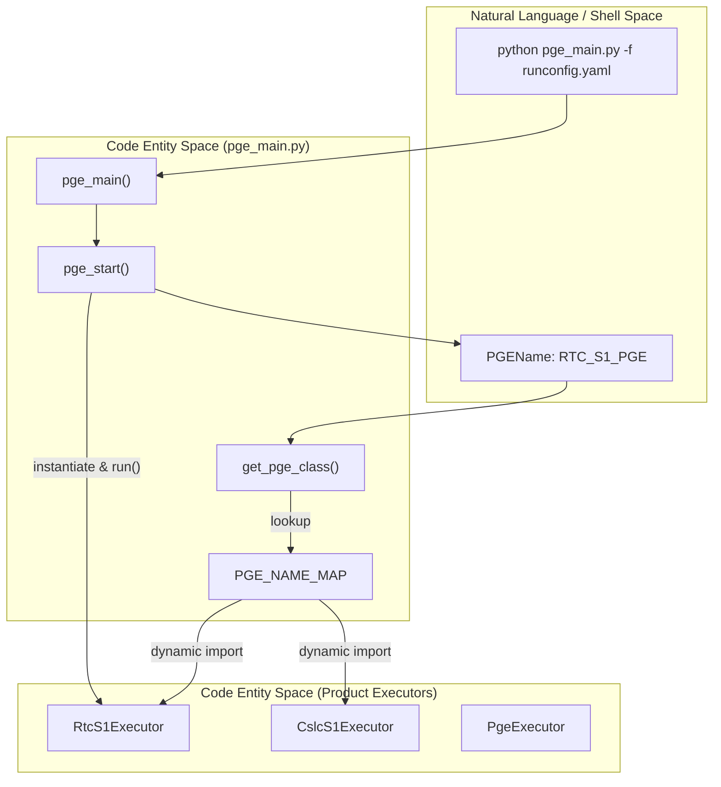
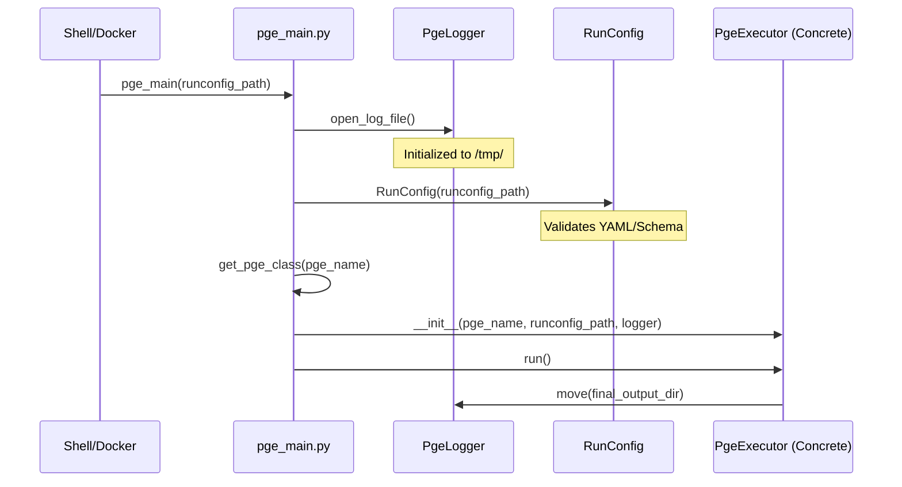

# Page: pge_main.py: Dispatcher and Entry Point

# pge_main.py: Dispatcher and Entry Point

Relevant source files

The following files were used as context for generating this wiki page:

- [src/opera/pge/__init__.py](src/opera/pge/__init__.py)
- [src/opera/scripts/pge_docker_entrypoint.sh](src/opera/scripts/pge_docker_entrypoint.sh)
- [src/opera/scripts/pge_main.py](src/opera/scripts/pge_main.py)
- [src/opera/scripts/pge_tests_entrypoint.sh](src/opera/scripts/pge_tests_entrypoint.sh)
- [src/opera/util/__init__.py](src/opera/util/__init__.py)
- [src/opera/util/metfile.py](src/opera/util/metfile.py)
- [src/opera/util/run_utils.py](src/opera/util/run_utils.py)
- [src/opera/util/time.py](src/opera/util/time.py)

The `pge_main.py` script serves as the primary Command Line Interface (CLI) and execution dispatcher for the OPERA SDS PGE repository. It is responsible for identifying the specific product type from a provided RunConfig, dynamically loading the corresponding executor class, and initiating the PGE lifecycle.

## CLI Entry Point and Argument Parsing

The `pge_main()` function is the main entry point for all OPERA PGEs [src/opera/scripts/pge_main.py:168-175](). It utilizes `argparse` to handle command-line inputs, specifically requiring the `-f` or `--file` argument to specify the path to a RunConfig YAML file [src/opera/scripts/pge_main.py:176-184]().

Upon execution, the script performs the following high-level sequence:
1. Resolves the absolute path of the RunConfig file [src/opera/scripts/pge_main.py:186]().
2. Verifies the existence of the configuration file [src/opera/scripts/pge_main.py:188-189]().
3. Hands off execution to `pge_start()` [src/opera/scripts/pge_main.py:191]().

**Sources:** [src/opera/scripts/pge_main.py:168-195]()

## Execution Dispatch Logic

The dispatch mechanism relies on a centralized registry and dynamic Python imports to decouple the entry point from specific product implementations.

### The PGE_NAME_MAP Registry
The `PGE_NAME_MAP` dictionary maps the `PGEName` string (found within the RunConfig) to a tuple containing the module path and the specific class name of the executor [src/opera/scripts/pge_main.py:25-38]().

| PGE Name | Module Path | Executor Class |
| :--- | :--- | :--- |
| `BASE_PGE` | `opera.pge.base.base_pge` | `PgeExecutor` |
| `RTC_S1_PGE` | `opera.pge.rtc_s1.rtc_s1_pge` | `RtcS1Executor` |
| `CSLC_S1_PGE` | `opera.pge.cslc_s1.cslc_s1_pge` | `CslcS1Executor` |
| `DSWX_HLS_PGE` | `opera.pge.dswx_hls.dswx_hls_pge` | `DSWxHLSExecutor` |
| `DISP_S1_PGE` | `opera.pge.disp_s1.disp_s1_pge` | `DispS1Executor` |

**Sources:** [src/opera/scripts/pge_main.py:25-38]()

### Dynamic Class Loading
The function `get_pge_class()` uses `importlib.import_module` to load the required module at runtime [src/opera/scripts/pge_main.py:42-69](). This allows the system to support multiple product types without hard-coding imports for every executor in the main script. If the `pge_name` is missing from the map or the module cannot be loaded, the system logs a critical error and terminates [src/opera/scripts/pge_main.py:73-77]().

**Sources:** [src/opera/scripts/pge_main.py:42-80]()

### Initialization Sequence
The `pge_start()` function orchestrates the hand-off from the CLI to the object-oriented framework:

1. **Log Initialization**: Calls `open_log_file()` to create a `PgeLogger` before the RunConfig is even parsed [src/opera/scripts/pge_main.py:148]().
2. **Temporary Log Location**: Initially moves the log file to `/tmp/` [src/opera/scripts/pge_main.py:152](). The specific `PgeExecutor` will later move this to the final output directory defined in the RunConfig.
3. **RunConfig Loading**: Instantiates the `RunConfig` object, which triggers YAML validation [src/opera/scripts/pge_main.py:155]().
4. **Executor Instantiation**: Retrieves the class via `get_pge_class()` and instantiates it with the `pge_name`, `run_config_filename`, and the existing `logger` [src/opera/scripts/pge_main.py:158-163]().
5. **Lifecycle Start**: Calls `pge.run()` to begin the pre-processing, SAS execution, and post-processing phases [src/opera/scripts/pge_main.py:165]().

**Sources:** [src/opera/scripts/pge_main.py:82-167]()

## Data Flow and Entity Mapping

The following diagrams illustrate how the `pge_main.py` script bridges the gap between the external shell environment and the internal Python class hierarchy.

### CLI to Executor Flow
This diagram shows the transition from a shell command to the instantiation of a specific product executor.

"CLI to Executor Dispatch"

**Sources:** [src/opera/scripts/pge_main.py:25-38](), [src/opera/scripts/pge_main.py:137-167]()

### Component Interaction Diagram
This diagram details the interaction between the dispatcher, the logging utility, and the configuration parser.

"Dispatcher Component Interaction"

**Sources:** [src/opera/scripts/pge_main.py:82-98](), [src/opera/scripts/pge_main.py:101-134](), [src/opera/scripts/pge_main.py:137-167]()

## Container Integration

### pge_docker_entrypoint.sh
The `pge_docker_entrypoint.sh` script serves as the `ENTRYPOINT` for OPERA PGE Docker containers [src/opera/scripts/pge_docker_entrypoint.sh:1-4](). It performs critical environment setup before invoking the Python dispatcher:

*   **PYTHONPATH Configuration**: Appends the PGE program directory (defined by `${PGE_DEST_DIR}`) to `PYTHONPATH` to ensure the `opera` package and its scripts are importable [src/opera/scripts/pge_docker_entrypoint.sh:10]().
*   **Execution**: Executes `pge_main.py` using the absolute path within the container, passing through all command-line arguments (`"$@"`) provided to the `docker run` command [src/opera/scripts/pge_docker_entrypoint.sh:16]().

### pge_tests_entrypoint.sh
A separate entry point, `pge_tests_entrypoint.sh`, is used for CI/CD and testing environments [src/opera/scripts/pge_tests_entrypoint.sh:1-2](). Unlike the production entry point, it does not hard-code the call to `pge_main.py`. Instead, it sets up the `PYTHONPATH` and then executes whatever command is passed to it, allowing for flexible invocation of `pytest`, `pylint`, or other diagnostic tools [src/opera/scripts/pge_tests_entrypoint.sh:8-14]().

**Sources:** [src/opera/scripts/pge_docker_entrypoint.sh:1-17](), [src/opera/scripts/pge_tests_entrypoint.sh:1-14]()
