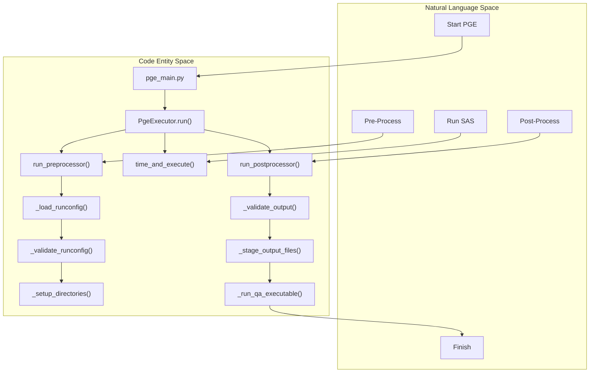
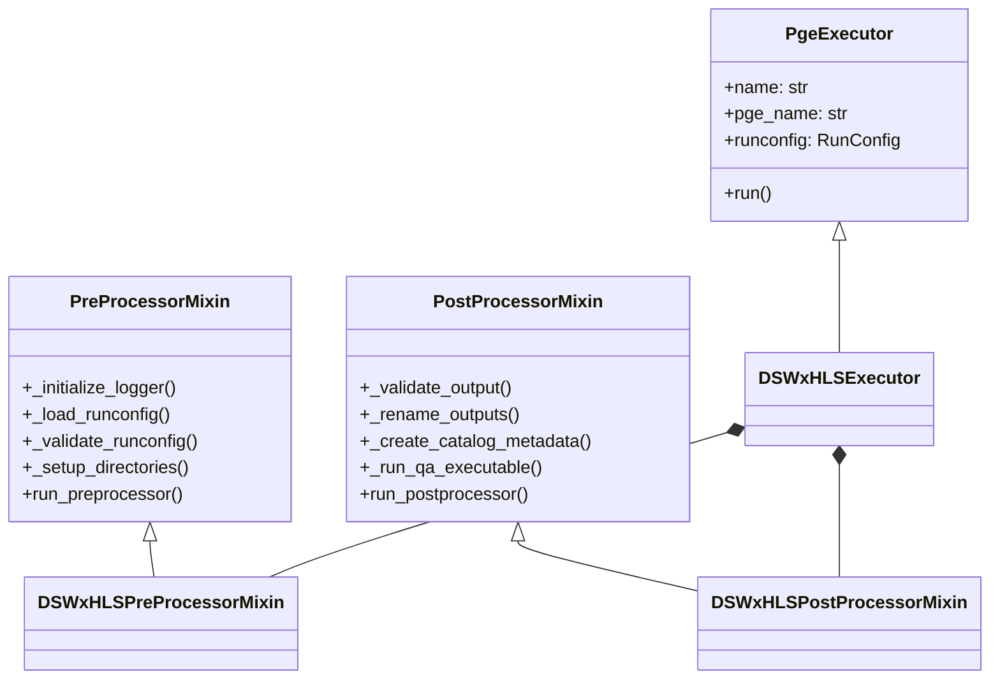

# Page: PgeExecutor Base Class and Lifecycle

# PgeExecutor Base Class and Lifecycle

Relevant source files

The following files were used as context for generating this wiki page:

- [src/opera/__init__.py](src/opera/__init__.py)
- [src/opera/pge/base/base_pge.py](src/opera/pge/base/base_pge.py)
- [src/opera/pge/dswx_hls/dswx_hls_pge.py](src/opera/pge/dswx_hls/dswx_hls_pge.py)
- [src/opera/scripts/pge_main.py](src/opera/scripts/pge_main.py)
- [src/opera/test/data/test_base_pge_config.yaml](src/opera/test/data/test_base_pge_config.yaml)
- [src/opera/test/data/test_base_pge_input_files_config.yaml](src/opera/test/data/test_base_pge_input_files_config.yaml)
- [src/opera/test/data/test_sas_error_config.yaml](src/opera/test/data/test_sas_error_config.yaml)
- [src/opera/test/data/test_sas_qa_bad_extension_config.yaml](src/opera/test/data/test_sas_qa_bad_extension_config.yaml)
- [src/opera/test/data/test_sas_qa_config.yaml](src/opera/test/data/test_sas_qa_config.yaml)
- [src/opera/test/pge/base/test_base_pge.py](src/opera/test/pge/base/test_base_pge.py)
- [src/opera/test/pge/dswx_hls/test_dswx_hls_pge.py](src/opera/test/pge/dswx_hls/test_dswx_hls_pge.py)
- [src/opera/test/scripts/test_pge_main.py](src/opera/test/scripts/test_pge_main.py)
- [src/opera/util/metfile.py](src/opera/util/metfile.py)
- [src/opera/util/usage_metrics.py](src/opera/util/usage_metrics.py)

The `PgeExecutor` class, defined in `base_pge.py`, serves as the abstract foundation for all Product Generation Executables (PGEs) within the OPERA SDS. It establishes a standardized execution lifecycle, directory management, and error handling framework that ensures consistency across different radar and optical product types [src/opera/pge/base/base_pge.py:8-40]().

## PgeExecutor Lifecycle

The `run()` method in `PgeExecutor` orchestrates the entire execution sequence. This lifecycle is divided into three primary phases: Pre-processing, SAS Execution, and Post-processing [src/opera/pge/base/base_pge.py:328-361]().

### 1. Pre-processing Phase
Handled by the `PreProcessorMixin`, this phase prepares the environment for the Science Application Software (SAS).
*   **Logger Initialization**: Creates the `PgeLogger` and an optional `qa_logger` [src/opera/pge/base/base_pge.py:59-86]().
*   **RunConfig Loading & Validation**: Parses the YAML RunConfig and validates it against the PGE-specific and SAS schemas [src/opera/pge/base/base_pge.py:88-123]().
*   **Directory Setup**: Creates `OutputProductPath` and `ScratchPath` as defined in the RunConfig [src/opera/pge/base/base_pge.py:125-158]().
*   **SAS RunConfig Isolation**: Dumps the SAS-specific portion of the configuration into the scratch directory for the SAS to consume [src/opera/pge/base/base_pge.py:202-214]().

### 2. SAS Execution Phase
The core science algorithm is executed as a subprocess.
*   **Command Line Construction**: Uses `create_sas_command_line` to build the execution string from `ProgramPath` and `ProgramOptions` [src/opera/pge/base/base_pge.py:345](), [src/opera/util/run_utils.py:28-56]().
*   **Execution**: The command is run via `time_and_execute`, which captures STDOUT/STDERR and tracks elapsed time [src/opera/pge/base/base_pge.py:347](), [src/opera/util/run_utils.py:100-143]().

### 3. Post-processing Phase
Handled by the `PostProcessorMixin`, this phase finalizes the product.
*   **Product Validation**: Scans the output directory to ensure all expected files were created [src/opera/pge/base/base_pge.py:255-274]().
*   **Metadata Generation**: Creates Catalog Metadata (`.met` files) and ISO XML metadata using Jinja2 templates [src/opera/pge/base/base_pge.py:276-302]().
*   **QA Execution**: If enabled, runs a separate Quality Assurance executable [src/opera/pge/base/base_pge.py:304-325]().

### Lifecycle Flow Diagram

The following diagram illustrates the relationship between the high-level lifecycle steps and the internal method calls within `PgeExecutor`.

**PgeExecutor Execution Flow**

Sources: [src/opera/pge/base/base_pge.py:328-361](), [src/opera/scripts/pge_main.py:137-165]()

## Mixin Architecture

The framework uses a Mixin pattern to allow specific PGEs (like RTC or DSWx) to override or extend behaviors without modifying the base class.

### PreProcessorMixin
This mixin provides the hooks for environment preparation. Subclasses often override `run_preprocessor` to add specific input validation, such as checking for co-located shapefile components (.dbf, .prj) [src/opera/pge/dswx_hls/dswx_hls_pge.py:52-88]().

### PostProcessorMixin
This mixin handles product finalization. Key methods include:
*   `_validate_output()`: Checks for existence of files and optionally matches them against expected patterns [src/opera/pge/base/base_pge.py:255-274]().
*   `_rename_outputs()`: Uses a `rename_by_pattern_map` to rename SAS-generated files to the OPERA standard naming convention [src/opera/pge/base/base_pge.py:377-407]().

**Code Entity Relationship Diagram**

Sources: [src/opera/pge/base/base_pge.py:41-57](), [src/opera/pge/base/base_pge.py:217-253](), [src/opera/pge/dswx_hls/dswx_hls_pge.py:38-48]()

## Key Mechanisms

### Rename by Pattern Map
PGEs often need to rename science outputs to meet project-specific naming conventions. The `rename_by_pattern_map` allows a PGE to define a mapping of glob patterns to target filenames. During `_rename_outputs()`, the executor finds files matching the pattern and renames them [src/opera/pge/base/base_pge.py:377-407]().

### QA Executable Support
If `QAExecutable/Enabled` is set to `True` in the RunConfig, the `PostProcessorMixin` will invoke a secondary executable after the primary SAS completes. This process uses a dedicated `qa_logger` and follows a similar execution pattern to the primary SAS [src/opera/pge/base/base_pge.py:75-86](), [src/opera/pge/base/base_pge.py:304-325]().

### Resource Metrics
At the end of the lifecycle, the PGE gathers OS-level metrics (CPU time, memory usage, I/O) for the main process and all child processes (SAS/QA). These are logged and included in the catalog metadata [src/opera/util/usage_metrics.py:21-70](), [src/opera/pge/base/base_pge.py:358-361]().

| Metric | Description | Source |
| :--- | :--- | :--- |
| `os.cpu.seconds.sys` | System CPU time consumed | `resource.getrusage` |
| `os.max_rss_kb.main_process` | Max physical memory (RSS) | `resource.getrusage` |
| `os.peak_vm_kb.main_process` | Peak virtual memory | `/proc/self/status` |

Sources: [src/opera/pge/base/base_pge.py:377-407](), [src/opera/util/usage_metrics.py:52-68](), [src/opera/util/metfile.py:24-56]()
