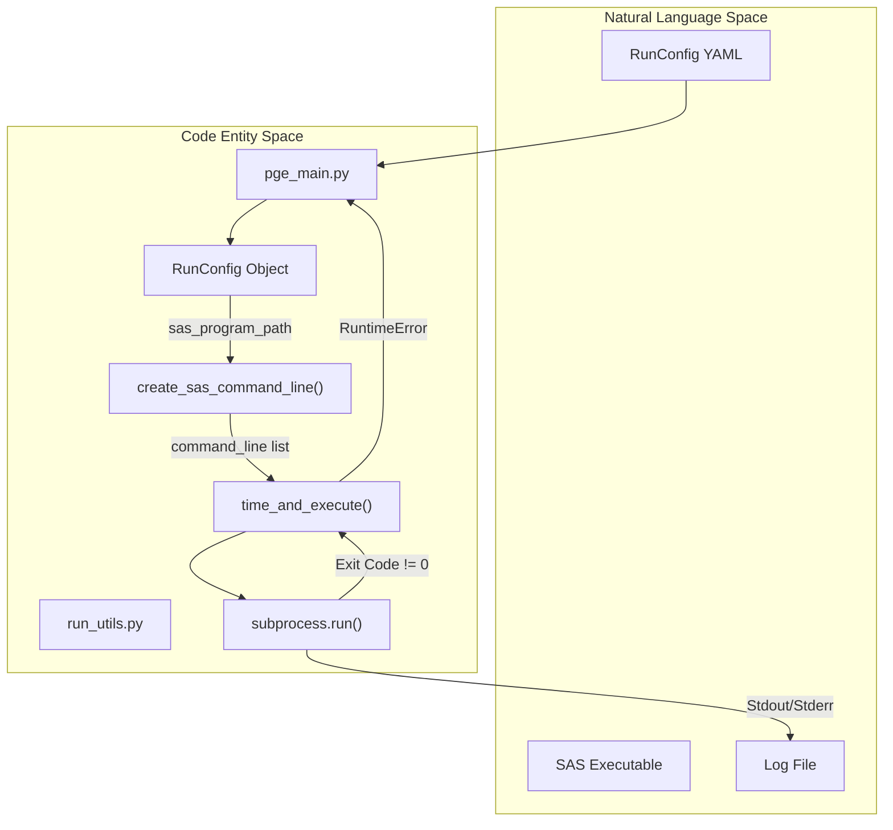

# Page: Process Execution and Catalog Metadata

# Process Execution and Catalog Metadata

<details>
<summary>Relevant source files</summary>

The following files were used as context for generating this wiki page:

- [src/opera/pge/__init__.py](src/opera/pge/__init__.py)
- [src/opera/scripts/pge_main.py](src/opera/scripts/pge_main.py)
- [src/opera/test/data/test_sas_log_with_traceback.txt](src/opera/test/data/test_sas_log_with_traceback.txt)
- [src/opera/test/data/test_sas_log_with_traceback_multiline_message.txt](src/opera/test/data/test_sas_log_with_traceback_multiline_message.txt)
- [src/opera/test/data/test_sas_log_with_traceback_no_message.txt](src/opera/test/data/test_sas_log_with_traceback_no_message.txt)
- [src/opera/test/util/test_run_utils.py](src/opera/test/util/test_run_utils.py)
- [src/opera/util/__init__.py](src/opera/util/__init__.py)
- [src/opera/util/metfile.py](src/opera/util/metfile.py)
- [src/opera/util/run_utils.py](src/opera/util/run_utils.py)
- [src/opera/util/time.py](src/opera/util/time.py)

</details>


This page details the core utilities used by the OPERA SDS PGE subsystem to execute external processes (Scientific Algorithms, or SAS), manage catalog metadata, handle time formats, and track system resource utilization.

## Process Execution Utilities

The `run_utils.py` module provides the foundational functions for constructing command lines and executing them as subprocesses. It ensures that SAS and Quality Assurance (QA) executables are properly located, have correct permissions, and are monitored for performance and failure.

### Command Line Construction
The PGE framework supports both system-level executables and Python-based modules.
*   **`create_sas_command_line`**: Forms a command list for a SAS executable. It resolves the path using `shutil.which` [src/opera/util/run_utils.py:132-133](). If the path is not in the system `PATH`, it checks for explicit file existence and execute permissions [src/opera/util/run_utils.py:138-142](). The RunConfig path is always appended as the final argument [src/opera/util/run_utils.py:152]().
*   **`create_qa_command_line`**: Similar to the SAS variant but tailored for QA applications, which may have different argument structures [src/opera/util/run_utils.py:157-208]().

### Execution and Monitoring
*   **`time_and_execute`**: Wraps `subprocess.run` to execute a command while capturing its duration [src/opera/util/run_utils.py:211-235](). It logs the command being run and, upon completion, the total elapsed time. If the process returns a non-zero exit code, it raises a `RuntimeError` [src/opera/util/run_utils.py:230-233]().
*   **`get_checksum`**: Generates MD5 hashes for output files to ensure data integrity [src/opera/util/run_utils.py:24-48]().
*   **`get_traceback_from_log`**: A specialized utility that uses regular expressions to extract Python traceback stacks from SAS log files [src/opera/util/run_utils.py:56-93](). This is critical for capturing detailed error information when a SAS fails internally [src/opera/test/data/test_sas_log_with_traceback.txt:144-182]().

### Process Execution Data Flow
The following diagram illustrates how `pge_main.py` utilizes `run_utils.py` to transition from a RunConfig to an active process.

Title: SAS Execution Flow

Sources: [src/opera/scripts/pge_main.py:137-165](), [src/opera/util/run_utils.py:96-154](), [src/opera/util/run_utils.py:211-235]()

## Catalog Metadata Management

The `metfile.py` module defines the `MetFile` class, which handles the generation and validation of `.json` catalog metadata files required by the SDS for product ingestion.

### The MetFile Class
The `MetFile` class acts as a wrapper around a dictionary representing metadata fields [src/opera/util/metfile.py:24-43]().
*   **Read/Write**: Supports loading existing `.json` files and merging new metadata into them [src/opera/util/metfile.py:63-94]().
*   **Validation**: Uses `jsonschema` to validate the metadata against a standard schema [src/opera/util/metfile.py:95-124](). The schema is located at `opera/pge/base/schema/catalog_metadata_schema.json` [src/opera/util/metfile.py:27]().

### Metadata Interaction Diagram
Title: MetFile Entity Relationship
```mermaid
classDiagram
    class MetFile {
        +dict met_dict
        +str combined_error_msg
        +SCHEMA_PATH
        +read(input_path)
        +write(output_path)
        +validate(schema_filename) bool
        +asdict() dict
    }
    class jsonschema {
        <<external>>
        +validate()
    }
    MetFile --> jsonschema : uses for validation
    MetFile ..> "catalog_metadata_schema.json" : validates against
```
Sources: [src/opera/util/metfile.py:24-129]()

## Time and Datetime Utilities

Standardized time formats are enforced across all PGEs via `util/time.py`. This ensures consistency between filenames, ISO metadata, and catalog entries.

| Function | Format | Usage |
| :--- | :--- | :--- |
| `get_iso_time` | `YYYY-MM-DDTHH:MM:SS.mmmmmmZ` | General ISO metadata [src/opera/util/time.py:35-52]() |
| `get_time_for_filename` | `YYYYMMDDTHHmmss` | Product output filenames [src/opera/util/time.py:55-73]() |
| `get_catalog_metadata_datetime_str` | `YYYY-MM-DDTHH:MM:SS.mmmmmm0000Z` | Catalog `.met` files (nanosecond precision) [src/opera/util/time.py:76-95]() |

Sources: [src/opera/util/time.py:1-96]()

## Usage Metrics and Resource Tracking

The SDS tracks the operational footprint of each PGE run. While high-level logging is handled by `PgeLogger`, specific resource tracking is integrated into the execution lifecycle.

*   **Resource Collection**: The `usage_metrics.py` module (referenced via `util.logger`) tracks OS-level resource consumption such as CPU usage and memory residency.
*   **Log Integration**: Metrics are typically collected at the start and end of `time_and_execute` and written to the structured CSV logs [src/opera/util/run_utils.py:211-235]().

Sources: [src/opera/util/run_utils.py:211-235](), [src/opera/util/__init__.py:1-15]()
