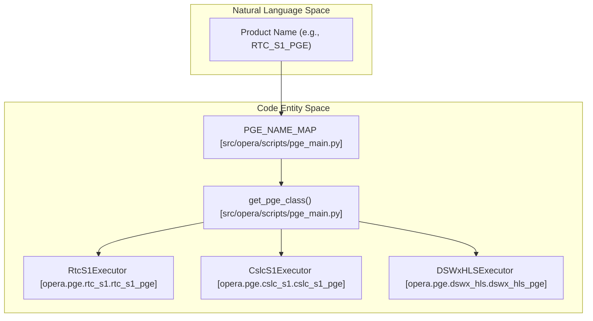
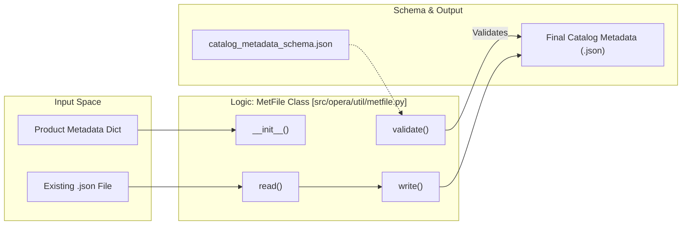

# Page: Repository Layout

# Repository Layout

Relevant source files

The following files were used as context for generating this wiki page:

- [COPYING](COPYING)
- [LICENSE.txt](LICENSE.txt)
- [NOTICE.txt](NOTICE.txt)
- [docs/opera.pge.base.rst](docs/opera.pge.base.rst)
- [docs/opera.pge.cslc_s1.rst](docs/opera.pge.cslc_s1.rst)
- [docs/opera.pge.dswx_hls.rst](docs/opera.pge.dswx_hls.rst)
- [src/opera/_package.py](src/opera/_package.py)
- [src/opera/scripts/pge_main.py](src/opera/scripts/pge_main.py)
- [src/opera/util/metfile.py](src/opera/util/metfile.py)

This page provides a technical breakdown of the `opera-sds-pge` repository structure. The project is organized to separate core execution logic, product-specific implementations, shared utilities, and the infrastructure required for containerized deployment and continuous integration.

## Top-Level Directory Structure

The repository follows a standard Python project layout with additional directories for CI/CD, documentation, and configuration examples.

| Directory | Purpose |
| :--- | :--- |
| `src/opera/pge` | Contains the Product Generation Executable (PGE) implementations for various OPERA products. |
| `src/opera/util` | Shared utility modules used across different PGEs (logging, metadata extraction, etc.). |
| `src/opera/scripts` | Entry point scripts, primarily `pge_main.py`. |
| `.ci` | CI/CD configuration, including Jenkinsfiles and Dockerfiles for PGE images. |
| `examples` | Sample `RunConfig` YAML files used for testing and as templates for production. |
| `docs` | Sphinx documentation source files. |

**Sources:**
- `src/opera/pge` (Project structure)
- `src/opera/util` (Project structure)
- `src/opera/scripts/pge_main.py` [src/opera/scripts/pge_main.py:1-14]()

---

## Product Generation Executables (`src/opera/pge`)

The `src/opera/pge` directory is the core of the repository. It contains a base framework and specialized subpackages for each OPERA product. Each subpackage typically includes an executor class that inherits from `PgeExecutor`.

### PGE Dispatching Logic
The `pge_main.py` script serves as the primary entry point. It uses a registry called `PGE_NAME_MAP` to map a `PGEName` (found in a `RunConfig`) to a specific Python class.

**PGE Class Resolution Diagram**
This diagram illustrates how the `pge_main.py` dispatcher links a product name to its implementation.

**Sources:**
- `PGE_NAME_MAP` [src/opera/scripts/pge_main.py:25-38]()
- `get_pge_class()` [src/opera/scripts/pge_main.py:42-79]()
- `pge_start()` [src/opera/scripts/pge_main.py:137-167]()

---

## Shared Utilities (`src/opera/util`)

The `util` package provides standardized components to ensure consistency across all PGEs. This includes handling of catalog metadata, logging, and filesystem interactions.

### Catalog Metadata (`metfile.py`)
The `MetFile` class is used to generate `.json` catalog metadata files that accompany OPERA products. It validates these files against a predefined JSON schema.

**Metadata Flow Diagram**
This diagram shows how `MetFile` interacts with the filesystem and validation schemas.

**Key Utility Components:**
- **Logging:** `PgeLogger` (referenced in `pge_main.py`) handles structured logging with specific `ErrorCode` values [src/opera/scripts/pge_main.py:93-98]().
- **Metadata:** `MetFile` handles JSON catalog metadata and schema validation [src/opera/util/metfile.py:24-129]().

**Sources:**
- `MetFile` class [src/opera/util/metfile.py:24-129]()
- `SCHEMA_PATH` [src/opera/util/metfile.py:27-27]()
- `open_log_file()` [src/opera/scripts/pge_main.py:82-98]()

---

## Infrastructure and Documentation

### CI/CD and Docker (`.ci`)
The `.ci` directory contains the logic for building the execution environment. This includes:
- **Dockerfiles:** Define the environment for each PGE, often layering OPERA code on top of Scientific Algorithm Software (SAS) base images.
- **Jenkins Pipelines:** Automate testing and deployment.

### Documentation (`docs`)
The `docs` directory uses Sphinx to generate technical documentation from docstrings and reStructuredText (RST) files. Each PGE subpackage has a corresponding RST file (e.g., `opera.pge.base.rst`, `opera.pge.cslc_s1.rst`) that uses `automodule` to pull documentation directly from the source code.

**Sources:**
- `docs/opera.pge.base.rst` [docs/opera.pge.base.rst:1-30]()
- `docs/opera.pge.cslc_s1.rst` [docs/opera.pge.cslc_s1.rst:1-22]()
- `docs/opera.pge.dswx_hls.rst` [docs/opera.pge.dswx_hls.rst:1-22]()

---

## Package Information
The package identity and versioning are managed in `src/opera/_package.py`.

| Attribute | Value |
| :--- | :--- |
| **Title** | `opera-sds-pge` |
| **Version** | `7.0.0-er.1.0` |
| **Summary** | OPERA SDS Product Generation Executable (PGE) Repository |

**Sources:**
- `_package.py` [src/opera/_package.py:10-13]()
