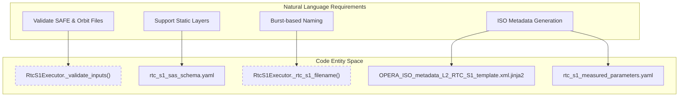
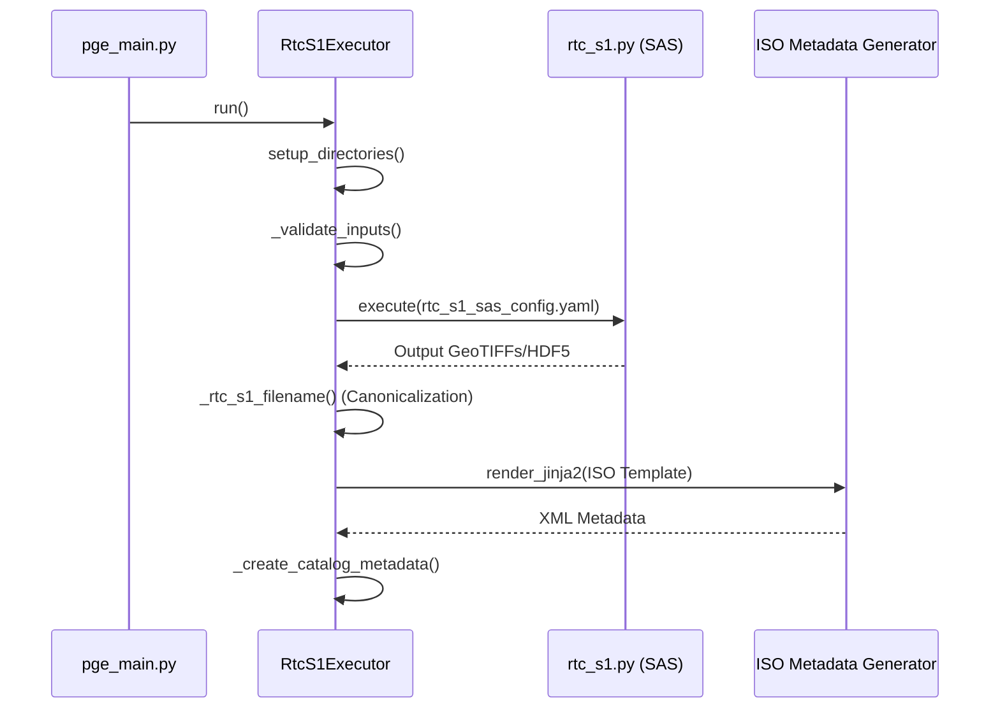

# Page: RTC-S1 PGE

# RTC-S1 PGE

Relevant source files

The following files were used as context for generating this wiki page:

- [.ci/docker/Dockerfile_cslc_s1](.ci/docker/Dockerfile_cslc_s1)
- [.ci/docker/Dockerfile_rtc_s1](.ci/docker/Dockerfile_rtc_s1)
- [.ci/scripts/rtc_s1/build_rtc_s1.sh](.ci/scripts/rtc_s1/build_rtc_s1.sh)
- [.ci/scripts/rtc_s1/opera_pge_rtc_s1_delivery_5.3_final_runconfig.yaml](.ci/scripts/rtc_s1/opera_pge_rtc_s1_delivery_5.3_final_runconfig.yaml)
- [.ci/scripts/rtc_s1/opera_pge_rtc_s1_static_delivery_5.3_final_runconfig.yaml](.ci/scripts/rtc_s1/opera_pge_rtc_s1_static_delivery_5.3_final_runconfig.yaml)
- [.ci/scripts/rtc_s1/test_int_rtc_s1.sh](.ci/scripts/rtc_s1/test_int_rtc_s1.sh)
- [src/opera/pge/rtc_s1/schema/rtc_s1_sas_schema.yaml](src/opera/pge/rtc_s1/schema/rtc_s1_sas_schema.yaml)
- [src/opera/pge/rtc_s1/templates/rtc_s1_static_measured_parameters.yaml](src/opera/pge/rtc_s1/templates/rtc_s1_static_measured_parameters.yaml)
- [src/opera/test/data/test_rtc_s1_config.yaml](src/opera/test/data/test_rtc_s1_config.yaml)
- [src/opera/test/data/test_rtc_s1_static_config.yaml](src/opera/test/data/test_rtc_s1_static_config.yaml)
- [src/opera/test/pge/rtc_s1/test_rtc_s1_pge.py](src/opera/test/pge/rtc_s1/test_rtc_s1_pge.py)

The RTC-S1 (Radiometric Terrain Corrected Sentinel-1) Product Generation Executable (PGE) is responsible for processing Sentinel-1 Level-1 Single Look Complex (SLC) data into geocoded, terrain-corrected backscatter products. This PGE supports both standard RTC products and static layer products (e.g., incidence angle, local incidence angle, number of looks, and shadow masks).

## Implementation Overview

The RTC-S1 PGE is implemented via the `RtcS1Executor` class. It inherits from the base `PgeExecutor` and utilizes the standard OPERA SDS lifecycle: pre-processing (validation), execution of the SAS (`rtc_s1.py`), and post-processing (product renaming and metadata generation).

### Data Flow and Code Entity Space

The following diagram illustrates how the natural language requirements for RTC-S1 processing map to specific code entities and data structures within the repository.

**Diagram: RTC-S1 Requirement to Code Mapping**

**Sources:** `[src/opera/pge/rtc_s1/rtc_s1_pge.py:25-27]()`, `[src/opera/pge/rtc_s1/schema/rtc_s1_sas_schema.yaml:10-11]()`, `[src/opera/test/data/test_rtc_s1_config.yaml:40-41]()`.

---

## Input Validation

The PGE performs rigorous validation of input files before invoking the SAS. This is handled during the `run()` lifecycle.

| Input Type | Validation Requirements | RunConfig Location |
| :--- | :--- | :--- |
| **SAFE Zip** | Must exist, have `.zip` extension, and contain S1 SLC data. | `InputFilesGroup/InputFilePaths` |
| **Orbit File** | Precise (POEORB) or Restituted (RESORB) orbit files with `.EOF` extension. | `InputFilesGroup/InputFilePaths` |
| **DEM** | GeoTIFF format used for terrain correction. | `DynamicAncillaryFilesGroup/AncillaryFileMap/dem_file` |
| **Burst DB** | SQLite database used for burst geogrid definitions. | `static_ancillary_file_group/burst_database_file` |

**Sources:** `[src/opera/pge/rtc_s1/schema/rtc_s1_sas_schema.yaml:16-40]()`, `[src/opera/test/pge/rtc_s1/test_rtc_s1_pge.py:61-76]()`.

---

## Static Layer Support

The RTC-S1 PGE supports a specific "Static" mode where the SAS generates geometric and auxiliary layers instead of backscatter. This is toggled via the `product_type` in the RunConfig.

*   **Product Types:** `RTC_S1` (Backscatter) or `RTC_S1_STATIC` (Geometric layers).
*   **Static Layers Generated:**
    *   Incidence Angle
    *   Local Incidence Angle
    *   Number of Looks
    *   Layover/Shadow Mask
    *   Radiometric Normalization Factors (gamma0 to beta0/sigma0)

**Sources:** `[src/opera/pge/rtc_s1/schema/rtc_s1_sas_schema.yaml:9-11]()`, `[src/opera/test/data/test_rtc_s1_static_config.yaml:29-34]()`.

---

## Output Validation and Canonicalization

### Filename Canonicalization
RTC-S1 products are burst-based. The PGE renames the raw SAS outputs into a canonical format using metadata extracted from the generated HDF5/GeoTIFF files.

The filename pattern follows:
`OPERA_L2_{PRODUCT_TYPE}_{BURST_ID}_{ACQUISITION_TIME}_{PRODUCTION_TIME}_{SENSOR}_{SPACING}_{VERSION}_{LAYER}.{EXT}`

**Sources:** `[src/opera/test/pge/rtc_s1/test_rtc_s1_pge.py:174-180]()`.

### Execution Logic
The `RtcS1Executor` manages the execution flow, ensuring the environment is prepared for the `rtc_s1.py` SAS.

**Diagram: RtcS1Executor Execution Flow**

**Sources:** `[src/opera/test/pge/rtc_s1/test_rtc_s1_pge.py:115-147]()`, `[src/opera/test/data/test_rtc_s1_config.yaml:22-39]()`.

---

## ISO Metadata Generation

Metadata is generated using Jinja2 templates. The PGE extracts attributes from the SAS output products (via `h5_utils.get_rtc_s1_product_metadata`) and populates the ISO XML template.

*   **Template:** `OPERA_ISO_metadata_L2_RTC_S1_template.xml.jinja2`
*   **Measured Parameters:** Defined in `rtc_s1_measured_parameters.yaml` or `rtc_s1_static_measured_parameters.yaml`. These files map HDF5/GeoTIFF metadata paths to ISO elements.

**Example Measured Parameters Mapping:**
*   `identification/absoluteOrbitNumber` -> `instrumentInformation`
*   `identification/burstID` -> `instrumentInformation`
*   `data/xCoordinateSpacing` -> `contentInformation`

**Sources:** `[src/opera/pge/rtc_s1/templates/rtc_s1_static_measured_parameters.yaml:1-20]()`, `[src/opera/test/data/test_rtc_s1_config.yaml:40-41]()`.

---

## Integration Testing

The PGE includes a Docker-based integration test suite (`test_int_rtc_s1.sh`) that verifies:
1.  **Baseline Workflow:** Standard RTC backscatter generation.
2.  **Static Layer Workflow:** Generation of geometric layers.
3.  **Product Comparison:** Validation of output products against expected golden datasets using `compare_rtc_s1_products.sh`.

**Sources:** `[ .ci/scripts/rtc_s1/test_int_rtc_s1.sh:92-128]()`, `[ .ci/docker/Dockerfile_rtc_s1:61]()`.
