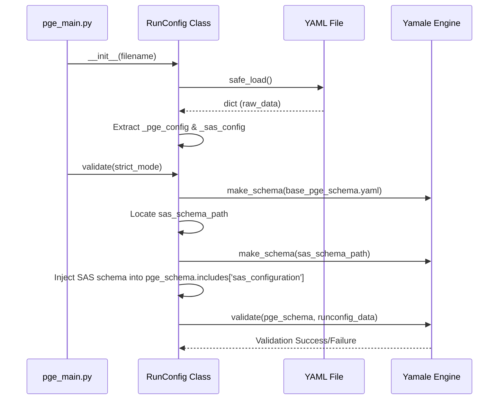
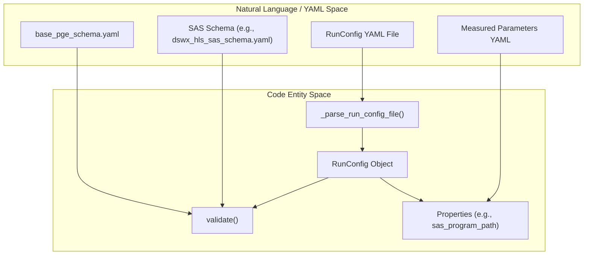

# Page: RunConfig: Schema and Parsing

# RunConfig: Schema and Parsing

Relevant source files

The following files were used as context for generating this wiki page:

- [src/opera/pge/base/runconfig.py](src/opera/pge/base/runconfig.py)
- [src/opera/pge/base/schema/base_pge_schema.yaml](src/opera/pge/base/schema/base_pge_schema.yaml)
- [src/opera/pge/base/schema/iso_metadata_measured_parameters_config_schema.yaml](src/opera/pge/base/schema/iso_metadata_measured_parameters_config_schema.yaml)
- [src/opera/pge/cslc_s1/templates/cslc_s1_measured_parameters.yaml](src/opera/pge/cslc_s1/templates/cslc_s1_measured_parameters.yaml)
- [src/opera/pge/cslc_s1/templates/cslc_s1_static_measured_parameters.yaml](src/opera/pge/cslc_s1/templates/cslc_s1_static_measured_parameters.yaml)
- [src/opera/test/data/invalid_runconfig.yaml](src/opera/test/data/invalid_runconfig.yaml)
- [src/opera/test/data/test_cslc_s1_static_config.yaml](src/opera/test/data/test_cslc_s1_static_config.yaml)
- [src/opera/test/data/test_dswx_hls_config.yaml](src/opera/test/data/test_dswx_hls_config.yaml)
- [src/opera/test/data/valid_runconfig_extra_fields.yaml](src/opera/test/data/valid_runconfig_extra_fields.yaml)
- [src/opera/test/data/valid_runconfig_full.yaml](src/opera/test/data/valid_runconfig_full.yaml)
- [src/opera/test/data/valid_runconfig_no_sas.yaml](src/opera/test/data/valid_runconfig_no_sas.yaml)
- [src/opera/test/pge/base/test_runconfig.py](src/opera/test/pge/base/test_runconfig.py)

The `RunConfig` system is the primary mechanism for configuring OPERA SDS PGEs. It utilizes YAML-based configuration files to define execution parameters for both the PGE framework and the underlying Scientific Algorithms Software (SAS). The system provides robust validation using the Yamale library and handles complex path resolution across different execution environments.

## RunConfig YAML Structure

A standard OPERA RunConfig is divided into a top-level `RunConfig` entry, containing `Name` and `Groups` [src/opera/pge/base/runconfig.py:51-58](). The `Groups` section is further divided into two main categories:

1.  **PGE Group**: Configuration for the PGE execution framework (e.g., paths, executable metadata, QA settings).
2.  **SAS Group**: Configuration specific to the scientific algorithm being executed (e.g., processing thresholds, algorithm types) [src/opera/pge/base/runconfig.py:55-58]().

### Base PGE Schema
The PGE portion of the RunConfig must adhere to the `base_pge_schema.yaml` [src/opera/pge/base/schema/base_pge_schema.yaml:5-45](). Key groups defined in this schema include:

| Group Name | Purpose | Key Fields |
| :--- | :--- | :--- |
| `PGENameGroup` | Identifies the PGE | `PGEName` |
| `InputFilesGroup` | List of primary input files | `InputFilePaths` |
| `ProductPathGroup` | Output and temporary locations | `OutputProductPath`, `ScratchPath` |
| `PrimaryExecutable` | SAS execution details | `ProgramPath`, `ErrorCodeBase`, `SchemaPath` |
| `QAExecutable` | Quality Assurance settings | `Enabled`, `ProgramPath`, `ProgramOptions` |
| `DebugLevelGroup` | Execution behavior | `DebugSwitch`, `ExecuteViaShell` |

**Sources:** [src/opera/pge/base/schema/base_pge_schema.yaml:9-43](), [src/opera/pge/base/runconfig.py:26-28]()

## Two-Tier Yamale Validation

The `RunConfig.validate()` method implements a two-tier validation strategy to ensure the configuration is both structurally sound for the framework and valid for the specific SAS being invoked [src/opera/pge/base/runconfig.py:117-171]().

1.  **Framework Validation**: The configuration is checked against `base_pge_schema.yaml`. This ensures that mandatory fields like `ScratchPath` and `ProgramPath` are present and of the correct type [src/opera/pge/base/runconfig.py:144]().
2.  **SAS Validation**: If a `SAS` section is present, the PGE locates the SAS-specific schema via the `SchemaPath` field in the `PrimaryExecutable` group. This schema is dynamically "included" into the base schema under the `sas_configuration` key [src/opera/pge/base/runconfig.py:149-159]().

### Validation Logic Flow
This diagram illustrates how the `RunConfig` class bridges the YAML file on disk to the internal Python dictionary while performing schema enforcement.

**RunConfig Parsing and Validation Sequence**

**Sources:** [src/opera/pge/base/runconfig.py:51-58](), [src/opera/pge/base/runconfig.py:142-171]()

## Path Resolution and Attribute Access

The `RunConfig` class provides property-based access to configuration values, often including logic to resolve relative paths to absolute paths based on the location of the RunConfig file itself.

### Key Functions and Properties
*   `_parse_run_config_file(yaml_filename)`: Static method that reads the YAML and ensures the `RunConfig` top-level key exists [src/opera/pge/base/runconfig.py:61-87]().
*   `sas_schema_path`: Resolves the path to the SAS schema. If the path in the YAML is relative, it is joined with the directory containing the RunConfig file [src/opera/pge/base/runconfig.py:328-340]().
*   `input_files`: Returns the list of input files from the `InputFilesGroup` [src/opera/pge/base/runconfig.py:228-232]().
*   `get_ancillary_filenames()`: Aggregates all non-null ancillary files from the `AncillaryFileMap` into a flat list for pre-processing [src/opera/pge/base/runconfig.py:397-414]().

### Attribute Access Wrapper
The class overrides `__getattribute__` to provide consistent error handling. If a required field is missing from the YAML (and thus missing from the internal dictionary), the resulting `KeyError` is caught and re-raised as a `RuntimeError` with a descriptive message identifying the missing field and the source file [src/opera/pge/base/runconfig.py:173-201]().

## Measured Parameters Configuration

For products requiring ISO metadata, the RunConfig points to an `IsoMeasuredParameterDescriptions` YAML file [src/opera/pge/base/schema/base_pge_schema.yaml:33](). This file is validated against `iso_metadata_measured_parameters_config_schema.yaml` [src/opera/pge/base/schema/iso_metadata_measured_parameters_config_schema.yaml:1-31]().

This schema defines how SAS output metadata (like `absolute_orbit_number` or `burst_id`) should be mapped to ISO additional attributes, including their `attribute_type` (e.g., `instrumentInformation`) and `attribute_data_type` [src/opera/pge/cslc_s1/templates/cslc_s1_static_measured_parameters.yaml:1-10]().

**Data Flow: From Schema to Code Entities**

**Sources:** [src/opera/pge/base/runconfig.py:30-49](), [src/opera/pge/base/runconfig.py:117-141](), [src/opera/pge/base/schema/iso_metadata_measured_parameters_config_schema.yaml:1-16]()
