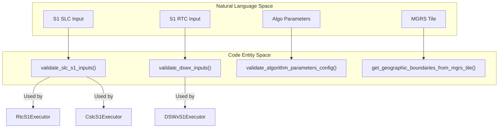
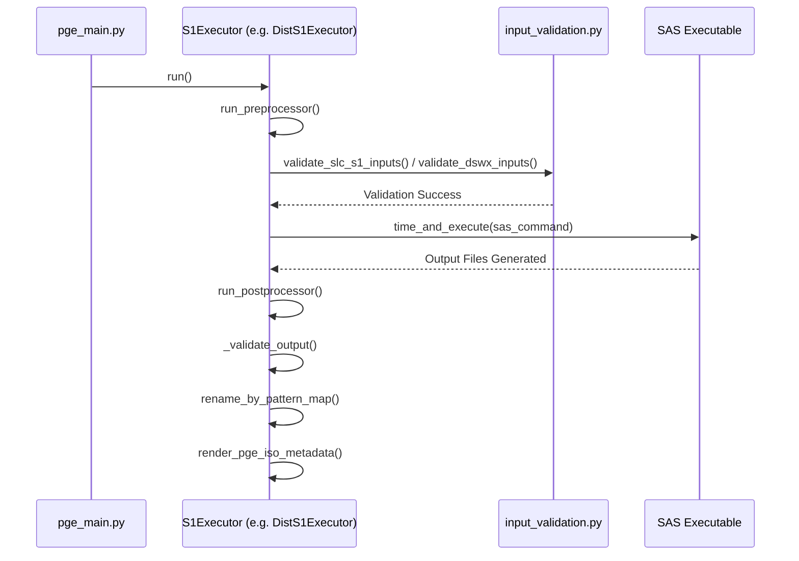

# Page: Sentinel-1 Product PGEs

# Sentinel-1 Product PGEs

Relevant source files

The following files were used as context for generating this wiki page:

- [.ci/scripts/dist_s1/build_dist_s1.sh](.ci/scripts/dist_s1/build_dist_s1.sh)
- [src/opera/pge/cslc_s1/cslc_s1_pge.py](src/opera/pge/cslc_s1/cslc_s1_pge.py)
- [src/opera/pge/disp_s1/disp_s1_pge.py](src/opera/pge/disp_s1/disp_s1_pge.py)
- [src/opera/pge/dist_s1/dist_s1_pge.py](src/opera/pge/dist_s1/dist_s1_pge.py)
- [src/opera/pge/dist_s1/schema/algorithm_parameters_dist_s1_schema.yaml](src/opera/pge/dist_s1/schema/algorithm_parameters_dist_s1_schema.yaml)
- [src/opera/pge/dist_s1/schema/dist_s1_sas_schema.yaml](src/opera/pge/dist_s1/schema/dist_s1_sas_schema.yaml)
- [src/opera/pge/dist_s1/templates/OPERA_ISO_metadata_L3_DIST_S1_template.xml.jinja2](src/opera/pge/dist_s1/templates/OPERA_ISO_metadata_L3_DIST_S1_template.xml.jinja2)
- [src/opera/pge/dist_s1/templates/dist_s1_measured_parameters.yaml](src/opera/pge/dist_s1/templates/dist_s1_measured_parameters.yaml)
- [src/opera/pge/dswx_s1/dswx_s1_pge.py](src/opera/pge/dswx_s1/dswx_s1_pge.py)
- [src/opera/pge/dswx_s1/schema/algorithm_parameters_s1_schema.yaml](src/opera/pge/dswx_s1/schema/algorithm_parameters_s1_schema.yaml)
- [src/opera/pge/dswx_s1/schema/dswx_s1_sas_schema.yaml](src/opera/pge/dswx_s1/schema/dswx_s1_sas_schema.yaml)
- [src/opera/pge/rtc_s1/rtc_s1_pge.py](src/opera/pge/rtc_s1/rtc_s1_pge.py)
- [src/opera/test/data/test_dist_s1_algorithm_parameters.yaml](src/opera/test/data/test_dist_s1_algorithm_parameters.yaml)
- [src/opera/test/data/test_dist_s1_config.yaml](src/opera/test/data/test_dist_s1_config.yaml)
- [src/opera/test/data/test_dswx_s1_config.yaml](src/opera/test/data/test_dswx_s1_config.yaml)
- [src/opera/test/pge/dist_s1/test_dist_s1_pge.py](src/opera/test/pge/dist_s1/test_dist_s1_pge.py)
- [src/opera/test/pge/dswx_s1/test_dswx_s1_pge.py](src/opera/test/pge/dswx_s1/test_dswx_s1_pge.py)

This page provides a high-level overview of the Product Generation Executables (PGEs) designed to process Sentinel-1 A/B/C/D data within the OPERA SDS. These PGEs wrap Science Application Software (SAS) specialized for radar processing, handling tasks such as radiometric terrain correction, co-registration, and change detection.

All Sentinel-1 PGEs inherit from the core `PgeExecutor` [src/opera/pge/base/base_pge.py:245-247]() and implement product-specific logic via Pre-Processor and Post-Processor mixins.

### Shared Sentinel-1 Patterns

Sentinel-1 PGEs follow a standardized lifecycle:
1.  **Validation**: Ensuring input SLC (Single Look Complex) or RTC (Radiometric Terrain Corrected) products match expected naming conventions and burst/tile IDs.
2.  **SAS Execution**: Invoking the underlying science software (e.g., `opera_rtc`, `opera_cslc`, `opera_dswx_s1`).
3.  **Canonicalization**: Renaming SAS-generated files into the OPERA standard naming convention using `rename_by_pattern_map` [src/opera/pge/base/base_pge.py:343-345]().
4.  **Metadata Generation**: Extracting attributes from HDF5 or GeoTIFF outputs to render ISO XML metadata via Jinja2 templates.

#### System Mapping: Natural Language to Code Entities

The following diagram illustrates how high-level Sentinel-1 concepts map to specific classes and validation functions in the codebase.

Title: Sentinel-1 PGE Entity Mapping

Sources: [src/opera/util/input_validation.py:108-113](), [src/opera/pge/rtc_s1/rtc_s1_pge.py:61-61](), [src/opera/pge/dswx_s1/dswx_s1_pge.py:121-128]().

---

### 3.1 RTC-S1 PGE
The `RtcS1Executor` processes Sentinel-1 SLC data to produce Radiometric Terrain Corrected products. It validates SAFE zip files and orbit files during pre-processing [src/opera/pge/rtc_s1/rtc_s1_pge.py:61-61](). It supports the generation of static layers (e.g., local incidence angle, shadow mask) and validates outputs against HDF5 or GeoTIFF formats [src/opera/pge/rtc_s1/rtc_s1_pge.py:103-108]().

For details, see [RTC-S1 PGE](#3.1).

### 3.2 CSLC-S1 PGE
The `CslcS1Executor` produces Co-registered Single Look Complex products. It focuses on burst-based processing, ensuring that output HDF5 files contain the correct Burst ID and acquisition timetags [src/opera/pge/cslc_s1/cslc_s1_pge.py:188-192](). It utilizes `get_cslc_s1_product_metadata` to extract spatial footprints for ISO metadata [src/opera/pge/cslc_s1/cslc_s1_pge.py:28-28]().

For details, see [CSLC-S1 PGE](#3.2).

### 3.3 DISP-S1 PGE
The `DispS1Executor` (and its static counterpart `DispS1StaticExecutor`) generates Land-Surface Displacement products from CSLC inputs. A unique feature is the conversion of troposphere model files from GRIB to NetCDF format using `grib_to_netcdf` before SAS execution [src/opera/pge/disp_s1/disp_s1_pge.py:139-147](). It enforces strict burst ID matching between reference and secondary SLCs [src/opera/pge/disp_s1/disp_s1_pge.py:108-108]().

For details, see [DISP-S1 PGE](#3.3).

### 3.4 DSWx-S1 PGE
The `DSWxS1Executor` produces Dynamic Surface Water Extent products. It validates a large suite of ancillary data including DEMs, HAND, and WorldCover files [src/opera/pge/dswx_s1/dswx_s1_pge.py:54-58](). Outputs are organized by MGRS tiles, and the PGE caches metadata per-tile to handle multi-band GeoTIFF validation [src/opera/pge/dswx_s1/dswx_s1_pge.py:147-148]().

For details, see [DSWx-S1 PGE](#3.4).

### 3.5 DIST-S1 PGE
The `DistS1Executor` creates Surface Disturbance products by comparing pre-acquisition and post-acquisition RTC pairs. It enforces sensor homogeneity (e.g., all inputs must be S1A or S1C) [src/opera/pge/dist_s1/dist_s1_pge.py:137-138]() and verifies that each burst is present in both co-polarization and cross-polarization [src/opera/pge/dist_s1/dist_s1_pge.py:145-148]().

For details, see [DIST-S1 PGE](#3.5).

---

### PGE Execution Workflow

The following diagram shows the common execution flow for Sentinel-1 PGEs, highlighting the interaction between the `PgeExecutor` and the product-specific mixins.

Title: Sentinel-1 PGE Execution Flow

Sources: [src/opera/pge/base/base_pge.py:289-325](), [src/opera/pge/dist_s1/dist_s1_pge.py:28-30](), [src/opera/pge/rtc_s1/rtc_s1_pge.py:45-61]().

### Sentinel-1 PGE Summary Table

| PGE Name | Class Name | Primary Input | Primary Output | SAS Executable |
| :--- | :--- | :--- | :--- | :--- |
| **RTC-S1** | `RtcS1Executor` | S1 SLC (SAFE) | RTC GeoTIFF/HDF5 | `opera_rtc` |
| **CSLC-S1** | `CslcS1Executor` | S1 SLC (SAFE) | CSLC HDF5 | `opera_cslc` |
| **DISP-S1** | `DispS1Executor` | CSLC HDF5 | NetCDF Displacement | `disp_s1.py` |
| **DSWx-S1** | `DSWxS1Executor` | RTC GeoTIFF | MGRS Tile GeoTIFFs | `opera_dswx_s1` |
| **DIST-S1** | `DistS1Executor` | RTC GeoTIFF Pairs | Disturbance COGs | `opera_dist_s1` |

Sources: [src/opera/pge/rtc_s1/rtc_s1_pge.py:18-20](), [src/opera/pge/cslc_s1/cslc_s1_pge.py:19-21](), [src/opera/pge/disp_s1/disp_s1_pge.py:22-24](), [src/opera/pge/dswx_s1/dswx_s1_pge.py:17-19](), [src/opera/pge/dist_s1/dist_s1_pge.py:18-18]().
