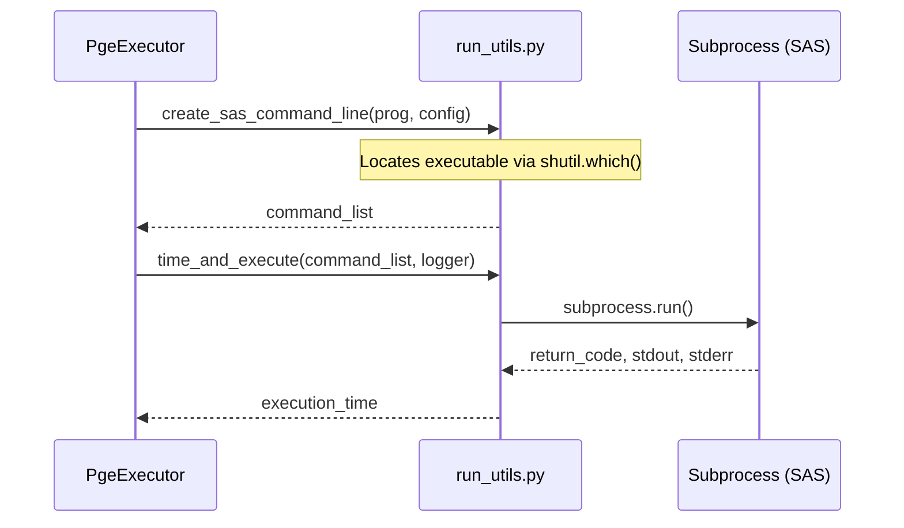

# Page: Shared Utilities

# Shared Utilities

<details>
<summary>Relevant source files</summary>

The following files were used as context for generating this wiki page:

- [.flake8](.flake8)
- [.gitignore](.gitignore)
- [.pylintrc](.pylintrc)
- [src/opera/pge/__init__.py](src/opera/pge/__init__.py)
- [src/opera/test/data/render_jinja_json_test_template.json.jinja2](src/opera/test/data/render_jinja_json_test_template.json.jinja2)
- [src/opera/test/data/render_jinja_test_template.html](src/opera/test/data/render_jinja_test_template.html)
- [src/opera/test/data/render_jinja_xml_test_template.xml.jinja2](src/opera/test/data/render_jinja_xml_test_template.xml.jinja2)
- [src/opera/test/data/render_jinja_yaml_test_template.yaml.jinja2](src/opera/test/data/render_jinja_yaml_test_template.yaml.jinja2)
- [src/opera/test/util/test_dataset_utils.py](src/opera/test/util/test_dataset_utils.py)
- [src/opera/test/util/test_h5_utils.py](src/opera/test/util/test_h5_utils.py)
- [src/opera/test/util/test_render_jinja2.py](src/opera/test/util/test_render_jinja2.py)
- [src/opera/test/util/test_tiff_utils.py](src/opera/test/util/test_tiff_utils.py)
- [src/opera/util/__init__.py](src/opera/util/__init__.py)
- [src/opera/util/dataset_utils.py](src/opera/util/dataset_utils.py)
- [src/opera/util/error_codes.py](src/opera/util/error_codes.py)
- [src/opera/util/geo_utils.py](src/opera/util/geo_utils.py)
- [src/opera/util/h5_utils.py](src/opera/util/h5_utils.py)
- [src/opera/util/logger.py](src/opera/util/logger.py)
- [src/opera/util/render_jinja2.py](src/opera/util/render_jinja2.py)
- [src/opera/util/run_utils.py](src/opera/util/run_utils.py)
- [src/opera/util/tiff_utils.py](src/opera/util/tiff_utils.py)
- [src/opera/util/time.py](src/opera/util/time.py)

</details>


The `opera.util` package provides a robust suite of cross-cutting concerns used by all Product Generation Executables (PGEs) in the OPERA SDS. This package ensures consistency in how logs are written, how metadata is extracted from complex scientific formats (HDF5/GeoTIFF), and how external processes are managed.

### Architecture Overview

The utilities are designed to be used both by the core `PgeExecutor` framework and by individual product-specific logic.

#### Relationship of Utility Modules
This diagram illustrates how the various utility components interact to support the PGE lifecycle.

```mermaid
graph TD
    subgraph "Natural Language Space"
        A["Logging & Errors"]
        B["Metadata Extraction"]
        C["ISO Generation"]
        D["Execution Control"]
    end

    subgraph "Code Entity Space"
        A --> "opera.util.logger.PgeLogger"
        A --> "opera.util.error_codes.ErrorCode"
        B --> "opera.util.h5_utils"
        B --> "opera.util.tiff_utils"
        C --> "opera.util.render_jinja2"
        D --> "opera.util.run_utils"
        
        "opera.util.logger.PgeLogger" -.-> "opera.util.usage_metrics"
        "opera.util.render_jinja2" -.-> "opera.util.h5_utils"
    end
```
**Sources:** [src/opera/util/logger.py:152-160](), [src/opera/util/render_jinja2.py:32-35](), [src/opera/util/run_utils.py:211-215]()

---

### 6.1 Logging and Error Codes
The logging system centers around the `PgeLogger` class, which provides buffered, structured logging. It captures severity levels ranging from `Info` to `Critical` and automatically associates standardized `ErrorCode` values with every message. The system also collects OS resource metrics (CPU/Memory) at the start and end of execution.

For details, see [Logging and Error Codes](#6.1).

**Key Entities:**
* `PgeLogger`: Main class for log management [src/opera/util/logger.py:152]().
* `ErrorCode`: Enum defining all system-wide error identifiers [src/opera/util/error_codes.py:34]().
* `get_os_metrics()`: Function for capturing system resource usage [src/opera/util/logger.py:27]().

**Sources:** [src/opera/util/logger.py:1-200](), [src/opera/util/error_codes.py:1-130]()

---

### 6.2 Metadata Extraction Utilities
These utilities provide specialized wrappers for reading metadata from scientific data formats. `h5_utils` handles recursive extraction from HDF5 and NetCDF files, while `tiff_utils` manages GeoTIFF tags and Cloud Optimized GeoTIFF (COG) validation. `dataset_utils` provides higher-level logic for parsing burst IDs and HLS-specific filenames.

For details, see [Metadata Extraction Utilities](#6.2).

**Key Entities:**
* `get_hdf5_group_as_dict()`: Recursively converts HDF5 groups to Python dictionaries [src/opera/util/h5_utils.py:39]().
* `get_hls_filename_fields()`: Parses standardized HLS filenames [src/opera/util/dataset_utils.py:17]().
* `translate_utm_bbox_to_lat_lon()`: Geospatial coordinate transformation [src/opera/util/geo_utils.py:46]().

**Sources:** [src/opera/util/h5_utils.py:1-75](), [src/opera/util/dataset_utils.py:1-71](), [src/opera/util/geo_utils.py:1-112]()

---

### 6.3 ISO Metadata Rendering (Jinja2)
The PGEs generate standards-compliant ISO XML metadata using Jinja2 templates. The `render_jinja2.py` module includes a specialized `LoggingUndefined` handler that ensures template rendering doesn't crash on missing data, instead logging a warning and inserting a placeholder. It also includes post-render validators for XML, JSON, and YAML formats.

For details, see [ISO Metadata Rendering (Jinja2)](#6.3).

**Key Entities:**
* `render_jinja2()`: Main entry point for template instantiation [src/opera/util/render_jinja2.py:300]().
* `LoggingUndefined`: Custom Jinja2 handler for missing variables [src/opera/util/render_jinja2.py:100]().
* `XML_VALIDATOR` / `JSON_VALIDATOR`: Post-rendering syntax checkers [src/opera/util/render_jinja2.py:230-240]().

**Sources:** [src/opera/util/render_jinja2.py:1-125](), [src/opera/test/util/test_render_jinja2.py:109-165]()

---

### 6.4 Input Validation
The `input_validation.py` module (referenced by the framework) ensures that all files provided in the `RunConfig` exist, have non-zero size, and meet product-specific constraints (e.g., matching Burst IDs between SLCs and Orbit files).

For details, see [Input Validation](#6.4).

**Sources:** [src/opera/util/error_codes.py:98-101]()

---

### 6.5 Process Execution and Catalog Metadata
The `run_utils.py` module provides helpers for executing Science Application Software (SAS) binaries via `subprocess`. It handles command-line construction, execution timing, and checksum generation. Complementary modules like `time.py` and `metfile.py` manage the temporal formats and sidecar JSON metadata files required by the SDS catalog.

For details, see [Process Execution and Catalog Metadata](#6.5).

#### SAS Execution Flow
This diagram maps the natural language "SAS execution" to the specific code functions in `run_utils.py`.


**Sources:** [src/opera/util/run_utils.py:96-154](), [src/opera/util/run_utils.py:211-230]()

**Key Entities:**
* `time_and_execute()`: Runs an external command and logs performance [src/opera/util/run_utils.py:211]().
* `get_checksum()`: Generates MD5 hashes for product integrity [src/opera/util/run_utils.py:24]().
* `get_catalog_metadata_datetime_str()`: Formats dates for the SDS Catalog [src/opera/util/time.py:76]().

**Sources:** [src/opera/util/run_utils.py:1-50](), [src/opera/util/time.py:1-95]()
