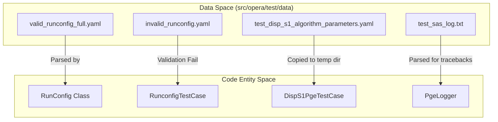
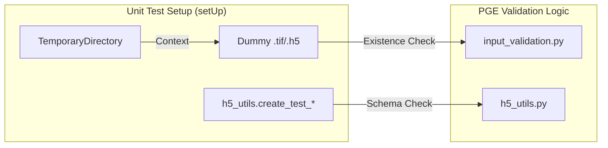

# Page: Test Data and Configuration Files

# Test Data and Configuration Files

Relevant source files

The following files were used as context for generating this wiki page:

- [src/opera/pge/base/runconfig.py](src/opera/pge/base/runconfig.py)
- [src/opera/pge/base/schema/base_pge_schema.yaml](src/opera/pge/base/schema/base_pge_schema.yaml)
- [src/opera/test/data/invalid_runconfig.yaml](src/opera/test/data/invalid_runconfig.yaml)
- [src/opera/test/data/test_base_pge_config.yaml](src/opera/test/data/test_base_pge_config.yaml)
- [src/opera/test/data/test_base_pge_input_files_config.yaml](src/opera/test/data/test_base_pge_input_files_config.yaml)
- [src/opera/test/data/test_disp_s1_algorithm_parameters.yaml](src/opera/test/data/test_disp_s1_algorithm_parameters.yaml)
- [src/opera/test/data/test_disp_s1_config.yaml](src/opera/test/data/test_disp_s1_config.yaml)
- [src/opera/test/data/test_dswx_hls_config.yaml](src/opera/test/data/test_dswx_hls_config.yaml)
- [src/opera/test/data/test_sas_error_config.yaml](src/opera/test/data/test_sas_error_config.yaml)
- [src/opera/test/data/test_sas_log.txt](src/opera/test/data/test_sas_log.txt)
- [src/opera/test/data/test_sas_qa_bad_extension_config.yaml](src/opera/test/data/test_sas_qa_bad_extension_config.yaml)
- [src/opera/test/data/test_sas_qa_config.yaml](src/opera/test/data/test_sas_qa_config.yaml)
- [src/opera/test/data/valid_runconfig_extra_fields.yaml](src/opera/test/data/valid_runconfig_extra_fields.yaml)
- [src/opera/test/data/valid_runconfig_full.yaml](src/opera/test/data/valid_runconfig_full.yaml)
- [src/opera/test/data/valid_runconfig_no_sas.yaml](src/opera/test/data/valid_runconfig_no_sas.yaml)
- [src/opera/test/pge/base/test_runconfig.py](src/opera/test/pge/base/test_runconfig.py)
- [src/opera/test/pge/disp_s1/test_disp_s1_pge.py](src/opera/test/pge/disp_s1/test_disp_s1_pge.py)
- [src/opera/test/util/test_logger.py](src/opera/test/util/test_logger.py)
- [src/opera/test/util/test_metfile.py](src/opera/test/util/test_metfile.py)
- [src/opera/test/util/test_time.py](src/opera/test/util/test_time.py)
- [src/opera/test/util/test_usage_metrics.py](src/opera/test/util/test_usage_metrics.py)

The OPERA SDS PGE repository maintains a comprehensive suite of test data and configuration files located in `src/opera/test/data`. This directory serves as the primary source of truth for unit tests, providing valid and invalid RunConfig variants, algorithm parameter files, sample metadata products, and log fixtures used to verify the PGE framework's robustness and schema validation logic.

## Directory Structure and Scope

The test data is organized to support both the base PGE framework and product-specific logic. It includes:
*   **RunConfig YAMLs**: Templates for every PGE type (RTC, CSLC, DISP, DSWx) used to simulate execution environments [src/opera/test/data/test_disp_s1_config.yaml:1-103]().
*   **Schema Validation Fixtures**: Pairs of "valid" and "invalid" YAML files designed to trigger or pass Yamale validation [src/opera/test/pge/base/test_runconfig.py:35-38]().
*   **Algorithm Parameters**: Detailed configuration files for SAS-specific logic, such as phase linking or unwrapping options [src/opera/test/data/test_disp_s1_algorithm_parameters.yaml:1-189]().
*   **Log Fixtures**: Sample SAS output logs used to test traceback extraction and error code parsing [src/opera/test/data/test_sas_log.txt]().

### Code Entity Association: Test Setup

The following diagram illustrates how the unit test classes utilize these data files to initialize a controlled execution environment.

**Test Data Flow to Code Entities**

Sources: [src/opera/pge/base/runconfig.py:30-59](), [src/opera/test/pge/base/test_runconfig.py:66-87](), [src/opera/test/pge/disp_s1/test_disp_s1_pge.py:98-100]()

## RunConfig Variants for Validation

The PGE framework uses a two-tier validation system. The `RunConfig` class first validates against the `BASE_PGE_SCHEMA` and then includes the SAS-specific schema if present [src/opera/pge/base/runconfig.py:117-171]().

### Validation Test Cases
| File Name | Purpose | Key Verification Point |
| :--- | :--- | :--- |
| `valid_runconfig_full.yaml` | Standard operational config | Includes both `PGE` and `SAS` groups [src/opera/test/data/valid_runconfig_full.yaml:6-45](). |
| `valid_runconfig_no_sas.yaml` | Minimal config | Verifies `SAS` group is optional (`required=False`) [src/opera/pge/base/schema/base_pge_schema.yaml:45](). |
| `invalid_runconfig.yaml` | Negative testing | Tests missing required lists or invalid date formats [src/opera/test/data/invalid_runconfig.yaml:11-30](). |
| `valid_runconfig_extra_fields.yaml` | Strictness testing | Used to test `strict_mode` in Yamale validation [src/opera/test/pge/base/test_runconfig.py:125-141](). |

Sources: [src/opera/pge/base/runconfig.py:117-141](), [src/opera/test/pge/base/test_runconfig.py:35-38]()

## Algorithm Parameters and SAS Configuration

For products like DISP-S1, the test data includes complex algorithm parameter files that define how the SAS should behave. These are validated using `validate_algorithm_parameters_config` in `input_validation.py`.

### DISP-S1 Algorithm Parameters Example
The file `test_disp_s1_algorithm_parameters.yaml` provides values for:
*   **Phase Linking**: `ministack_size`, `half_window`, and `shp_method` [src/opera/test/data/test_disp_s1_algorithm_parameters.yaml:5-35]().
*   **Unwrapping Options**: `unwrap_method` (e.g., 'phass'), `n_parallel_jobs`, and `snaphu_options` [src/opera/test/data/test_disp_s1_algorithm_parameters.yaml:69-104]().

In unit tests, these files are often loaded via `_parse_algorithm_parameters_run_config_file` and compared against expected values to ensure the parser correctly handles nested dictionaries and null types [src/opera/pge/base/runconfig.py:89-115](), [src/opera/test/pge/disp_s1/test_disp_s1_pge.py:130-160]().

Sources: [src/opera/test/data/test_disp_s1_algorithm_parameters.yaml:1-189](), [src/opera/pge/base/runconfig.py:89-115]()

## Mock Data Generation in Tests

Since the repository does not store large binary files (GeoTIFF/HDF5), the unit tests dynamically generate "dummy" files that satisfy PGE input/output requirements.

### File Simulation Pattern
Tests like `DispS1PgeTestCase` create non-empty dummy files using shell commands or utility functions:
1.  **Dummy Inputs**: `echo "non-empty file" > file.h5` to satisfy `check_input` [src/opera/test/pge/disp_s1/test_disp_s1_pge.py:115-119]().
2.  **Metadata Products**: `create_test_cslc_metadata_product` creates HDF5 files with the internal structure required for metadata extraction tests [src/opera/test/pge/disp_s1/test_disp_s1_pge.py:120-121]().
3.  **SAS Execution Simulation**: The `PrimaryExecutable` in test RunConfigs often points to `/bin/echo` or `mkdir` to simulate a successful SAS run without needing the actual science binary [src/opera/test/data/test_disp_s1_config.yaml:31-41]().

**Dynamic Data Generation Logic**

Sources: [src/opera/test/pge/disp_s1/test_disp_s1_pge.py:87-124](), [src/opera/util/h5_utils.py:30-32]()

## Utility Test Data

The `src/opera/test/util` directory contains data specific to testing the framework's helper modules:
*   **MetFile JSONs**: Used in `test_metfile.py` to verify catalog metadata validation against JSON schemas [src/opera/test/util/test_metfile.py:114-145]().
*   **Logger Metrics**: `test_usage_metrics.py` validates that OS-level resource tracking (CPU, RSS, VMM) returns correctly formatted values [src/opera/test/util/test_usage_metrics.py:70-112]().
*   **Time Formats**: `test_time.py` ensures ISO 8601 strings are correctly converted for catalog and filename use.

Sources: [src/opera/test/util/test_metfile.py:114-145](), [src/opera/test/util/test_usage_metrics.py:70-112]()
