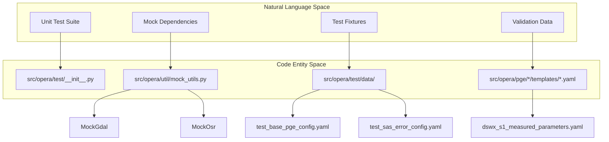
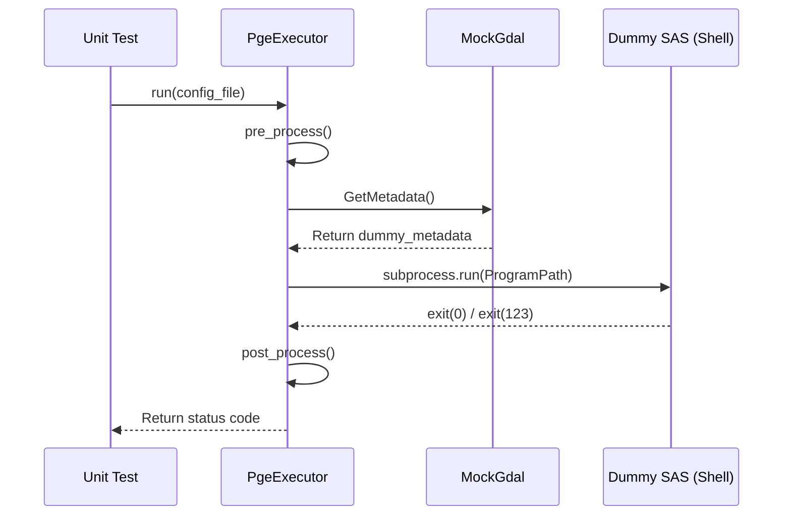

# Page: Testing Infrastructure

# Testing Infrastructure

Relevant source files

The following files were used as context for generating this wiki page:

- [src/opera/pge/dswx_s1/templates/dswx_s1_measured_parameters.yaml](src/opera/pge/dswx_s1/templates/dswx_s1_measured_parameters.yaml)
- [src/opera/test/__init__.py](src/opera/test/__init__.py)
- [src/opera/test/data/test_base_pge_config.yaml](src/opera/test/data/test_base_pge_config.yaml)
- [src/opera/test/data/test_base_pge_input_files_config.yaml](src/opera/test/data/test_base_pge_input_files_config.yaml)
- [src/opera/test/data/test_sas_error_config.yaml](src/opera/test/data/test_sas_error_config.yaml)
- [src/opera/test/data/test_sas_qa_bad_extension_config.yaml](src/opera/test/data/test_sas_qa_bad_extension_config.yaml)
- [src/opera/test/data/test_sas_qa_config.yaml](src/opera/test/data/test_sas_qa_config.yaml)
- [src/opera/util/mock_utils.py](src/opera/util/mock_utils.py)

The OPERA SDS PGE repository includes a comprehensive unit testing suite located under `src/opera/test`. This infrastructure is designed to validate the PGE execution framework, individual product executors, and shared utility modules without requiring the heavy scientific software (SAS) binaries or large-scale geospatial dependencies (like GDAL) to be present in the local development environment.

### Test Suite Structure

The testing infrastructure is organized to mirror the source code structure, ensuring that every functional component has a corresponding test module.

*   **Per-PGE Modules**: Specific test files for each PGE (e.g., `test_rtc_s1.py`, `test_dswx_hls.py`) that verify the `PreProcessorMixin` and `PostProcessorMixin` logic.
*   **Utility Tests**: Tests for the `opera.util` package, covering logging, metadata extraction, and RunConfig parsing.
*   **Shared Test Data**: A centralized repository of fixtures and configuration files used across multiple test modules.
*   **Mocking Layer**: Specialized utilities to simulate external dependencies and filesystem states.

### Natural Language to Code Entity Mapping

The following diagram maps high-level testing concepts to their specific implementations within the `src/opera/test` and `src/opera/util` directories.

**Testing Entity Map**

Sources: [src/opera/test/__init__.py:1-10](), [src/opera/util/mock_utils.py:1-28](), [src/opera/test/data/test_base_pge_config.yaml:1-10]()

### Unit Test Patterns and Mock Utilities

Because the PGEs are designed to run in highly specialized Docker environments containing GDAL and OGR, the testing infrastructure provides `MockGdal` and `MockOsr` classes. These allow developers to run tests on machines where these libraries are not installed by simulating the metadata return values and dataset structures expected by the PGEs.

Key patterns include:
*   **Lifecycle Simulation**: Testing the `run()` method by providing dummy executables (like `echo` or `bash`) in the RunConfig to simulate SAS success or failure.
*   **Filesystem Isolation**: Using temporary directories and `pathlib` utilities to ensure tests do not leave artifacts.
*   **Error Injection**: Using specific RunConfigs like `test_sas_error_config.yaml` to verify that the PGE correctly captures and logs SAS tracebacks.

For details, see [Unit Test Patterns and Mock Utilities](#8.1).

**Mocking and Execution Flow**

Sources: [src/opera/util/mock_utils.py:31-71](), [src/opera/test/data/test_sas_error_config.yaml:23-60](), [src/opera/test/data/test_base_pge_config.yaml:23-31]()

### Test Data and Configuration Files

The `src/opera/test/data` directory contains a variety of YAML and mock data files used to exercise different edge cases in the PGE framework.

*   **RunConfig Variants**: Includes valid configurations for every PGE type, as well as invalid variants (e.g., `test_sas_qa_bad_extension_config.yaml`) to test schema validation and error handling.
*   **Metadata Templates**: Uses files like `dswx_s1_measured_parameters.yaml` to validate that the ISO metadata generation logic correctly maps SAS output to the final product attributes.
*   **Log Fixtures**: Simulated SAS logs containing specific error patterns and tracebacks used to test the `get_traceback_from_log` utility.

For details, see [Test Data and Configuration Files](#8.2).

### Summary Table: Key Testing Components

| Component | Location | Purpose |
| :--- | :--- | :--- |
| **Mock GDAL** | `MockGdal` in `mock_utils.py` | Simulates `osgeo.gdal` for metadata extraction tests [src/opera/util/mock_utils.py:19-28](). |
| **Error Config** | `test_sas_error_config.yaml` | Simulates a SAS failure with a Python traceback for logging tests [src/opera/test/data/test_sas_error_config.yaml:29-57](). |
| **Path Normalization** | `normalize_path()` in `test/__init__.py` | Ensures test resources are handled consistently across OS platforms [src/opera/test/__init__.py:22-31](). |
| **Measured Params** | `*_measured_parameters.yaml` | Defines the expected schema for product metadata attributes [src/opera/pge/dswx_s1/templates/dswx_s1_measured_parameters.yaml:1-11](). |

Sources: [src/opera/util/mock_utils.py:19-28](), [src/opera/test/data/test_sas_error_config.yaml:29-57](), [src/opera/test/__init__.py:22-31](), [src/opera/pge/dswx_s1/templates/dswx_s1_measured_parameters.yaml:1-11]()
