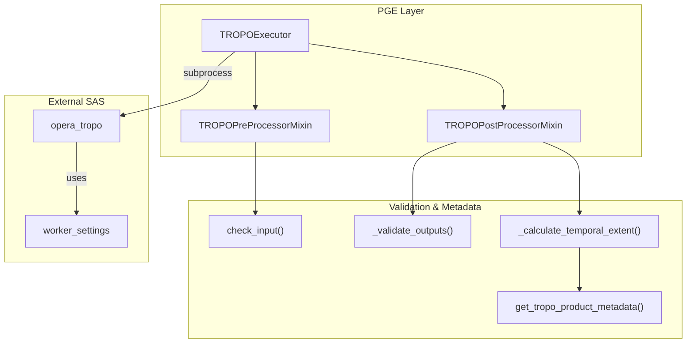
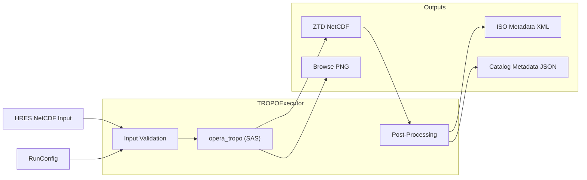

# Page: TROPO PGE

# TROPO PGE

Relevant source files

The following files were used as context for generating this wiki page:

- [.ci/docker/Dockerfile_tropo](.ci/docker/Dockerfile_tropo)
- [.ci/scripts/tropo/build_tropo.sh](.ci/scripts/tropo/build_tropo.sh)
- [.ci/scripts/tropo/opera_pge_tropo_1.0_final_runconfig.yaml](.ci/scripts/tropo/opera_pge_tropo_1.0_final_runconfig.yaml)
- [.ci/scripts/tropo/test_int_tropo.sh](.ci/scripts/tropo/test_int_tropo.sh)
- [.ci/scripts/tropo/test_tropo.sh](.ci/scripts/tropo/test_tropo.sh)
- [.secrets.baseline](.secrets.baseline)
- [examples/tropo_sample_runconfig-v3.0.0-rc.1.0.yaml](examples/tropo_sample_runconfig-v3.0.0-rc.1.0.yaml)
- [src/opera/pge/tropo/schema/tropo_sas_schema.yaml](src/opera/pge/tropo/schema/tropo_sas_schema.yaml)
- [src/opera/pge/tropo/templates/OPERA_ISO_metadata_L4_TROPO_template.xml.jinja2](src/opera/pge/tropo/templates/OPERA_ISO_metadata_L4_TROPO_template.xml.jinja2)
- [src/opera/pge/tropo/templates/tropo_measured_parameters.yaml](src/opera/pge/tropo/templates/tropo_measured_parameters.yaml)
- [src/opera/pge/tropo/tropo_pge.py](src/opera/pge/tropo/tropo_pge.py)
- [src/opera/test/data/test_tropo_config.yaml](src/opera/test/data/test_tropo_config.yaml)
- [src/opera/test/pge/tropo/test_tropo_pge.py](src/opera/test/pge/tropo/test_tropo_pge.py)

The TROPO PGE is responsible for executing the Tropospheric Zenith-integrated Delay (ZTD) generation software. It processes Numerical Weather Model (NWM) data, specifically High Resolution 15-day Forecast (HRES) NetCDF files from ECMWF, to produce Level 4 (L4) tropospheric delay products used for SAR atmospheric correction [src/opera/pge/tropo/tropo_pge.py:7-8](), [src/opera/pge/tropo/templates/tropo_measured_parameters.yaml:57-61]().

## TROPOExecutor Implementation

The `TROPOExecutor` class coordinates the lifecycle of the TROPO product generation by inheriting from `PgeExecutor` and utilizing specific mixins for pre- and post-processing [src/opera/pge/tropo/tropo_pge.py:245-249]().

### Data Flow and Execution Logic

The execution flow follows the standard PGE lifecycle:
1.  **Pre-processing**: Validates input HRES NetCDF files for existence and non-zero size [src/opera/pge/tropo/tropo_pge.py:52-59]().
2.  **SAS Execution**: Invokes the `opera_tropo` executable (typically the RAiDER-based SAS) using Dask-based parallelization parameters defined in the RunConfig [examples/tropo_sample_runconfig-v3.0.0-rc.1.0.yaml:56-61](), [src/opera/pge/tropo/schema/tropo_sas_schema.yaml:29-31]().
3.  **Post-processing**: Validates output NetCDF and PNG browse products, calculates temporal extents, and renders L4 ISO metadata [src/opera/pge/tropo/tropo_pge.py:62-70]().

### Code Entity Relationship Diagram

The following diagram maps the logical components of the TROPO PGE to their corresponding code entities.

Title: TROPO PGE Code Entity Map

Sources: [src/opera/pge/tropo/tropo_pge.py:25-249](), [src/opera/pge/tropo/schema/tropo_sas_schema.yaml:29-48]()

## Input Validation

The `TROPOPreProcessorMixin` ensures that all input files provided in the `InputFilePaths` group of the RunConfig meet the following criteria:
*   Must have a `.nc` extension [src/opera/pge/tropo/tropo_pge.py:57]().
*   Must exist and have a size greater than zero [src/opera/pge/tropo/tropo_pge.py:58]().

Sources: [src/opera/pge/tropo/tropo_pge.py:25-60]()

## Output Handling and Naming Conventions

The `TROPOPostProcessorMixin` enforces strict naming conventions for the generated products.

### Expected Outputs
The PGE expects exactly one NetCDF (`.nc`) product and one browse image (`.png`) [src/opera/pge/tropo/tropo_pge.py:75]().

### Filename Pattern
Output filenames must match the following regex pattern:
`^OPERA_L4_TROPO-ZENITH_\d{8}T\d{6}Z_\d{8}T\d{6}Z_HRES_v\d+\.\d+$` [src/opera/pge/tropo/tropo_pge.py:84-86]().

| Component | Description | Example |
| :--- | :--- | :--- |
| **Product ID** | Fixed prefix | `OPERA_L4_TROPO-ZENITH` |
| **Start Time** | YYYYMMDDTHHMMSSZ | `20250101T010101Z` |
| **End Time** | YYYYMMDDTHHMMSSZ | `20250101T010101Z` |
| **Model** | Input source | `HRES` |
| **Version** | SAS Version | `v1.0` |

### Temporal Extent Calculation
Unlike other PGEs that might extract start/end times directly from metadata, the TROPO PGE calculates the end time by adding a `temporal_resolution` (e.g., "6h") to the `reference_time` found in the product metadata [src/opera/pge/tropo/tropo_pge.py:160-205]().

Sources: [src/opera/pge/tropo/tropo_pge.py:77-126](), [src/opera/pge/tropo/tropo_pge.py:207-242]()

## SAS Configuration and Parallelism

The TROPO SAS (`opera_tropo`) utilizes Dask for parallel execution. The RunConfig provides specific settings for the Dask distributed cluster.

| RunConfig Parameter | Code Entity (SAS Schema) | Purpose |
| :--- | :--- | :--- |
| `n_workers` | `worker_settings/n_workers` | Number of parallel processes [src/opera/pge/tropo/schema/tropo_sas_schema.yaml:31]() |
| `threads_per_worker` | `worker_settings/threads_per_worker` | Sets `OMP_NUM_THREADS` [src/opera/pge/tropo/schema/tropo_sas_schema.yaml:33-35]() |
| `max_memory` | `worker_settings/max_memory` | Memory limit per worker (e.g., "8GB") [src/opera/pge/tropo/schema/tropo_sas_schema.yaml:39]() |
| `block_shape` | `worker_settings/block_shape` | Spatial tiling for data loading [src/opera/pge/tropo/schema/tropo_sas_schema.yaml:47]() |

Sources: [src/opera/pge/tropo/schema/tropo_sas_schema.yaml:29-48](), [src/opera/test/data/test_tropo_config.yaml:59-77]()

## Metadata and ISO Rendering

The PGE renders ISO 19115 metadata using Jinja2 templates.

1.  **Metadata Extraction**: The `get_tropo_product_metadata` utility extracts global attributes from the output NetCDF [src/opera/pge/tropo/tropo_pge.py:19]().
2.  **Measured Parameters**: The file `tropo_measured_parameters.yaml` provides descriptions for the scientific datasets within the NetCDF (e.g., `spatial_resolution`, `temporal_resolution`) [src/opera/pge/tropo/templates/tropo_measured_parameters.yaml:31-40]().
3.  **Rendering**: `render_jinja2` combines the extracted metadata with the `OPERA_ISO_metadata_L4_TROPO_template.xml.jinja2` template [src/opera/pge/tropo/tropo_pge.py:21](), [src/opera/test/data/test_tropo_config.yaml:29]().

### System Data Flow Diagram

Title: TROPO PGE Data Flow

Sources: [src/opera/pge/tropo/tropo_pge.py:38-70](), [src/opera/test/data/test_tropo_config.yaml:1-36]()
