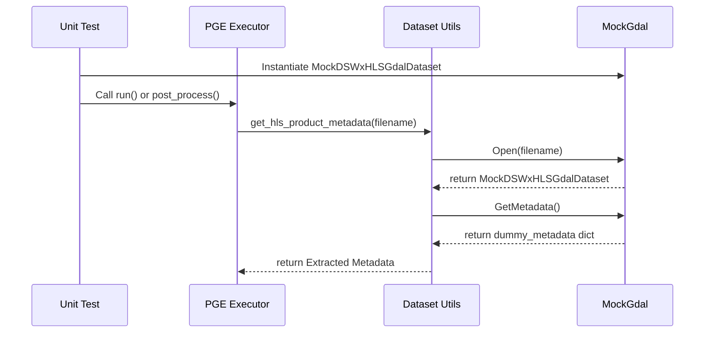
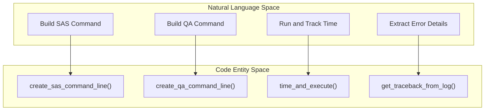

# Page: Unit Test Patterns and Mock Utilities

# Unit Test Patterns and Mock Utilities

Relevant source files

The following files were used as context for generating this wiki page:

- [src/opera/pge/dswx_s1/templates/dswx_s1_measured_parameters.yaml](src/opera/pge/dswx_s1/templates/dswx_s1_measured_parameters.yaml)
- [src/opera/test/__init__.py](src/opera/test/__init__.py)
- [src/opera/test/data/test_sas_log_with_traceback.txt](src/opera/test/data/test_sas_log_with_traceback.txt)
- [src/opera/test/data/test_sas_log_with_traceback_multiline_message.txt](src/opera/test/data/test_sas_log_with_traceback_multiline_message.txt)
- [src/opera/test/data/test_sas_log_with_traceback_no_message.txt](src/opera/test/data/test_sas_log_with_traceback_no_message.txt)
- [src/opera/test/util/test_run_utils.py](src/opera/test/util/test_run_utils.py)
- [src/opera/util/mock_utils.py](src/opera/util/mock_utils.py)

The OPERA SDS PGE unit test suite is designed to validate the execution framework, metadata extraction logic, and product validation rules without requiring heavy geospatial dependencies (like GDAL) or actual Science Application Software (SAS) binaries in the development environment. This is achieved through a combination of mock classes, shell-based dummy executables, and temporary directory fixtures.

## Mock Utilities (`mock_utils.py`)

To support development and testing in environments where the Geospatial Data Abstraction Library (GDAL) or OSR (Spatial Reference) are not installed, the repository provides `MockGdal` and `MockOsr` classes [src/opera/util/mock_utils.py:19-21](). These classes simulate the behavior of `osgeo.gdal` and `osgeo.osr` enough to satisfy PGE metadata extraction and validation logic.

### MockGdal Implementation
`MockGdal` provides nested classes that mimic GDAL `Dataset` objects. These datasets return hardcoded metadata dictionaries tailored to specific PGE requirements.

| Mock Class | Target PGE | Simulated Metadata Fields |
| :--- | :--- | :--- |
| `MockDSWxHLSGdalDataset` | DSWx-HLS | `ACCODE`, `HLS_DATASET`, `SPACECRAFT_NAME`, `SENSING_TIME` [src/opera/util/mock_utils.py:31-71]() |
| `MockRtcS1GdalDataset` | RTC-S1 | `BOUNDING_BOX`, `BURST_ID`, `BOUNDING_BOX_EPSG_CODE` [src/opera/util/mock_utils.py:81-93]() |
| `MockDSWxS1GdalDataset` | DSWx-S1 | `MGRS_COLLECTION_ACTUAL_NUMBER_OF_BURSTS`, `POLARIZATION`, `INPUT_DEM_SOURCE` [src/opera/util/mock_utils.py:103-148]() |

### Data Flow: Mock Metadata Extraction
The following diagram illustrates how the PGE framework interacts with these mock utilities during a test run to simulate reading metadata from a GeoTIFF or HDF5 file.

**Metadata Mocking Sequence**

Sources: [src/opera/util/mock_utils.py:19-148](), [src/opera/test/util/test_run_utils.py:27-48]()

## Test Fixture Patterns

Unit tests in the OPERA SDS PGE repository follow a consistent pattern for environment setup and teardown, primarily using the `unittest` framework.

### Temporary Directory Management
To ensure test isolation and prevent disk clutter, tests utilize `tempfile.TemporaryDirectory`.
1. **Setup**: The `setUp` method creates a temporary directory and changes the current working directory (`os.chdir`) to it [src/opera/test/util/test_run_utils.py:58-63]().
2. **Teardown**: The `tearDown` method reverts to the original directory and cleans up the temporary files [src/opera/test/util/test_run_utils.py:65-71]().

### Resource Path Normalization
The `opera.test` package includes a `path` context manager to handle resource location across different installation environments. It uses `importlib.resources` to provide a file path to test data (like RunConfigs or sample logs) [src/opera/test/__init__.py:34-47]().

## Simulating the SAS Lifecycle

The PGE framework's `run()` method executes external binaries. In a unit test environment, these binaries are simulated using standard shell commands (like `echo` or `bash`) to verify that the PGE correctly constructs command lines and handles return codes.

### SAS Command Construction
The utility `create_sas_command_line` is tested by passing it `echo` as the executable. The test verifies that:
* The executable is resolved via `shutil.which` [src/opera/test/util/test_run_utils.py:87]().
* The RunConfig path is appended as the final argument [src/opera/test/util/test_run_utils.py:90]().
* Additional options are correctly interleaved [src/opera/test/util/test_run_utils.py:92-94]().

### Execution and Error Handling
Tests for `time_and_execute` verify the PGE's ability to capture output and detect failures:
* **Success**: Executing `echo` returns 0, and the output is verified in the log file [src/opera/test/util/test_run_utils.py:172-174]().
* **Failure**: Executing `bash -c "exit 1"` is used to trigger a `RuntimeError` within the PGE, simulating a SAS crash [src/opera/test/util/test_run_utils.py:176-182]().

### Code Entity Space: Execution Utilities
The following diagram maps the logical execution steps to the specific functions in `run_utils.py`.

**Execution Utility Mapping**

Sources: [src/opera/util/run_utils.py:21-24](), [src/opera/test/util/test_run_utils.py:73-182]()

## Log and Traceback Parsing

A critical part of the PGE lifecycle is capturing SAS errors for the Catalog system. The test suite includes fixtures for various SAS log scenarios.

### Traceback Fixtures
The repository contains sample log files used to test `get_traceback_from_log`:
* `test_sas_log_with_traceback.txt`: A standard Python traceback [src/opera/test/data/test_sas_log_with_traceback.txt:144-182]().
* `test_sas_log_with_traceback_multiline_message.txt`: A traceback ending in a complex Pydantic validation error [src/opera/test/data/test_sas_log_with_traceback_multiline_message.txt:161-169]().
* `test_sas_log_with_traceback_no_message.txt`: An `AssertionError` without a descriptive message [src/opera/test/data/test_sas_log_with_traceback_no_message.txt:172]().

These fixtures allow the PGE to verify that it can identify the start of a traceback (typically `Traceback (most recent call last):`) and extract the relevant lines while ignoring surrounding progress bars or debug prints [src/opera/test/data/test_sas_log_with_traceback.txt:138-143]().

Sources: [src/opera/test/data/test_sas_log_with_traceback.txt:1-182](), [src/opera/test/data/test_sas_log_with_traceback_multiline_message.txt:1-174](), [src/opera/test/data/test_sas_log_with_traceback_no_message.txt:1-174]()
