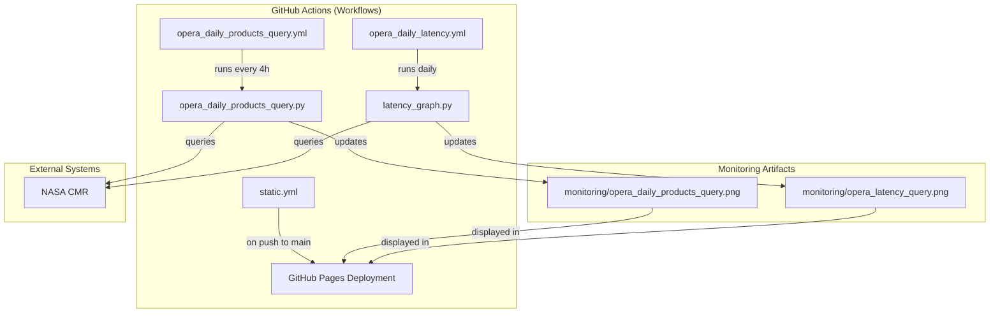
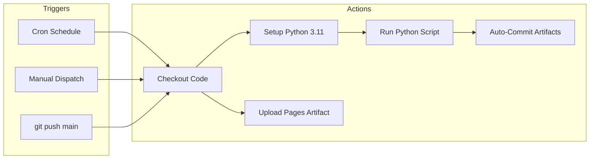

# Page: CI/CD & GitHub Automation

# CI/CD & GitHub Automation

Relevant source files

The following files were used as context for generating this wiki page:

- [.github/PULL_REQUEST_TEMPLATE.md](.github/PULL_REQUEST_TEMPLATE.md)
- [.github/workflows/opera_daily_latency.yml](.github/workflows/opera_daily_latency.yml)
- [.github/workflows/opera_daily_products_query.yml](.github/workflows/opera_daily_products_query.yml)
- [.github/workflows/static.yml](.github/workflows/static.yml)
- [.gitignore](.gitignore)
- [monitoring/opera_daily_products_query.png](monitoring/opera_daily_products_query.png)
- [monitoring/opera_daily_products_query.py](monitoring/opera_daily_products_query.py)

The OPERA SDS repository utilizes GitHub Actions to automate operational monitoring, maintain a public web presence via GitHub Pages, and standardize contributions through templates. This automation ensures that data product counts and latency metrics are updated without manual intervention and that the system's status is always accessible to stakeholders.

### Automation Architecture Overview

The automation stack is divided into three primary categories: scheduled monitoring, site deployment, and contribution management. The monitoring workflows interact with the NASA Common Metadata Repository (CMR) to generate visual reports, which are then committed back to the repository and served via GitHub Pages.

#### System Automation Flow
"Natural Language Space" to "Code Entity Space" Mapping:

**Sources:** [.github/workflows/opera_daily_products_query.yml:2-40](), [.github/workflows/opera_daily_latency.yml:2-40](), [.github/workflows/static.yml:1-44]()

---

### Scheduled Monitoring Workflows

The SDS maintains two primary scheduled workflows that handle the "heartbeat" of operational visibility. These workflows are configured to run on a cron schedule, set up a Python 3.11 environment, install dependencies from `requirements.txt`, and execute monitoring scripts.

*   **Daily Products Query:** Runs every 4 hours `[0 */4 * * *]` to update the rolling 30-day product count visualization `[.github/workflows/opera_daily_products_query.yml:8-30]()`.
*   **Latency Query:** Runs once daily at 17:00 UTC `[0 17 */1 * *]` to generate the latency histogram for OPERA products `[.github/workflows/opera_daily_latency.yml:8-30]()`.

Both workflows utilize the `stefanzweifel/git-auto-commit-action` to push the resulting `.png` files back to the `monitoring/` directory using the `opera_sds` bot identity `[.github/workflows/opera_daily_products_query.yml:34-39]()`.

For details, see [Scheduled Monitoring Workflows](#6.1).

**Sources:** [.github/workflows/opera_daily_products_query.yml:1-42](), [.github/workflows/opera_daily_latency.yml:1-42]()

---

### GitHub Pages Deployment

The `static.yml` workflow manages the deployment of the repository's root and subdirectories to a public URL. This workflow is triggered on every push to the `main` branch `[.github/workflows/static.yml:4-7]()`.

Unlike standard Jekyll-based GitHub Pages, this project deploys the entire repository as a static site `[.github/workflows/static.yml:39-40]()`. This allows the `index.html` file and various generated status reports (such as the DISP-S1 frame maps) to be viewed in a browser. The workflow handles permissions for `id-token` and `pages` to ensure secure delivery to the `github-pages` environment `[.github/workflows/static.yml:13-29]()`.

For details, see [GitHub Pages Deployment](#6.2).

**Sources:** [.github/workflows/static.yml:1-44]()

---

### Contribution & Issue Templates

To maintain consistency in the SDS pipeline, the repository enforces specific structures for code changes and processing requests.

*   **Pull Request Template:** Located at `.github/PULL_REQUEST_TEMPLATE.md`, it requires contributors to categorize changes using `[ADD]`, `[CHANGE]`, or `[FIX]` tags and provide testing proof `[.github/PULL_REQUEST_TEMPLATE.md:1-14]()`.
*   **Processing Request Form:** (Detailed in Section 3.1) A YAML-based issue template that standardizes how science teams request new data processing runs.

#### Workflow Execution Logic

**Sources:** [.github/workflows/opera_daily_products_query.yml:4-15](), [.github/workflows/static.yml:4-37]()

**Sources:**
*   [.github/workflows/opera_daily_products_query.yml]()
*   [.github/workflows/opera_daily_latency.yml]()
*   [.github/workflows/static.yml]()
*   [.github/PULL_REQUEST_TEMPLATE.md]()
*   [monitoring/opera_daily_products_query.py]()
