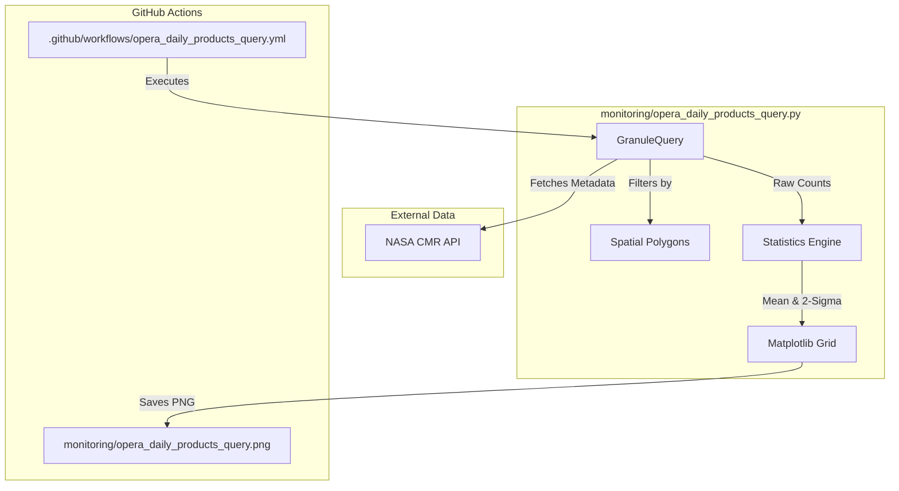
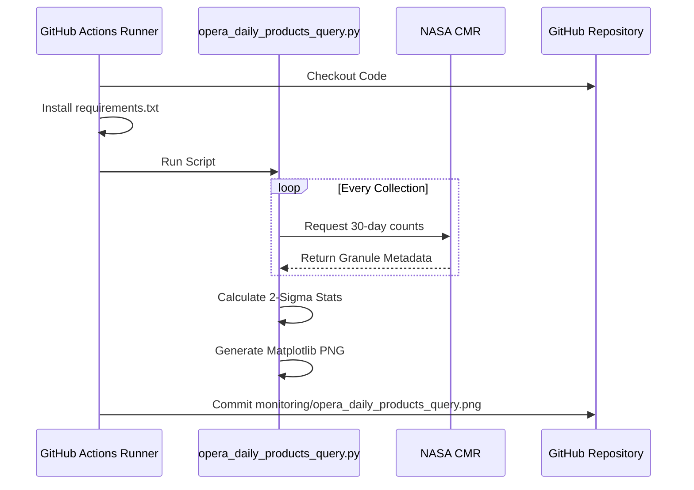

# Page: Daily Product Count Monitor

# Daily Product Count Monitor

Relevant source files

The following files were used as context for generating this wiki page:

- [.github/workflows/opera_daily_products_query.yml](.github/workflows/opera_daily_products_query.yml)
- [.gitignore](.gitignore)
- [monitoring/opera_daily_products_query.png](monitoring/opera_daily_products_query.png)
- [monitoring/opera_daily_products_query.py](monitoring/opera_daily_products_query.py)

The **Daily Product Count Monitor** is an automated pipeline designed to track the daily production volume of OPERA Science Data System (SDS) products. It performs rolling 30-day queries against the NASA Common Metadata Repository (CMR), applies spatial filters for North American coverage, calculates anomaly detection statistics, and generates a visual grid of production trends.

## System Overview

The monitor is implemented primarily in `monitoring/opera_daily_products_query.py`. It operates on a scheduled basis via GitHub Actions, ensuring that the SDS team has a near-real-time view of production health and consistency.

### Data Flow and Code Entity Map

The following diagram illustrates the transformation of raw CMR metadata into the final visualization.

**Product Count Data Flow**

Sources: `monitoring/opera_daily_products_query.py:11-13`(), `monitoring/opera_daily_products_query.py:152-174`(), `.github/workflows/opera_daily_products_query.yml:27-30`()

## CMR Query Pipeline

The script queries the CMR for granules belonging to specific OPERA collections. It iterates through a 30-day window, calculating the start and end times for each day to retrieve daily totals.

### Collection Configuration
The system distinguishes between global collections and those specifically tracked for North American (NA) coverage:
*   **COLLECTIONS**: Standard product shortnames (e.g., `OPERA_L3_DSWX-HLS_V1`).
*   **NA_COLLECTIONS**: Products where spatial subsetting is required to monitor regional production commitments.

### Spatial Filtering
To monitor North American production, the script defines a complex coordinate polygon (`NORTH_AMERICA_POLYGON`) and a `CENTRAL_AMERICA_POLYGON` [monitoring/opera_daily_products_query.py:156-174](). When the `north_america_flag` is set, the `GranuleQuery` object is configured with these spatial constraints to filter the CMR results [monitoring/opera_daily_products_query.py:152-180]().

Sources: `monitoring/opera_daily_products_query.py:152-174`(), `monitoring/opera_daily_products_query.py:11-12`()

## Statistics and Anomaly Detection

The monitor includes a statistics engine to identify production dips or spikes.

### Mean and 2-Sigma Calculation
The function `get_statistics` processes the raw daily counts to establish a baseline:
1.  **Data Truncation**: It removes trailing zeros and the most recent non-zero entry (which usually represents a partial day) to avoid skewing the mean [monitoring/opera_daily_products_query.py:114-115]().
2.  **Standard Deviation**: It calculates the population standard deviation and mean of the remaining sample [monitoring/opera_daily_products_query.py:121-122]().
3.  **Thresholding**: It computes a "2-sigma" boundary (Mean ± 2 * StdDev) [monitoring/opera_daily_products_query.py:123-125]().

### Anomaly Logging
The `check_data_points` function iterates through the sample and compares each day's count against the lower sigma boundary. If a daily count falls below `mean - 2σ`, the script logs a warning indicating that production is lower than expected [monitoring/opera_daily_products_query.py:143-146]().

Sources: `monitoring/opera_daily_products_query.py:97-125`(), `monitoring/opera_daily_products_query.py:128-150`()

## Visualization Engine

The output is a multi-panel Matplotlib figure saved as `monitoring/opera_daily_products_query.png`.

| Feature | Implementation Detail |
| :--- | :--- |
| **Grid Layout** | A 4x2 or similar grid depending on the number of collections tracked. |
| **Bar Colors** | Colors are adjusted for saturation using `adjust_saturation` to distinguish between global and NA counts [monitoring/opera_daily_products_query.py:41-60](). |
| **Statistical Overlays** | Horizontal lines indicate the Mean (solid) and the 2-Sigma boundaries (dashed/shaded). |
| **Timestamping** | The plot includes a "Generated at" timestamp in UTC to ensure data freshness is transparent. |

Sources: `monitoring/opera_daily_products_query.py:2-4`(), `monitoring/opera_daily_products_query.py:41-61`()

## Automation and Deployment

The monitor is fully automated via GitHub Actions to ensure the SDS dashboard remains current without manual intervention.

### Workflow Configuration
The workflow `.github/workflows/opera_daily_products_query.yml` is configured with the following parameters:
*   **Schedule**: Runs every 4 hours using a cron expression (`0 */4 * * *`) [ .github/workflows/opera_daily_products_query.yml:8]().
*   **Environment**: Uses `ubuntu-latest` with Python 3.11 [ .github/workflows/opera_daily_products_query.yml:13-20]().
*   **Persistence**: Uses the `stefanzweifel/git-auto-commit-action` to automatically commit the updated PNG back to the repository [ .github/workflows/opera_daily_products_query.yml:33-40]().

### GitHub Actions Logic

Sources: `.github/workflows/opera_daily_products_query.yml:1-40`(), `monitoring/opera_daily_products_query.py:1-30`()
