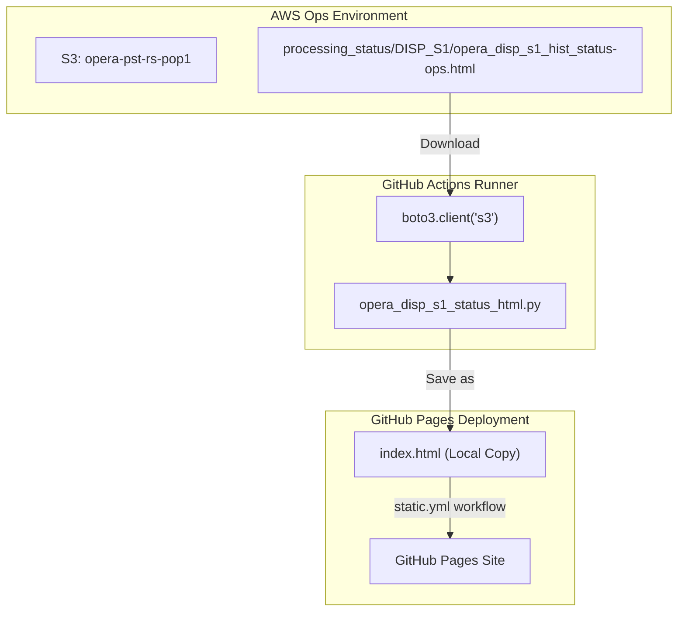
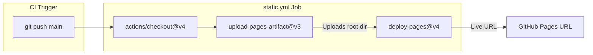

# Page: DISP-S1 Historical Status Dashboard

# DISP-S1 Historical Status Dashboard

Relevant source files

The following files were used as context for generating this wiki page:

- [.github/workflows/static.yml](.github/workflows/static.yml)
- [.nojekyll](.nojekyll)
- [README.md](README.md)
- [index.html](index.html)
- [monitoring/opera_disp_s1_hist_status-ops.html](monitoring/opera_disp_s1_hist_status-ops.html)
- [monitoring/opera_disp_s1_status_html.py](monitoring/opera_disp_s1_status_html.py)
- [requirements.txt](requirements.txt)

The DISP-S1 Historical Status Dashboard provides a geospatial visualization of the processing progress for the Displacement Sentinel-1 (DISP-S1) product. This dashboard is generated as a standalone HTML file and is automatically synchronized from S3 to the SDS GitHub Pages environment to provide stakeholders with a near-real-time view of frame-based processing completion across the global grid.

## Overview and Data Flow

The dashboard lifecycle involves three primary stages: external generation in the operational environment, retrieval via the `opera_disp_s1_status_html.py` script, and deployment via GitHub Actions.

### System Data Flow Diagram

The following diagram illustrates how the status HTML moves from the operational S3 bucket to the public-facing GitHub Pages site.

"DISP-S1 Status Data Flow"

**Sources:** [monitoring/opera_disp_s1_status_html.py:30-46](), [.github/workflows/static.yml:26-43](), [README.md:9-9]()

## The Retrieval Script: `opera_disp_s1_status_html.py`

The script `monitoring/opera_disp_s1_status_html.py` is responsible for fetching the latest status report from the OPERA SDS operational S3 bucket.

### Key Functions

*   **`get_args()`**: Configures the S3 source parameters. By default, it targets the `opera-pst-rs-pop1` bucket and the `processing_status/DISP_S1/opera_disp_s1_hist_status-ops.html` path [monitoring/opera_disp_s1_status_html.py:16-27]().
*   **`download_hist_s1_html()`**: Uses `boto3` to perform the file transfer. It renames the downloaded file to `index.html` in the repository root to ensure it serves as the landing page for GitHub Pages [monitoring/opera_disp_s1_status_html.py:30-46]().

### S3 Path Conventions
The script uses specific defaults for the production environment:
| Parameter | Default Value |
| :--- | :--- |
| **Bucket** | `opera-pst-rs-pop1` |
| **Region** | `us-west-2` |
| **S3 Path** | `processing_status/DISP_S1/opera_disp_s1_hist_status-ops.html` |

**Sources:** [monitoring/opera_disp_s1_status_html.py:24-26](), [monitoring/opera_disp_s1_status_html.py:40-41]()

## Leaflet-Based Geospatial Map

The status report is a self-contained HTML document utilizing the **Leaflet.js** library and **Folium** templates to render a global map of DISP-S1 frames.

### Visualized Data Entities
The map visualizes frames as GeoJSON features. Each feature contains properties used for styling and tooltips:
*   **`frame_id`**: The unique identifier for the DISP-S1 frame [index.html:103-104]().
*   **`orbit_pass`**: Indicates whether the frame belongs to an ascending or descending pass.
*   **Completion Percentage**: Often represented via color-coding in the `geo_json_styler` function [index.html:102-105]().
*   **Sensing Datetimes**: Information regarding the temporal range of data triggered for that specific frame.

### Implementation Details
The HTML includes several CSS and JS dependencies to handle the interactive UI:
*   **Leaflet v1.9.3**: Core mapping engine [index.html:14]().
*   **Bootstrap v5.2.2**: UI components and tooltips [index.html:16]().
*   **Leaflet.awesome-markers**: Custom iconography for status indicators [index.html:17]().

**Sources:** [index.html:1-53](), [index.html:102-105]()

## Deployment Workflow

The dashboard is deployed via the `static.yml` GitHub Actions workflow. This workflow is triggered on every push to the `main` branch [ .github/workflows/static.yml:4-7]().

### Deployment Process Logic

"Deployment Pipeline"

### GitHub Pages Configuration
*   **NoJekyll**: A `.nojekyll` file is present in the root to prevent GitHub Pages from ignoring files starting with underscores or using Jekyll processing [ .nojekyll:1-2]().
*   **Artifacts**: The workflow uploads the entire repository path (`'.'`) as the deployment artifact [ .github/workflows/static.yml:37-40]().
*   **Permissions**: The workflow requires `pages: write` and `id-token: write` permissions to interact with the GitHub Pages deployment API [ .github/workflows/static.yml:13-16]().

**Sources:** [.github/workflows/static.yml:1-44](), [.nojekyll:1-2]()
