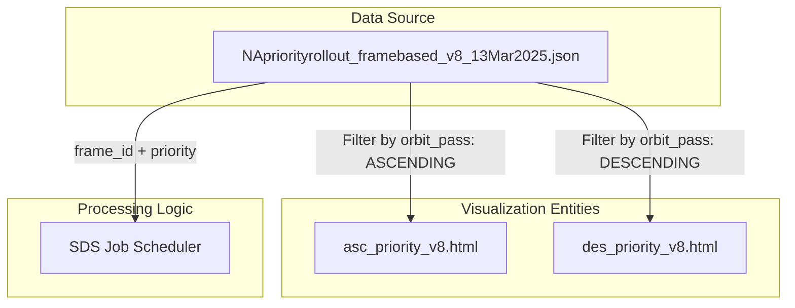
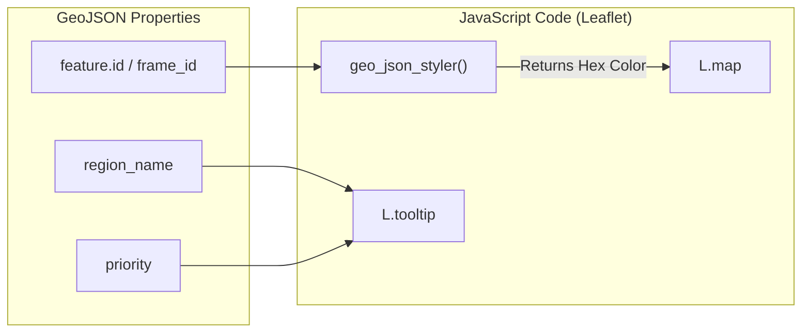

# Page: DISP-S1 Priority Rollout

# DISP-S1 Priority Rollout

Relevant source files

The following files were used as context for generating this wiki page:

- [README.md](README.md)
- [disp_s1/NApriorityrollout_framebased_v8_13Mar2025.json](disp_s1/NApriorityrollout_framebased_v8_13Mar2025.json)
- [disp_s1/asc_priority_v8.html](disp_s1/asc_priority_v8.html)
- [disp_s1/des_priority_v8.html](disp_s1/des_priority_v8.html)
- [monitoring/opera_disp_s1_hist_status-ops.html](monitoring/opera_disp_s1_hist_status-ops.html)

This page documents the data structures and visualization tools used to manage the phased rollout of the DISP-S1 (Disturbance from InSAR Pilot - Sentinel-1) product across North America. The rollout is organized by geographic frames and prioritized to ensure critical regions are processed first.

## Purpose and Scope

The DISP-S1 rollout strategy relies on a frame-based prioritization schema. The SDS uses a GeoJSON feature collection to define the spatial boundaries of processing frames, their associated orbit directions (Ascending/Descending), and their rollout priority (1.0 to 4.0). To facilitate operational planning, the repository provides interactive HTML map visualizations that allow engineers to inspect the rollout sequence geographically.

## Priority Rollout Data Structure

The core configuration for the rollout is defined in `disp_s1/NApriorityrollout_framebased_v8_13Mar2025.json`. This file is a GeoJSON `FeatureCollection` where each feature represents a Sentinel-1 frame.

### Feature Properties
Each feature in the collection contains the following metadata used by the SDS to filter and schedule processing jobs:

| Property | Type | Description |
| :--- | :--- | :--- |
| `frame_id` | Integer | The unique identifier for the Sentinel-1 frame [disp_s1/NApriorityrollout_framebased_v8_13Mar2025.json:5](). |
| `region_name` | String | The geographic region (e.g., "México", "Hawaii", "Nevada") [disp_s1/NApriorityrollout_framebased_v8_13Mar2025.json:5-24](). |
| `priority` | Float | Processing priority (lower values typically indicate higher priority) [disp_s1/NApriorityrollout_framebased_v8_13Mar2025.json:5-24](). |
| `orbit_pass` | String | Sentinel-1 orbit direction: `ASCENDING` or `DESCENDING` [disp_s1/NApriorityrollout_framebased_v8_13Mar2025.json:5](). |

### Data Flow Diagram: Priority Configuration
The following diagram illustrates how the priority GeoJSON relates to the visualization and processing logic.

**DISP-S1 Configuration Flow**

Sources: [disp_s1/NApriorityrollout_framebased_v8_13Mar2025.json:1-27](), [disp_s1/asc_priority_v8.html:90-95](), [disp_s1/des_priority_v8.html:90-95]()

## Map Visualizations

The SDS provides two interactive Leaflet-based maps to visualize the rollout. These maps color-code frames based on their `priority` level and provide tooltips with frame metadata.

### Visualization Implementation
The maps are generated using `folium` (a Python wrapper for Leaflet.js). The styling logic is embedded directly in the HTML files via JavaScript functions that switch styles based on the feature `id` or `frame_id`.

*   **Ascending Pass Map**: `disp_s1/asc_priority_v8.html`
*   **Descending Pass Map**: `disp_s1/des_priority_v8.html`

### Key JavaScript Entities
The maps utilize the following Leaflet and D3 components:
*   **`L.map`**: Initializes the map container centered at `[40.0, -110.0]` for a North America focus [disp_s1/des_priority_v8.html:65-74]().
*   **`L.geoJson` styler**: A JavaScript function (e.g., `geo_json_203807536a9251dcbbab81ab0f3457c7_styler`) that applies hex color codes (e.g., `#21918c`, `#5ec962`) based on the frame's priority group [disp_s1/des_priority_v8.html:90-95]().
*   **`L.tileLayer`**: Loads OpenStreetMap tiles as the base layer [disp_s1/des_priority_v8.html:81-84]().

**Entity Mapping: Code to Visuals**

Sources: [disp_s1/des_priority_v8.html:65-100](), [disp_s1/asc_priority_v8.html:65-100](), [disp_s1/NApriorityrollout_framebased_v8_13Mar2025.json:5-20]()

## Historical Status Integration

While the priority rollout files define the *plan*, the actual *execution* status is monitored via a separate dashboard. The `README.md` provides a link to the **OPERA Disp S1 hist status**, which is an S3-hosted HTML report [README.md:9]().

This report (e.g., `monitoring/opera_disp_s1_hist_status-ops.html`) visualizes the real-time progress of frames defined in the priority rollout. It includes:
1.  **Completion Percentage**: Calculated per frame.
2.  **Sensing Time Range**: The temporal window of data processed for that frame.
3.  **Frame Filtering**: A `switch` statement in the `geo_json_styler` logic that maps thousands of `frame_id` values to specific map layers [monitoring/opera_disp_s1_hist_status-ops.html:102-105]().

Sources: [README.md:9](), [monitoring/opera_disp_s1_hist_status-ops.html:1-105]()
