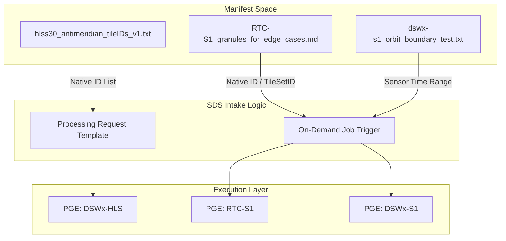
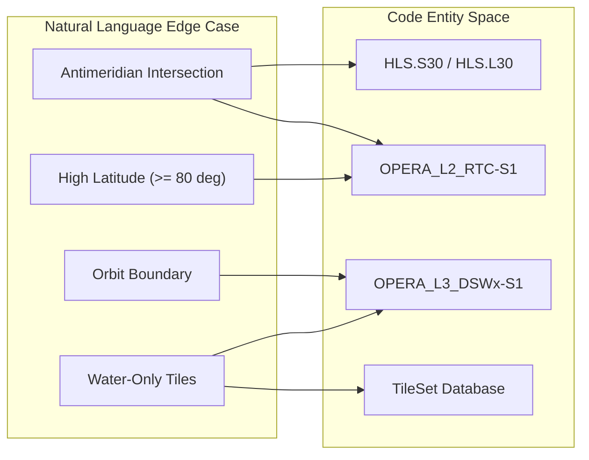

# Page: Geographic Edge Case Datasets

# Geographic Edge Case Datasets

Relevant source files

The following files were used as context for generating this wiki page:

- [processing_request_datasets/edge_cases/README.md](processing_request_datasets/edge_cases/README.md)
- [processing_request_datasets/edge_cases/RTC-S1_granules_for_edge_cases.md](processing_request_datasets/edge_cases/RTC-S1_granules_for_edge_cases.md)
- [processing_request_datasets/edge_cases/S1A_AntiMeridien_IWonly.txt](processing_request_datasets/edge_cases/S1A_AntiMeridien_IWonly.txt)
- [processing_request_datasets/edge_cases/S1A_SLC_NorthLatitude_IWonly.txt](processing_request_datasets/edge_cases/S1A_SLC_NorthLatitude_IWonly.txt)
- [processing_request_datasets/edge_cases/S1A_SLC_SouthLatitude_IWonly.txt](processing_request_datasets/edge_cases/S1A_SLC_SouthLatitude_IWonly.txt)
- [processing_request_datasets/edge_cases/S1B_AntiMeridien_IWonly.txt](processing_request_datasets/edge_cases/S1B_AntiMeridien_IWonly.txt)
- [processing_request_datasets/edge_cases/S1B_SLC_NorthLatitude_IWonly.txt](processing_request_datasets/edge_cases/S1B_SLC_NorthLatitude_IWonly.txt)
- [processing_request_datasets/edge_cases/S1B_SLC_SouthLatitude_IWonly.txt](processing_request_datasets/edge_cases/S1B_SLC_SouthLatitude_IWonly.txt)
- [processing_request_datasets/edge_cases/dswx-s1_orbit_boundary_test.txt](processing_request_datasets/edge_cases/dswx-s1_orbit_boundary_test.txt)
- [processing_request_datasets/edge_cases/hlsl30_antimeridian_tileIDs_v1.txt](processing_request_datasets/edge_cases/hlsl30_antimeridian_tileIDs_v1.txt)
- [processing_request_datasets/edge_cases/hlsl30_near_antimeridian_tileIDs_v1.txt](processing_request_datasets/edge_cases/hlsl30_near_antimeridian_tileIDs_v1.txt)
- [processing_request_datasets/edge_cases/hlss30_antimeridian_tileIDs_v1.txt](processing_request_datasets/edge_cases/hlss30_antimeridian_tileIDs_v1.txt)
- [processing_request_datasets/edge_cases/hlss30_near_antimeridian_tileIDs_v1.txt](processing_request_datasets/edge_cases/hlss30_near_antimeridian_tileIDs_v1.txt)
- [processing_request_datasets/edge_cases/rtc_antimeridian_complete_20231004_thru_20240311.txt](processing_request_datasets/edge_cases/rtc_antimeridian_complete_20231004_thru_20240311.txt)
- [processing_request_datasets/edge_cases/rtc_antimeridian_complete_20231004_thru_20240311_landonly.txt](processing_request_datasets/edge_cases/rtc_antimeridian_complete_20231004_thru_20240311_landonly.txt)
- [processing_request_datasets/edge_cases/rtc_high_latitude_complete_20231004_thru_20240311.txt](processing_request_datasets/edge_cases/rtc_high_latitude_complete_20231004_thru_20240311.txt)
- [processing_request_datasets/edge_cases/rtc_high_latitude_complete_20231004_thru_20240311_landonly.txt](processing_request_datasets/edge_cases/rtc_high_latitude_complete_20231004_thru_20240311_landonly.txt)

This page documents the curated validation datasets used to test the OPERA Science Data System (SDS) under challenging geographic conditions. These datasets target specific scenarios such as the antimeridian, high-latitude regions, and orbit boundaries to ensure the reliability of product generation for DSWx-HLS, DSWx-S1, and RTC-S1.

## DSWx-HLS Edge Cases

The DSWx-HLS edge case manifests consist of MGRS tile IDs from the first six months of 2022 [processing_request_datasets/edge_cases/README.md:3-4](). These are categorized into two groups for both Sentinel-2 (S30) and Landsat-8/9 (L30) inputs.

### Antimeridian Intersections
These files contain unique MGRS tiles that directly intersect the 180° longitude line [processing_request_datasets/edge_cases/README.md:5-7]().
*   **Sentinel-2:** `hlss30_antimeridian_tileIDs_v1.txt` [processing_request_datasets/edge_cases/hlss30_antimeridian_tileIDs_v1.txt:1-27]()
*   **Landsat:** `hlsl30_antimeridian_tileIDs_v1.txt` [processing_request_datasets/edge_cases/hlsl30_antimeridian_tileIDs_v1.txt:1-28]()

### Near-Antimeridian Proximity
These files are supersets of the intersection lists, containing tiles within approximately 200 km of the antimeridian [processing_request_datasets/edge_cases/README.md:8-10]().
*   **Sentinel-2:** `hlss30_near_antimeridian_tileIDs_v1.txt` [processing_request_datasets/edge_cases/hlss30_near_antimeridian_tileIDs_v1.txt:1-108]()
*   **Landsat:** `hlsl30_near_antimeridian_tileIDs_v1.txt` [processing_request_datasets/edge_cases/hlsl30_near_antimeridian_tileIDs_v1.txt:1-110]()

**Sources:** [processing_request_datasets/edge_cases/README.md:3-10](), [processing_request_datasets/edge_cases/hlss30_antimeridian_tileIDs_v1.txt:1-27](), [processing_request_datasets/edge_cases/hlsl30_antimeridian_tileIDs_v1.txt:1-28]()

---

## RTC-S1 and DSWx-S1 Edge Cases

The SDS uses specific RTC-S1 granules to validate DSWx-S1 algorithm performance in complex spatial and polarization scenarios.

### ADT Edge Case Table
The file `RTC-S1_granules_for_edge_cases.md` provides a structured table for on-demand job testing [processing_request_datasets/edge_cases/README.md:15-17]().

| Column | Description |
| :--- | :--- |
| **RTC-S1 granule native-id** | The unique identifier used to trigger the SDS job [processing_request_datasets/edge_cases/README.md:24](). |
| **TileSetID** | The MGRS Tile Set associated with the granule. |
| **Burst ID** | The specific Sentinel-1 burst ID. |
| **Notes** | Context such as polarization (VV/VH/HH/HV), water-only coverage, or memory-intensive burst counts [processing_request_datasets/edge_cases/RTC-S1_granules_for_edge_cases.md:3-14](). |

#### Key Scenarios in Table:
*   **Polarization Diversity:** Granules with all four polarizations (VV/VH/HH/HV) [processing_request_datasets/edge_cases/RTC-S1_granules_for_edge_cases.md:4]().
*   **Water-Only Tiles:** Tiles that cover no land, which may trigger specific ancillary data handling or exclusion logic [processing_request_datasets/edge_cases/RTC-S1_granules_for_edge_cases.md:7-9]().
*   **High Burst Count:** Cases like `MS_26_48` with 61 bursts, used to test memory limits at high latitudes [processing_request_datasets/edge_cases/RTC-S1_granules_for_edge_cases.md:13]().

### Geographic Manifest Variants
The SDS provides manifests for testing specific geographic extremes. These lists are derived from queries of RTC bursts within 0.1 degrees of the antimeridian or at latitudes ≥ 80° [processing_request_datasets/edge_cases/README.md:29-34]().

*   **Antimeridian:** `rtc_antimeridian_complete_20231004_thru_20240311.txt` (Land + Water) and its `_landonly.txt` variant [processing_request_datasets/edge_cases/README.md:26-27]().
*   **High Latitude:** `rtc_high_latitude_complete_20231004_thru_20240311.txt` (Land + Water) and its `_landonly.txt` variant [processing_request_datasets/edge_cases/README.md:31-32]().

**Sources:** [processing_request_datasets/edge_cases/README.md:13-34](), [processing_request_datasets/edge_cases/RTC-S1_granules_for_edge_cases.md:1-15]()

---

## Orbit Boundary Validation

The file `dswx-s1_orbit_boundary_test.txt` defines a specific test case to verify that the DSWx-S1 pipeline correctly handles TileSets spanning orbit boundaries [processing_request_datasets/edge_cases/README.md:35-36]().

### Test Configuration
*   **Sensor Time Range:** `2024-02-14T15:36:00Z` to `2024-02-14T15:46:00Z` [processing_request_datasets/edge_cases/dswx-s1_orbit_boundary_test.txt:2-3]().
*   **Primary Goal:** Verify the production of `MS_160_1` [processing_request_datasets/edge_cases/dswx-s1_orbit_boundary_test.txt:5]().

### Expected Coverage Percentages
The test expects successful production for TileSets with 100% coverage and conditional production for those below the threshold [processing_request_datasets/edge_cases/dswx-s1_orbit_boundary_test.txt:7-17]().

| MGRS Set ID | Coverage % | Matching Burst Count | Total Burst Count |
| :--- | :--- | :--- | :--- |
| `MS_159_179` | 100% | 41 | 41 |
| `MS_160_1` | 100% | 41 | 41 |
| `MS_159_178` | 85% | 34 | 40 |
| `MS_160_3` | 42.5% | 17 | 40 |

**Sources:** [processing_request_datasets/edge_cases/dswx-s1_orbit_boundary_test.txt:1-19]()

---

## Data Flow & System Integration

The following diagrams illustrate how these edge case datasets move from the repository into the SDS processing pipeline.

### Edge Case Data Flow
"This diagram shows how the text-based manifests are consumed by the SDS to trigger specialized PGE (Product Generation Executable) runs."

### Validation Entity Mapping
"Mapping the geographic edge case definitions to the specific PGEs and validation targets."

**Sources:** [processing_request_datasets/edge_cases/README.md:1-37](), [processing_request_datasets/edge_cases/RTC-S1_granules_for_edge_cases.md:1-15](), [processing_request_datasets/edge_cases/dswx-s1_orbit_boundary_test.txt:1-19]()
