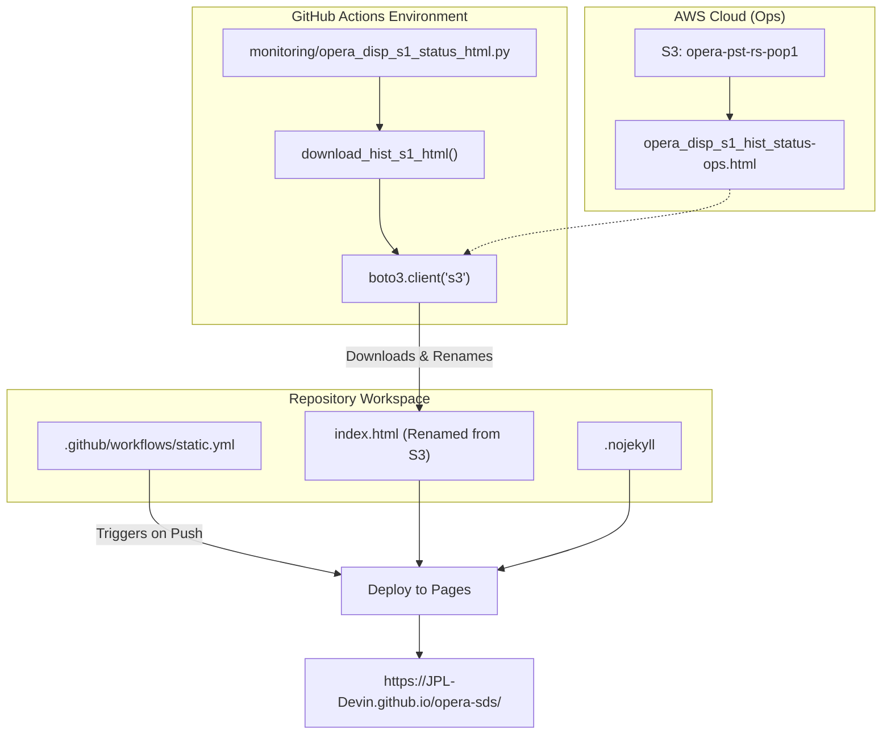
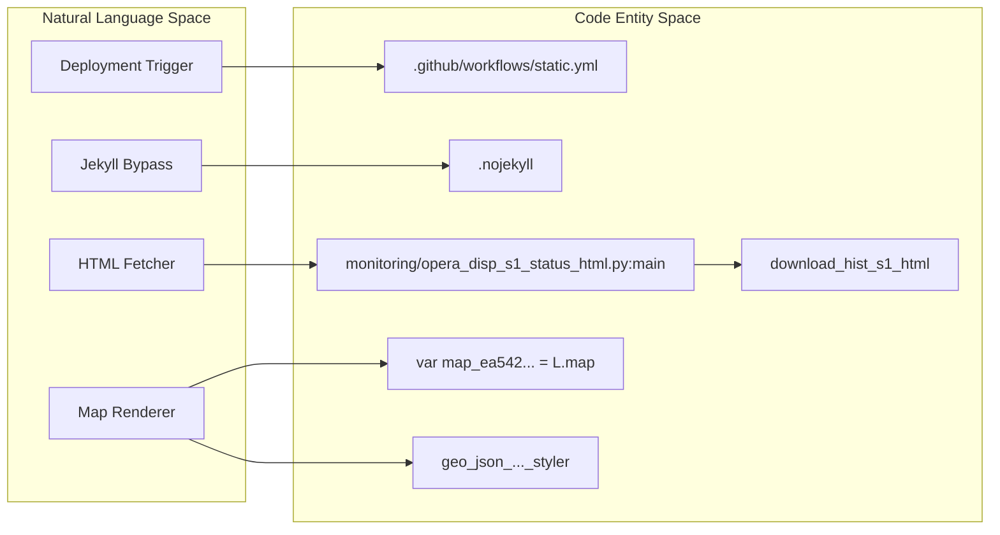

# Page: GitHub Pages Deployment

# GitHub Pages Deployment

Relevant source files

The following files were used as context for generating this wiki page:

- [.github/workflows/static.yml](.github/workflows/static.yml)
- [.nojekyll](.nojekyll)
- [index.html](index.html)
- [monitoring/opera_disp_s1_status_html.py](monitoring/opera_disp_s1_status_html.py)
- [requirements.txt](requirements.txt)

The OPERA SDS repository utilizes GitHub Pages to provide a public-facing web presence that surfaces operational status and monitoring visualizations. This deployment is primarily used to host the **DISP-S1 Historical Status Dashboard**, a Leaflet-based geospatial map that tracks the processing progress of the DISP-S1 product line.

## Workflow Implementation

The deployment is managed by a GitHub Actions workflow that synchronizes the repository's static content with the GitHub Pages hosting environment.

### static.yml Workflow
The `static.yml` workflow is the core automation for site deployment. It is configured to trigger on every push to the `main` branch or via manual `workflow_dispatch` [ .github/workflows/static.yml:4-11]().

The workflow performs the following key steps:
1.  **Permissions**: It configures the `GITHUB_TOKEN` with `pages: write` and `id-token: write` permissions to allow the deployment to the `github-pages` environment [ .github/workflows/static.yml:13-16]().
2.  **Concurrency**: It limits concurrent deployments to one at a time using the `pages` group to prevent race conditions during site updates [ .github/workflows/static.yml:20-22]().
3.  **Artifact Upload**: The workflow uploads the entire root directory (`path: '.'`) as a Pages artifact [ .github/workflows/static.yml:36-40]().
4.  **Deployment**: It uses the `actions/deploy-pages` action to push the uploaded artifact to the public URL [ .github/workflows/static.yml:41-43]().

### .nojekyll Marker
The repository includes an empty `.nojekyll` file at the root [ .nojekyll:1-2](). This file instructs the GitHub Pages build engine to bypass Jekyll processing. This is critical for the OPERA SDS because the site includes files with underscores (e.g., in the `monitoring/` directory) and large, complex HTML/JS files that Jekyll might otherwise ignore or fail to process correctly.

**Sources:**
- [ .github/workflows/static.yml:1-44]()
- [ .nojekyll:1-2]()

---

## DISP-S1 Status Surface

The primary content served by GitHub Pages is the DISP-S1 status report. While the repository contains a default `index.html`, it is dynamically overwritten by automated monitoring scripts to reflect the current state of the SDS.

### Status Retrieval (opera_disp_s1_status_html.py)
The script `monitoring/opera_disp_s1_status_html.py` is responsible for fetching the latest DISP-S1 status report from the OPERA S3 environment and preparing it for the web.

| Parameter | Default Value | Description |
| :--- | :--- | :--- |
| `bucket` | `opera-pst-rs-pop1` | The S3 bucket containing operational status files [ monitoring/opera_disp_s1_status_html.py:24](). |
| `s3path` | `processing_status/DISP_S1/opera_disp_s1_hist_status-ops.html` | The specific S3 key for the DISP-S1 HTML report [ monitoring/opera_disp_s1_status_html.py:26](). |
| `region` | `us-west-2` | The AWS region where the bucket resides [ monitoring/opera_disp_s1_status_html.py:25](). |

The function `download_hist_s1_html` downloads this remote file and renames it to `index.html` in the repository root [ monitoring/opera_disp_s1_status_html.py:30-41](). This ensures that when GitHub Pages serves the site, the DISP-S1 map is the landing page.

### Landing Page (index.html)
The `index.html` file is a Leaflet-based application. It utilizes several external libraries to render geospatial frames and status tooltips:
*   **Leaflet.js**: Core mapping engine [ index.html:14]().
*   **Bootstrap**: For UI styling and tooltips [ index.html:19]().
*   **Folium Templates**: The HTML is typically generated via the Python `folium` library, incorporating complex CSS for tooltips [ index.html:39-52]() and GeoJSON stylers to color-code frames by `frame_id` or status [ index.html:102-104]().

**Sources:**
- [ monitoring/opera_disp_s1_status_html.py:16-56]()
- [ index.html:1-104]()

---

## Data Flow: S3 to Web Presence

The following diagram illustrates how operational data from the AWS cloud is surfaced to the public-facing GitHub Pages site.

### Deployment Pipeline

**Sources:**
- [ monitoring/opera_disp_s1_status_html.py:30-41]()
- [ .github/workflows/static.yml:4-7]()
- [ .github/workflows/static.yml:36-43]()

---

## Code Entity Association

This diagram maps the high-level deployment concepts to the specific code entities and file paths that implement them.

### Deployment Component Mapping

**Sources:**
- [ .github/workflows/static.yml:1-10]()
- [ .nojekyll:1-2]()
- [ monitoring/opera_disp_s1_status_html.py:30-56]()
- [ index.html:64-76]()
- [ index.html:102-104]()
