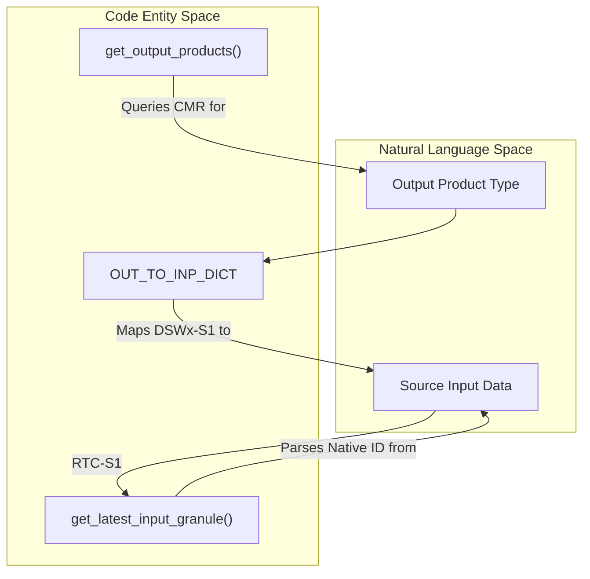
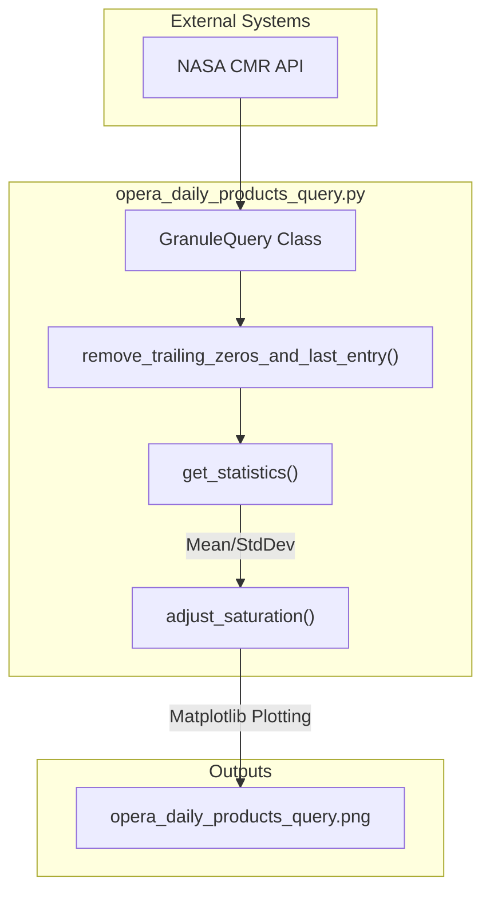

# Page: Glossary

# Glossary

Relevant source files

The following files were used as context for generating this wiki page:

- [.github/ISSUE_TEMPLATE/processing_request.yml](.github/ISSUE_TEMPLATE/processing_request.yml)
- [.github/workflows/opera_daily_products_query.yml](.github/workflows/opera_daily_products_query.yml)
- [.gitignore](.gitignore)
- [README.md](README.md)
- [disp_s1/NApriorityrollout_framebased_v8_13Mar2025.json](disp_s1/NApriorityrollout_framebased_v8_13Mar2025.json)
- [disp_s1/asc_priority_v8.html](disp_s1/asc_priority_v8.html)
- [disp_s1/des_priority_v8.html](disp_s1/des_priority_v8.html)
- [monitoring/latency_graph.py](monitoring/latency_graph.py)
- [monitoring/opera_daily_products_query.png](monitoring/opera_daily_products_query.png)
- [monitoring/opera_daily_products_query.py](monitoring/opera_daily_products_query.py)
- [monitoring/opera_disp_s1_hist_status-ops.html](monitoring/opera_disp_s1_hist_status-ops.html)
- [monitoring/opera_latency_query.png](monitoring/opera_latency_query.png)
- [processing_request_datasets/edge_cases/README.md](processing_request_datasets/edge_cases/README.md)
- [processing_request_datasets/edge_cases/RTC-S1_granules_for_edge_cases.md](processing_request_datasets/edge_cases/RTC-S1_granules_for_edge_cases.md)
- [processing_request_datasets/edge_cases/dswx-s1_orbit_boundary_test.txt](processing_request_datasets/edge_cases/dswx-s1_orbit_boundary_test.txt)
- [processing_request_datasets/edge_cases/rtc_antimeridian_complete_20231004_thru_20240311.txt](processing_request_datasets/edge_cases/rtc_antimeridian_complete_20231004_thru_20240311.txt)
- [processing_request_datasets/edge_cases/rtc_high_latitude_complete_20231004_thru_20240311.txt](processing_request_datasets/edge_cases/rtc_high_latitude_complete_20231004_thru_20240311.txt)
- [sds_releases.md](sds_releases.md)

This glossary defines the technical terms, acronyms, and domain-specific concepts used throughout the OPERA SDS (Science Data System) codebase. It provides a mapping between high-level science requirements and the specific implementation details found in the repository.

## Core System Components

| Term | Definition | Key Code Entities |
| :--- | :--- | :--- |
| **PCM** | Process Control Manager. The orchestration layer that manages job submission and data movement. | [sds_releases.md:3-10]() |
| **PGE** | Product Generation Executable. The wrapper around the science algorithm that handles environment setup and execution. | [sds_releases.md:3-10]() |
| **SAS** | Science Application Software. The core scientific algorithm (e.g., RTC, CSLC, DSWx) developed by the ADT. | [sds_releases.md:3-10]() |
| **ADT** | Algorithm Development Team. The science team responsible for creating the SAS. | [processing_request_datasets/edge_cases/README.md:15-16]() |
| **Venue** | A specific deployment environment (e.g., Ops-Fwd, Int-Pop1, PST) determining data destination. | [.github/ISSUE_TEMPLATE/processing_request.yml:11-21]() |

**Sources:**
- [.github/ISSUE_TEMPLATE/processing_request.yml:11-21]()
- [sds_releases.md:3-10]()
- [processing_request_datasets/edge_cases/README.md:15-16]()

## Product & Data Concepts

### Product Types
*   **DSWx-HLS**: Dynamic Surface Water Extent from Harmonized Landsat Sentinel-2. [monitoring/latency_graph.py:34-36]()
*   **RTC-S1**: Radiometric Terrain Corrected Sentinel-1. [monitoring/latency_graph.py:34-36]()
*   **CSLC-S1**: Co-registered Single Look Complex Sentinel-1. [monitoring/latency_graph.py:34-36]()
*   **DISP-S1**: Displacement Sentinel-1 (InSAR-based product). [.github/ISSUE_TEMPLATE/processing_request.yml:35-35]()
*   **STATIC**: Ancillary layers (burst maps, DEMs) used as inputs for processing. [.github/ISSUE_TEMPLATE/processing_request.yml:37-39]()

### Identification & Lineage
*   **Granule ID / Native ID**: The unique identifier for a single data unit in the CMR. [monitoring/latency_graph.py:118-156]()
*   **Burst ID**: A specific spatial subset of a Sentinel-1 orbit used for RTC and CSLC products. [.github/ISSUE_TEMPLATE/processing_request.yml:67-73]()
*   **Frame ID**: A predefined geospatial boundary used specifically for DISP-S1 product organization. [monitoring/opera_disp_s1_hist_status-ops.html:103-104]()
*   **Input-to-Output Mapping**: The logical relationship where an output product (e.g., DSWx-S1) is derived from specific inputs (e.g., RTC-S1). This is tracked via the `OUT_TO_INP_DICT`. [monitoring/latency_graph.py:39-44]()

### Data Flow: Product Lineage
The following diagram illustrates how the system maps output products back to their source inputs for latency and count monitoring.

Title: Product Lineage and Mapping

**Sources:**
- [monitoring/latency_graph.py:39-44]()
- [monitoring/latency_graph.py:49-90]()
- [monitoring/latency_graph.py:93-156]()

## Monitoring & Metrics

### Latency Definitions
The system calculates latency using three distinct timestamps extracted from CMR metadata:
1.  **Sensing-to-Publication**: Time from data acquisition to appearance in the SDS. [monitoring/latency_graph.py:75-90]()
2.  **Input-to-Output**: Time elapsed between the availability of the source granule and the generation of the derived product. [monitoring/latency_graph.py:93-156]()

### Anomaly Detection
*   **Sigma Multiplier**: A configurable threshold (defaulting to 2) used to identify outliers in product counts. [monitoring/opera_daily_products_query.py:97-125]()
*   **Mean & Std Dev**: Calculated by `get_statistics()` after removing trailing zeros (partial days) to ensure operational health is measured against stable data. [monitoring/opera_daily_products_query.py:114-125]()

### Geospatial Filtering
*   **North America Polygon**: A hardcoded set of coordinates used to filter CMR queries to the OPERA project's primary area of interest. [monitoring/opera_daily_products_query.py:156-164]()

### Logic Flow: Monitoring Pipeline
The monitoring scripts follow a structured sequence to transform raw CMR metadata into visual health indicators.

Title: Monitoring Pipeline Data Flow

**Sources:**
- [monitoring/opera_daily_products_query.py:11-13]()
- [monitoring/opera_daily_products_query.py:41-60]()
- [monitoring/opera_daily_products_query.py:63-88]()
- [monitoring/opera_daily_products_query.py:97-125]()

## Edge Case & Validation Terms

*   **Antimeridian**: Geographic boundary (180° longitude) where tiles often split across the coordinate system limit. [processing_request_datasets/edge_cases/README.md:5-10]()
*   **High Latitude**: Regions at 80° latitude or higher, requiring specific handling for polar projections. [processing_request_datasets/edge_cases/README.md:30-34]()
*   **Orbit Boundary**: Scenarios where a single product's temporal or spatial coverage is split across two satellite orbits. [processing_request_datasets/edge_cases/README.md:35-36]()
*   **Land-only vs. Complete**: Filtering logic for DSWx-S1 where water-only tiles are excluded to save processing resources. [processing_request_datasets/edge_cases/README.md:26-32]()

**Sources:**
- [processing_request_datasets/edge_cases/README.md:1-37]()