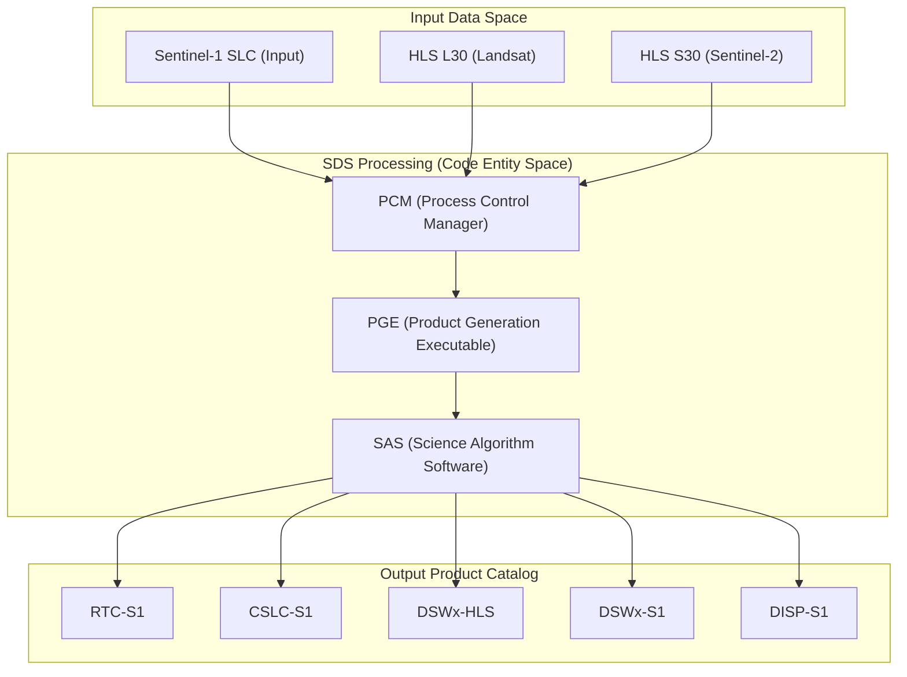
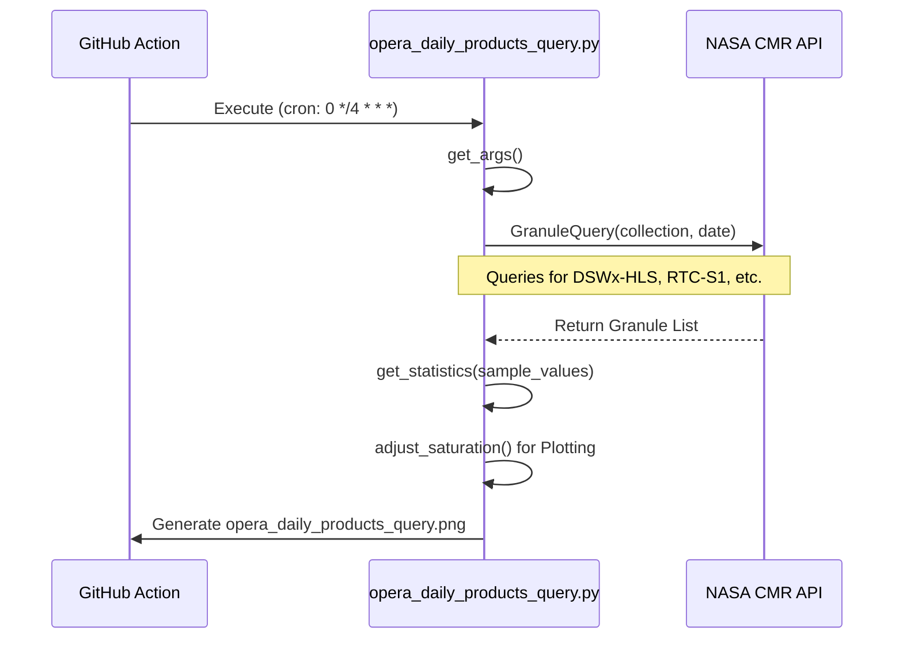

# Page: OPERA Product Catalog

# OPERA Product Catalog

Relevant source files

The following files were used as context for generating this wiki page:

- [.github/ISSUE_TEMPLATE/processing_request.yml](.github/ISSUE_TEMPLATE/processing_request.yml)
- [.github/workflows/opera_daily_products_query.yml](.github/workflows/opera_daily_products_query.yml)
- [.gitignore](.gitignore)
- [monitoring/opera_daily_products_query.png](monitoring/opera_daily_products_query.png)
- [monitoring/opera_daily_products_query.py](monitoring/opera_daily_products_query.py)
- [sds_releases.md](sds_releases.md)

The OPERA Science Data System (SDS) manages a diverse suite of satellite-derived data products generated from Sentinel-1 and Harmonized Landsat Sentinel-2 (HLS) inputs. This catalog defines the product types, their relationships to input data, and the naming conventions used to identify granules within the system.

## 1. Supported Data Products

The SDS categorizes products into primary science outputs, static layers, and NISAR-ready (NI) variants. These are formally defined in the processing request system [ .github/ISSUE_TEMPLATE/processing_request.yml:30-47 ]().

### 1.1 Science Products
*   **DSWx-HLS**: Dynamic Surface Water Extent derived from HLS data.
*   **DSWx-S1**: Dynamic Surface Water Extent derived from Sentinel-1 SAR.
*   **RTC-S1**: Radiometric Terrain Corrected backscatter from Sentinel-1.
*   **CSLC-S1**: Co-registered Single Look Complex data from Sentinel-1.
*   **DISP-S1**: Displacement maps showing surface deformation.
*   **TROPO**: Tropospheric delay corrections.
*   **VLM-S1**: Vertical Land Motion products.

### 1.2 Static & Variant Products
*   **STATIC Layers**: These include `RTC-S1-STATIC`, `CSLC-S1-STATIC`, and `DISP-S1-STATIC`. They provide non-temporal reference data (e.g., masks, local incident angles) required for science processing [ .github/ISSUE_TEMPLATE/processing_request.yml:37-39 ]().
*   **NI Variants**: Preparatory products for the NISAR mission, including `DSWx-NI`, `DISP-NI`, and `VLM-NI` [ .github/ISSUE_TEMPLATE/processing_request.yml:40-44 ]().

---

## 2. Data Flow: From Input to Output

The SDS transforms raw or lower-level satellite data into high-level science products. The `monitoring` subsystem tracks this flow by querying the Common Metadata Repository (CMR) [ monitoring/opera_daily_products_query.py:11-11 ]().

### Product Lineage Diagram
This diagram maps the natural relationship between input satellite granules and the code-managed output products.

**Sources:** [ .github/ISSUE_TEMPLATE/processing_request.yml:30-47 ](), [ sds_releases.md:3-10 ]()

---

## 3. Product Naming & Identification

Every product managed by the SDS is identified by a unique Granule ID. This ID encodes critical metadata used by the `GranuleQuery` logic in the monitoring tools [ monitoring/opera_daily_products_query.py:11-11 ]().

### 3.1 Geographic Filtering
For operational monitoring, products are often filtered by geographic region. The `opera_daily_products_query.py` script implements specific polygons for North America and Central America to validate production coverage [ monitoring/opera_daily_products_query.py:156-174 ]().

### 3.2 Identification in Monitoring
The monitoring system uses the `get_products` function to interface with CMR, using the collection name and date as primary keys [ monitoring/opera_daily_products_query.py:152-155 ]().

**Sources:** [ monitoring/opera_daily_products_query.py:16-25 ](), [ monitoring/opera_daily_products_query.py:97-125 ](), [ .github/workflows/opera_daily_products_query.yml:8-30 ]()

---

## 4. Versioning Matrix

The SDS maintains a strict mapping between the SDS software version, the PGE (Product Generation Executable) version, and the underlying SAS (Science Algorithm Software) version. This is documented in the `sds_releases.md` file to ensure traceability of product quality [ sds_releases.md:3-10 ]().

| Component | Example Version | Role |
| :--- | :--- | :--- |
| **SDS Release** | R2 Final | The integration wrapper version. |
| **PGE Release** | 2.0.0 | The containerized execution environment. |
| **SAS Release** | RTC 5.1 / CSLC 6.2 | The core science algorithm code. |
| **SAS Docker Tag** | RTC 1.0.1 | The specific image used in production. |

**Sources:** [ sds_releases.md:3-10 ]()

---

## 5. Statistical Validation

To ensure the product catalog remains healthy, the SDS runs anomaly detection on daily product counts. The `get_statistics` function calculates the mean and standard deviation ($\sigma$) of product generation rates [ monitoring/opera_daily_products_query.py:97-125 ]().

*   **Sigma Multiplier**: Defaults to 2 [ monitoring/opera_daily_products_query.py:97-97 ]().
*   **Outlier Detection**: The `check_data_points` function compares current counts against `std_sigma` boundaries [ monitoring/opera_daily_products_query.py:128-150 ]().
*   **Data Cleaning**: The `remove_trailing_zeros_and_last_entry` function is used to ignore partial data from the current (incomplete) day to avoid false alarms [ monitoring/opera_daily_products_query.py:63-88 ]().

**Sources:** [ monitoring/opera_daily_products_query.py:63-150 ]()
