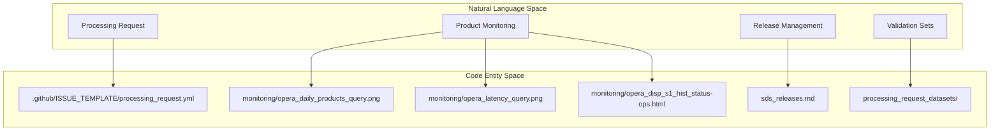
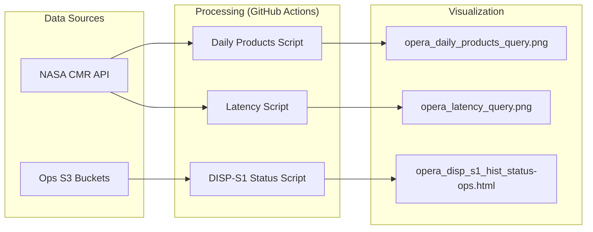

# Page: OPERA SDS — Project Overview

# OPERA SDS — Project Overview

Relevant source files

The following files were used as context for generating this wiki page:

- [.github/ISSUE_TEMPLATE/processing_request.yml](.github/ISSUE_TEMPLATE/processing_request.yml)
- [README.md](README.md)
- [monitoring/opera_disp_s1_hist_status-ops.html](monitoring/opera_disp_s1_hist_status-ops.html)
- [sds_releases.md](sds_releases.md)

The OPERA Science Data System (SDS) repository serves as the central management hub for the Observational Products for End-Users from Remote Sensing Analysis (OPERA) project. This repository integrates science algorithms, data processing workflows, and operational monitoring to generate high-resolution Earth observation products from satellite radar and optical data.

## Purpose and Scope

The SDS is responsible for the end-to-end lifecycle of OPERA data products, from ingesting raw satellite telemetry (Sentinel-1, HLS) to delivering analysis-ready data to NASA Distributed Active Archive Centers (DAACs). It orchestrates the execution of Science Application Software (SAS) within a scalable cloud environment.

Key functions managed within this repository include:
*   **Operational Monitoring:** Real-time tracking of product generation rates and system latency [README.md:5-12]().
*   **Processing Orchestration:** Formal intake of large-scale processing requests via structured GitHub issues [.github/ISSUE_TEMPLATE/processing_request.yml:1-5]().
*   **Release Management:** Coordination of software versions across the multi-layer SDS stack [sds_releases.md:3-10]().
*   **Validation:** Maintenance of curated datasets for Calibration/Validation (CalVal) and geographic edge-case testing.

## System Components

The SDS architecture bridges high-level science requirements with low-level cloud execution. The following diagram maps the logical subsystems to their corresponding representations in the codebase.

### SDS Functional Mapping

**Sources:** [README.md:5-12](), [.github/ISSUE_TEMPLATE/processing_request.yml:1-5](), [sds_releases.md:3-10]().

## Managed Products

The SDS manages a diverse catalog of products derived from Sentinel-1 (S1), Harmonized Landsat Sentinel-2 (HLS), and future NISAR (NI) data. These include:

| Product Category | Key Products |
| :--- | :--- |
| **Surface Water** | DSWx-HLS, DSWx-S1, DSWx-NI, DSWx-SW |
| **Radar Backscatter** | RTC-S1, RTC-S1-STATIC |
| **Phase/Displacement** | CSLC-S1, DISP-S1, DISP-S1-STATIC, DISP-NI |
| **Ancillary/Support** | TROPO (Tropospheric), VLM (Vertical Land Motion), CSLC-CAL-S1 |

**Sources:** [.github/ISSUE_TEMPLATE/processing_request.yml:31-47](). For detailed product definitions and naming conventions, see [OPERA Product Catalog](#1.1).

## Software Stack and Releases

The SDS operates on a four-layer software stack to ensure science reproducibility and operational stability:
1.  **PCM (Process Control Manager):** The workflow orchestration layer.
2.  **PGE (Product Generation Executable):** The wrapper that interfaces the SAS with the SDS.
3.  **SAS (Science Application Software):** The core physics-based algorithms.
4.  **SDS Integration:** The environment and infrastructure configuration.

Release versions are strictly tracked in a version matrix to ensure specific SAS Docker tags are pinned to validated SDS releases [sds_releases.md:3-10]().

For details on the architecture and container management, see [SDS Software Architecture & Release Management](#1.2).

## Operational Monitoring & Rollout

The SDS includes an automated monitoring subsystem that generates visual dashboards for data health and processing progress.

*   **Daily Counts:** Tracks the volume of products generated over a rolling 10-day window [README.md:7]().
*   **Latency:** Measures the time delta between satellite sensing and final product publication [README.md:11]().
*   **DISP-S1 Rollout:** A specialized geospatial dashboard (using Leaflet) tracks the historical processing status of DISP-S1 frames across North America [monitoring/opera_disp_s1_hist_status-ops.html:64-100]().

### Monitoring Data Flow

**Sources:** [README.md:5-12](), [monitoring/opera_disp_s1_hist_status-ops.html:14-23]().

## Processing Requests

Tasking the SDS is handled through a structured **Processing Request** workflow. Users submit requests via GitHub Issues, specifying the target `venue` (e.g., `Ops-Fwd` for production or `PST` for testing), the `product` type, and the required `sas-version` [.github/ISSUE_TEMPLATE/processing_request.yml:11-65]().

Requests are validated against curated datasets, including R2 CalVal sites and geographic edge cases (e.g., antimeridian crossings), to ensure pipeline robustness.

---
**Next Steps:**
*   To learn about specific data products, see **[OPERA Product Catalog](#1.1)**.
*   To understand the deployment stack, see **[SDS Software Architecture & Release Management](#1.2)**.
