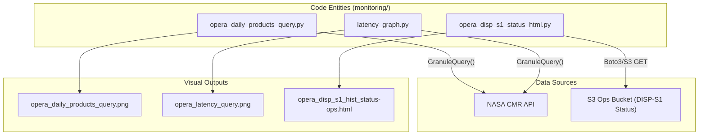
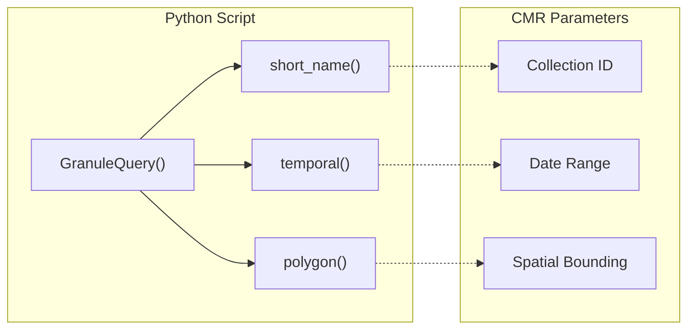

# Page: Operational Monitoring

# Operational Monitoring

Relevant source files

The following files were used as context for generating this wiki page:

- [.github/workflows/opera_daily_products_query.yml](.github/workflows/opera_daily_products_query.yml)
- [.gitignore](.gitignore)
- [README.md](README.md)
- [monitoring/latency_graph.py](monitoring/latency_graph.py)
- [monitoring/opera_daily_products_query.png](monitoring/opera_daily_products_query.png)
- [monitoring/opera_daily_products_query.py](monitoring/opera_daily_products_query.py)
- [monitoring/opera_disp_s1_hist_status-ops.html](monitoring/opera_disp_s1_hist_status-ops.html)
- [monitoring/opera_latency_query.png](monitoring/opera_latency_query.png)

The Operational Monitoring subsystem provides automated tracking and visualization of the OPERA Science Data System's (SDS) performance and product generation status. It is designed to provide high-level visibility into production volumes, data latency, and the historical rollout status of specific product lines like DISP-S1.

The subsystem relies on scheduled Python scripts that query the Common Metadata Repository (CMR) or retrieve status reports from S3, generating visual dashboards that are automatically committed to the repository and served via GitHub Pages.

## System Architecture Overview

The monitoring tools are primarily located in the `monitoring/` directory. They interact with external NASA data services (CMR) and internal project storage (S3) to synthesize operational metrics.

### Code-to-System Mapping
The following diagram illustrates how the Python scripts in the codebase map to the operational monitoring dashboards and their data sources.

**Monitoring Data Flow and Entity Mapping**

Sources: [monitoring/opera_daily_products_query.py:11-12](), [monitoring/latency_graph.py:20-20](), [README.md:5-12]()

## Automated Update Lifecycle

Monitoring dashboards are kept current through GitHub Actions workflows that execute on fixed schedules. This ensures that the `README.md` and GitHub Pages site reflect the latest SDS state without manual intervention.

| Dashboard | Update Frequency | Workflow File |
| :--- | :--- | :--- |
| **Daily Product Counts** | Every 4 hours | `opera_daily_products_query.yml` |
| **Product Latency** | Daily at 17:00 UTC | `opera_daily_latency.yml` |
| **DISP-S1 Status** | On-demand / S3 Sync | `static.yml` (Pages Deployment) |

The workflows follow a standard pattern of setting up a Python environment, installing requirements from `requirements.txt`, executing the query scripts, and using `stefanzweifel/git-auto-commit-action` to push updated imagery back to the repository.

Sources: [.github/workflows/opera_daily_products_query.yml:5-39](), [README.md:7-11]()

## Key Monitoring Components

### Daily Product Count Monitor
This component tracks the volume of OPERA products generated over a rolling 30-day window. It categorizes products by type (e.g., RTC-S1, CSLC-S1, DSWx-HLS) and applies spatial filters to distinguish between global production and North America-specific requirements. It includes an anomaly detection engine that flags production drops below the 2-sigma threshold.

For details, see [Daily Product Count Monitor](#2.1).

### Product Latency Monitor
The Latency Monitor measures the time elapsed between different stages of the data lifecycle. It specifically tracks "Sensing to Publication" (total latency) and "Input Revision to Output Revision" (SDS processing time). It uses a two-stage CMR query to link output products back to their specific input granule lineages.

For details, see [Product Latency Monitor](#2.2).

### DISP-S1 Historical Status Dashboard
Unlike the PNG-based charts, this is a geospatial dashboard built with Leaflet. It visualizes the progress of the DISP-S1 (Displacement) product rollout across North America. It maps individual frames and color-codes them based on completion percentage and the history of sensing datetimes triggered for that specific frame.

For details, see [DISP-S1 Historical Status Dashboard](#2.3).

## Code-Entity Relationships

The monitoring subsystem utilizes the `cmr` library's `GranuleQuery` class to interface with NASA's metadata backend.

**CMR Query Integration**

Sources: [monitoring/opera_daily_products_query.py:75-85](), [monitoring/latency_graph.py:75-85]()
