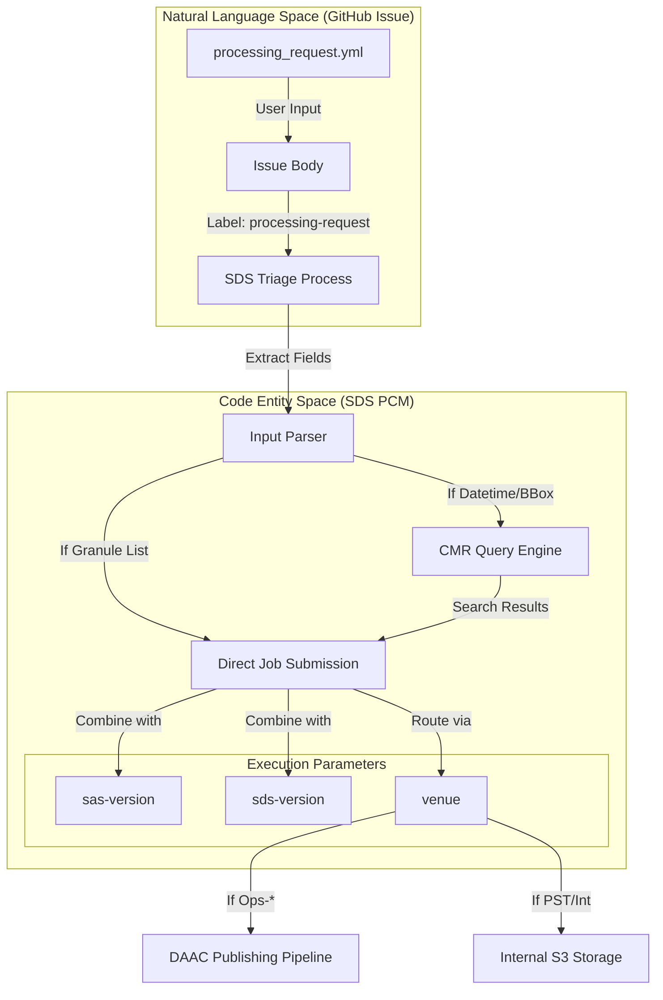
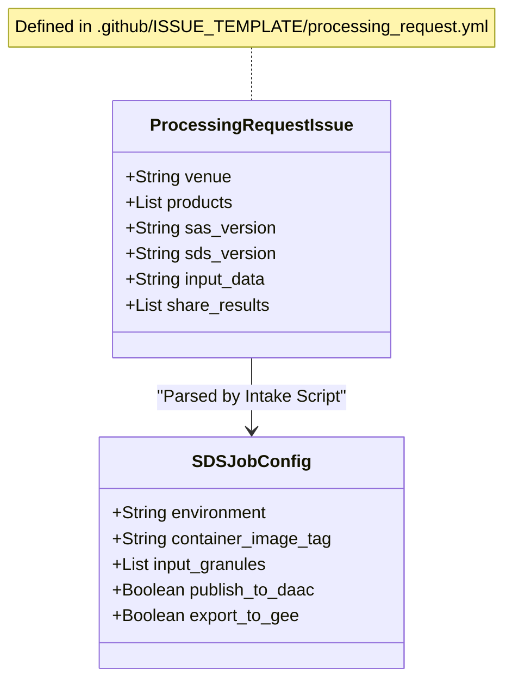

# Page: Processing Request Issue Template

# Processing Request Issue Template

Relevant source files

The following files were used as context for generating this wiki page:

- [.github/ISSUE_TEMPLATE/processing_request.yml](.github/ISSUE_TEMPLATE/processing_request.yml)

The **Processing Request Issue Template** serves as the formal intake mechanism for all science data processing tasks within the OPERA SDS. It provides a structured interface for operators and science team members to define the execution environment, target products, software versions, and input datasets.

This template is implemented as a GitHub YAML form, ensuring that all necessary metadata is captured before a request is triaged and converted into a set of processing jobs within the SDS orchestration layer.

## Form Implementation and Metadata

The form is defined in the repository at [.github/ISSUE_TEMPLATE/processing_request.yml:1-92](). When a user creates a new issue using this template, GitHub automatically applies specific labels to trigger downstream workflows and organizational visibility.

### Automatic Labeling
Upon submission, the following labels are applied:
*   `processing-request`: Identifies the issue as a task for the SDS pipeline.
*   `needs-triage`: Signals to the SDS operations team that the request parameters need validation before execution.

**Sources:**
*   [.github/ISSUE_TEMPLATE/processing_request.yml:4-4]()

---

## Field Reference & Data Flow

The template consists of several key fields that determine how the SDS PCM (Process Control Manager) will route and execute the request.

| Field ID | UI Label | Type | Description |
| :--- | :--- | :--- | :--- |
| `venue` | Venue | Dropdown | The deployment environment where processing occurs. |
| `product` | Product | Dropdown (Multi) | The specific OPERA data product(s) to generate. |
| `sas-version` | SAS Version | Input | The version of the Science Algorithm Software (PGE) to use. |
| `sds-version` | SDS Version | Input | The version of the SDS integration/wrapper code to use. |
| `input-data` | Input Data | Textarea | Polymorphic field for specifying what to process. |
| `results` | Share Results | Checkboxes | Optional distribution targets beyond standard S3 storage. |

### Venue Routing Logic
The `venue` selection is critical for data lifecycle management. Specifically, selecting an "Ops" venue has implications for external data publication.
*   **Ops-Fwd / Ops-Pop1**: Production environments. Data generated here is eligible for publication to NASA DAACs [.github/ISSUE_TEMPLATE/processing_request.yml:14-18]().
*   **Int-Fwd / Int-Pop1**: Integration environments for testing pipeline stability.
*   **PST**: Product Selection Tool / Project Support Team environment for ad-hoc science validation.

### Product Selection
The `product` field supports multi-select, allowing a single request to trigger multiple product lines (e.g., requesting both `RTC-S1` and `CSLC-S1` for the same input set) [.github/ISSUE_TEMPLATE/processing_request.yml:29-47]().

**Sources:**
*   [.github/ISSUE_TEMPLATE/processing_request.yml:10-49]()

---

## Polymorphic Input Data Handling

The `input-data` field is designed to be polymorphic, meaning it accepts various formats that the SDS intake scripts must parse to identify the required granules [.github/ISSUE_TEMPLATE/processing_request.yml:66-73]().

### Supported Input Formats
1.  **Granule Lists**: A newline-separated list of specific granule IDs (e.g., Sentinel-1 SLC IDs or HLS Tile IDs).
2.  **Datetime Ranges**: ISO-8601 start and end timestamps used to query the CMR (Common Metadata Repository) for available data.
3.  **Bounding Boxes**: Geographic coordinates defining an Area of Interest (AOI).
4.  **Reference Links**: Pointers to previous GitHub issues or external manifests (e.g., those found in `processing_request_datasets/`).

### Input Processing Flow

Title: Processing Request Data Flow

**Sources:**
*   [.github/ISSUE_TEMPLATE/processing_request.yml:66-73]()
*   [.github/ISSUE_TEMPLATE/processing_request.yml:11-23]()

---

## Results and External Distribution

The `results` field determines the post-processing data movement. While all successful jobs result in data being stored in the SDS-managed Amazon S3 buckets, users can request additional distribution [.github/ISSUE_TEMPLATE/processing_request.yml:74-83]().

*   **Google Earth Engine (GEE)**: Triggers an export task to ingest the resulting COGs (Cloud Optimized GeoTIFFs) into GEE Assets.
*   **NASA DAAC UAT**: Routes the products to the User Acceptance Testing environment of the respective DAAC (e.g., PO.DAAC or ASF) for validation before full production release.

Title: Issue Template Field to SDS Configuration Mapping

**Sources:**
*   [.github/ISSUE_TEMPLATE/processing_request.yml:74-83]()
*   [.github/ISSUE_TEMPLATE/processing_request.yml:50-65]()
