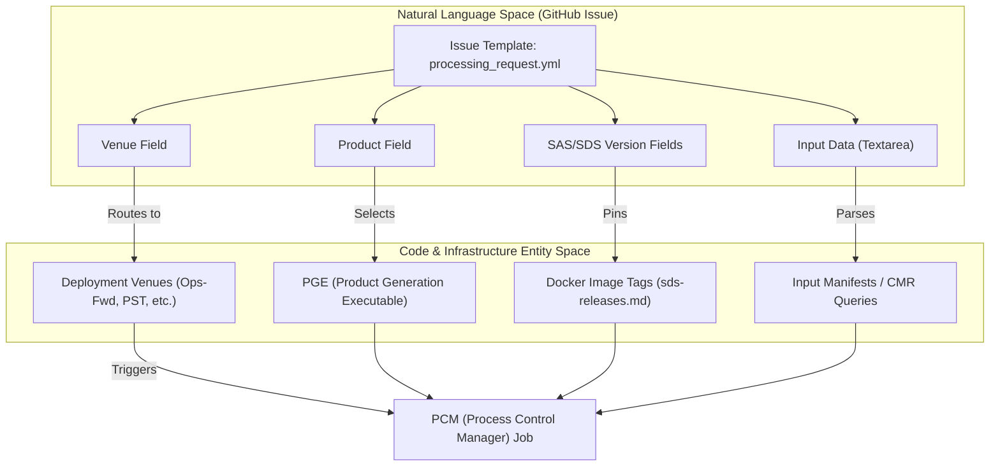

# Page: Processing Request Workflow

# Processing Request Workflow

Relevant source files

The following files were used as context for generating this wiki page:

- [.github/ISSUE_TEMPLATE/processing_request.yml](.github/ISSUE_TEMPLATE/processing_request.yml)
- [.github/PULL_REQUEST_TEMPLATE.md](.github/PULL_REQUEST_TEMPLATE.md)

The **Processing Request Workflow** is the formal mechanism for initiating science data processing within the OPERA Science Data System (SDS). Rather than ad-hoc command-line triggers, the SDS utilizes a structured intake process via GitHub Issues to ensure traceability, version control, and proper routing across different operational venues.

This workflow bridges the gap between science team requirements (e.g., "process this list of bursts") and the underlying High-Level Processing (HLP) infrastructure.

### Intake Mechanism: GitHub Issue Template

The primary entry point for any processing task is the `Processing Request` issue template. This form standardizes the metadata required to configure a processing job, including the target environment, the specific Science Application Software (SAS) versions, and the spatial/temporal scope of the data.

When a user creates a request, the system automatically applies labels for triage and tracking:
*   `processing-request`: Identifies the issue as a task for the SDS operations team.
*   `needs-triage`: Signals that the parameters require validation before execution.

#### Workflow Diagram: From Request to Execution

The following diagram illustrates how the GitHub Issue fields map to the operational environment and SAS components.

**Sources:**
*   [.github/ISSUE_TEMPLATE/processing_request.yml:1-4]() (Template name and labels)
*   [.github/ISSUE_TEMPLATE/processing_request.yml:10-49]() (Venue and Product dropdown definitions)
*   [.github/ISSUE_TEMPLATE/processing_request.yml:50-65]() (SAS and SDS versioning inputs)

---

### Key Configuration Fields

The intake form uses several critical fields to define the lifecycle of the processing task:

| Field | Description | Impact on Workflow |
| :--- | :--- | :--- |
| **Venue** | The target environment (e.g., `Ops-Fwd`, `PST`, `Int-Pop1`). | Determines if results are published to NASA DAACs. `OPS` options trigger external distribution. |
| **Product** | The OPERA product type (e.g., `RTC-S1`, `CSLC-S1`, `DSWx-HLS`). | Determines which SAS container and PGE workflow is invoked. |
| **Versions** | `sas-version` and `sds-version`. | Ensures reproducibility by pinning specific software releases. |
| **Input Data** | Polymorphic field for granules, dates, or bounding boxes. | Defines the source data to be pulled from CMR or local SDS storage. |

For a detailed breakdown of every field and the routing logic for DAAC publishing, see [Processing Request Issue Template](#3.1).

**Sources:**
*   [.github/ISSUE_TEMPLATE/processing_request.yml:11-23]() (Venue logic and DAAC warnings)
*   [.github/ISSUE_TEMPLATE/processing_request.yml:25-49]() (Product selection options)
*   [.github/ISSUE_TEMPLATE/processing_request.yml:67-73]() (Input data requirements)

---

### Curated Input Datasets

While many requests are ad-hoc, the SDS maintains a library of curated datasets to seed major processing campaigns. These are particularly important for **Static Layer** products (e.g., `RTC-S1-STATIC`), which provide the baseline terrain and mask information required for downstream science.

The repository stores these manifests as CSV files, which are referenced in processing requests to ensure consistency across large-scale historical re-processing.

For documentation on the burst-ID and frame-ID manifests used for static layer generation, see [Static Layer Input Datasets](#3.2).

**Sources:**
*   [.github/ISSUE_TEMPLATE/processing_request.yml:37-39]() (Static product types)
*   [.github/ISSUE_TEMPLATE/processing_request.yml:70-71]() (Referencing previous requests/files)

---

### Related Child Pages
*   **[Processing Request Issue Template](#3.1)**: Deep dive into the `processing_request.yml` form, field validations, and venue-specific routing.
*   **[Static Layer Input Datasets](#3.2)**: Reference for the CSV manifests used to generate baseline static products for RTC and CSLC.
