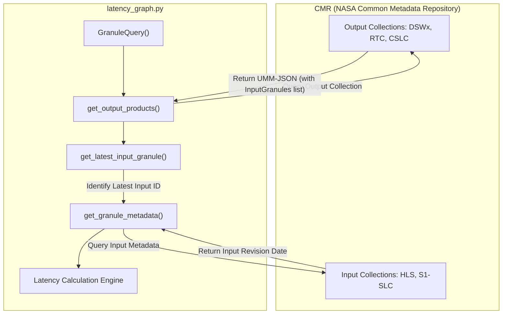
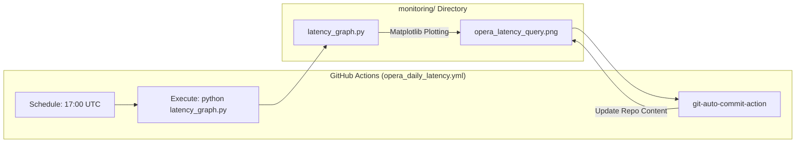

# Page: Product Latency Monitor

# Product Latency Monitor

Relevant source files

The following files were used as context for generating this wiki page:

- [.github/workflows/opera_daily_latency.yml](.github/workflows/opera_daily_latency.yml)
- [monitoring/latency_graph.py](monitoring/latency_graph.py)
- [monitoring/opera_latency_query.png](monitoring/opera_latency_query.png)

The Product Latency Monitor is an automated subsystem designed to track and visualize the time elapsed between the acquisition of satellite data and the publication of derived OPERA science products. It utilizes a two-stage Common Metadata Repository (CMR) query pipeline to establish lineage between output products (e.g., DSWx-S1) and their specific input granules (e.g., RTC-S1), calculating three distinct latency metrics to identify bottlenecks in the processing chain.

## Latency Metrics Definition

The monitor calculates three primary latency values for each product type, as defined in `latency_graph.py`:

| Metric | Description | Implementation Logic |
| :--- | :--- | :--- |
| **Sensing-to-Publication** | Total time from the start of satellite sensing to the product appearing in CMR. | `publication_date - sensing_start` [[monitoring/latency_graph.py:228-230]]() |
| **Input-Revision-to-Output-Revision** | Processing latency: time from when the input was last revised in CMR to when the output was published. | `output_revision_date - input_revision_date` [[monitoring/latency_graph.py:234-236]]() |
| **Sensing-to-Input-Revision** | Upstream latency: time from satellite sensing to the availability of the input product. | `input_revision_date - sensing_start` [[monitoring/latency_graph.py:231-233]]() |

**Sources:** `monitoring/latency_graph.py` [[228-236]]()

## Two-Stage CMR Query Pipeline

Establishing latency requires linking an OPERA product back to its specific source data. Since CMR does not always provide direct parent-child links in a single query, `latency_graph.py` implements a two-stage lookup.

### Stage 1: Output Product Discovery
The script queries the CMR for OPERA products (DSWx-HLS, DSWx-S1, RTC-S1, CSLC-S1) using the `GranuleQuery` class [[monitoring/latency_graph.py:75-75]](). It requests metadata in `umm_json` format [[monitoring/latency_graph.py:78-78]]() because this format contains the `InputGranules` field required for lineage tracking.

### Stage 2: Input Lineage Resolution
For every output product found, the script parses the `InputGranules` list. It identifies the "latest" input granule (the one with the most recent sensing end time) using `get_latest_input_granule` [[monitoring/latency_graph.py:93-93]](). It then performs a follow-up query via `get_granule_metadata` [[monitoring/latency_graph.py:159-159]]() to retrieve the precise revision date of that specific input.

### Data Flow Diagram: Lineage Resolution
This diagram shows how `latency_graph.py` bridges the gap between the OPERA product and its source data.

**Sources:** `monitoring/latency_graph.py` [[49-90]](), [[93-156]](), [[159-169]]()

## Implementation Details

### Configuration and Mapping
The monitor targets a specific subset of the OPERA catalog defined in the `COLLECTIONS` list [[monitoring/latency_graph.py:36-36]](). The relationship between an output and its primary input is maintained in `OUT_TO_INP_DICT` [[monitoring/latency_graph.py:39-44]]().

### Outlier Handling and Statistics
To ensure visualizations are not skewed by anomalous data points (e.g., reprocessing of historical data), the script applies a standard deviation filter. It calculates the mean and standard deviation for the latency sets and excludes values that fall outside a specific sigma threshold [[monitoring/latency_graph.py:22-23]]().

### Visualization
The output is a multi-panel histogram generated using `matplotlib`.
- **Histograms:** Each product type has a histogram showing the distribution of "Sensing-to-Publication" latency.
- **Color Coding:** Different colors are used to distinguish between the three latency components (upstream vs. processing).
- **Output:** The resulting image is saved as `monitoring/opera_latency_query.png` [[monitoring/opera_latency_query.png:1-16]]().

**Sources:** `monitoring/latency_graph.py` [[34-44]](), [[210-250]]()

## GitHub Actions Workflow

The latency monitor is updated daily via a scheduled GitHub Action. This ensures the project's landing page always displays current performance metrics.

### Workflow: `opera_daily_latency.yml`
The workflow is configured to run at 17:00 UTC daily [[.github/workflows/opera_daily_latency.yml:8-8]]().

1. **Environment Setup:** Initializes a Python 3.11 environment [[.github/workflows/opera_daily_latency.yml:20-20]]().
2. **Execution:** Runs `latency_graph.py` within the `monitoring/` directory [[.github/workflows/opera_daily_latency.yml:29-30]]().
3. **Commitment:** Uses `stefanzweifel/git-auto-commit-action` to commit the updated `opera_latency_query.png` back to the repository [[.github/workflows/opera_daily_latency.yml:34-36]]().

### Automation Topology
This diagram maps the natural language "Daily Workflow" to the specific code entities involved.

**Sources:** `.github/workflows/opera_daily_latency.yml` [[1-42]](), `monitoring/latency_graph.py` [[1-30]]()
