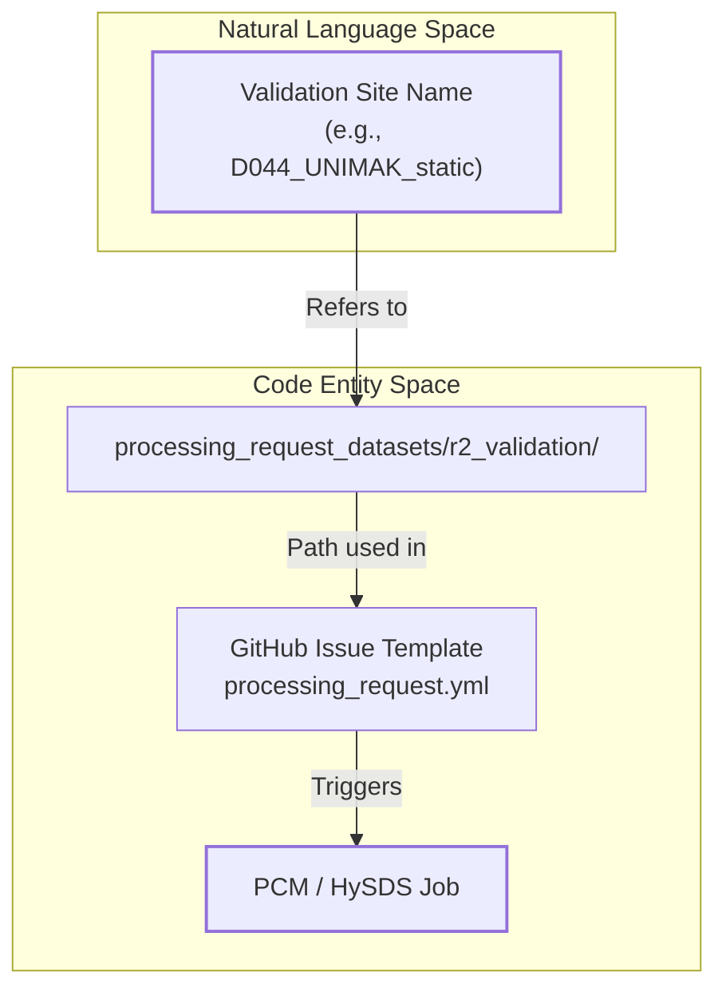
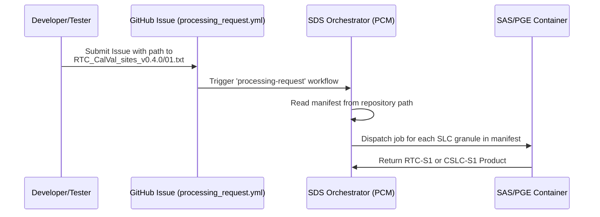

# Page: R2 Calibration & Validation Sites

# R2 Calibration & Validation Sites

Relevant source files

The following files were used as context for generating this wiki page:

- [processing_request_datasets/r2_validation/CSLC_CalVal_sites_v0.3.1/D044_UNIMAK_static.txt](processing_request_datasets/r2_validation/CSLC_CalVal_sites_v0.3.1/D044_UNIMAK_static.txt)
- [processing_request_datasets/r2_validation/CSLC_CalVal_sites_v0.3.1/all.txt](processing_request_datasets/r2_validation/CSLC_CalVal_sites_v0.3.1/all.txt)
- [processing_request_datasets/r2_validation/RTC_CalVal_sites_v0.4.0.txt](processing_request_datasets/r2_validation/RTC_CalVal_sites_v0.4.0.txt)
- [processing_request_datasets/r2_validation/RTC_CalVal_sites_v0.4.0/01.txt](processing_request_datasets/r2_validation/RTC_CalVal_sites_v0.4.0/01.txt)

This page documents the curated Calibration and Validation (CalVal) datasets used for the OPERA Release 2 (R2) SDS pipeline. These datasets are specifically designed to validate the **RTC-S1** (Radiometric Terrain Corrected) and **CSLC-S1** (Co-registered Stack of L-band/S-band Complex) processing workflows. The SDS uses these manifests to trigger processing jobs via the GitHub Issue intake system to ensure algorithm performance across diverse geographic and temporal conditions.

## RTC-S1 Validation Sites (v0.4.0)

The RTC-S1 validation suite consists of 13 primary numbered site files and a comprehensive master list. These sites are used to verify the radiometric accuracy and geometric precision of the RTC-S1 product.

### Dataset Structure
The datasets are stored in `processing_request_datasets/r2_validation/RTC_CalVal_sites_v0.4.0/`.
- **Master List**: `RTC_CalVal_sites_v0.4.0.txt` contains a concatenated list of all Sentinel-1 SLC granules across all validation sites [processing_request_datasets/r2_validation/RTC_CalVal_sites_v0.4.0.txt:1-105]().
- **Numbered Sites**: Individual files (e.g., `01.txt`) contain subsets of granules specific to a geographic calibration target [processing_request_datasets/r2_validation/RTC_CalVal_sites_v0.4.0/01.txt:1-14]().

### Granule Naming Convention
The granules follow the standard Sentinel-1 naming convention:
`S1A_IW_SLC__1SDV_[SensingStart]_[SensingStop]_[Orbit]_[DataTake]_[ID]-SLC`

**Sources:**
- [processing_request_datasets/r2_validation/RTC_CalVal_sites_v0.4.0.txt:1-105]()
- [processing_request_datasets/r2_validation/RTC_CalVal_sites_v0.4.0/01.txt:1-14]()

---

## CSLC-S1 Validation Sites (v0.3.1)

The CSLC-S1 validation suite is more extensive, covering 27 named geographic sites. These are used to validate the co-registration of Sentinel-1 SLC stacks over time, which is critical for subsequent displacement (DISP-S1) processing.

### Site Naming Convention
CSLC site files follow a specific naming pattern to identify the orbit direction and geographic location:
`[Direction][Orbit]_[LOCATION]_[Type].txt`

- **Direction**: `A` for Ascending, `D` for Descending.
- **Orbit**: The Relative Orbit Number (e.g., `044`).
- **LOCATION**: The geographic name (e.g., `UNIMAK`, `FINLAND`).
- **Type**: `static` or `no-static` (indicating if static layers like local incident angle maps should be generated).

**Example**: `D044_UNIMAK_static.txt` [processing_request_datasets/r2_validation/CSLC_CalVal_sites_v0.3.1/D044_UNIMAK_static.txt:1-2]().

### Implementation Mapping: Site Manifest to SDS Job
The following diagram illustrates how a CalVal site manifest is transformed from a text file into a processing request within the SDS.

**CalVal Manifest Processing Flow**

**Sources:**
- [processing_request_datasets/r2_validation/CSLC_CalVal_sites_v0.3.1/D044_UNIMAK_static.txt:1-2]()
- [processing_request_datasets/r2_validation/CSLC_CalVal_sites_v0.3.1/all.txt:1-110]()

---

## Data Flow and Usage

These site manifests are primarily consumed by the SDS via the `processing_request.yml` issue template. When a user or developer needs to run a validation pass, they provide the path to one of these text files in the `input-data` field of the GitHub Issue.

### Processing Request Integration
The SDS automation parses the provided file path and extracts the list of SLC granules to be processed by the PGE (Product Generation Executable).

**System Component Interaction**

### Dataset Summary Table

| Product | Version | Site Count | Key Characteristics |
| :--- | :--- | :--- | :--- |
| **RTC-S1** | v0.4.0 | 13 Sites | Focused on radiometric calibration; includes SLC-to-RTC transformations. |
| **CSLC-S1** | v0.3.1 | 27 Sites | Organized by Orbit-Pass (Asc/Des); supports static layer validation. |

**Sources:**
- [processing_request_datasets/r2_validation/RTC_CalVal_sites_v0.4.0.txt:1-15]()
- [processing_request_datasets/r2_validation/CSLC_CalVal_sites_v0.3.1/all.txt:1-50]()
- [processing_request_datasets/r2_validation/CSLC_CalVal_sites_v0.3.1/D044_UNIMAK_static.txt:1-2]()
