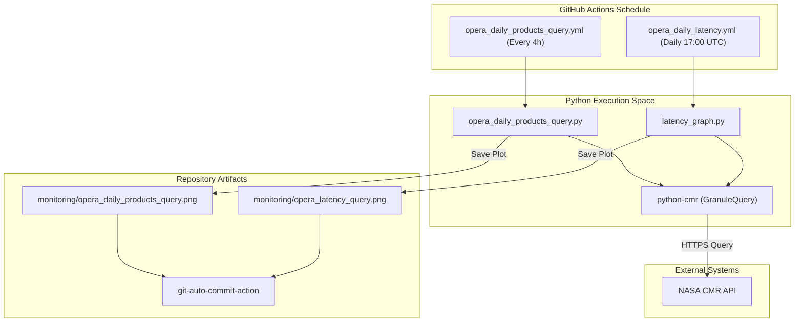
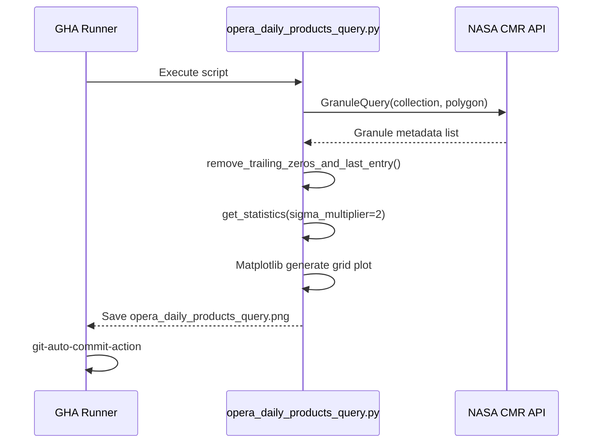

# Page: Scheduled Monitoring Workflows

# Scheduled Monitoring Workflows

Relevant source files

The following files were used as context for generating this wiki page:

- [.github/workflows/opera_daily_latency.yml](.github/workflows/opera_daily_latency.yml)
- [.github/workflows/opera_daily_products_query.yml](.github/workflows/opera_daily_products_query.yml)
- [.gitignore](.gitignore)
- [monitoring/opera_daily_products_query.png](monitoring/opera_daily_products_query.png)
- [monitoring/opera_daily_products_query.py](monitoring/opera_daily_products_query.py)
- [monitoring/opera_disp_s1_status_html.py](monitoring/opera_disp_s1_status_html.py)
- [requirements.txt](requirements.txt)

The OPERA SDS utilizes scheduled GitHub Actions to maintain up-to-date health and performance metrics for all data products. These workflows automate the querying of the Common Metadata Repository (CMR), statistical analysis of product generation, and the generation of visualization dashboards. By committing these artifacts directly back to the repository, the SDS provides a low-latency, serverless monitoring solution.

### Purpose and Scope
The monitoring system focuses on two primary metrics:
1.  **Product Counts:** Tracking the volume of products generated over a rolling 30-day window to detect anomalies in processing throughput.
2.  **Latency:** Measuring the time delta between initial satellite sensing and final product publication to ensure operational Service Level Agreements (SLAs) are met.

---

## 1. Workflow Architecture

Both monitoring workflows follow a standardized execution pattern within the GitHub Actions environment. They leverage a Python-based stack to perform data acquisition, processing, and visualization.

### Common Execution Environment
The workflows run on `ubuntu-latest` runners and initialize a consistent Python environment:
*   **Python Version:** `3.11.0` [[.github/workflows/opera_daily_products_query.yml:20-20](), [.github/workflows/opera_daily_latency.yml:20-20]()]
*   **Dependency Management:** Dependencies are installed from the root `requirements.txt` [[requirements.txt:1-6]()] which includes `python-cmr` for metadata queries, `matplotlib` for plotting, and `numpy` for statistical calculations [[.github/workflows/opera_daily_products_query.yml:22-25](), [.github/workflows/opera_daily_latency.yml:22-25]()].
*   **Persistence:** Updated visualization PNGs are committed back to the `monitoring/` directory using the `stefanzweifel/git-auto-commit-action@v5` [[.github/workflows/opera_daily_products_query.yml:33-40](), [.github/workflows/opera_daily_latency.yml:33-40]()].

### System Data Flow
The following diagram illustrates the relationship between the GitHub Actions schedules, the Python execution scripts, and the external CMR data source.

**Figure 1: Monitoring Data Pipeline**

**Sources:** [[.github/workflows/opera_daily_products_query.yml:1-40](), [.github/workflows/opera_daily_latency.yml:1-40](), [monitoring/opera_daily_products_query.py:11-11]()]

---

## 2. Daily Product Count Monitor

The `opera_daily_products_query.yml` workflow runs every 4 hours [[.github/workflows/opera_daily_products_query.yml:8-8]()]. It executes `opera_daily_products_query.py` to generate a 30-day rolling visualization of product counts.

### Statistical Engine
The script includes a robust statistics engine to identify processing anomalies.
*   **Data Cleaning:** The function `remove_trailing_zeros_and_last_entry` [[monitoring/opera_daily_products_query.py:63-89]()] strips trailing zeros and the most recent partial data point to ensure statistics are calculated on completed UTC days.
*   **Anomaly Detection:** The `get_statistics` function [[monitoring/opera_daily_products_query.py:97-125]()] calculates the mean and standard deviation ($\sigma$). It defines a "normal" range as $mean \pm (2 \times \sigma)$ [[monitoring/opera_daily_products_query.py:123-123]()].
*   **Logging:** If data points fall below the lower $\sigma$ boundary, the system logs an info message for operational review [[monitoring/opera_daily_products_query.py:143-150]()].

### Spatial Filtering
To focus on North American production, the script defines a complex polygon [[monitoring/opera_daily_products_query.py:156-164]()] used in the CMR `GranuleQuery` to filter results geographically [[monitoring/opera_daily_products_query.py:152-154]()].

**Figure 2: Product Query Logic**

**Sources:** [[monitoring/opera_daily_products_query.py:63-125](), [monitoring/opera_daily_products_query.py:156-164](), [.github/workflows/opera_daily_products_query.yml:27-40]()]

---

## 3. Product Latency Monitor

The `opera_daily_latency.yml` workflow runs once daily at 17:00 UTC [[.github/workflows/opera_daily_latency.yml:8-8]()]. It executes `latency_graph.py` to assess the timeliness of the SDS pipeline.

### Latency Metrics
The monitor calculates three distinct latency phases:
1.  **Sensing to Publication:** Total time from satellite acquisition to the product appearing in the DAAC.
2.  **Input Revision to Output Revision:** Time elapsed between the availability of the input granule and the generation of the OPERA product.
3.  **Sensing to Input Revision:** Time taken for upstream providers (e.g., ESA for Sentinel-1) to provide input data to the SDS.

### Implementation Details
*   **Workflow Command:** `python latency_graph.py` [[.github/workflows/opera_daily_latency.yml:30-30]()].
*   **Output Artifact:** `monitoring/opera_latency_query.png` [[.github/workflows/opera_daily_latency.yml:36-36]()].
*   **Commit Configuration:** Uses the `opera_sds` bot identity to push updates [[.github/workflows/opera_daily_latency.yml:37-39]()].

**Sources:** [[.github/workflows/opera_daily_latency.yml:1-42]()]

---

## 4. Configuration and Dependencies

### Python Requirements
The monitoring tools rely on the following key libraries defined in `requirements.txt`:

| Package | Purpose |
| :--- | :--- |
| `python-cmr` | Primary interface for querying NASA's Common Metadata Repository [[requirements.txt:1]()] |
| `matplotlib` | Used for generating PNG visualizations of counts and histograms [[requirements.txt:2]()] |
| `numpy` | Used for standard deviation and mean calculations in `get_statistics` [[requirements.txt:3]()] |
| `boto3` | Used by related scripts (e.g., `opera_disp_s1_status_html.py`) to interface with AWS S3 [[requirements.txt:5]()] |

### GitHub Action Parameters
The workflows use the `stefanzweifel/git-auto-commit-action` with specific parameters to ensure repository cleanliness:
*   **File Pattern:** Limited to `monitoring/*.png` or specific latency files to avoid accidental commits of temporary data [[.github/workflows/opera_daily_products_query.yml:36-36](), [.github/workflows/opera_daily_latency.yml:36-36]()].
*   **Author:** `OPERA SDS <opera-sds@jpl.nasa.gov>` [[.github/workflows/opera_daily_products_query.yml:39-39]()]

**Sources:** [[requirements.txt:1-6](), [.github/workflows/opera_daily_products_query.yml:33-40]()]
