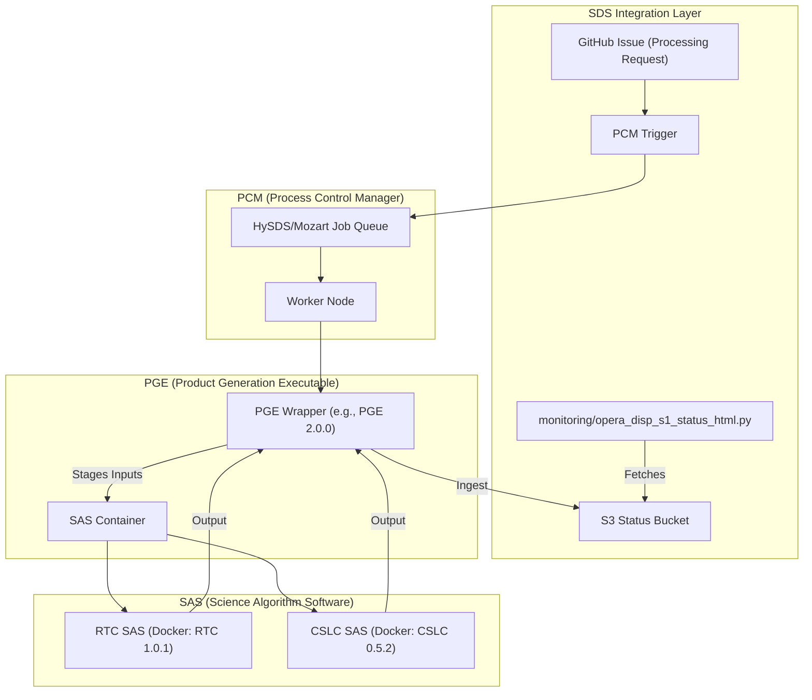
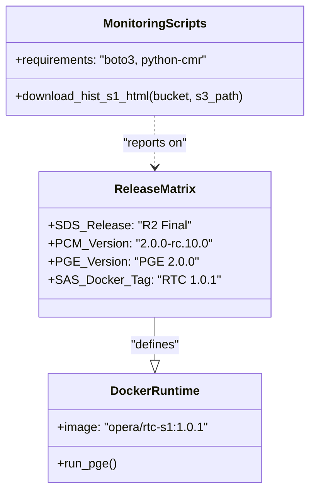

# Page: SDS Software Architecture & Release Management

# SDS Software Architecture & Release Management

Relevant source files

The following files were used as context for generating this wiki page:

- [monitoring/opera_disp_s1_status_html.py](monitoring/opera_disp_s1_status_html.py)
- [requirements.txt](requirements.txt)
- [sds_releases.md](sds_releases.md)

The OPERA Science Data System (SDS) utilizes a multi-layered software architecture designed to decouple the core science algorithms from the cloud-native orchestration infrastructure. This separation ensures that science updates can be released independently of system-level improvements, while maintaining strict provenance through containerization and versioned release matrices.

## Four-Layer Software Stack

The SDS architecture is organized into four distinct layers, each with a specific responsibility in the data transformation pipeline.

### 1. SAS (Science Algorithm Software)
The **SAS** is the fundamental layer containing the scientific code (e.g., Python, C++, or Fortran) that performs the actual geophysical processing. Each SAS is developed by a dedicated science team and is packaged as a standalone entity.
*   **Role:** Performs pixel-level calculations (e.g., RTC-S1, CSLC-S1).
*   **Versioning:** Managed via specific **SAS Release** versions and pinned using **SAS Docker Tags** [sds_releases.md:3-6]().

### 2. PGE (Product Generation Executable)
The **PGE** layer acts as a wrapper for the SAS. It standardizes the interface between the science code and the SDS infrastructure.
*   **Role:** Handles input file staging, metadata extraction, log formatting, and output product packaging (NetCDF/GeoTIFF).
*   **Implementation:** The PGE ensures that the SAS receives data in the expected directory structure and translates SAS exits into SDS status codes.
*   **Versioning:** Tracked in the release matrix as `PGE Release` (e.g., `PGE 2.0.0`) [sds_releases.md:5]().

### 3. PCM (Process Control Manager)
The **PCM** is the orchestration layer responsible for workflow management and job scheduling within the AWS environment.
*   **Role:** Monitors input data availability (triggers), manages the job queue (using HySDS/Mozart), and handles resource scaling.
*   **Versioning:** PCM versions follow a Release Candidate (RC) lifecycle (e.g., `2.0.0-rc.10.0`) before final production deployment [sds_releases.md:8]().

### 4. SDS Integration
The **SDS Integration** layer represents the glue code and configuration that binds the PCM, PGE, and SAS together for a specific mission release (e.g., "Release 2").
*   **Role:** Defines the deployment environment, S3 bucket configurations, and GitHub automation for monitoring.
*   **Key Files:** Configuration for operational monitoring and status reporting (e.g., `monitoring/opera_disp_s1_status_html.py`) [monitoring/opera_disp_s1_status_html.py:1-56]().

### Software Stack Data Flow
The following diagram illustrates how a processing request flows through the architectural layers.

**Title: SDS Data Flow and Entity Mapping**

**Sources:** [sds_releases.md:3-10](), [monitoring/opera_disp_s1_status_html.py:30-41]()

---

## Release Management & Version Matrix

The SDS follows a rigorous release cycle to ensure that science algorithm updates do not break the production pipeline. This is documented in a version matrix that maps SDS releases to specific software versions.

### Release Candidate Lifecycle
Before a version is finalized, it undergoes a Release Candidate (RC) phase.
1.  **RC Tagging:** PCM and PGE are tagged with `-rc` suffixes (e.g., `2.0.0-rc.10.0`) [sds_releases.md:8]().
2.  **Validation:** CalVal datasets are processed using the RC versions to verify science performance.
3.  **Finalization:** Once validated, the `R2 Final` (or equivalent) is declared, pinning specific SAS Docker Tags to the production environment [sds_releases.md:5-6]().

### The Version Matrix (`sds_releases.md`)
The `sds_releases.md` file serves as the single source of truth for the system's state at any given time.

| Column | Description |
| :--- | :--- |
| **SDS Release** | The top-level project milestone (e.g., R2 Final) [sds_releases.md:5](). |
| **PCM Release** | The version of the orchestration engine [sds_releases.md:8](). |
| **PGE Release** | The version of the product packaging wrapper [sds_releases.md:5](). |
| **SAS Docker Tag** | The immutable container hash/tag used to pin the science code [sds_releases.md:5-6](). |

**Sources:** [sds_releases.md:1-13]()

---

## Containerization and Environment Pinning

To ensure reproducibility, the SAS is always executed within a Docker container. The SDS pins these versions in the `sds_releases.md` matrix to prevent "floating" versions from entering production.

### Dependency Management
The SDS integration layer manages its own dependencies for monitoring and automation scripts separately from the SAS containers.
*   **Python Dependencies:** Defined in `requirements.txt`, including `boto3` for S3 interactions and `python-cmr` for metadata queries [requirements.txt:1-6]().
*   **Operational Scripts:** Scripts like `opera_disp_s1_status_html.py` utilize these dependencies to download status reports from S3 buckets (e.g., `opera-pst-rs-pop1`) and prepare them for display on GitHub Pages [monitoring/opera_disp_s1_status_html.py:24-30]().

**Title: Version Pinning Implementation**

**Sources:** [sds_releases.md:3-10](), [requirements.txt:1-6](), [monitoring/opera_disp_s1_status_html.py:30-41]()

---

## Data Flow: Monitoring and Reporting

The architecture includes a feedback loop where the **SDS Integration** layer queries the results of the **PCM** and **PGE** processing.

1.  **Processing Status:** The PGE writes processing logs and status files to S3.
2.  **Status Retrieval:** The `download_hist_s1_html` function in `monitoring/opera_disp_s1_status_html.py` retrieves the `opera_disp_s1_hist_status-ops.html` file from the `processing_status/DISP_S1/` S3 path [monitoring/opera_disp_s1_status_html.py:26-30]().
3.  **Publication:** The script renames the file to `index.html` and places it in the repository root for deployment via GitHub Pages [monitoring/opera_disp_s1_status_html.py:35-38]().

**Sources:** [monitoring/opera_disp_s1_status_html.py:23-56]()
