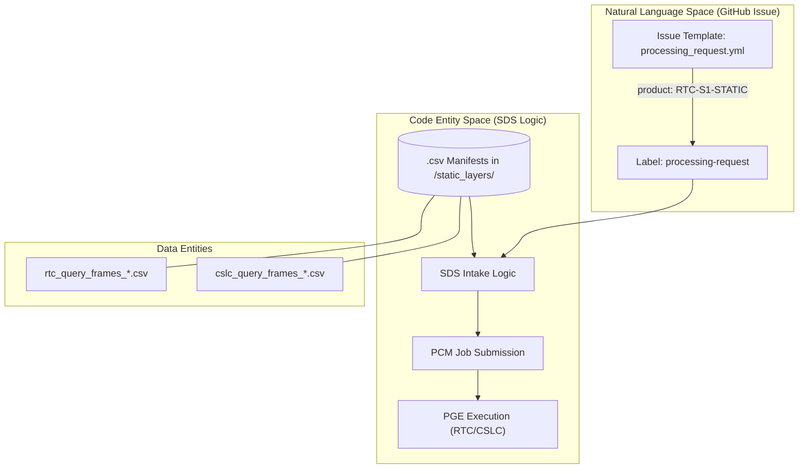
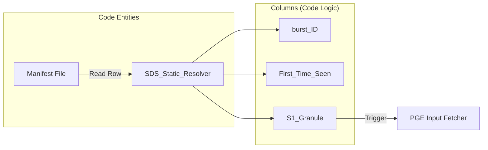

# Page: Static Layer Input Datasets

# Static Layer Input Datasets

Relevant source files

The following files were used as context for generating this wiki page:

- [processing_request_datasets/static_layers/README.md](processing_request_datasets/static_layers/README.md)
- [processing_request_datasets/static_layers/cslc_query_bursts_2016-05-01_to_2023-09.csv](processing_request_datasets/static_layers/cslc_query_bursts_2016-05-01_to_2023-09.csv)
- [processing_request_datasets/static_layers/cslc_query_frames_2016-05-01_to_2023-09.csv](processing_request_datasets/static_layers/cslc_query_frames_2016-05-01_to_2023-09.csv)
- [processing_request_datasets/static_layers/rtc_query_bursts_2016-05-01_to_2023-09.csv](processing_request_datasets/static_layers/rtc_query_bursts_2016-05-01_to_2023-09.csv)
- [processing_request_datasets/static_layers/rtc_query_frames_2016-05-01_to_2023-09.csv](processing_request_datasets/static_layers/rtc_query_frames_2016-05-01_to_2023-09.csv)

This page documents the curated CSV manifests used to seed the initial generation of OPERA RTC-S1-STATIC and CSLC-S1-STATIC products. These datasets provide the foundational mapping between Sentinel-1 SLC granules and the unique burst/frame identifiers required by the Science Data System (SDS) to establish the static layer baseline.

## Purpose and Scope

The static layer datasets serve as the "golden" reference for processing requests involving static products. They cover a temporal range from **May 1, 2016, to mid-September 2023** [processing_request_datasets/static_layers/README.md:7-7](). Any Sentinel-1 bursts appearing exclusively before May 2016 are excluded from these manifests [processing_request_datasets/static_layers/README.md:8-8]().

These files are consumed by the SDS during the intake of processing requests to ensure that the initial generation of static layers is performed against a consistent and verified set of input SLC granules.

---

## Dataset Architecture

The datasets are organized by product type (RTC vs. CSLC) and contain two types of files: **Frame Manifests** (input granules) and **Burst Manifests** (mapping files).

### RTC-S1 Static Layers
Used for generating Radiometric Terrain Corrected (RTC) static layers.

| File Name | Description | Count |
| :--- | :--- | :--- |
| `rtc_query_frames_2016-05-01_to_2023-09.csv` | List of unique Sentinel-1 A/B frames (granules) used as processing inputs. | 12,475 |
| `rtc_query_bursts_2016-05-01_to_2023-09.csv` | Mapping of unique burst IDs to the first SLC granule they appeared in. | 297,562 |

### CSLC-S1 Static Layers
Used for generating Co-registered Stacked Intermediate Complex (CSLC) static layers.

| File Name | Description | Count |
| :--- | :--- | :--- |
| `cslc_query_frames_2016-05-01_to_2023-09.csv` | List of unique Sentinel-1 A/B frames (granules) used as processing inputs. | 1,508 |
| `cslc_query_bursts_2016-05-01_to_2023-09.csv` | Mapping of unique burst IDs to the first SLC granule they appeared in. | 33,057 |

**Sources:**
- [processing_request_datasets/static_layers/README.md:3-30]()

---

## File Schemas

The CSV files do not contain header rows. The following schemas are applied by the SDS during consumption:

### Frame Manifest Schema
Used in `rtc_query_frames...csv` and `cslc_query_frames...csv`.

| Column Index | Name | Data Type | Example |
| :--- | :--- | :--- | :--- |
| 0 | `S1 Granule` | String | `S1A_IW_SLC__1SDV_20170203T180033...` |

**Sources:**
- [processing_request_datasets/static_layers/rtc_query_frames_2016-05-01_to_2023-09.csv:1-10]()
- [processing_request_datasets/static_layers/README.md:15-15]()

### Burst Manifest Schema
Used in `rtc_query_bursts...csv` and `cslc_query_bursts...csv`.

| Column Index | Name | Data Type | Example |
| :--- | :--- | :--- | :--- |
| 0 | `burst ID` | String | `t001_000010_iw1` |
| 1 | `First Time Seen` | Timestamp | `2017-02-03 18:00:33.938144` |
| 2 | `S1 Granule` | String | `S1A_IW_SLC__1SDV_20170203T180033...` |

**Sources:**
- [processing_request_datasets/static_layers/rtc_query_bursts_2016-05-01_to_2023-09.csv:1-1]()
- [processing_request_datasets/static_layers/README.md:10-10]()

---

## Data Flow and Implementation

The following diagrams illustrate how these static manifests bridge the gap between high-level processing requests and the execution of Science Algorithm Software (SAS).

### Processing Request Intake Flow
This diagram shows how a `Processing Request` issue triggers the selection of these static datasets to populate the input granule list for the PCM (Process Control Manager).

Title: Static Layer Dataset Intake Pipeline

**Sources:**
- [processing_request_datasets/static_layers/README.md:11-13]()
- [processing_request_datasets/static_layers/README.md:26-28]()

### Burst-to-Granule Resolution
This diagram demonstrates how the SDS uses the burst manifest files to verify the lineage of a static layer back to its original Sentinel-1 SLC source.

Title: Static Burst Lineage Resolution

**Sources:**
- [processing_request_datasets/static_layers/rtc_query_bursts_2016-05-01_to_2023-09.csv:1-3]()
- [processing_request_datasets/static_layers/README.md:21-25]()

---

## Consumption by the SDS

The SDS consumes these files primarily during the **Initial Product Generation** phase for the STATIC collection. 

1.  **Granule Selection:** When a processing request for `RTC-S1-STATIC` or `CSLC-S1-STATIC` is received, the SDS refers to the `*_query_frames_*.csv` files to identify the specific SLC granules that must be retrieved from the DAAC [processing_request_datasets/static_layers/README.md:13-13]().
2.  **Metadata Validation:** The `*_query_bursts_*.csv` files are used to validate that the bursts produced by the PGE match the expected `burst ID` and `First Time Seen` timestamp established in the static baseline [processing_request_datasets/static_layers/README.md:10-10]().
3.  **Temporal Filtering:** The SDS enforces the temporal boundary (post-May 2016) by ensuring no granules outside the manifest's range are ingested for the static baseline [processing_request_datasets/static_layers/README.md:7-8]().

**Sources:**
- [processing_request_datasets/static_layers/README.md:1-33]()
